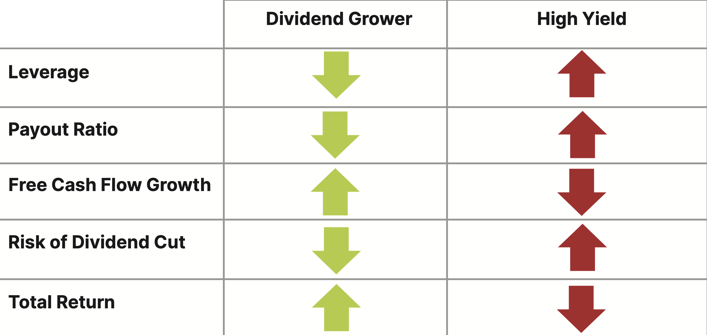

## Table of Contents

## What is a dividend?

A dividend is money that a company pays to its shareholders. When a company makes a profit, it can choose to share some of that profit with the people who own its stock. This payment is usually given out every three months, but sometimes it can be yearly or at different times.

Dividends are important because they give investors a regular income from their investments. For example, if you own 100 shares of a company and they pay a dividend of $1 per share, you would get $100. This can be a good way to earn money, especially for people who want a steady income from their investments.

## What is a dividend rate?

The dividend rate is how much money a company pays out in dividends for each share of its stock over a certain period, usually a year. It's like knowing how much you'll get paid for owning one share of the company's stock. For example, if a company pays a quarterly dividend of $0.25 per share, the annual dividend rate would be $1 per share because $0.25 times 4 quarters equals $1.

This rate helps investors understand how much income they can expect from their investment in the company. If you own 100 shares of a company with an annual dividend rate of $1 per share, you would receive $100 in dividends each year. Knowing the dividend rate is important for people who want to plan their finances and rely on dividend income as part of their investment strategy.

## What is a dividend yield?

Dividend yield is a way to measure how much money you get back from a company's dividends compared to the price you paid for the stock. It's like figuring out the return on your investment just from the dividends. You find the dividend yield by dividing the annual dividend per share by the current price per share and then multiplying by 100 to get a percentage. For example, if a company pays an annual dividend of $2 per share and the stock price is $50, the dividend yield would be 4% because ($2 / $50) * 100 = 4%.

This percentage is important because it helps investors see how much income they are getting from their investment relative to its cost. A higher dividend yield might mean more income, but it can also mean the stock price has gone down, which might be a sign of problems with the company. So, investors need to look at the whole picture, not just the dividend yield, to make smart choices about their investments.

## How is the dividend rate calculated?

The dividend rate is how much money a company pays out in dividends for each share of its stock over a certain time, usually a year. To find the dividend rate, you look at how much the company pays in dividends each quarter or each year. For example, if a company pays a quarterly dividend of $0.25 per share, you multiply that by 4 to get the annual dividend rate, which would be $1 per share.

This rate helps investors know how much money they will get from their investment in the company. If you own 100 shares of a company with an annual dividend rate of $1 per share, you would receive $100 in dividends each year. Knowing the dividend rate is important for planning your finances and understanding how much income you can expect from your investments.

## How is the dividend yield calculated?

Dividend yield is a way to see how much money you get back from a company's dividends compared to the price you paid for the stock. It's like figuring out how much income you earn from your investment just from the dividends. To find the dividend yield, you divide the annual dividend per share by the current price per share and then multiply by 100 to turn it into a percentage. For example, if a company pays an annual dividend of $2 per share and the stock price is $50, the dividend yield would be 4% because ($2 / $50) * 100 = 4%.

This percentage is important because it helps investors understand how much income they are getting from their investment compared to its cost. A higher dividend yield might mean more income, but it can also mean the stock price has gone down, which might be a sign of problems with the company. So, investors need to look at the whole picture, not just the dividend yield, to make smart choices about their investments.

## Why are dividend rates and yields important for investors?

Dividend rates and yields are important for investors because they help them understand how much money they can expect to get back from their investment. The dividend rate tells you how much money you will get for each share of stock you own over a year. This is important because it helps you plan your finances and know how much income you can count on from your investment. For example, if you know a company pays a $1 dividend per share every year, and you own 100 shares, you can expect to get $100 from that investment each year.

The dividend yield is also important because it shows you the return on your investment just from the dividends, compared to the price you paid for the stock. It's like a percentage that tells you how much income you are [earning](/wiki/earning-announcement) relative to the cost of the stock. For example, if a stock costs $50 and pays a $2 dividend each year, the dividend yield is 4%. This helps you compare different investments and see which ones might give you more income for your money. Both the dividend rate and yield are key pieces of information that help investors make smart choices about where to put their money.

## How do dividend rates and yields differ?

The dividend rate is how much money a company pays out in dividends for each share of its stock over a year. It's like knowing how much you'll get paid for owning one share of the company's stock. For example, if a company pays a quarterly dividend of $0.25 per share, the annual dividend rate would be $1 per share because $0.25 times 4 quarters equals $1. This helps investors know exactly how much money they can expect to receive from their investment each year.

The dividend yield is different because it shows how much money you get back from dividends compared to the price you paid for the stock. It's like figuring out the return on your investment just from the dividends. You find the dividend yield by dividing the annual dividend per share by the current price per share and then turning it into a percentage. For example, if a company pays an annual dividend of $2 per share and the stock price is $50, the dividend yield would be 4% because ($2 / $50) * 100 = 4%. This helps investors see how much income they are getting from their investment relative to its cost.

## What factors can affect a company's dividend rate?

A company's dividend rate can change because of different things. One big thing is how much money the company makes. If a company is doing well and making more profit, it might decide to give more money to its shareholders through higher dividends. But if the company is not doing so well and making less money, it might lower the dividend or even stop paying it to save money.

Another thing that can affect the dividend rate is the company's plans for the future. If a company wants to grow and needs money to start new projects or buy new things, it might keep more of its profit instead of paying it out as dividends. Also, the overall economy can play a part. If the economy is doing badly, companies might be more careful with their money and lower their dividends to be safe.

## What factors can affect a company's dividend yield?

A company's dividend yield can change because of the stock price and the dividend rate. The dividend yield is the dividend rate divided by the stock price and turned into a percentage. So, if the stock price goes down but the dividend rate stays the same, the dividend yield goes up. This can happen if people think the company is not doing well, so they sell the stock and the price drops. On the other hand, if the stock price goes up but the dividend rate stays the same, the dividend yield goes down. This can happen if the company is doing well and more people want to buy the stock, pushing the price up.

The dividend rate itself can also change and affect the dividend yield. If a company decides to pay more dividends because it's making more money, the dividend yield will go up if the stock price stays the same. But if the company lowers the dividend because it's not making as much money or wants to save cash for other things, the dividend yield will go down if the stock price stays the same. So, both the stock price and the dividend rate are important in deciding what the dividend yield will be.

## How can investors use dividend rates and yields to compare different stocks?

Investors can use dividend rates and yields to compare different stocks by looking at how much money they can get from each stock. The dividend rate tells you how much money a company pays out for each share of its stock over a year. If one company pays a higher dividend rate than another, it means you'll get more money from owning its stock. For example, if Stock A pays $2 per share and Stock B pays $1 per share, Stock A gives you more income. This helps investors decide which stocks might give them more money to live on or reinvest.

The dividend yield is also helpful because it shows how much money you get back from dividends compared to the price you paid for the stock. It's like a percentage that tells you the return on your investment just from the dividends. If Stock A has a dividend yield of 4% and Stock B has a yield of 2%, Stock A gives you more income for the same amount of money spent. This is useful for comparing stocks with different prices. By looking at both the dividend rate and the yield, investors can pick stocks that fit their goals, whether they want more income or a good return on their investment.

## What are the limitations of using dividend rate and yield for investment decisions?

Using dividend rate and yield to make investment decisions can have some problems. One big issue is that a high dividend yield might look good, but it can also mean the stock price has gone down a lot. This could be because people think the company is not doing well. So, a high yield might be a warning sign instead of a good thing. Also, the dividend rate can change. A company might lower its dividends if it's not making as much money, which means you'll get less money than you expected. So, just looking at the dividend rate and yield might not give you the whole picture of how the company is doing.

Another problem is that dividend rates and yields don't tell you everything about a company's future. A company might pay good dividends now, but if it's not growing or making smart choices for the future, the dividends might not last. Also, some companies might choose to use their profits to grow the business instead of paying dividends, which could be better for the stock's value in the long run. So, investors need to look at other things like the company's growth plans, how it's doing compared to other companies, and the overall economy to make the best choices.

## How do changes in stock price impact the dividend yield, and what does this imply for investment strategy?

Changes in stock price can really affect the dividend yield. If the stock price goes down but the company keeps paying the same dividend, the dividend yield goes up. This is because the dividend yield is the dividend rate divided by the stock price. So, a lower stock price makes the yield higher. But, a high dividend yield might not always be a good thing. It could mean that people think the company is not doing well, so they are selling the stock and the price is dropping. On the other hand, if the stock price goes up and the dividend stays the same, the dividend yield goes down. This can happen when a company is doing well and more people want to buy the stock, pushing the price up.

This impact on dividend yield has important implications for an investment strategy. Investors need to be careful when they see a high dividend yield. They should look at why the stock price is going down before deciding to buy the stock just because of the high yield. It's important to check if the company is having problems or if the high yield is just a short-term thing. Also, if an investor is looking for a steady income, they might want to pick stocks with a good dividend rate and a stable stock price. This way, they can be sure they will keep getting the income they expect. So, understanding how stock price changes affect dividend yield can help investors make smarter choices about where to put their money.

## What is the difference between Dividend Rate and Dividend Yield?

Dividend investing is a popular strategy among investors who seek to generate a steady stream of passive income. Two critical terms in this investment approach are the dividend rate and dividend yield. Understanding these concepts is essential for evaluating the income potential and comparative performance of dividend-paying stocks.

The **dividend rate** refers to the total expected dividend payments from an investment over a specified period, usually expressed annually. It is often quoted as a dollar amount per share. For instance, if a company pays a quarterly dividend of $0.50 per share, its annual dividend rate would be $2.00 per share. This measure gives investors an idea of the income they can expect to receive from holding the stock. The dividend rate is a straightforward metric that primarily offers insight into the cash flow of holding a specific stock.

The **dividend yield**, on the other hand, provides a relative measure of dividend income against the stock's price. It is calculated by dividing the annual dividend rate by the stock's current market price, and it is expressed as a percentage. The formula for dividend yield is:

$$
\text{Dividend Yield} = \left( \frac{\text{Dividend Rate}}{\text{Current Stock Price}} \right) \times 100
$$

For example, if a stock has an annual dividend rate of $2.00 and is currently priced at $40.00, the dividend yield would be 5%. This percentage allows investors to assess the income return on a stock relative to its price, facilitating comparisons across different stocks and sectors. 

The primary difference between these two metrics is that while the dividend rate gives a fixed dollar amount of expected income, the dividend yield provides context by linking the income to the size of the investment required to obtain that income. The dividend rate is significant for investors interested in absolute income figures, particularly those relying on dividend payments for living expenses. Conversely, the dividend yield is more relevant for comparing the income potential across different stocks or when assessing a stock's valuation relative to its dividend payout.

In summary, both the dividend rate and dividend yield are vital for investors seeking dividend income, each offering unique insights. The dividend rate measures absolute income from a stock, whereas the yield evaluates that income relative to the investment's market value, guiding investors in making informed decisions aligned with their investment goals.

## What are the special considerations in dividend investment?

Dividend investment is influenced by various factors that can significantly affect both the dividend rate and the dividend yield. Key among these factors are company earnings, overall economic conditions, and fiscal policies.

**Factors Affecting Dividend Rate and Yield**

1. **Company Earnings**: The financial health of a company is crucial in determining its ability to pay dividends. Companies with strong, consistent earnings are more likely to maintain or increase their dividend payments. In contrast, companies experiencing declining profits may reduce dividends or stop them altogether. The dividend payout ratio, calculated as (Dividends per Share / Earnings per Share), provides insight into how comfortably a company can support its dividend distribution.

2. **Economic Conditions**: Macroeconomic factors such as inflation rates, interest rate changes, and broader economic growth can influence dividend policies. In a robust economic environment, companies might generate higher profits, thus facilitating enhanced dividend payments. Conversely, during economic downturns, even companies with a history of steady dividends might face pressure to reduce payouts to conserve cash.

3. **Fiscal Policies**: Government fiscal policies, including tax legislation and government expenditure, can also impact dividends. Policies that stimulate economic growth can enhance company earnings potential, thereby supporting higher dividends. On the other hand, tax increases on corporate profits might lead to lower net earnings and therefore lower dividends.

**Risks Associated with High Dividend Yields**

High dividend yields can be attractive, but they often come with increased risks. A high yield might indicate that a stock's price has recently decreased, which could be a sign of underlying company issues. Additionally, companies offering unusually high dividends might be over-distributing earnings, which is unsustainable in the long term. This overstretch can lead to dividend cuts, causing significant losses for investors relying on stable income streams. The formula for dividend yield is:

$$
\text{Dividend Yield} = \left( \frac{\text{Annual Dividends per Share}}{\text{Price per Share}} \right) \times 100
$$

A persistently high dividend yield compared to industry peers should prompt a thorough examination of the company's financial health and prospects.

**Tax Implications**

Taxation is another critical consideration in dividend investing. Dividends are often subject to taxation, which varies by jurisdiction, potentially reducing the net return on investment. Qualified dividends may be taxed at a lower rate than ordinary income, while non-qualified dividends are taxed as ordinary income. This difference can impact the overall attractiveness of dividend stocks as part of an investment portfolio. Investors should therefore consult tax professionals to understand their specific tax obligations and optimize their investment returns accordingly.

## References & Further Reading

[1]: Damodaran, A. (2012). ["Investment Valuation: Tools and Techniques for Determining the Value of Any Asset."](https://books.google.com/books/about/Investment_Valuation.html?id=5SRHAAAAQBAJ) Wiley Finance.

[2]: Malkiel, B. G. (2019). ["A Random Walk Down Wall Street: The Time-Tested Strategy for Successful Investing."](https://yourknowledgedigest.org/wp-content/uploads/2020/04/a-random-walk-down-wall-street.pdf) W. W. Norton & Company.

[3]: Hull, J. C. (2019). ["Options, Futures, and Other Derivatives."](https://www.semanticscholar.org/paper/Options%2C-Futures%2C-and-Other-Derivatives-Hull/89bdee500c8623864fc9eb7a471546aa713acc44) Pearson.

[4]: Marcos López de Prado. (2018). ["Advances in Financial Machine Learning."](https://www.amazon.com/Advances-Financial-Machine-Learning-Marcos/dp/1119482089) Wiley.

[5]: Bodie, Z., Kane, A., & Marcus, A. J. (2014). ["Investments."](https://www.mheducation.com/highered/product/Investments-Bodie.html) McGraw-Hill Education.