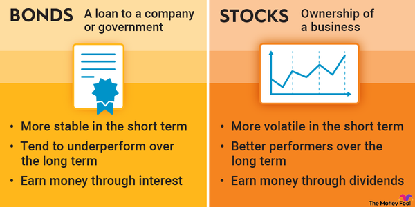

Investing in the modern financial landscape provides multiple pathways for potential profitability. This diversity allows individuals to tailor their investment strategies according to personal financial goals, risk tolerance, and market conditions. Among the myriad options available, four popular tools have emerged as central to successful investment portfolios: bonds, dividend stocks, a variety of investment options, and algorithmic trading. Each of these tools offers unique benefits and poses specific risks that require careful consideration and strategic integration.

Bonds are widely recognized as a stable income source, often appealing to risk-averse investors. They serve as debt instruments where the investor lends money to an entity—be it a government, corporation, or municipality—in return for periodic interest payments and the repayment of the principal at maturity. This predictable income stream makes bonds an integral component of a balanced investment portfolio, providing a cushion against the volatility of equities.



On the other hand, dividend stocks provide an opportunity for regular income through dividend payments distributed by corporations. These stocks can be an attractive alternative to bonds, especially in low-interest environments, due to their potential for higher yields. However, they carry inherent risks such as market volatility and the possibility of dividend cuts, necessitating careful selection and an astute investment strategy.

The landscape of investment options extends beyond traditional securities, encompassing equities and alternative investments. Employing strategies such as diversification and a total return approach can significantly enhance the long-term growth and stability of an investment portfolio. Aligning these investments with an investor's financial objectives ensures that the portfolio reflects personal goals, risk appetite, and timelines.

Algorithmic trading, a relatively modern development, leverages the power of technology to execute trades based on pre-set criteria. This approach benefits from its speed, efficiency, and capacity to process large volumes of data, opening new possibilities in trading and portfolio management. Despite its advantages, algorithmic trading also presents pitfalls, including technical failures and overfitting, which require a clear understanding of the tools and platforms that facilitate such trading.

In summary, this article will provide a comprehensive overview of bonds, dividend stocks, investment options, and algorithmic trading—highlighting their benefits, risks, and how they can be seamlessly integrated into a cohesive investment strategy. By understanding these avenues, you empower yourself to make informed decisions that align with your financial aspirations, adapting to the dynamic shifts of the global financial market.

## Table of Contents

## Deep Dive into Bonds

Bonds are fundamental components of the financial markets, representing a loan made by an investor to a borrower, typically corporate or governmental. When an investor purchases a bond, they are essentially lending money to the issuer in exchange for regular interest payments, known as coupon payments, and the eventual return of the bond's face value, or principal, at maturity. This mechanism allows entities to raise capital for various purposes, such as funding infrastructure projects or expanding business operations.

Bonds are generally viewed as stable income sources, providing predictable returns with lower risk compared to equities. The risk profile of bonds varies in accordance with the issuer's creditworthiness and the bond's maturity period. Investors benefit from the fixed income generated, which can serve as a hedge against the [volatility](/wiki/volatility-trading-strategies) of equity investments.

### Types of Bonds and Portfolio Integration

#### Government Bonds

Government bonds, sometimes referred to as sovereign bonds, are issued by national governments. In the United States, these include Treasury bonds, notes, and bills, distinguished by their differing maturity periods. Government bonds are typically considered low-risk investments since they [carry](/wiki/carry-trading) the backing of the issuing government. For instance, US Treasury bonds are often deemed risk-free because they are supported by the full faith and credit of the US government. These bonds are essential components of a balanced portfolio, providing stability and risk mitigation.

#### Municipal Bonds

Municipal bonds are issued by states, cities, or other local government entities to finance public projects such as highways, schools, or hospitals. These bonds often come with tax advantages, as the interest income may be exempt from federal and, in some cases, state and local taxes. However, municipal bonds can carry more risk than government bonds due to the varied creditworthiness of the issuing entities. Careful research and selection of issuers with strong financial health are crucial when incorporating municipal bonds into a portfolio.

#### Corporate Bonds

Corporate bonds are debt securities issued by corporations to fund business activities. They generally offer higher yields compared to government or municipal bonds to compensate for the increased risk of default. These bonds come in various forms, with investment-grade bonds issued by financially stable companies, and high-yield or "junk" bonds issued by companies with lower credit ratings. Corporate bonds add an element of diversification to a portfolio and can enhance returns, but they require thorough credit analysis.

### Strategic Allocation

Incorporating bonds into an investment portfolio involves evaluating one's risk tolerance, investment horizon, and income needs. A strategically allocated bond portfolio could combine government, municipal, and corporate bonds to benefit from their different risk-reward profiles. For instance, a risk-averse investor might prioritize government bonds, while a more aggressive investor might increase exposure to corporate bonds to achieve higher returns.

The bond market's dynamics are significantly influenced by interest rates. Bond prices typically move inversely to [interest rate](/wiki/interest-rate-trading-strategies) changes; when rates rise, bond prices fall, and vice versa. Consequently, investors need to remain vigilant and adjust their bond holdings in response to rate movements and economic conditions to optimize portfolio performance.

## Exploring Dividend Stocks

Dividend stocks are a powerful tool for investors seeking regular income, offering periodic payments derived from a corporation's earnings. Generally, companies with a consistent track record of profitability tend to pay dividends, making them an appealing investment choice, particularly in low-interest environments where traditional fixed-income products like bonds may offer minimal returns.

In situations where interest rates are low, dividend stocks offer potential for higher yields. These stocks can provide returns through both capital appreciation and periodic dividend payments. For example, if an investor buys a stock priced at $100 with a dividend yield of 4%, they can expect an annual dividend of $4 per share, along with any capital gains resulting from an increase in the stock’s market price.

However, investing in dividend stocks involves certain risks. Market volatility can impact the stock's price, leading to fluctuations in the portfolio's value. Additionally, there is a risk of dividend cuts or suspensions, especially if a company’s financial performance deteriorates. Investors should analyze the dividend payout ratio—a metric that represents the proportion of earnings paid out as dividends. A high payout ratio may indicate limited reserves for future growth or dividend sustainability, while a lower ratio could suggest the potential for future dividend increases.

Selecting reliable dividend stocks requires careful analysis. One strategy involves examining a company’s historical dividend growth, stability, and payout ratio, complemented by a strong business model and competitive position in its industry. Additionally, investors can look for companies with consistent cash flow generation and a commitment to returning capital to shareholders.

For a more technical approach, one could employ the Gordon Growth Model to estimate a stock's intrinsic value based on its expected future dividends. The formula is:

$$
P = \frac{D_1}{r - g}
$$

where $P$ is the price of the stock, $D_1$ is the expected dividend next year, $r$ is the required rate of return, and $g$ is the dividend growth rate. This model is particularly useful for companies with stable growth rates.

In summary, while dividend stocks present an attractive investment opportunity, especially when interest rates are low, investors must remain cognizant of the inherent risks and conduct thorough analysis to make informed decisions. By focusing on dividend reliability and growth potential, investors can effectively integrate dividend stocks into a diversified investment strategy.

## Investment Options and Strategies

Investment options are abundant and vary from traditional assets like equities, bonds, and real estate to alternative investments such as commodities, hedge funds, and private equity. Each option has unique characteristics that can contribute to an investment portfolio. Balancing these options effectively often relies on key strategies such as diversification, adopting a total return approach, and aligning investments with an individual's financial objectives.

**Diversification** is a foundational strategy that spreads investments across different asset classes to mitigate risk. By diversifying, investors can reduce the impact of volatility associated with any single investment. For example, while equities might offer the potential for high returns, they also bring significant volatility. Counterbalancing equities with bonds or other low-risk assets helps stabilize returns and hedge against market downturns. An essential principle of diversification is the correlation coefficient, which measures how investment returns move in relation to one another. Ideally, combining assets with low or negative correlations can optimize portfolio performance. 

In contrast, the **total return approach** prioritizes the overall growth of the portfolio rather than focusing solely on income generation. This strategy combines capital appreciation, interest, dividends, and distributions to enhance returns. Investors practicing this approach actively reinvest income and periodically rebalance their portfolios to take advantage of market conditions. A Python code snippet that periodically rebalances a portfolio could resemble the following:

```python
import numpy as np

# Define portfolio weights, returns, and rebalance interval
weights = np.array([0.6, 0.4])  # 60% equities, 40% bonds
returns = np.array([[0.05, 0.02], [0.07, 0.03], [0.08, 0.04]])  # hypothetical returns
intervals = 12  # rebalance every 12 months

# Simulate periodic rebalancing
def rebalance(portfolio, target_weights):
    total_value = sum(portfolio)
    return total_value * target_weights

# Initial portfolio value
portfolio = np.array([60000, 40000])

# Rebalance over specified intervals
for i in range(returns.shape[0]):
    portfolio = portfolio * (1 + returns[i])
    if (i + 1) % intervals == 0:
        portfolio = rebalance(portfolio, weights)

print("Rebalanced portfolio:", portfolio)
```

Aligning investments with an individual's **financial objectives** is crucial. Investment goals might range from building a retirement fund to purchasing property or funding education. The strategy must account for these objectives, along with the investor's risk tolerance and timeline. While **conservative tactics** prioritize capital preservation and lower-risk avenues like bonds and high-dividend stocks, **aggressive tactics** may lean towards [growth stocks](/wiki/growth-stocks), emerging markets, or innovative technology firms offering higher potential returns, albeit with increased risk and volatility.

Risk tolerance and investment timelines are critical considerations when choosing between conservative and aggressive strategies. Younger investors with a long investment horizon can generally afford to adopt more aggressive strategies due to their capacity to recover from losses. Conversely, older investors nearing retirement may prioritize capital preservation and stable income streams, favoring conservative approaches.

Ultimately, a well-rounded investment strategy incorporates diversification, adapts to a total return approach, and aligns with personal financial goals. By understanding these strategies, investors can make informed choices tailored to their risk profile and financial aspirations.

## The Rise of Algorithmic Trading

Algorithmic trading, often referred to as algo trading, utilizes computer programs to execute trades at speeds and efficiencies unattainable by human traders. These algorithms are designed to follow a set of predetermined instructions for trading, in order to generate profits at frequencies and speeds that are impossible for a human trader. 

### Benefits of Algorithmic Trading

1. **Speed and Efficiency**: Algorithms can analyze market conditions and execute trades in a fraction of a second, much faster than a human can. This speed allows traders to capitalize quickly on trading opportunities that arise.

2. **Handling Large Volumes of Data**: Algorithms have the capacity to process vast amounts of data and market information efficiently. By analyzing multiple markets and securities simultaneously, algo trading enables complex strategies to be automated and executed without latency issues.

3. **Eliminating Human Emotion**: Trading decisions are made strictly based on logic and pre-set criteria, eliminating the emotional biases that can often disrupt manual trading decisions.

### Potential Pitfalls

Despite the upsides, [algorithmic trading](/wiki/algorithmic-trading) is not without challenges:

1. **Technical Failures**: Since algo trading is heavily reliant on technology, any software glitches, network connectivity issues, or power outages can lead to missed opportunities or unintended trades. Having a robust technical infrastructure is critical.

2. **Overfitting**: Overfitting occurs when a model is excessively complex and captures noise instead of the underlying pattern in data. This can lead to poor performance in actual trading. It's essential to ensure that the algorithms are tested on out-of-sample data to validate their efficiency and robustness.

3. **Market Impact and Liquidity Risk**: High-frequency trading strategies can inadvertently impact the market dynamics, leading to increased volatility and liquidity risks. Algorithms need to be designed to minimize market impact, keeping execution strategies discreet and efficient.

### Tools and Platforms

Several platforms and programming languages support algorithmic trading, providing tools for both strategy development and execution:

- **Python**: Known for its simplicity and a wide range of libraries such as NumPy, pandas, and SciPy, Python is preferred for developing trading algorithms. Libraries such as `backtrader` offer backtesting capabilities.

  ```python
  import backtrader as bt

  class MyStrategy(bt.Strategy):
      def log(self, txt, dt=None):
          dt = dt or self.datetime.date(0)
          print(f'{dt.isoformat()} {txt}')

      def next(self):
          self.log(f'Open: {self.dataclose[0]:.2f}')

  cerebro = bt.Cerebro()
  cerebro.addstrategy(MyStrategy)

  data = bt.feeds.YahooFinanceData(dataname='AAPL', fromdate=datetime(2020, 1, 1), todate=datetime(2021, 1, 1))
  cerebro.adddata(data)
  cerebro.run()
  ```

- **Trading Platforms**: Platforms like MetaTrader, Interactive Brokers, and NinjaTrader offer a variety of tools for algorithmic trading. These platforms often provide APIs allowing traders to customize their algorithms and integrate them with existing trading systems.

- **QuantConnect and Quantopian**: These cloud-based platforms allow developers to backtest their strategies using historical data, employing modern features and frameworks to turn hypotheses into trading algorithms rapidly.

Algorithmic trading marks a significant shift in how financial markets operate, with its ability to enhance trading strategy performance through speed, efficiency, and [volume](/wiki/volume-trading-strategy) handling. However, investors must carefully manage the risks associated with potential technical failures and ensure algorithms are robust against overfitting and market impact.

## Comparing Risk and Reward

When evaluating investment options, understanding and comparing the risk and reward profiles of bonds, dividend stocks, and algorithmic trading strategies is crucial for investors.

### Historical Performance, Liquidity, and Volatility

**Bonds**: Historically, bonds have provided stable yet modest returns, primarily due to their fixed interest payments and the repayment of principal upon maturity. They are generally considered low-risk investments, with government bonds seen as particularly secure. The volatility of bonds is relatively low, which translates to less price fluctuation. Liquidity varies depending on the bond type, with government bonds usually being more liquid than corporate or municipal bonds.

**Dividend Stocks**: Dividend stocks have offered higher potential returns compared to bonds due to both dividend payments and capital appreciation. However, they also come with higher risk associated with market volatility. Stocks are more liquid than bonds, allowing for easier buying and selling, but their prices fluctuate more significantly in the short term. The performance of dividend stocks can be erratic, especially during economic downturns, when dividends may be cut or suspended.

**Algorithmic Trading**: This strategy uses computer algorithms to execute trades based on pre-set conditions and has shown varied historical performance. The potential for high returns exists due to the ability to exploit micro-market movements, but it also entails substantial risk, as algorithms can misfire due to technical failures or unanticipated market conditions. Liquidity in algorithmic trading can be high, considering that such strategies are often used in markets with substantial trading volumes. Nonetheless, volatility can be significant, especially if the algorithms are not diversified or if they concentrate on high-frequency trading.

### Impact of Macroeconomic Factors

**Inflation and Interest Rates**: 

- **Bonds**: Inflation negatively impacts bond returns by eroding the purchasing power of future interest payments. If inflation rises, interest rates often follow, leading to a decrease in existing bond prices as newer bonds might offer higher yields.

- **Dividend Stocks**: Inflation can lead to increased interest rates, which typically affects dividend stocks adversely as fixed-income investments become more attractive. However, companies with strong pricing power may continue to pay dividends and maintain their stock prices.

- **Algorithmic Trading**: Inflation and interest rate fluctuations can cause increased market volatility, which may alter the performance of algorithmic trading strategies. Algorithms that exploit short-term price changes may benefit from such fluctuations, but there is also the risk of algorithm failure and increased transaction costs during highly volatile periods.

Investors must weigh these factors carefully in constructing a diversified portfolio. An understanding of how macroeconomic conditions affect each asset class helps mitigate risks and exploit potential rewards in line with financial goals.

## Conclusion: Creating an Investment Plan

Crafting a robust investment plan involves understanding and integrating various financial instruments such as bonds, dividend stocks, and algorithmic trading, tailored to meet one's personal financial objectives. Each of these options presents distinct advantages and challenges, which require careful consideration to optimize a portfolio.

Bonds, traditionally perceived as stable income sources, offer periodic interest payments and the return of principal at maturity with relatively lower risk. Incorporating government, municipal, and corporate bonds can be a strategic way to stabilize a portfolio's performance through consistent returns, especially during volatile market conditions. Investors should assess the issuer's creditworthiness and prevailing interest rates to select bonds that align with their risk tolerance and [liquidity](/wiki/liquidity-risk-premium) needs.

Dividend stocks provide an attractive income stream, particularly in low-interest environments, mitigating some of the risk associated with stock market volatility. Selecting reliable dividend stocks involves analyzing a company's financial health, dividend history, and payout ratios. This approach not only offers potential capital appreciation but also serves as a buffer against inflationary pressures.

Algorithmic trading leverages technological advancements to enhance trading efficiency. It offers substantial benefits like speed and the ability to process large volumes of data. However, investors must be cautious of risks such as technical glitches and strategy overfitting. Utilizing robust platforms and applying rigorous [backtesting](/wiki/backtesting) can mitigate these risks, enabling investors to capitalize on short-term market inefficiencies.

Creating a diversified portfolio necessitates a combination of these investment vehicles, ensuring balance between risk and return. By categorizing investments according to factors such as historical performance, liquidity, and volatility, investors can tailor their strategies to suit different economic climates. Regularly reassessing the portfolio's composition in light of macroeconomic factors, including inflation and interest rate fluctuations, is crucial for maintaining alignment with financial goals.

Continuous learning is paramount in staying abreast of market trends and emerging tools. Engaging with financial literature, attending seminars, and utilizing educational platforms can enhance one's investment acumen. This proactive approach enables investors to refine their strategies and make informed decisions, thereby enhancing the potential for achieving long-term financial success.

## References & Further Reading

[1]: ["Advances in Financial Machine Learning"](https://www.amazon.com/Advances-Financial-Machine-Learning-Marcos/dp/1119482089) by Marcos Lopez de Prado

[2]: ["Quantitative Trading: How to Build Your Own Algorithmic Trading Business"](https://www.amazon.com/Quantitative-Trading-Build-Algorithmic-Business/dp/1119800064) by Ernest P. Chan

[3]: ["Evidence-Based Technical Analysis: Applying the Scientific Method and Statistical Inference to Trading Signals"](https://www.amazon.com/Evidence-Based-Technical-Analysis-Scientific-Statistical/dp/0470008741) by David Aronson

[4]: ["Machine Learning for Algorithmic Trading"](https://github.com/stefan-jansen/machine-learning-for-trading) by Stefan Jansen

[5]: Peters, E. E. (1991). ["Chaos and Order in the Capital Markets: A New View of Cycles, Prices, and Market Volatility."](https://archive.org/details/chaosorderincapi00pete) John Wiley & Sons.