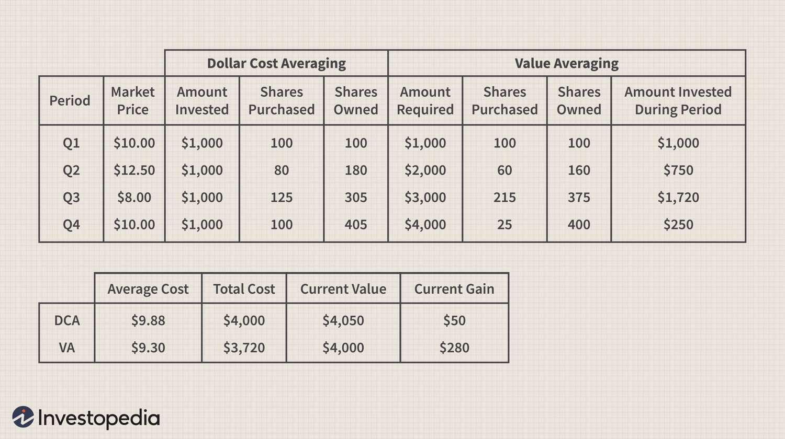

## Table of Contents

## What is Dollar-Cost Averaging (DCA)?

Dollar-Cost Averaging (DCA) is an investment strategy where you invest a fixed amount of money into a particular investment at regular intervals, no matter what the market is doing. Instead of trying to time the market, you keep investing the same amount over time. This means you buy more shares when prices are low and fewer shares when prices are high. Over time, this can help reduce the average cost per share of your investment.

DCA is popular because it helps take the emotion out of investing. Instead of worrying about when to buy or sell, you stick to a regular schedule. This can be especially helpful for people who are new to investing or who might feel nervous about putting a large sum of money into the market all at once. By spreading out your investments, you can smooth out the ups and downs of the market and potentially build wealth over the long term.

## What is Value Averaging (VA)?

Value Averaging (VA) is a strategy where you aim to grow the value of your investment by a set amount each period. Instead of investing a fixed amount of money like in Dollar-Cost Averaging, you adjust how much you invest based on how your investments are doing. If your investments are doing well and growing faster than your target, you invest less money. If they're not doing as well, you invest more to catch up to your target.

This strategy can be a bit more complex than Dollar-Cost Averaging because you need to keep track of your investments and adjust your contributions. But it can help you buy more when prices are low and less when prices are high, which might lead to better returns over time. It's like trying to keep your investment growth on a steady path, adjusting your steps along the way.

## How does Dollar-Cost Averaging work?

Dollar-Cost Averaging is a way to invest money little by little over time. Instead of putting all your money into an investment at once, you decide to invest a certain amount of money regularly, like every month. For example, if you want to invest in a stock, you might decide to put $100 into it every month, no matter what the stock's price is. This means when the stock's price is low, your $100 will buy more shares, and when the price is high, it will buy fewer shares.

This strategy helps you avoid trying to guess the best time to invest. It takes the emotion out of investing because you're not worried about whether the market is going up or down. Over time, because you're buying more shares when prices are low and fewer when prices are high, the average cost of each share you buy can be lower than if you had invested all your money at one time. This can help you build wealth slowly and steadily, without the stress of trying to time the market perfectly.

## How does Value Averaging work?

Value Averaging is a way to invest money where you aim to grow the value of your investment by a set amount each time you invest. Instead of putting in the same amount of money every time like with Dollar-Cost Averaging, you change how much you invest based on how well your investments are doing. If your investments are doing better than you planned, you put in less money. If they're not doing as well, you put in more money to help them catch up to where you want them to be.

This strategy can be a bit trickier because you have to keep an eye on your investments and adjust your contributions. But it can help you buy more when prices are low and less when prices are high, which might lead to better returns over time. It's like trying to keep your investment growth on a steady path, making adjustments along the way to stay on track.

## What are the main differences between DCA and VA?

Dollar-Cost Averaging (DCA) and Value Averaging (VA) are two ways to invest money over time, but they work differently. With DCA, you put in the same amount of money into your investment at regular times, like every month. You don't change how much you invest based on how the market is doing. This means if the price of what you're buying goes up, you'll get fewer shares, and if the price goes down, you'll get more shares. It's simple because you don't need to keep checking the market; you just stick to your plan.

Value Averaging (VA) is different because you aim to increase the total value of your investment by a certain amount each time you invest. If your investments are doing better than you expected, you'll put in less money to keep things balanced. But if they're not doing as well, you'll put in more money to help them reach your target. This can be a bit more complicated because you need to watch your investments and adjust how much you're putting in. VA can help you buy more when prices are low and less when prices are high, which might lead to better returns over time.

## What are the advantages of using Dollar-Cost Averaging?

Dollar-Cost Averaging (DCA) has some big pluses. One main advantage is that it helps you avoid the stress of trying to guess when the market will be at its best. Instead of worrying about whether to buy now or later, you just keep putting in the same amount of money each time. This can make investing feel less scary, especially if you're new to it. It's like setting your investment on autopilot, so you don't have to think about it all the time.

Another good thing about DCA is that it can help lower the average price you pay for your investments. Because you're buying a set amount regularly, you end up buying more shares when prices are low and fewer when prices are high. Over time, this can even out the ups and downs of the market, which might lead to better results in the long run. It's a way to build wealth slowly and steadily, without the need to time the market perfectly.

## What are the advantages of using Value Averaging?

One of the big advantages of using Value Averaging is that it can help you get better returns over time. With Value Averaging, you change how much money you put into your investments based on how they're doing. If your investments aren't growing as fast as you want, you put in more money. This means you end up buying more when prices are low, which can be a smart move. On the other hand, if your investments are doing really well, you put in less money, so you don't buy as much when prices are high. This way, you're always trying to keep your investment growth on track, which can lead to better results.

Another advantage is that Value Averaging can help you stay disciplined with your investing. Because you're always adjusting how much you invest, you have to keep an eye on your investments. This can help you stay focused on your long-term goals and not get too caught up in short-term ups and downs. Even though it might seem a bit harder than just putting in the same amount of money every time, the extra effort can pay off by helping you make smarter investment choices and stick to your plan.

## What are the potential risks or disadvantages of Dollar-Cost Averaging?

One potential risk of Dollar-Cost Averaging is that it might not always be the best strategy if the market keeps going up. If you start investing when the market is already high, you could end up buying at higher prices for a long time. This means you might not get as good of a deal as if you had put all your money in at once when the market was lower. So, if the market keeps going up and up, Dollar-Cost Averaging might not give you the best results.

Another disadvantage is that Dollar-Cost Averaging can take a lot of time to see big results. Because you're putting in small amounts of money over time, it can take years to build up a big investment. If you need your money to grow faster, this slow and steady approach might not work for you. Plus, it requires discipline to keep investing regularly, even when the market is going down, which can be hard for some people.

## What are the potential risks or disadvantages of Value Averaging?

One risk of Value Averaging is that it can be more complicated than other ways of investing. You have to keep watching your investments and change how much money you put in every time. This can be hard to do and might make you feel stressed or confused. If you don't do it right, you might end up putting in too much or too little money, which can mess up your plan.

Another disadvantage is that Value Averaging might make you invest more money when the market is going down. If the market keeps dropping, you'll have to keep putting in more and more money to reach your target. This can be scary and might make you lose more money if the market doesn't go back up. It's a bit riskier because you're always trying to catch up, and that can be tough if things don't go your way.

## In what scenarios might Dollar-Cost Averaging be more suitable than Value Averaging?

Dollar-Cost Averaging might be more suitable than Value Averaging if you're new to investing and want a simple way to start. With DCA, you just put in the same amount of money every time, no matter what the market is doing. This makes it easy to follow and less stressful because you don't have to keep checking your investments and changing how much you invest. It's a good choice if you want to build wealth slowly over time without worrying about the ups and downs of the market.

Another scenario where DCA might be better is if you're worried about putting all your money into the market at once. DCA lets you spread out your investments, which can help you feel more comfortable. It's also a good fit if you want to invest a little bit of money regularly, like from your paycheck. This way, you can keep investing without needing a big chunk of money all at once, and it can help you stay on track with your long-term goals.

## In what scenarios might Value Averaging be more suitable than Dollar-Cost Averaging?

Value Averaging might be a better choice if you want to try to get the best possible returns from your investments. With Value Averaging, you change how much money you put in based on how your investments are doing. If they're not growing as fast as you want, you put in more money, which can help you buy more when prices are low. This way, you're always trying to keep your investment growth on track, which can lead to better results over time. It's like playing a smarter game with your money, aiming to make the most out of the market's ups and downs.

Another time when Value Averaging could be better is if you're okay with putting in a bit more work and keeping a closer eye on your investments. With Value Averaging, you need to watch your investments and adjust how much you're putting in every time. This can be more complicated than just putting in the same amount of money with Dollar-Cost Averaging, but it can pay off if you're willing to put in the effort. If you like being hands-on with your money and want to make sure you're always making the best moves, Value Averaging might be the right choice for you.

## How can investors decide which strategy, DCA or VA, is best for their investment goals?

Investors can decide between Dollar-Cost Averaging (DCA) and Value Averaging (VA) by thinking about how much time and effort they want to put into their investments. If you want a simple and easy way to invest without having to watch the market all the time, DCA might be better for you. With DCA, you just put in the same amount of money every time, no matter what the market is doing. This can be good if you're new to investing or if you want to build wealth slowly over time without the stress of trying to time the market perfectly.

On the other hand, if you're willing to put in more work and want to try to get the best possible returns, VA could be a better fit. With VA, you need to keep an eye on your investments and change how much money you put in based on how they're doing. This can be more complicated, but it can help you buy more when prices are low and less when prices are high, which might lead to better results over time. If you like being hands-on with your money and want to make sure you're always making the best moves, VA might be the right choice for you.

## What is Exploring Value Averaging?

Value Averaging (VA) is an investment strategy aimed at increasing returns and enforcing a disciplined investment approach. Developed by Michael E. Edleson, VA involves adjusting the amount invested to achieve a predetermined growth rate in the total investment value over time. Unlike Dollar-Cost Averaging (DCA), where a fixed amount is invested at regular intervals, VA adjusts the investment amount based on the performance of the portfolio to meet a predefined target value.

### Benefits of Value Averaging

Value Averaging has several advantages, primarily potential for higher returns due to its responsive nature. It enforces a buy-low, sell-high strategy by investing more when prices are low and less or even selling when prices are high to maintain the target growth path. This could lead to better overall returns compared to DCA, which invests a constant amount irrespective of market conditions.

Moreover, VA fosters a disciplined investment approach, urging investors to periodically analyze their portfolio performance relative to their financial goals. This methodical reallocation aligns well with long-term investment planning and minimizes emotional influences by sticking to a predefined strategy.

### Comparison with Dollar-Cost Averaging

While both VA and DCA are systematic investment strategies, they differ in approach and complexity. DCA is characterized by simplicity and ease of implementation as it involves investing a fixed amount regularly, making it favorable for novice investors or those with limited resources. This method spreads out investment purchases, reducing the risk of timing the market.

Conversely, VA requires adjustments based on the portfolio's performance relative to the target growth path. For instance, if we define the target value $V_t$ at time $t$ as:

$$
V_t = V_0 \times (1 + r)^t
$$

where $V_0$ is the initial investment value and $r$ is the desired growth rate, the amount invested or withdrawn periodically will depend on how current portfolio value compares to $V_t$. This complexity necessitates more careful monitoring and calculation than DCA, potentially involving additional transaction fees and tax implications from more frequent trading.

### Potential Challenges and Risks

Implementing VA can be challenging due to its inherent complexity and demands. Investors need to actively manage their portfolio to align with target values, which could lead to increased transaction costs through frequent buying and selling. Moreover, tax liabilities from short-term gains can affect overall returns. There's also more decision-making involved, which could overwhelm less experienced investors, possibly leading to inconsistencies in maintaining the strategy.

### Real-World Example

An illustration of Value Averaging can be seen in investment scenarios where an investor seeks to maintain a specific growth trajectory. Suppose an investor starts with $10,000 and aims for a 10% annual growth rate over five years. If after the first year, the portfolio is valued at $10,500 instead of the targeted $11,000, the investor would allocate additional funds to match the target, buying more assets at relatively lower prices. Conversely, if the portfolio exceeds the target, they might sell some assets to avoid overshooting the growth path, thereby taking advantage of high prices.

In summary, Value Averaging provides a strategic alternative to Dollar-Cost Averaging, potentially enhancing returns via its adaptive approach. However, it demands a higher level of engagement and scrutiny from the investor to navigate the complexities and associated risks effectively.

## References & Further Reading

[1]: Milevsky, M. A., & Posner, S. P. (2003). ["A Continuous-Time Reexamination of the Inefficient Markets Argument for Dollar-Cost Averaging"](https://mdpi-res.com/bookfiles/book/1892/Stochastic_Processes.pdf?v=1732068115). The Journal of Portfolio Management.

[2]: Edleson, M. E. (1993). ["Value Averaging: The Safe and Easy Strategy for Higher Investment Returns"](https://www.amazon.com/Value-Averaging-Strategy-Investment-Returns/dp/0470049774). Wiley.

[3]: Poterba, J. M., & Samuelson, W. F. (1995). ["An Economic Analysis of Dollar Cost Averaging"](https://www.nber.org/system/files/working_papers/w6185/w6185.pdf). Journal of Economic Dynamics and Control.

[4]: Chan, E. (2008). ["Quantitative Trading: How to Build Your Own Algorithmic Trading Business"](https://github.com/ftvision/quant_trading_echan_book). Wiley Trading.

[5]: Jansen, S. (2020). ["Machine Learning for Algorithmic Trading"](https://github.com/stefan-jansen/machine-learning-for-trading). Packt Publishing.

[6]: Lopez de Prado, M. (2018). ["Advances in Financial Machine Learning"](https://www.amazon.com/Advances-Financial-Machine-Learning-Marcos/dp/1119482089). Wiley.

[7]: Narang, R. K. (2009). ["Inside the Black Box: A Simple Guide to Quantitative and High Frequency Trading"](https://onlinelibrary.wiley.com/doi/book/10.1002/9781118267738). Wiley.