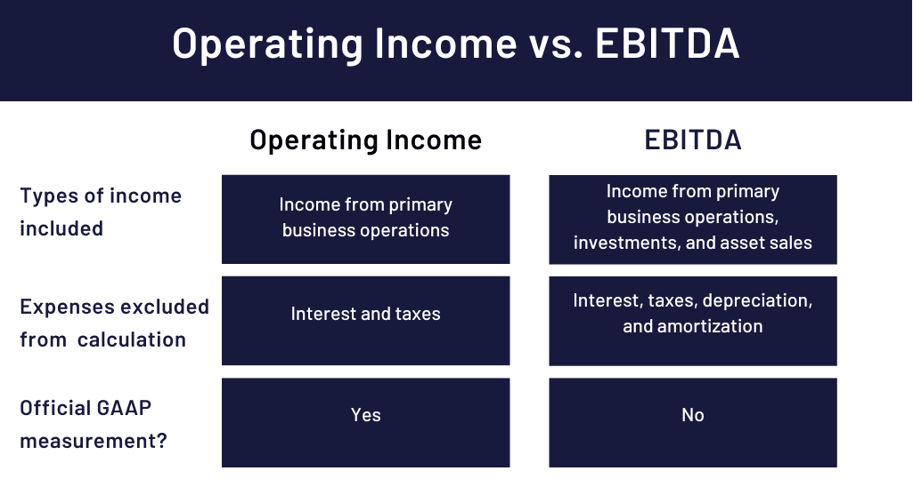

## Table of Contents

## What is EBIT?

EBIT stands for Earnings Before Interest and Taxes. It is a measure of a company's profitability that shows how much money the company makes from its operations before paying interest on any loans and before paying taxes. It's useful because it focuses just on the business's main activities, without the influence of how the company is financed or the tax situation.

You can find EBIT by starting with the company's revenue, then subtracting the cost of goods sold and other operating expenses. EBIT is important for comparing the performance of different companies because it removes the effects of different tax rates and debt levels. This makes it easier to see which company is doing a better job at making money from its core business activities.

## What is Operating Income?

Operating Income is the amount of money a company makes from its main business activities after paying for the costs to run those activities. It's what's left over from the company's sales after it pays for things like making products, paying employees, and other day-to-day expenses. Operating Income is important because it shows how well a company is doing at its core business, without considering other factors like investments or loans.

You can think of Operating Income as a company's profit before it has to pay interest on any loans or taxes. It's a key number to look at when you want to understand how profitable a company's main operations are. By focusing on Operating Income, you can see if a company is good at making money from what it does every day, which is really helpful for comparing different companies or seeing how a company is doing over time.

## How is EBIT calculated?

EBIT, which stands for Earnings Before Interest and Taxes, is a way to figure out how much money a company makes from its main work before it pays interest on loans or taxes. To find EBIT, you start with the company's total sales or revenue. Then, you take away the costs of making the products or services, like the materials and labor, and other expenses needed to run the business day-to-day, such as rent and utilities. What's left after subtracting these costs is the EBIT.

EBIT is useful because it shows how well a company is doing at making money from its main activities, without the impact of how it's financed or its tax situation. This makes it easier to compare different companies, even if they have different amounts of debt or pay different tax rates. By looking at EBIT, you can get a clearer picture of a company's core business performance.

## How is Operating Income calculated?

Operating Income is how much money a company makes from its main work after paying for the costs to do that work. It's like the money left over after the company sells its products or services and then pays for things like making the products, paying workers, and other everyday costs to run the business. To find Operating Income, you start with the total money the company makes from sales, then subtract the cost of making those sales, like materials, labor, and other regular expenses.

Operating Income is important because it shows if a company is good at making money from what it does every day. It doesn't include money made or lost from things like investments or loans. By looking at Operating Income, you can see how well the main part of the business is doing, without the effects of other financial stuff. This makes it easier to compare different companies or see how one company is doing over time.

## What are the main differences between EBIT and Operating Income?

EBIT and Operating Income are both ways to see how well a company is doing at making money from its main work. They are pretty similar because they both look at the money left over after paying for the costs of making and selling products or services. The big difference is that EBIT stands for Earnings Before Interest and Taxes, which means it's the profit before the company pays interest on loans or taxes. Operating Income, on the other hand, is just the money left after the costs of running the business, but before interest and taxes are taken out.

Even though they sound different, in many cases, EBIT and Operating Income are actually the same number. This is because both are calculated by starting with the company's sales and then subtracting the costs of making and selling those products or services. The difference comes up when a company has other kinds of income or expenses that are not part of its main work. For example, if a company makes money from renting out a building it owns, that money would be included in EBIT but not in Operating Income. So, while they are usually the same, it's good to check if there are any extra kinds of income or expenses that might make them different.

## Why might a company prefer to report EBIT over Operating Income?

A company might prefer to report EBIT instead of Operating Income because EBIT gives a broader picture of how well the company is doing overall. EBIT includes not just the money made from the main business activities, but also other kinds of income that the company might have, like money from renting out property or selling investments. This can make the company look more profitable, which is good for showing investors and others how well the company is doing.

Also, EBIT is useful for comparing different companies because it takes out the effects of how much debt a company has or what its tax situation is. This makes it easier to see which company is better at making money from its core business, no matter how they are financed or what their taxes are. So, a company might choose to report EBIT to make it easier for people to see how well it's doing compared to other companies.

## Can EBIT and Operating Income be the same for a company?

Yes, EBIT and Operating Income can be the same for a company. This happens when the company only makes money from its main business activities and doesn't have any other kinds of income or expenses. For example, if a company sells shoes and its only costs are making the shoes and running the store, then the money left over after these costs would be both its EBIT and its Operating Income.

However, if a company has other kinds of income or expenses that are not part of its main work, then EBIT and Operating Income might be different. For instance, if the same shoe company also makes money from renting out a building it owns, this extra money would be included in its EBIT but not in its Operating Income. So, while they can be the same, it depends on whether the company has any income or costs outside of its main business activities.

## How do non-operating expenses affect EBIT and Operating Income?

Non-operating expenses are costs that a company has that are not related to its main business activities. These can include things like interest on loans, losses from selling investments, or costs from legal issues. When you calculate Operating Income, you don't include these non-operating expenses because Operating Income only looks at the money made from the main business activities. So, non-operating expenses don't affect Operating Income at all.

On the other hand, non-operating expenses do affect EBIT because EBIT is calculated before interest and taxes, but after all other expenses, including non-operating ones. So, if a company has non-operating expenses, these will be subtracted when figuring out EBIT, which could make the EBIT number lower. This means that if a company has a lot of non-operating expenses, its EBIT will be less than its Operating Income.

## What industries typically show significant differences between EBIT and Operating Income?

Some industries often show big differences between EBIT and Operating Income because they have a lot of non-operating income or expenses. For example, in the financial services industry, like banks or insurance companies, they might have a lot of money coming in from investments or interest on loans. These are not part of their main business of banking or insurance, so they are included in EBIT but not in Operating Income. This can make their EBIT much higher than their Operating Income.

Another industry where you might see big differences is real estate. Companies in this industry often make money from renting out properties, which is not part of their main business of buying and selling real estate. This rental income would be included in EBIT but not in Operating Income. So, if a real estate company has a lot of rental income, its EBIT could be a lot higher than its Operating Income.

## How do tax considerations influence the choice between using EBIT or Operating Income?

Tax considerations can influence whether a company chooses to report EBIT or Operating Income because taxes are not included in either of these numbers. EBIT, which stands for Earnings Before Interest and Taxes, looks at how much money a company makes from its main work and other activities before it pays any taxes. This means that if a company wants to show how well it's doing without the effect of taxes, it might choose to report EBIT. This can be helpful for comparing different companies, especially if they are in countries with different tax rates.

On the other hand, Operating Income also does not include taxes, but it only looks at the money made from the main business activities. If a company wants to focus on how well it's doing at its core business and doesn't want to include other kinds of income or expenses, it might choose to report Operating Income. Since both EBIT and Operating Income are before taxes, tax considerations might not directly affect the choice between them, but they can influence how a company wants to present its financial performance to investors and others.

## What are the implications of using EBIT versus Operating Income for financial analysis?

When you use EBIT for financial analysis, you're looking at how much money a company makes from all its activities before it pays interest on loans or taxes. This can give you a broader view of the company's overall performance, including money made from things like renting out property or selling investments. Because EBIT includes these other kinds of income, it can make a company look more profitable. It's also good for comparing different companies because it takes out the effects of how much debt they have or what their tax situation is. This makes it easier to see which company is better at making money, no matter where they are or how they're financed.

On the other hand, using Operating Income for financial analysis focuses only on the money the company makes from its main business activities. This can be more useful if you want to see how well the company is doing at its core business without the influence of other income or expenses. Operating Income doesn't include money from things like investments, so it gives you a clearer picture of how the main part of the business is doing. This can be helpful for understanding if the company is good at making money from what it does every day, and it's easier to compare different companies or see how one company is doing over time based on its main operations.

## How do international accounting standards impact the reporting of EBIT and Operating Income?

International accounting standards can affect how companies report their financial numbers, including EBIT and Operating Income. These standards, like the International Financial Reporting Standards (IFRS), are rules that companies around the world follow to make sure their financial reports are clear and easy to compare. When it comes to EBIT and Operating Income, these standards help make sure that companies calculate these numbers in a similar way. This is important because it means that when you look at the financial reports of companies from different countries, you can trust that their EBIT and Operating Income numbers are calculated the same way.

However, even with these standards, there can still be some differences in how companies report EBIT and Operating Income. For example, some companies might include certain costs in their Operating Income that others do not. This can happen because the standards allow for some flexibility in how companies classify their expenses. So, while international accounting standards help make financial reports more consistent, it's still important to look closely at how each company calculates its numbers to make sure you understand what's included in their EBIT and Operating Income.

## What is the understanding of EBIT and Operating Income?

EBIT (Earnings Before Interest and Taxes) is a critical financial metric that provides insight into a company's operational profit by considering all expenses except for interest and income tax expenses. It reflects a firm's ability to generate earnings from its core operations before accounting for the costs related to borrowings and tax liabilities. EBIT is calculated as follows:

$$
\text{EBIT} = \text{Revenue} - \text{Operating Expenses} - \text{Non-operating expenses}
$$

This metric is valuable for investors and traders as it allows for a comparison of profitability between companies without the interference of different capital structures and tax environments.

Operating Income, on the other hand, evaluates a company’s profit derived strictly from its primary business activities, omitting any income or expenses not related to the core operations. It is defined as:

$$
\text{Operating Income} = \text{Gross Income} - \text{Operating Expenses}
$$

By focusing exclusively on operating efficiency, Operating Income assesses how well a company is performing without the distortions introduced by ancillary revenue streams or irregular expenses. This makes it a vital measure for assessing management effectiveness and the underlying strength of a company's business model.

While EBIT and Operating Income are often used interchangeably, they serve distinct analytical purposes. EBIT includes exceptional income and other non-operating results, thus providing a comprehensive overview of all factors affecting earnings, which is particularly useful for traders when contrasting firms with diverse non-operational activities. Conversely, Operating Income offers a purer picture of core business profitability by excluding non-operational results, thus focusing more intently on the sustainability of primary business functions.

For traders, the distinction between these metrics is instrumental in developing strategies based on a company's operational efficiency versus overall earnings potential. Understanding the nuances of EBIT and Operating Income can provide traders with more informed perspectives on the financial health and structure of different companies. In [algorithmic trading](/wiki/algorithmic-trading), selecting between these metrics may enable more accurate predictions of profitability trends, enhancing strategy effectiveness.

## References & Further Reading

[1]: ["Advances in Financial Machine Learning"](https://www.amazon.com/Advances-Financial-Machine-Learning-Marcos/dp/1119482089) by Marcos Lopez de Prado

[2]: ["Quantitative Trading: How to Build Your Own Algorithmic Trading Business"](https://books.google.com/books/about/Quantitative_Trading.html?id=j70yEAAAQBAJ) by Ernest P. Chan

[3]: ["Machine Learning for Algorithmic Trading"](https://github.com/PacktPublishing/Machine-Learning-for-Algorithmic-Trading-Second-Edition) by Stefan Jansen

[4]: ["Evidence-Based Technical Analysis: Applying the Scientific Method and Statistical Inference to Trading Signals"](https://www.amazon.com/Evidence-Based-Technical-Analysis-Scientific-Statistical/dp/0470008741) by David Aronson

[5]: Nachtmann, H. (2004). ["Earnings Management: Analyzing the EBIT Operating Income Relation."](https://www.coursehero.com/file/242399600/Verdi-How-doespdf/) Journal of Financial Economics.