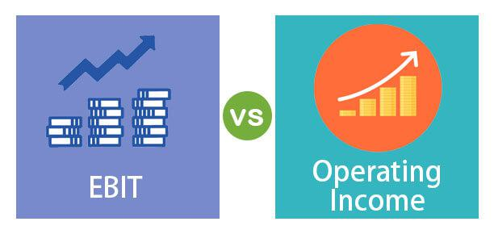

In the world of finance, understanding and utilizing the right financial metrics is crucial for success. Choosing appropriate financial indicators enables investors and traders to evaluate potential investments effectively, assess business performance, and make informed trading decisions. Among the myriad of financial metrics available, EBIT (Earnings Before Interest and Taxes) and Operating Income stand out as vital tools, particularly when applied within the rapidly evolving sphere of algorithmic trading.

EBIT and Operating Income play an essential role in assessing a company's profitability and operational efficiency. EBIT is calculated by taking a company's revenue and subtracting the cost of goods sold (COGS) and its operating expenses, but excluding interest and tax expenses. This metric allows traders and investors to examine earnings without the influence of tax regimes or financing structures, offering a more comparable measure of profitability across different companies. Operating Income, on the other hand, focuses on the profit derived from a company's core business operations. It discounts any non-operational revenue, thus providing insight into a company's operational efficiency and management performance.



The proliferation of algorithmic trading has extended beyond traditional analysis, necessitating more nuanced and sophisticated financial analyses. Algorithmic trading utilizes computer algorithms to automate trading decisions, often executing them in fractions of a second. These algorithms rely heavily on financial metrics to establish predefined trading criteria, monitor market trends, and spot trading opportunities. Consequently, the comprehensive insight offered by EBIT and Operating Income can be instrumental in formulating these criteria.

This article will explore how EBIT and Operating Income can be integral to algorithmic trading algorithms. By integrating these metrics into algorithms, traders can enhance their capability to assess financial health, identify undervalued or overvalued stocks, and execute trades with increased precision and efficiency. The proper application of EBIT and Operating Income within algorithmic trading strategies can lead to superior financial performance and increased market competitiveness.

## Table of Contents

## Understanding EBIT and Operating Income

EBIT (Earnings Before Interest and Taxes) is a critical financial metric that provides insight into a company's operational profit by considering all expenses except for interest and income tax expenses. It reflects a firm's ability to generate earnings from its core operations before accounting for the costs related to borrowings and tax liabilities. EBIT is calculated as follows:

$$
\text{EBIT} = \text{Revenue} - \text{Operating Expenses} - \text{Non-operating expenses}
$$

This metric is valuable for investors and traders as it allows for a comparison of profitability between companies without the interference of different capital structures and tax environments.

Operating Income, on the other hand, evaluates a company’s profit derived strictly from its primary business activities, omitting any income or expenses not related to the core operations. It is defined as:

$$
\text{Operating Income} = \text{Gross Income} - \text{Operating Expenses}
$$

By focusing exclusively on operating efficiency, Operating Income assesses how well a company is performing without the distortions introduced by ancillary revenue streams or irregular expenses. This makes it a vital measure for assessing management effectiveness and the underlying strength of a company's business model.

While EBIT and Operating Income are often used interchangeably, they serve distinct analytical purposes. EBIT includes exceptional income and other non-operating results, thus providing a comprehensive overview of all factors affecting earnings, which is particularly useful for traders when contrasting firms with diverse non-operational activities. Conversely, Operating Income offers a purer picture of core business profitability by excluding non-operational results, thus focusing more intently on the sustainability of primary business functions.

For traders, the distinction between these metrics is instrumental in developing strategies based on a company's operational efficiency versus overall earnings potential. Understanding the nuances of EBIT and Operating Income can provide traders with more informed perspectives on the financial health and structure of different companies. In [algorithmic trading](/wiki/algorithmic-trading), selecting between these metrics may enable more accurate predictions of profitability trends, enhancing strategy effectiveness.

## Usefulness of EBIT and Operating Income

EBIT (Earnings Before Interest and Taxes) stands as a critical financial metric that provides a comprehensive overview of a company’s profitability. By excluding interest and tax expenses, EBIT offers a neutral perspective on profitability that is not skewed by varying tax obligations or capital structures. This characteristic makes EBIT an invaluable tool for comparing firms across different jurisdictions with diverse tax frameworks. By using EBIT, traders can gain insights into a company's pure operational performance, devoid of financial leverage effects or taxation impacts, which is essential for making informed investment decisions and identifying potential [arbitrage](/wiki/arbitrage) opportunities.

On the other hand, Operating Income specifically highlights a company's profit derived from its core business operations. By excluding non-operational revenue and expenses, Operating Income zeroes in on the efficiency and profitability of the company's primary business activities. This focus enables traders and investors to assess the effectiveness of management in utilizing the company's assets to generate revenue. A robust Operating Income indicates strong operational performance and managerial acumen, thus serving as a critical indicator of a company’s potential for sustained profitability within its industry. 

Both EBIT and Operating Income are pivotal in evaluating a company’s financial health and stability. For traders, especially those focusing on long-term strategies, these metrics provide a deeper understanding of a company’s economic viability and future growth prospects. By analyzing EBIT and Operating Income trends, traders can assess whether a company is likely to maintain or improve its market position over time. Consequently, these metrics guide strategic trading decisions, enabling traders to identify undervalued or overvalued stocks, optimize their portfolios, and anticipate shifts in market dynamics. Understanding and utilizing EBIT and Operating Income are therefore essential for achieving superior trading outcomes and financial market success.

## Algorithmic Trading and Financial Metrics

Algorithmic trading, often known as algo trading, involves the use of sophisticated computer algorithms to execute trades at speeds and frequencies that are impossible for human traders. By leveraging mathematical models and complex formulas, these algorithms can analyze a vast array of market variables and make trading decisions based on predefined criteria. The primary objective is to capitalize on profitable opportunities in the market with speed and efficiency.

Financial metrics such as EBIT (Earnings Before Interest and Taxes) and Operating Income play a pivotal role in shaping algorithmic trading strategies. These metrics offer valuable insights into a company’s profitability and operational health, which are critical for identifying viable investment opportunities. EBIT, for instance, provides a comprehensive profit picture by excluding the costs of interest and taxes, thus allowing traders to compare companies irrespective of their differing tax and financial structures. Operating Income, on the other hand, focuses specifically on income derived from a company’s primary business operations, offering a clear perspective on operational efficiency and management performance.

In the context of algorithmic trading, the integration of financial metrics like EBIT and Operating Income involves several technical processes. Algorithms are designed to process large datasets containing these metrics, and through a series of computations, they ascertain the financial viability of potential trades. For example, a trading algorithm might be programmed to identify and execute trades when a company’s EBIT or Operating Income surpasses a certain threshold, indicating potential undervaluation or overvaluation.

To effectively utilize these financial metrics in algorithms, accurate and timely data is paramount. Algorithms rely heavily on real-time data feeds and historical data to conduct predictive analysis and risk assessments. The precision of an algorithm's predictions hinges on the quality of this data and the robustness of the financial models employed. By systematically incorporating EBIT and Operating Income into trading strategies, algorithms can refine their decision-making processes. This leads to enhanced prediction accuracy, reducing exposure to risk and increasing the potential for profitable trades.

The role of these financial metrics extends beyond simple trading triggers; they are instrumental in developing sophisticated risk management frameworks within algorithmic trading systems. Understanding a company’s profitability dynamics through EBIT and Operating Income enables algorithms to better gauge market conditions and [volatility](/wiki/volatility-trading-strategies). This knowledge aids in constructing balanced portfolios that align with a trader’s investment objectives while mitigating potential financial risks. 

In conclusion, the incorporation of financial metrics like EBIT and Operating Income into algorithmic trading is indispensable for traders seeking to optimize their trading strategies and outcomes. By harnessing these metrics, traders can improve their decision-making capabilities, thereby achieving greater precision and success in the ever-evolving financial markets.

## Key Differences and Implications

EBIT (Earnings Before Interest and Taxes) and Operating Income are financial metrics that, while similar, have distinct components and implications for financial analysis. EBIT encompasses non-operating income, whereas Operating Income restricts its focus to income generated from core business operations, excluding any non-operational revenue or expenses such as interest and taxes. This distinction leads to differences in how these metrics are interpreted and applied in financial analyses.

For traders, especially those dealing in commodities and equities, the ability to discern between operational and non-operational revenues is crucial. Variances in these metrics could signal different operational efficiencies or profitability levels that might affect investment decisions. For instance, EBIT might present a healthier financial picture if a company has significant non-operational income. Conversely, Operating Income illuminates the financial performance derived strictly from a company's core activities, providing insight into the firm's operational effectiveness.

For algorithm developers, these differences necessitate a careful choice of which metric to use based on their trading objectives and the standards prevalent in their industry. Algorithms leveraging EBIT may be more suitable for environments where understanding overall profitability, including external, non-operational factors, is key. On the other hand, employing Operating Income might be advantageous when the focus is on evaluating managerial performance and operational health, independent of external income variations.

Choosing appropriately between these metrics is vital to align algorithmic trading strategies with financial objectives. The alignment ensures that the trading algorithms accurately reflect the desired balance between operational insights and comprehensive profitability evaluations. Algorithm developers may use Python to build algorithms that incorporate either EBIT or Operating Income metrics. Below is an example of how one might filter stock data based on EBIT:

```python
import pandas as pd

# Sample data
data = {'Company': ['A', 'B', 'C'],
        'Revenue': [1000, 1500, 800],
        'Operating_Expenses': [400, 500, 300],
        'Non_Operating_Income': [50, 100, 0],
        'Interest': [50, 50, 50],
        'Taxes': [150, 200, 100]}

df = pd.DataFrame(data)

# Calculate EBIT
df['EBIT'] = df['Revenue'] - df['Operating_Expenses'] + df['Non_Operating_Income'] - df['Interest'] - df['Taxes']

# Filter companies with EBIT over a threshold
threshold = 300
ebit_positive = df[df['EBIT'] > threshold]

print(ebit_positive)
```

In this code snippet, a DataFrame contains financial data for companies, and EBIT is calculated to filter companies exceeding a certain profit threshold. This type of analysis can guide traders and algorithm developers to better understand the implications of these financial metrics, ensuring selected strategies are aligned with their specific goals and market expectations.

## Applying EBIT and Operating Income in Trading Strategies

Traders can enhance their strategies by exploiting the differences between EBIT (Earnings Before Interest and Taxes) and Operating Income. These financial metrics provide distinct perspectives on a company's financial health, and discrepancies between them can signal potential investment opportunities. 

When EBIT is significantly higher than Operating Income, this may indicate that non-operational income is bolstering a company's profitability. Conversely, if Operating Income exceeds EBIT, it may suggest substantial non-operational losses or expenses. Traders can leverage these discrepancies to identify stocks that may be undervalued or overvalued, thereby informing their algorithmic trading decisions.

An in-depth analysis of EBIT and Operating Income can be integrated into algorithmic trading strategies. By incorporating these metrics into algorithms, traders can systematically evaluate a large [volume](/wiki/volume-trading-strategy) of stocks to uncover inefficiencies within the market. This process can be articulated in algorithmic code, emphasizing precise metrics calculations and logical conditions to trigger buy or sell signals.

Here's a basic Python example that illustrates how such insights might be coded:

```python
def evaluate_stock(ebit, operating_income):
    # Calculate discrepancy between EBIT and Operating Income
    discrepancy = ebit - operating_income
    threshold = 1000000  # Example threshold value for significant discrepancy

    if discrepancy > threshold:
        decision = "Potential Overvaluation"
    elif discrepancy < -threshold:
        decision = "Potential Undervaluation"
    else:
        decision = "Fairly Valued"

    return decision

# Example usage
ebit = 15000000
operating_income = 13500000
print(evaluate_stock(ebit, operating_income))
```

In this basic algorithm, a threshold is set to determine a significant discrepancy. Adjusting the threshold allows traders to customize the algorithm based on their risk tolerance and market conditions. By scaling this to analyze a portfolio or the entire market, traders can systemically identify opportunities where the market might not accurately reflect a company's operational success.

In conclusion, the strategic application of EBIT and Operating Income metrics within trading algorithms can spotlight opportunities not immediately evident from surface-level financial assessments. Traders who adeptly incorporate these insights into their algorithmic models are positioned to exploit market inefficiencies effectively, potentially leading to more informed investment decisions and enhanced trading outcomes.

## Conclusion

EBIT (Earnings Before Interest and Taxes) and Operating Income are integral financial metrics that play a crucial role in formulating effective trading strategies. These metrics provide insights into a company’s profitability and operational efficiency, making them invaluable for both traditional and algorithmic trading approaches. By excluding interest and taxes, EBIT offers a clear picture of how well a company generates profits from its operations. In contrast, Operating Income focuses on earnings derived strictly from core business activities, thereby highlighting management's operational competence.

In the context of algorithmic trading, these metrics are indispensable for enhancing the accuracy and efficiency of financial transactions. Algorithms utilize EBIT and Operating Income to evaluate potential investment opportunities by analyzing a company's fundamental financial stability and performance. The precise and systematic nature of algorithmic trading allows traders to react swiftly to discrepancies in these financial metrics, enabling timely decision-making that maximizes returns while minimizing risks.

For traders and algorithm developers, a thorough understanding and effective application of EBIT and Operating Income can unlock superior trading outcomes and lead to sustained success in the financial markets. By integrating these metrics into algorithmic models, traders are better equipped to navigate the complexities of the market, identify undervalued or overvalued stocks, and capitalize on market inefficiencies. This strategic use of financial metrics is vital in achieving long-term profitability and maintaining a competitive edge in modern trading environments.

## References & Further Reading

[1]: ["Advances in Financial Machine Learning"](https://www.amazon.com/Advances-Financial-Machine-Learning-Marcos/dp/1119482089) by Marcos Lopez de Prado

[2]: ["Quantitative Trading: How to Build Your Own Algorithmic Trading Business"](https://books.google.com/books/about/Quantitative_Trading.html?id=j70yEAAAQBAJ) by Ernest P. Chan

[3]: ["Machine Learning for Algorithmic Trading"](https://github.com/PacktPublishing/Machine-Learning-for-Algorithmic-Trading-Second-Edition) by Stefan Jansen

[4]: ["Evidence-Based Technical Analysis: Applying the Scientific Method and Statistical Inference to Trading Signals"](https://www.amazon.com/Evidence-Based-Technical-Analysis-Scientific-Statistical/dp/0470008741) by David Aronson

[5]: Nachtmann, H. (2004). ["Earnings Management: Analyzing the EBIT Operating Income Relation."](https://www.coursehero.com/file/242399600/Verdi-How-doespdf/) Journal of Financial Economics.