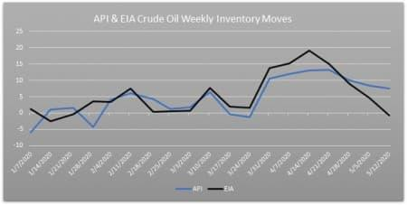

In today's fast-paced financial markets, algorithmic trading has become a cornerstone of trading strategies for many investors and institutions. These automated trading strategies rely heavily on technological advancements and access to real-time data. APIs (Application Programming Interfaces) play a crucial role in facilitating algorithmic trading by providing seamless integration with trading platforms and enabling traders to execute strategies with precision and speed. Through APIs, traders can access a wealth of market data, perform transactions, and receive confirmations almost instantaneously, allowing for rapid response to market dynamics.

In the commodities market, particularly oil trading, two key reports significantly influence trading decisions: the Energy Information Administration (EIA) and the American Petroleum Institute (API) reports. These reports provide crucial insights into the oil supply-demand balance, impacting prices and subsequently guiding trading strategies. The EIA, a governmental agency, delivers comprehensive and highly regarded data through its weekly crude oil inventory report. In contrast, the API, an industry organization, releases its report earlier than the EIA, offering a preliminary glimpse into oil inventories that traders may use for early positioning.



This article aims to explore the significance of APIs in algorithmic trading, compare the impact of EIA and API data on trading strategies, and discuss how traders utilize these reports to refine their trading decisions. The focus will be on understanding the relevance of these reports and APIs in crafting successful algorithmic trading strategies, highlighting how combining technological interfaces with data analysis can provide a strategic edge in the dynamic environment of commodities trading.

## Table of Contents

## Understanding APIs in Algo Trading

APIs (Application Programming Interfaces) serve as essential conduits for traders, linking their algorithms directly with market data and trading platforms. This integration is critical for executing automated trading strategies, as APIs provide a real-time flow of information and operational capabilities necessary for contemporary trading environments.

One of the primary functions of APIs in algo trading is to offer access to real-time market data. This data includes live price feeds, [order book](/wiki/order-book-trading-strategies) details, and historical price information, which are vital for making informed trading decisions. By incorporating real-time data, algorithms can respond swiftly to market fluctuations, executing trades with precision and speed that would be impossible to achieve manually.

APIs also facilitate the order placement process, enabling traders to automate the submission, modification, and cancellation of orders. This capability is particularly advantageous in fast-paced markets where timing is critical. The ability to automate these actions allows traders to implement complex strategies that involve high-frequency trading or other time-sensitive operations.

Transaction confirmations are another crucial component provided by APIs. Once trades are executed, APIs send confirmations back to the algorithm, ensuring that the system is aware of the trade status. This feedback loop is essential for maintaining the integrity of the trading strategy, allowing the algorithm to adapt based on the outcomes of executed trades.

Different brokers offer a variety of API solutions, each with unique access to markets, products, and pricing structures. For instance, some brokers may provide APIs with direct access to a broad range of global markets, while others might focus on specific asset classes such as equities, commodities, or currencies. This variability necessitates traders to evaluate their choice of API based on their specific trading needs.

Choosing the right API involves a thorough assessment of factors such as speed, reliability, and the broker's market access. Speed is of paramount importance in algo trading, where milliseconds can make a significant difference in trade outcomes. Traders should also consider the reliability of the API, as system downtimes can lead to missed opportunities or unintended trade consequences. Furthermore, the breadth of market access offered by the broker's API should align with the trader’s strategy, ensuring that all required markets and instruments are accessible.

In conclusion, APIs are pivotal to the functionality and success of [algorithmic trading](/wiki/algorithmic-trading) strategies, offering the necessary infrastructure for real-time data access, automated order execution, and transaction verification. The careful selection of an API that matches a trader's performance criteria and strategic objectives is essential for achieving optimal trading results.

## EIA and API Reports: Overview

Weekly [crude oil](/wiki/crude-oil) inventory reports from the Energy Information Administration (EIA) and the American Petroleum Institute (API) are integral components of the oil markets. These reports are essential for traders and analysts as they provide critical insights into the supply-demand dynamics that directly influence oil prices and inform trading decisions.

The EIA, a U.S. governmental agency, releases comprehensive and highly regarded oil inventory data. This data is collected using robust methodologies and is generally considered more reliable due to the EIA's adherence to stringent data collection and reporting standards. The EIA's weekly report includes details about crude oil inventories, refinery throughput, imports, and other pertinent data points that can affect market conditions.

On the other hand, the API is an industry organization that also provides influential data on crude oil inventories. Unlike the EIA, the API's data often relies on voluntary reporting from the industry, which may lead to discrepancies. However, the API report is typically released ahead of the EIA report, offering an early look at potential inventory changes. This timeliness allows traders to make preliminary assessments and potentially position themselves in the market before the EIA's data is available.

Both reports serve as valuable tools for market participants who use them to gauge supply-demand balances. When inventories are reported to have increased, it may suggest a supply surplus, potentially exerting downward pressure on prices. Conversely, a reported decrease can imply tighter supply conditions, possibly leading to price increases. Traders utilizing these reports must consider the broader context of global oil markets and other economic indicators to fully assess their impact.

The strategic use of these reports lies in understanding their nuances—while the EIA provides more detailed and reliable data, the API offers an early glimpse that can be instrumental for immediate decision-making. Consequently, successful trading strategies often incorporate both sources of information to navigate the complex landscape of oil trading effectively.

## Impact of EIA and API Reports on Algo Trading

In algo trading, the integration of EIA (Energy Information Administration) and API (American Petroleum Institute) reports plays a pivotal role in forecasting oil market trends. These reports provide traders with valuable data concerning oil inventories, which can significantly impact supply-demand dynamics and, consequently, oil prices. As these reports are released, algorithms can be fine-tuned to respond efficiently to new information. 

Changes in oil inventories reported by the EIA and API often indicate shifts in supply or demand. For instance, a larger-than-expected increase in oil inventories may suggest an oversupply or weakening demand, potentially leading to downward pressure on oil prices. Conversely, a reduction in inventories could indicate stronger demand or decreased supply, possibly driving prices higher. Understanding these dynamics allows traders to refine their algorithms to exploit such situations.

Algorithmic trading systems can be programmed to react to these data releases instantly. For example, a simple model might entail using an algorithm that executes buy orders when inventory decreases beyond a certain threshold:

```python
if eia_inventory_change < -threshold:
    execute_trade('buy', quantity)
elif eia_inventory_change > threshold:
    execute_trade('sell', quantity)
```

These algorithms often look for anomalies between expected and reported values, adjusting their trading strategies in response to significant deviations. The real advantage lies in the ability of these algorithms to capitalize on market [volatility](/wiki/volatility-trading-strategies) triggered by unexpected data points, enabling traders to maximize gains in short time frames.

Successful algo trading strategies frequently integrate such economic data to increase their effectiveness over time. By incorporating EIA and API reports, traders can optimize their decision-making processes, leveraging precise inventory insights to improve forecasting and execution. This data-driven approach can significantly enhance the performance of trading strategies, allowing algorithms to not only anticipate market movements but also adapt swiftly to changes and maintain a competitive edge in the commodities market.

## Comparing EIA and API in Algo Trading

The Energy Information Administration (EIA) and the American Petroleum Institute (API) both issue weekly reports on crude oil inventories, which are crucial for making informed trading decisions in the oil market, especially within algorithmic trading frameworks. Understanding the comparative strengths and limitations of these reports is essential for optimizing trading strategies.

The EIA's report is highly regarded for its comprehensive methodology and detailed datasets. As a governmental agency, the EIA collects data through a structured and consistent approach, ensuring high accuracy and reliability. This thoroughness provides traders with a more definitive analysis of oil market conditions. Consequently, traders often place significant trust in the EIA's data when executing their trading strategies.

In contrast, the API, a prominent industry organization, releases its report a day prior to the EIA. While the API's report is less comprehensive, it offers a vital preliminary indication of potential changes in oil inventories. This timing advantage allows traders to anticipate market movements, offering them the opportunity to position themselves early. For algo traders, this early release can be crucial, providing a window to adjust algorithms in anticipation of the subsequent EIA report.

Algorithms can be specifically programmed to take advantage of the differences between the API and EIA reports. For instance, if the API indicates a significant increase in oil inventories, an algorithm might predict a similar trend in the EIA report and adjust its trading positions accordingly. Conversely, if the reports diverge, this discrepancy could signal a unique trading opportunity. Utilizing Python, traders can write scripts that automatically analyze and respond to the differences between these reports. Here's a simple script outline to model this behavior:

```python
# Pseudo Python code for analyzing API and EIA report differences

def analyze_reports(api_data, eia_data):
    if api_data['inventory_change'] > eia_data['inventory_change']:
        # Strategy for higher API predicted inventory
        trade_strategy = "short"
    elif api_data['inventory_change'] < eia_data['inventory_change']:
        # Strategy for lower API predicted inventory
        trade_strategy = "long"
    else:
        # Neutral or hold position
        trade_strategy = "hold"
    return trade_strategy

# Example usage
api_report = {'inventory_change': 50000}  # Example data
eia_report = {'inventory_change': 45000}  # Example data

decision = analyze_reports(api_report, eia_report)
print(f"Trading strategy based on reports divergence: {decision}")
```

In conclusion, while both EIA and API reports are valuable resources, understanding their unique strengths and limitations is crucial for refining trading strategies. The EIA report's depth offers reliability, whereas the API report's earlier release provides valuable foresight. By effectively leveraging the data from each report, traders can significantly enhance their algorithmic trading strategies.

## Choosing the Right API Broker for Algo Trading

Choosing the right API broker is a critical step in optimizing algorithmic trading strategies. Evaluating brokers involves assessing key service aspects, such as market access, fee structures, and technical support, which can significantly impact trading efficiency and profitability. 

Market access is a primary consideration when selecting an API broker. Different brokers provide varying levels of access to financial instruments, trading platforms, and global markets. For instance, [Interactive Brokers](/wiki/interactive-brokers-api) and Alpaca offer extensive market access, catering to a broad spectrum of financial products including stocks, options, futures, and [forex](/wiki/forex-system). Interactive Brokers, with its comprehensive global reach, is especially popular among institutional and individual traders seeking diverse market opportunities. On the other hand, Alpaca is known for its commission-free trading model, which appeals to cost-conscious traders, offering US market stocks and ETFs.

Fee structures are another important [factor](/wiki/factor-investing). Traders must understand the costs associated with using an API broker, such as commissions, data feed charges, and potential hidden fees. Interactive Brokers uses a tiered pricing model that offers lower costs for higher trading volumes, which can benefit active traders. Alpaca’s zero-commission trading is attractive, but it's essential to consider any fees related to data or additional trading features.

Technical support and API reliability are also crucial. A reliable API is fundamental for executing trades efficiently and minimizing downtime. Interactive Brokers provides robust API solutions with extensive documentation, sample codes, and regular updates, ensuring seamless integration and operation. Alpaca, focusing on accessibility and ease of use, offers a RESTful API with modern programming languages, such as Python, which simplifies the building of trading applications. 

Ultimately, traders must align their choice of API broker with their specific trading needs and strategy requirements. For instance, a trader focused on high-frequency trading may prioritize a broker offering low latency, while another employing a [machine learning](/wiki/machine-learning) model could emphasize API versatility and data access. Python, with its rich ecosystem of libraries for machine learning and data analysis, can be leveraged to create sophisticated trading algorithms. Here is a simple example of using Alpaca's API in Python:

```python
import alpaca_trade_api as tradeapi

# Initialize the API with your credentials
api = tradeapi.REST('APCA-API-KEY-ID', 'APCA-API-SECRET-KEY', base_url='https://paper-api.alpaca.markets')

# Retrieve account info
account = api.get_account()
print(account)

# Place a market order for Apple stocks
api.submit_order(
    symbol='AAPL',
    qty=1,
    side='buy',
    type='market',
    time_in_force='gtc'
)
```

This code snippet illustrates how straightforward it can be to interact with an API to execute trades. Understanding the intricacies of each broker's API, assessing their offerings, and evaluating how these align with your trading strategy are critical steps in selecting the right API broker for algorithmic trading.

## Conclusion

APIs have significantly transformed traders’ interactions with financial markets, with algorithmic trading standing out as a primary beneficiary. By providing real-time market data, APIs facilitate the execution of complex trading algorithms, allowing traders to respond swiftly to market changes. When integrated with comprehensive reports from the EIA and API, these capabilities can offer a strategic edge in the commodities sector. EIA and API reports grant detailed insights into oil inventories, influencing price predictions and helping traders craft more informed strategies. The immediacy of API data access, coupled with the intricate analysis from EIA reports, forms a robust foundation for traders looking to optimize their trading results.

For traders to maximize the benefits of these resources, understanding both their individual and combined impacts on algo trading is vital. The speed with which APIs deliver data means traders can act on fresh information faster than ever, while the EIA’s in-depth reports provide a reliable basis for longer-term strategic planning. Developing expertise in these areas is crucial for traders seeking successful algo trading outcomes. Mastery of API functionalities and the analytical prowess to interpret EIA and API reports can greatly enhance a trader’s ability to anticipate and navigate market movements effectively.

Ultimately, the fusion of rapid API data transmission with the rich, analytical insights offered by EIA and API reports positions traders to achieve superior market performance. Emphasizing this dual advantage fosters a more responsive and informed trading approach, paving the way for continued success in the ever-evolving arena of algorithmic trading.

## References & Further Reading

[1]: Strange, W. (2013). ["Oil, Illiquidity and Index Option Pricing,"](https://www.uni-goettingen.de/de/document/download/cbc3de8e4ea122ac6263edb279074ac7.pdf/Kanne_et_al_2020.pdf) Decisions in Economics and Finance.

[2]: Jansen, S. (2020). ["Machine Learning for Algorithmic Trading,"](https://github.com/stefan-jansen/machine-learning-for-trading) 2nd Edition, Packt Publishing.

[3]: Aronson, D. R. (2006). ["Evidence-Based Technical Analysis: Applying the Scientific Method and Statistical Inference to Trading Signals,"](https://www.amazon.com/Evidence-Based-Technical-Analysis-Scientific-Statistical/dp/0470008741) Wiley.

[4]: De Prado, M. L. (2018). ["Advances in Financial Machine Learning,"](https://www.amazon.com/Advances-Financial-Machine-Learning-Marcos/dp/1119482089) Wiley.

[5]: Chan, E. (2008). ["Quantitative Trading: How to Build Your Own Algorithmic Trading Business,"](https://github.com/ftvision/quant_trading_echan_book) Wiley.