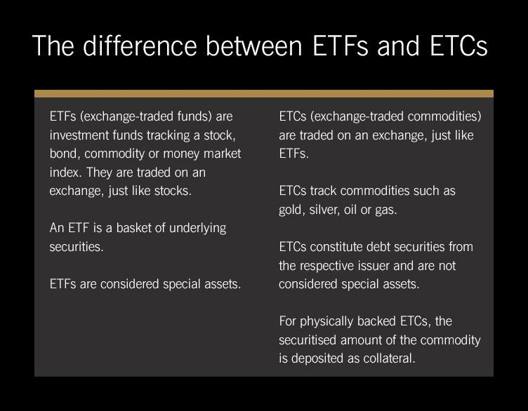

## Table of Contents

## What is an ETC?

An ETC, or Electronic Toll Collection, is a system that lets drivers pay tolls without stopping. It uses technology to automatically charge the toll to the driver's account when their vehicle passes through a toll booth. This makes travel faster and more convenient because drivers don't need to stop and pay with cash or a card.

ETC systems usually work with a small device, called a transponder, that is placed inside the vehicle. When the vehicle goes through a toll area, the transponder communicates with sensors at the toll booth. The sensors read the transponder and the toll is charged to the account linked to it. This technology helps reduce traffic congestion and saves time for everyone on the road.

## What is an ETF?

An ETF, or Exchange-Traded Fund, is a type of investment that works like a basket. It holds a collection of different investments, like stocks, bonds, or commodities, and you can buy or sell it on a stock exchange just like you would with a single stock. This makes it easy for people to invest in a wide range of assets without having to buy each one separately.

ETFs are popular because they offer a way to diversify your investments, which means spreading your money across different types of assets to reduce risk. They also tend to have lower fees than other types of funds, making them a cost-effective choice for many investors. Plus, since they trade on stock exchanges, you can buy and sell them throughout the trading day at market prices, giving you more flexibility than some other investment options.

## How do ETCs and ETFs differ in their structure?

ETCs, or Electronic Toll Collection systems, are not investment vehicles but rather a technology used for collecting tolls on roads and highways. They work by using a small device called a transponder that's placed in a vehicle. When the vehicle passes through a toll booth, the transponder communicates with sensors to automatically charge the toll to the driver's account. This system is designed to make travel smoother and faster by eliminating the need for drivers to stop and pay tolls manually.

ETFs, or Exchange-Traded Funds, on the other hand, are investment products that hold a collection of assets like stocks, bonds, or commodities. They are traded on stock exchanges, just like individual stocks, allowing investors to buy and sell shares throughout the trading day. ETFs provide a way for people to diversify their investments easily and typically have lower fees compared to other types of funds. Unlike ETCs, ETFs are focused on helping people grow their money through investments rather than facilitating toll payments.

## What are the typical underlying assets for ETCs?

ETCs, or Electronic Toll Collection systems, don't have underlying assets like ETFs do. Instead, they are systems designed to help collect tolls on roads and highways. The main component of an ETC system is a transponder, which is a small device placed inside a vehicle. When the vehicle goes through a toll booth, the transponder communicates with sensors to automatically charge the toll to the driver's account.

This system makes travel easier and faster because drivers don't have to stop to pay tolls. It helps reduce traffic congestion and saves time for everyone on the road. ETCs focus on improving the efficiency of toll collection and do not involve investments or financial assets.

## What are the common types of assets held by ETFs?

ETFs often hold a variety of assets, but the most common ones are stocks. These can be from a specific country, like the U.S., or from different countries around the world. ETFs can also focus on stocks from certain industries, like technology or healthcare. This makes it easy for people to invest in a whole group of stocks at once, instead of buying each one separately.

Another common type of asset in ETFs is bonds. These can be government bonds, like those issued by the U.S. Treasury, or corporate bonds from companies. Bond ETFs are popular because they can provide a steady income through interest payments, and they can help balance out the risk in an investment portfolio.

ETFs can also hold commodities, like gold, silver, or oil. These are physical goods that people can trade. Commodity ETFs give investors a way to invest in these goods without having to buy and store them themselves. This can be a good option for people who want to add some variety to their investments.

## How do the fees and expenses compare between ETCs and ETFs?

ETCs, or Electronic Toll Collection systems, don't have fees in the same way ETFs do. When you use an ETC, you usually pay a one-time fee for the transponder, and then you pay the tolls as you go. There might be a small monthly or annual fee for maintaining your account, but these fees are generally low and straightforward. The main cost is the toll itself, which varies depending on the road and the distance you travel.

ETFs, on the other hand, come with fees that are more like investment costs. The main fee is called the expense ratio, which is a percentage of your investment that goes to cover the costs of managing the [ETF](/wiki/etf-trading-strategies). This fee is taken out of the fund's assets, so it affects the overall return on your investment. ETFs might also have other costs, like trading fees when you buy or sell shares, and sometimes there are fees if you want to withdraw your money quickly. Overall, ETFs usually have lower fees than other types of funds, but it's important to check the specific fees for any ETF you're thinking about investing in.

## What are the tax implications of investing in ETCs versus ETFs?

ETCs, or Electronic Toll Collection systems, don't have any tax implications in terms of investment returns because they are not investments. When you use an ETC, you're simply paying tolls to use certain roads. The only tax-related aspect might be if your country or state charges sales tax on the purchase of the transponder or on the tolls themselves. But this would be the same as any other purchase you make, and it's not related to investing.

ETFs, on the other hand, can have tax implications because they are investment vehicles. When you invest in an ETF, you might have to pay taxes on any profits you make, like capital gains. If you sell your ETF shares for more than you paid for them, you'll owe taxes on that gain. Also, some ETFs pay dividends, and you'll have to pay taxes on those dividends too. The exact tax you'll pay depends on your country's tax laws and how long you held the ETF before selling it. It's a good idea to talk to a tax advisor to understand how ETFs might affect your taxes.

## How does liquidity vary between ETCs and ETFs?

ETCs, or Electronic Toll Collection systems, don't have anything to do with [liquidity](/wiki/liquidity-risk-premium) because they are not investments. They are just a way to pay tolls on roads without stopping. You buy a transponder and use it to pay tolls, but you can't sell the transponder or the toll payments to someone else. So, the idea of liquidity, which means how easily you can turn something into cash, doesn't apply to ETCs.

ETFs, or Exchange-Traded Funds, are very different because they are investments that you can buy and sell on a stock exchange. Liquidity for ETFs means how easily you can buy or sell shares without affecting the price too much. ETFs usually have good liquidity because they trade on stock exchanges where there are lots of buyers and sellers. This means you can usually buy or sell ETF shares quickly and at a fair price, which is important if you need to get your money out of the investment fast.

## What are the risks associated with ETCs compared to ETFs?

ETCs, or Electronic Toll Collection systems, don't really have risks in the same way that investments do. They're just a way to pay tolls on roads without stopping. The main risk with ETCs might be if the system doesn't work properly and you get charged the wrong amount, or if your account gets hacked and someone uses your transponder without permission. But these risks are more about using technology and less about losing money like you might with an investment.

ETFs, or Exchange-Traded Funds, come with different kinds of risks because they are investments. One big risk is that the value of the assets inside the ETF can go up or down, which means you could lose money if you sell your shares for less than you paid for them. Another risk is that the market where you buy and sell ETFs might not be as busy on some days, making it harder to sell your shares quickly at a good price. Also, ETFs can be affected by things like changes in interest rates, economic news, or big events that impact the whole market.

## How do ETCs and ETFs perform under different market conditions?

ETCs, or Electronic Toll Collection systems, don't really change with the market because they're not investments. They just help you pay tolls on roads without stopping. So, whether the stock market goes up or down, ETCs keep working the same way. The only thing that might change is if the toll prices go up or down, but that's not related to the market. It's more about how much it costs to use the road.

ETFs, or Exchange-Traded Funds, are different because they are investments that can go up or down with the market. When the market is doing well, the value of the assets inside the ETF might go up, which means your investment could be worth more. But if the market goes down, the value of those assets might drop, and you could lose money. ETFs can be affected by all sorts of things, like changes in interest rates, economic news, or big events that impact the whole market. So, it's important to think about these market conditions when you're investing in ETFs.

## What are the regulatory differences between ETCs and ETFs?

ETCs, or Electronic Toll Collection systems, are regulated by transportation authorities and government agencies that manage roads and highways. These agencies set the rules for how ETCs work, like how much the tolls cost and how the transponders are used. They make sure that the systems are safe and that people's information is kept private. The focus is on making sure the toll collection process is smooth and fair for everyone who uses the roads.

ETFs, or Exchange-Traded Funds, are regulated by financial authorities, like the Securities and Exchange Commission (SEC) in the United States. These regulators make rules to protect investors and keep the financial markets fair. They check that ETFs follow certain rules, like how they are created, how they are traded, and what information they have to share with investors. The goal is to make sure that people can invest in ETFs safely and that the funds are managed properly.

## How can advanced investors use ETCs and ETFs in portfolio diversification strategies?

Advanced investors can't use ETCs, or Electronic Toll Collection systems, in their portfolio diversification strategies because ETCs are not investments. They are just a way to pay tolls on roads without stopping. So, ETCs don't have anything to do with growing your money or spreading out your investments to reduce risk. If you're thinking about using ETCs, it's only for making your travels easier and faster, not for investing.

On the other hand, ETFs, or Exchange-Traded Funds, are very useful for advanced investors looking to diversify their portfolios. ETFs hold a bunch of different assets, like stocks, bonds, or commodities, which means you can invest in a wide range of things all at once. This helps spread out your risk because if one type of investment goes down, the others might go up and balance things out. Advanced investors can use ETFs to invest in different industries, countries, or types of assets, making their portfolio more balanced and less likely to be affected by big changes in any one area.

## References & Further Reading

[1]: ["ETFs for the Long Run: What They Are, How They Work, and Simple Strategies for Successful Long-Term Investing"](https://www.amazon.com/ETFs-Long-Run-Strategies-Successful/dp/0470138947) by Lawrence Carrel

[2]: ["Algorithmic Trading: Winning Strategies and Their Rationale"](https://play.google.com/store/books/details/Algorithmic_Trading_Winning_Strategies_and_Their_R?id=CIwCTVqEj4oC&hl=en-US) by Ernest P. Chan

[3]: ["Commodity Exchanges and Futures Trading: Principles and Operating Methods"](https://www.amazon.com/Commodity-Exchanges-Futures-Trading-Principles/dp/1443729426) Edited by Bruce L. Johnson

[4]: "High-Frequency Trading: A Practical Guide to Algorithmic Strategies and Trading Systems" by Irene Aldridge

[5]: ["Exchange-Traded Funds and the New Dynamics of Investing"](https://academic.oup.com/book/3366) by Ananth N. Madhavan

[6]: ["Financial Markets and Trading: An Introduction to Market Microstructure and Trading Strategies"](https://archive.org/details/financialmarkets0000schm) by Anatoly B. Schmidt