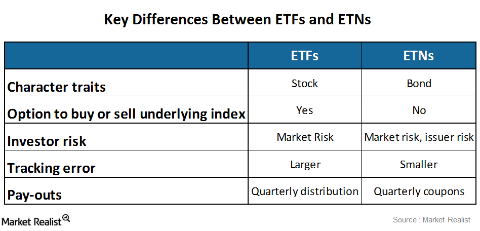

## Table of Contents

## What are ETFs and how do they work?

ETFs, or Exchange-Traded Funds, are a type of investment that combines the benefits of stocks and mutual funds. They are designed to track the performance of a specific index, like the S&P 500, a commodity, bonds, or a basket of assets. When you buy shares of an ETF, you're essentially buying a small piece of all the investments within that fund. This makes it easier for investors to diversify their portfolio without having to buy each asset individually.

ETFs are traded on stock exchanges, just like individual stocks. This means you can buy and sell them throughout the trading day at market prices. The price of an ETF share will fluctuate based on the performance of the underlying assets it tracks. One of the key advantages of ETFs is their lower expense ratios compared to mutual funds, which means you pay less in fees over time. This makes them an attractive option for both new and experienced investors looking to build a diversified investment portfolio.

## What are ETNs and how do they work?

ETNs, or Exchange-Traded Notes, are different from ETFs. They are debt instruments issued by banks. When you buy an ETN, you are not buying a piece of a fund like with an ETF. Instead, you are buying a promise from the bank to pay you based on the performance of a specific index or asset. This means your return depends on how well that index or asset does over time.

ETNs do not hold any assets themselves. They are just a contract between you and the bank. If the index goes up, the value of your ETN goes up too. If it goes down, your ETN loses value. One big risk with ETNs is that if the bank that issued them goes bankrupt, you might lose your investment. So, it's important to think about the bank's stability before buying an ETN.

## What are the key differences between ETFs and ETNs?

ETFs and ETNs are both traded on stock exchanges, but they work in different ways. An [ETF](/wiki/etf-trading-strategies) is like a basket of investments that you can buy a piece of. It holds actual assets like stocks, bonds, or commodities. When you buy an ETF, you own a part of all those assets. ETFs are usually safer because they are backed by these real investments.

On the other hand, an ETN is more like a promise from a bank. When you buy an ETN, you're not buying any actual assets. Instead, you're buying a promise that the bank will pay you based on how well a certain index or asset performs. This can be riskier because if the bank goes bankrupt, you might lose your money. So, ETFs are generally seen as less risky than ETNs.

The costs can also be different. ETFs often have lower fees because they are passively managed and just track an index. ETNs might have different fee structures, and you need to think about the credit risk of the bank issuing them. So, while ETFs and ETNs might look similar on the surface, they have big differences in how they work and the risks they [carry](/wiki/carry-trading).

## How do the investment risks of ETFs compare to those of ETNs?

The risks of investing in ETFs and ETNs are different. ETFs are generally seen as safer because they hold real assets like stocks or bonds. If the market goes down, the value of your ETF will go down too, but you still own a piece of those assets. This makes ETFs less risky because they are backed by real investments. Also, ETFs often have lower fees, which means you keep more of your money over time.

ETNs, on the other hand, are riskier because they are just a promise from a bank. When you buy an ETN, you're betting on how well an index or asset will do, but you don't own any of those assets. If the bank that issued the ETN goes bankrupt, you could lose all your money. This is called credit risk. So, while ETNs can offer higher returns, they come with the extra risk of the bank's stability.

## What are the typical costs associated with investing in ETFs versus ETNs?

The costs of investing in ETFs are usually lower than those for ETNs. ETFs have what's called an expense ratio, which is a small percentage of your investment that goes towards managing the fund. This fee is often lower because ETFs are usually passively managed, meaning they just track an index without a lot of active trading. On top of the expense ratio, you might also have to pay trading commissions when you buy or sell ETF shares, but many brokers now offer commission-free trading.

ETNs, on the other hand, can have different costs. They might have an expense ratio too, but it can be higher than what you'd pay for an ETF. Besides the expense ratio, ETNs might come with other fees like structuring fees or annual fees. Also, since ETNs are debt instruments, you need to think about the credit risk of the bank issuing them. If the bank runs into trouble, it could affect the value of your ETN, adding another layer of cost and risk to consider.

## How does the tax treatment differ between ETFs and ETNs?

The tax treatment of ETFs and ETNs can be quite different. For ETFs, you might have to pay capital gains tax when you sell your shares for a profit. If the ETF holds stocks, it might also pay out dividends, which can be taxed as well. But one good thing about ETFs is that they can be more tax-efficient than mutual funds because they usually don't have to sell assets as often, which means fewer taxable events for you.

ETNs, on the other hand, are taxed differently because they don't hold any actual assets. You only pay taxes when you sell your ETN, and it's treated as a capital gain or loss, depending on whether you made or lost money. This can be good because you don't have to worry about taxes on dividends or interest while you hold the ETN. But remember, if the ETN is linked to commodities, you might have to pay a special kind of tax called the Section 1256 contract, which can be a bit more complicated.

## What types of assets can be tracked by ETFs and ETNs?

ETFs can track a wide variety of assets. They often follow stock market indexes like the S&P 500, but they can also track bonds, commodities like gold or oil, and even specific sectors like technology or healthcare. Some ETFs focus on international markets or emerging economies. This makes ETFs a flexible way for investors to gain exposure to different parts of the market without having to buy each asset individually.

ETNs can also track many different types of assets, but they do it in a different way. They can follow stock indexes, commodities, currencies, or even more complex financial products like [volatility](/wiki/volatility-trading-strategies) indexes. Since ETNs are just promises from a bank, they can be used to track assets that might be hard for ETFs to hold directly. This gives investors another way to bet on the performance of various markets or assets.

## How does the liquidity of ETFs compare to that of ETNs?

ETFs are usually more liquid than ETNs. This means it's easier to buy and sell them without affecting their price too much. ETFs are popular and many people trade them, so there's usually a lot of buying and selling happening. This high trading [volume](/wiki/volume-trading-strategy) makes it easier to get in and out of your investment quickly. Also, because ETFs hold real assets, there's a process called creation and redemption that helps keep their prices stable and close to the value of the assets they track.

ETNs can be less liquid than ETFs. This means there might not be as many people buying and selling them, so it can be harder to trade them without moving the price. Since ETNs are just promises from a bank, they don't have the same creation and redemption process that helps with ETF [liquidity](/wiki/liquidity-risk-premium). If you're thinking about investing in ETNs, you need to check how easy it is to trade them and be ready for possible price changes when you buy or sell.

## What are the considerations for long-term versus short-term investment in ETFs and ETNs?

For long-term investment, ETFs are often a better choice than ETNs. ETFs are usually more stable because they hold real assets like stocks or bonds. This means they can grow over time as the market does well. ETFs also have lower fees, which is good for long-term investors because it means more of your money stays invested. Plus, ETFs are more liquid, so it's easier to buy and sell them without big price changes. If you're planning to hold your investment for many years, ETFs are a safer and more cost-effective option.

On the other hand, ETNs can be better for short-term investment if you're looking for a specific kind of return. ETNs can track things that ETFs can't, like certain commodities or complex financial products. This makes them useful if you want to bet on a specific market movement over a short period. But remember, ETNs are riskier because they depend on the bank's stability. If you're only holding the investment for a short time, you might be okay with this risk, but you need to be ready for bigger price swings and less liquidity compared to ETFs.

## How do ETFs and ETNs perform during different market conditions?

ETFs and ETNs can behave differently in various market conditions. ETFs are usually more stable because they hold real assets like stocks or bonds. When the market goes up, ETFs tend to go up too because their value is tied to the performance of those assets. If the market goes down, ETFs will lose value, but you still own a piece of those assets. This makes ETFs a safer bet in both good and bad market conditions. They are also easier to buy and sell, which can be helpful when the market is moving a lot.

ETNs, on the other hand, can be more unpredictable. They don't hold any real assets; they're just a promise from a bank to pay you based on how well an index or asset does. In a rising market, ETNs can give you big returns if they track the right thing. But if the market falls, ETNs can lose value quickly, and you have the extra risk of the bank going bankrupt. So, in tough market conditions, ETNs can be riskier. They might be good for short-term bets, but they can be less reliable over the long run.

## What are the regulatory differences between ETFs and ETNs?

ETFs and ETNs are regulated differently because they are different kinds of investments. ETFs are regulated by the SEC, the Securities and Exchange Commission, under the Investment Company Act of 1940. This law makes sure that ETFs are managed properly and that investors are protected. ETFs have to follow rules about what they can invest in and how they report their performance. This helps keep ETFs more transparent and safer for investors.

ETNs, on the other hand, are more like bonds and are regulated under the Securities Act of 1933. They don't have to follow the same strict rules as ETFs because they don't hold any real assets. Instead, they are just promises from a bank, so the focus is more on the bank's ability to pay you back. This means ETNs can be riskier because they depend on the bank's financial health, and there's less oversight on what they can track or how they work.

## How can advanced investors use ETFs and ETNs in sophisticated trading strategies?

Advanced investors can use ETFs to build complex trading strategies because ETFs are so flexible. They can use ETFs to hedge their bets, which means they can protect their investments from losing too much money if the market goes down. For example, they might buy ETFs that track different sectors or markets to spread out their risk. They can also use ETFs for something called [arbitrage](/wiki/arbitrage), where they buy and sell ETFs and the assets they track to make small profits from price differences. ETFs are great for these strategies because they are easy to trade and have low costs.

ETNs can be useful for advanced investors who want to make very specific bets on the market. Because ETNs can track things that ETFs can't, like complex financial products or certain commodities, investors can use them to take advantage of short-term market movements. For example, they might buy an ETN that tracks a volatility index if they think the market is going to get more unpredictable. But ETNs are riskier, so advanced investors need to be careful and understand the bank's stability before using them in their strategies.

## References & Further Reading

[1]: Rangvid, J. (2021). ["Asset Management and Exchange-Traded Funds (ETFs)."](https://www.morningstar.com/funds/what-is-an-etf-morningstars-etf-guide) In From Main Street to Wall Street (pp. 115-138). Springer.

[2]: Swensen, D. F. (2009). ["Pioneering Portfolio Management: An Unconventional Approach to Institutional Investment, Fully Revised and Updated."](https://books.google.com/books/about/Pioneering_Portfolio_Management.html?id=SbIz2gRbrF4C) Free Press.

[3]: ["Exchange Traded Funds and the New Dynamics of Investing"](https://academic.oup.com/book/3366) by Ananth N. Madhavan

[4]: Zakamulin, V. (2011). ["A Test of Intrinsic Value-Based Asset Pricing Models on Exchange-Traded Funds."](https://onlinelibrary.wiley.com/doi/abs/10.1111/jofi.12607) The Journal of Investing, 20(4), 52-65.

[5]: Menkveld, A. J. (2013). ["High Frequency Trading and the New Market Makers."](https://www.sciencedirect.com/science/article/pii/S1386418113000281) The Review of Financial Studies, 27(8), 2093-2128.