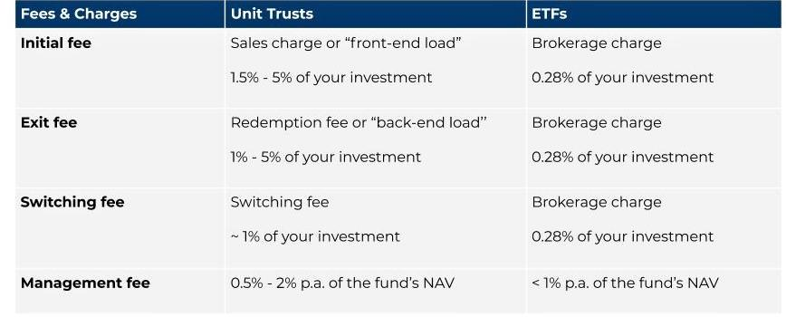

## Table of Contents

## What are ETFs and how do they work?

ETFs, or Exchange-Traded Funds, are a type of investment that works a lot like a mutual fund but trades on a stock exchange like a stock. You can buy and sell ETFs throughout the day at the current market price. They are designed to track the performance of a specific index, like the S&P 500, a commodity, bonds, or a basket of assets. This means if you invest in an ETF that tracks the S&P 500, your investment will go up or down based on how the S&P 500 performs.

When you buy shares of an ETF, you are essentially buying a small piece of all the investments that the ETF holds. This allows you to diversify your investments easily without having to buy each stock or bond individually. ETFs are popular because they are often cheaper to own than mutual funds, and they offer more flexibility since you can trade them during the day. They are a good way for investors to get broad exposure to different markets or sectors with a single investment.

## What are Investment Trusts and how do they differ from ETFs?

Investment Trusts are another type of investment vehicle, similar to ETFs but with some key differences. An Investment Trust is a company that pools money from investors to buy a variety of assets, like stocks, bonds, or property. These trusts are listed on the stock exchange, so you can buy and sell shares in them just like you would with a regular company's stock. The price of an Investment Trust's shares can be higher or lower than the value of the assets it owns, which is known as trading at a premium or a discount.

The main difference between Investment Trusts and ETFs is how they are structured and managed. ETFs are designed to track the performance of an index or a specific set of assets very closely. They usually aim to match the performance of their benchmark as closely as possible. On the other hand, Investment Trusts are often actively managed, meaning a manager makes decisions about which assets to buy and sell, trying to beat the market. This active management can lead to higher fees, but it also offers the potential for higher returns if the manager makes good choices. Additionally, Investment Trusts can use borrowed money, or gearing, to try and boost returns, which ETFs generally do not do.

## How can beginners start investing in ETFs?

Starting to invest in ETFs is easy for beginners. First, you need to open a brokerage account. This is like a bank account, but it's used to buy and sell investments. Many brokers let you start with a small amount of money, so you don't need a lot to begin. Once your account is set up, you can search for ETFs that interest you. There are lots of ETFs to choose from, but if you're new, you might want to start with ones that track broad market indexes, like the S&P 500. These ETFs give you a piece of many different companies, which can help spread out your risk.

After [picking](/wiki/asset-class-picking) an [ETF](/wiki/etf-trading-strategies), you can place an order to buy it through your brokerage account. You can usually buy ETFs in whole shares or even fractions of shares, depending on your broker. Once you own the ETF, you can hold onto it for as long as you want. Over time, the value of the ETF will go up or down based on the performance of the assets it holds. Remember, investing in ETFs is a long-term game, so it's important to stay patient and not worry too much about short-term ups and downs.

## What are the key differences in structure between ETFs and Investment Trusts?

ETFs and Investment Trusts are both ways to invest, but they have different structures. ETFs are designed to track an index, like the S&P 500, and they do this by holding the same assets as the index. They trade on a stock exchange, so you can buy and sell them during the day, just like a stock. The price of an ETF is usually very close to the value of the assets it holds because it's designed to match the index's performance.

Investment Trusts, on the other hand, are companies that pool money from investors to buy assets. They also trade on a stock exchange, but their price can be different from the value of the assets they own. This is because Investment Trusts are often managed by people who make decisions about what to buy and sell, trying to beat the market. They can also use borrowed money to try and boost returns, which is something ETFs usually don't do.

## How do the fees and costs compare between ETFs and Investment Trusts?

ETFs and Investment Trusts both have fees, but they can be different. ETFs usually have lower fees than Investment Trusts. This is because ETFs are often passively managed, which means they just try to match the performance of an index without a lot of extra work. The main fee you pay with an ETF is called the expense ratio, and it's a small percentage of your investment that goes to the company running the ETF. Some brokers might also charge you a small fee when you buy or sell an ETF, but many don't charge anything at all.

Investment Trusts, on the other hand, often have higher fees. This is because they are usually actively managed, meaning there's a person making decisions about what to buy and sell. These managers need to be paid, so the fees can be higher. Investment Trusts also have an expense ratio, but it's often bigger than the one for ETFs. Plus, if the trust uses borrowed money to try and boost returns, that can add extra costs, too. So, while both ETFs and Investment Trusts have fees, ETFs are usually the cheaper option.

## What are the tax implications of investing in ETFs versus Investment Trusts?

The tax implications of investing in ETFs can be more favorable than those of Investment Trusts. ETFs are structured to minimize capital gains distributions. This means you might not have to pay taxes on gains until you sell your ETF shares. When you do sell, you'll pay capital gains tax based on how long you held the ETF. If you held it for more than a year, you'll pay the lower long-term capital gains rate. ETFs that track broad market indexes, like the S&P 500, are especially good at keeping tax costs down because they don't trade their holdings as often.

Investment Trusts, on the other hand, can have different tax implications. Because they are often actively managed, they might buy and sell assets more frequently. This can lead to more capital gains distributions, which you'll have to pay taxes on even if you haven't sold your shares in the trust. These distributions are taxed at your regular income tax rate if they are short-term gains, or at the long-term capital gains rate if they are long-term gains. Additionally, if the trust uses borrowed money and makes income from it, that can also affect your taxes.

## How does liquidity vary between ETFs and Investment Trusts?

ETFs usually have better [liquidity](/wiki/liquidity-risk-premium) than Investment Trusts. This means it's easier and quicker to buy and sell ETFs. They trade on stock exchanges just like regular stocks, and there are lots of people and big institutions buying and selling them all the time. This makes it easy to get in and out of your investment without waiting. Plus, because ETFs are designed to track indexes, there's always someone willing to buy or sell them at the right price.

Investment Trusts can be less liquid. This means it might take longer to buy or sell them, and sometimes you might not get the price you want. They also trade on stock exchanges, but they might not have as many people trading them as ETFs. The price of an Investment Trust can be different from the value of its assets, which can make it harder to know what price to buy or sell at. So, if you need to get your money out quickly, ETFs might be a better choice.

## What are the diversification benefits of ETFs compared to Investment Trusts?

ETFs are great for diversification because they often track a broad index, like the S&P 500. This means when you buy an ETF, you're getting a little piece of lots of different companies all at once. It's like buying a big basket of stocks with one purchase. This can help spread out your risk because if one company in the ETF does poorly, it won't hurt your whole investment as much. ETFs can cover all sorts of things, like different countries, industries, or types of assets, so you can easily build a diverse portfolio.

Investment Trusts can also offer diversification, but they might focus on specific areas or strategies. Because they are often actively managed, the manager picks the investments, which might be more concentrated in certain sectors or types of assets. This can mean less diversification compared to a broad market ETF. However, some Investment Trusts do aim to spread their investments widely, so it depends on the specific trust. Overall, ETFs tend to offer easier and broader diversification for most investors.

## How do ETFs and Investment Trusts perform during different market conditions?

ETFs and Investment Trusts can perform differently during various market conditions. ETFs that track broad market indexes, like the S&P 500, tend to go up and down with the overall market. So, if the market is doing well, these ETFs will likely do well too. But if the market goes down, the ETFs will follow. Because ETFs are designed to match the performance of their index, they don't usually try to beat the market. This means they can be a safe choice during stable or growing markets, but they won't protect you if the market crashes.

Investment Trusts might act differently because they are often managed by people who try to pick the best investments. This can help them do better than the market if the manager makes good choices. But it can also mean they do worse if the choices are bad. During tough market conditions, some Investment Trusts might use strategies like borrowing money to try and boost returns, which can be risky but also potentially rewarding. So, while ETFs offer steady performance that follows the market, Investment Trusts can be more unpredictable but might offer higher returns or bigger losses depending on how they're managed.

## What are the advanced trading strategies that can be applied to ETFs but not to Investment Trusts?

ETFs are great for advanced trading strategies because they're so easy to buy and sell. One common strategy is called "short selling." This means you can borrow ETF shares and sell them, hoping to buy them back later at a lower price to make a profit. You can't do this as easily with Investment Trusts because they're less liquid and might not have as many shares available to borrow. Another strategy is using ETFs for "options trading." Options let you bet on where the ETF price will go without actually owning the ETF. This can be a way to make money if you think the ETF will go up or down, but it's more complicated and risky.

Another advanced strategy with ETFs is called "sector rotation." This means moving your money from ETFs that focus on one part of the market to another, based on where you think the market is heading. For example, if you think tech stocks will do well, you might buy a tech ETF and then switch to a different sector later. ETFs make this easier because there are so many different ones to choose from. Investment Trusts might not offer the same flexibility because they often focus on specific strategies or areas and can't be traded as quickly or easily.

## How do regulatory environments affect ETFs and Investment Trusts differently?

Regulatory environments can affect ETFs and Investment Trusts in different ways. ETFs are usually set up to follow rules that make sure they track their indexes closely. This means they have to be very clear about what they're investing in and how they're doing it. Regulators keep a close eye on ETFs to make sure they're not taking too much risk and that they're giving investors all the information they need. This can make ETFs a bit safer for investors because there are strict rules in place.

Investment Trusts, on the other hand, might have more freedom because they're often managed by people who make their own investment choices. This can mean they have to follow different rules, like ones about how they report their performance and what they can invest in. Regulators still watch Investment Trusts, but the rules might not be as tight as those for ETFs. This can give Investment Trusts more room to try different strategies, but it can also mean more risk for investors if things don't go well.

## What are the long-term investment outcomes typically seen with ETFs versus Investment Trusts?

Over the long term, ETFs usually offer steady growth that matches the market they track. If you invest in an ETF that follows the S&P 500, your investment will grow as the S&P 500 grows. This can be a safe way to invest because you're not trying to beat the market, just go along with it. ETFs are great for people who want to invest for the long haul and don't want to worry too much about picking individual stocks. They're easy to buy and sell, and the fees are usually low, which means more of your money stays invested and working for you.

Investment Trusts, on the other hand, can have more ups and downs over the long term. Because they're often managed by people who try to pick the best investments, they might do better than the market if the manager makes good choices. But they can also do worse if the choices are bad. Investment Trusts might use strategies like borrowing money to try and boost returns, which can lead to bigger gains or bigger losses. So, while they might offer the chance for higher returns, they can also be riskier than ETFs. The fees for Investment Trusts are often higher, too, which can eat into your returns over time.

## References & Further Reading

[1]: Bergstra, J., Bardenet, R., Bengio, Y., & Kégl, B. (2011). ["Algorithms for Hyper-Parameter Optimization."](https://papers.nips.cc/paper/4443-algorithms-for-hyper-parameter-optimization) Advances in Neural Information Processing Systems 24.

[2]: ["Advances in Financial Machine Learning"](https://www.amazon.com/Advances-Financial-Machine-Learning-Marcos/dp/1119482089) by Marcos Lopez de Prado

[3]: ["Evidence-Based Technical Analysis: Applying the Scientific Method and Statistical Inference to Trading Signals"](https://www.amazon.com/Evidence-Based-Technical-Analysis-Scientific-Statistical/dp/0470008741) by David Aronson

[4]: ["Machine Learning for Algorithmic Trading"](https://github.com/stefan-jansen/machine-learning-for-trading) by Stefan Jansen

[5]: ["Quantitative Trading: How to Build Your Own Algorithmic Trading Business"](https://www.amazon.com/Quantitative-Trading-Build-Algorithmic-Business/dp/1119800064) by Ernest P. Chan