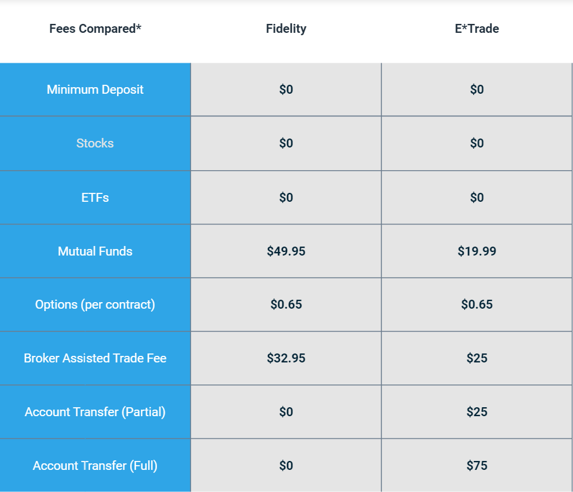

## Table of Contents

## What are E*TRADE and Fidelity?

E*TRADE is a company that helps people buy and sell stocks, bonds, and other investments online. It started in 1982 and has made it easier for people to manage their money from home using the internet. E*TRADE offers different tools and resources to help people make smart choices about their investments. They also have a mobile app so you can check your investments anytime, anywhere.

Fidelity is another company that helps people with their investments. It began in 1946 and offers many services like managing retirement accounts, mutual funds, and other financial products. Fidelity is known for its customer service and educational resources, which help people learn more about investing. Like E*TRADE, Fidelity also has an online platform and a mobile app, making it easy for people to keep track of their money and make changes to their investments whenever they need to.

## How do E*TRADE and Fidelity differ in terms of account types offered?

E*TRADE offers a variety of account types to meet different needs. They have individual and joint brokerage accounts for people who want to invest on their own or with someone else. E*TRADE also provides retirement accounts like Traditional IRAs, Roth IRAs, and Rollover IRAs, which are great for saving for the future. If you're looking to save for your kids' education, they offer a custodial account called the E*TRADE Complete™ IRA for Minors. Plus, they have managed portfolios for those who want professional help with their investments.

Fidelity, on the other hand, also offers a wide range of account types but with some differences. They provide individual and joint brokerage accounts, similar to E*TRADE, but they also offer a cash management account that combines the features of a brokerage account with a bank account. For retirement, Fidelity has Traditional IRAs, Roth IRAs, and Rollover IRAs, just like E*TRADE, but they also offer a variety of employer-sponsored retirement plans like 401(k)s and 403(b)s. For education savings, Fidelity provides a 529 college savings plan, which is different from E*TRADE's custodial account. Both companies cater to a wide range of investment needs, but the specific account types they offer can help you decide which one fits your goals better.

## What are the fee structures for trading stocks on E*TRADE versus Fidelity?

E*TRADE charges $0 for online U.S. stock, ETF, and options trades. This means you can buy and sell stocks without paying a commission fee. However, if you trade options, there is a $0.65 fee per contract. If you need help from a broker to make a trade, E*TRADE charges a $25 fee for that service. Also, if you want to trade stocks on a foreign market, there will be additional fees.

Fidelity also charges $0 for online U.S. stock, ETF, and options trades, just like E*TRADE. For options trades, Fidelity charges $0.65 per contract, which is the same as E*TRADE. If you need a broker-assisted trade, Fidelity will charge you $32.50, which is more than E*TRADE's fee. Like E*TRADE, trading on foreign markets with Fidelity will come with extra fees.

## How do the mobile apps of E*TRADE and Fidelity compare in terms of features and user experience?

E*TRADE's mobile app is user-friendly and packed with features that help you manage your investments easily. You can trade stocks, ETFs, and options right from your phone. The app has real-time quotes and charts, so you can keep an eye on how your investments are doing. It also lets you set up alerts for price changes, which can be really handy. E*TRADE's app is known for being easy to use, even if you're new to investing. Plus, you can check your account balance, see your portfolio's performance, and even deposit checks using your phone's camera.

Fidelity's mobile app is also easy to use and offers a lot of features. Like E*TRADE, you can trade stocks, ETFs, and options on the go. The app gives you real-time quotes and charts, and you can set up alerts for price changes. One cool thing about Fidelity's app is that it has a lot of educational resources built-in, so you can learn about investing while you're using it. You can also check your account balance and see how your investments are doing. Fidelity's app is praised for its smooth user experience and the variety of tools it offers to help you make smart investment choices.

## What investment research tools are available on E*TRADE and Fidelity?

E*TRADE provides a variety of tools to help you research investments. They have a tool called E*TRADE MarketWatch, which gives you real-time market data, news, and analysis. You can also use their stock and ETF screeners to find investments that match what you're looking for. E*TRADE also offers research reports from Morningstar and other sources, so you can get detailed information about companies and funds. If you like charts, E*TRADE has a charting tool where you can see how stocks have performed over time and even draw on the charts to spot trends.

Fidelity also offers many research tools to help you make smart investment choices. They have a tool called Fidelity.com Research, which provides real-time market data, news, and analysis. You can use their stock and ETF screeners to find investments that fit your goals. Fidelity gives you access to research reports from their own analysts and from other big names like Morningstar and S&P Global. They also have a powerful charting tool that lets you look at stock performance and draw on the charts to find patterns. Plus, Fidelity has a lot of educational resources that can help you learn more about investing as you go.

## How do the customer service options and quality compare between E*TRADE and Fidelity?

E*TRADE offers good customer service. You can reach them by phone, email, or through live chat on their website. They also have branches in some places where you can talk to someone in person. People say E*TRADE's customer service team is helpful and friendly. They can help you with questions about your account, trading, and other things. But sometimes, you might have to wait a bit longer to talk to someone, especially during busy times.

Fidelity is known for having really great customer service. You can contact them by phone, email, or live chat too. They have more branches around the country than E*TRADE, so it's easier to find a place to go in person if you need to. People often say that Fidelity's customer service is top-notch, with quick responses and knowledgeable staff. They can help you with all sorts of questions and issues, and they usually don't make you wait long to get help.

## What are the differences in mutual fund and ETF offerings between E*TRADE and Fidelity?

E*TRADE offers a wide range of mutual funds and ETFs for you to choose from. They have over 4,000 mutual funds, including no-load funds and funds with no transaction fees. This means you can invest in a lot of different funds without paying extra fees. E*TRADE also has a good selection of ETFs, covering many different sectors and investment styles. You can use their tools to find the ETFs that fit your goals, whether you want to invest in tech companies, green energy, or something else.

Fidelity also has a big selection of mutual funds and ETFs. They offer more than 10,000 mutual funds, with many of them being no-load and no-transaction-fee funds. This gives you even more choices than E*TRADE when it comes to mutual funds. Fidelity's ETF selection is also large and diverse, with options in all sorts of areas. They have tools to help you pick the right ETFs for your needs, and they often have their own Fidelity-branded ETFs that you can invest in.

## How do E*TRADE and Fidelity handle retirement accounts like IRAs?

E*TRADE offers several types of retirement accounts, including Traditional IRAs, Roth IRAs, and Rollover IRAs. These accounts help you save for the future by letting you invest in stocks, bonds, and mutual funds. E*TRADE makes it easy to manage your IRA online or through their mobile app. They also have tools to help you plan for retirement and figure out how much you need to save. If you need help, their customer service team can answer your questions and guide you through the process.

Fidelity also provides Traditional IRAs, Roth IRAs, and Rollover IRAs, just like E*TRADE. They offer a lot of investment options, so you can choose what fits your retirement goals. Fidelity's website and app make it simple to check your account and make changes. They have a lot of educational resources to help you learn about saving for retirement. Fidelity is known for great customer service, so you can get help whenever you need it.

## What advanced trading features does E*TRADE offer that Fidelity might not, and vice versa?

E*TRADE offers some advanced trading features that you might not find with Fidelity. One of these is the Power E*TRADE platform, which is made for people who trade a lot and want more advanced tools. It has things like customizable charts, technical analysis tools, and options trading strategies that can help you make smarter trades. E*TRADE also lets you trade options in a more advanced way, with features like multi-leg options strategies and risk/reward analysis tools. These can be really helpful if you're into options trading and want to do it in a more detailed way.

Fidelity, on the other hand, has its own set of advanced trading features that might not be available on E*TRADE. They have a platform called Active Trader Pro, which is great for people who trade often and want to use advanced tools. It includes things like customizable layouts, real-time market data, and advanced charting tools that can help you make better trading decisions. Fidelity also offers advanced options trading features, including the ability to trade multi-leg options strategies and use tools for risk analysis. Plus, Fidelity has a feature called Wealth-Lab Pro, which lets you backtest your trading strategies to see how they would have worked in the past, which is something E*TRADE doesn't have.

## How do the educational resources and investor support differ between E*TRADE and Fidelity?

E*TRADE has a lot of educational resources to help you learn about investing. They have articles, videos, and webinars that cover all sorts of topics, from beginner stuff to more advanced trading strategies. E*TRADE also has a tool called E*TRADE Education, where you can find guides and courses to help you get better at investing. If you need help, their customer service team can answer your questions and guide you through the process. They're known for being helpful and friendly, but sometimes you might have to wait a bit during busy times.

Fidelity also offers a wide range of educational resources to help you learn about investing. They have articles, videos, and webinars too, but they also have a lot of interactive tools and calculators that can help you plan your investments. Fidelity's Learning Center is a big part of their website, where you can find courses and guides on all sorts of topics. Their customer service is known for being top-notch, with quick responses and knowledgeable staff. They have more branches around the country, so it's easier to get help in person if you need it.

## What are the margin rates and margin account features at E*TRADE compared to Fidelity?

E*TRADE offers margin accounts that let you borrow money to buy more investments. Their margin rates depend on how much you borrow. If you borrow less than $10,000, the rate is around 14.20%. For bigger amounts, the rate goes down. For example, if you borrow between $100,000 and $249,999, the rate is about 12.70%. E*TRADE's margin account also comes with features like real-time margin monitoring, so you can keep track of how much you're borrowing and how much you can borrow. They also have tools to help you manage your margin account and understand the risks involved.

Fidelity also offers margin accounts with rates that change based on the amount you borrow. If you borrow less than $25,000, the rate is about 13.575%. For larger amounts, the rate drops. For example, if you borrow between $100,000 and $499,999, the rate is around 11.825%. Fidelity's margin account includes features like real-time margin monitoring and tools to help you manage your account. They also offer educational resources to help you understand how margin works and the risks you need to be aware of.

## How do E*TRADE and Fidelity perform in terms of security measures and account protection?

E*TRADE takes security very seriously to keep your money and information safe. They use things like two-factor authentication, which means you need more than just a password to log in. This makes it harder for someone else to get into your account. E*TRADE also has strong encryption to protect your data when you're using their website or app. They watch for any strange activity on your account and will let you know if they see anything that doesn't look right. Plus, your money is protected by the SIPC, which can help you get your money back if E*TRADE ever has big problems.

Fidelity also works hard to keep your account secure. They use two-factor authentication too, so you need a password and another way to prove it's really you. They use encryption to keep your information safe while you're using their services. Fidelity keeps an eye out for any unusual activity and will alert you if they spot something fishy. Just like E*TRADE, your money at Fidelity is protected by the SIPC, which means you're covered if something goes wrong with the company. Both E*TRADE and Fidelity are committed to keeping your investments safe and secure.

## References & Further Reading

[1]: Bergstra, J., Bardenet, R., Bengio, Y., & Kégl, B. (2011). ["Algorithms for Hyper-Parameter Optimization."](https://papers.nips.cc/paper/4443-algorithms-for-hyper-parameter-optimization) Advances in Neural Information Processing Systems 24.

[2]: ["Advances in Financial Machine Learning"](https://www.amazon.com/Advances-Financial-Machine-Learning-Marcos/dp/1119482089) by Marcos Lopez de Prado

[3]: ["Evidence-Based Technical Analysis: Applying the Scientific Method and Statistical Inference to Trading Signals"](https://www.wiley.com/en-us/Evidence+Based+Technical+Analysis%3A+Applying+the+Scientific+Method+and+Statistical+Inference+to+Trading+Signals-p-9780470008744) by David Aronson

[4]: ["Machine Learning for Algorithmic Trading"](https://github.com/PacktPublishing/Machine-Learning-for-Algorithmic-Trading-Second-Edition) by Stefan Jansen

[5]: ["Quantitative Trading: How to Build Your Own Algorithmic Trading Business"](https://www.amazon.com/Quantitative-Trading-Build-Algorithmic-Business/dp/1119800064) by Ernest P. Chan