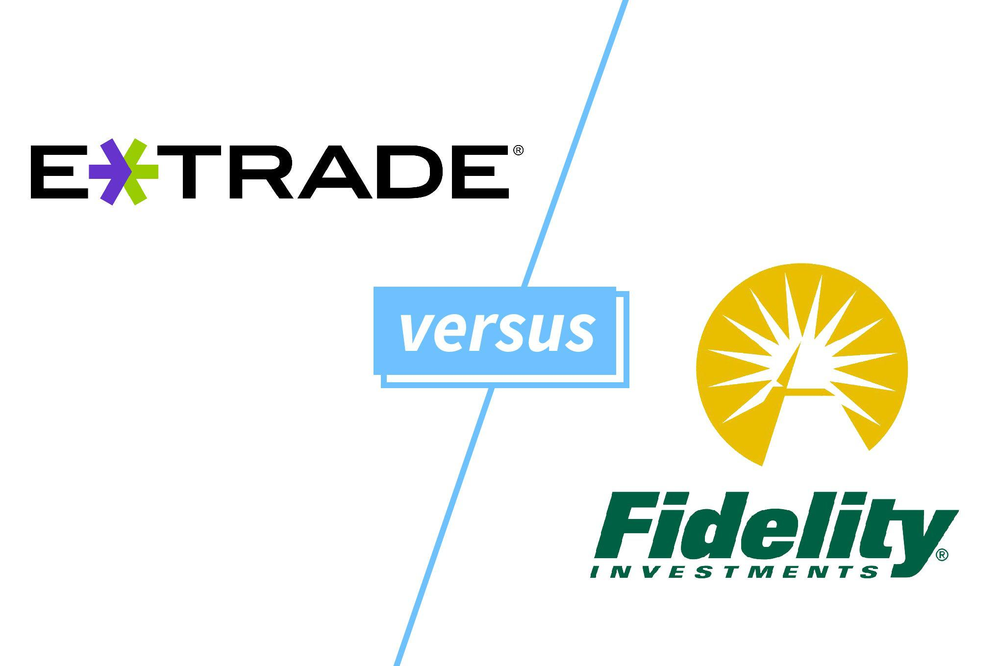

Algorithmic trading has emerged as a dominant force in financial markets, revolutionizing the way transactions are conducted. It involves using electronic platforms and algorithms to execute trading orders, often utilizing data analysis and mathematical models. This approach offers distinct advantages such as speed, precision, and the elimination of human emotions from trading decisions, making it attractive for both individual and institutional investors.

Prominent online brokerage firms, including E*TRADE and Fidelity, have been at the forefront of integrating advanced technology into their platforms to enhance trading experiences. Both companies have embraced algorithmic trading tools to provide their users with sophisticated mechanisms to optimize their trading strategies. This shift toward technology-driven solutions helps traders, whether inexperienced or veteran, to make informed decisions quickly and efficiently.

E*TRADE, for instance, has integrated powerful trading platforms and analytical tools to cater to diverse investor needs. The company's focus on innovation aims to empower traders by providing accessible and cutting-edge technologies that were once reserved for institutional investors. Similarly, Fidelity has leveraged technological advancements to offer extensive research resources and customizable trading tools. These enhancements facilitate the creation of personalized trading algorithms, thus enabling users to refine their strategies to achieve better trading outcomes.

By harnessing the potential of algorithmic trading, E*TRADE and Fidelity not only enhance user experience but also democratize access to sophisticated trading tools. As these platforms continue to evolve, they play a crucial role in empowering traders by providing the resources necessary to navigate the complexities of the financial markets with confidence.

## Table of Contents

## Overview of E*TRADE and Fidelity

E*TRADE and Fidelity are two of the most established names in online trading, each with a rich history and distinct offerings that have shaped their evolution and service portfolios. 

### History and Evolution

**E*TRADE** was founded in 1982 by William A. Porter and Bernard A. Newcomb. Originally known as TradePlus, the platform was a pioneer in online trading, offering its first service on Compuserve in 1983. By 1996, E*TRADE went public and became emblematic of the dot-com boom with its aggressive marketing and technological innovation. The brand continued to expand by acquiring companies such as OptionsHouse, bolstering its offerings in options trading and enhancing its Power E*TRADE platform to cater to both novice and seasoned traders. E*TRADE's focus has always been on empowering individual investors through technology, providing tools that simplify trading across multiple asset types.

**Fidelity Investments**, on the other hand, was founded much earlier, in 1946, by Edward C. Johnson II. As a well-established financial services corporation, Fidelity launched its online trading platform in 1995, capitalizing on the internet boom. The company introduced innovations like wireless trading in 1999 and continuously invested in technology to support an extensive range of investment products and retirement planning services. Fidelity’s approach integrates robust technology with comprehensive investor education, making it a preferred choice for both individual and institutional investors.

### Key Differences in Services and Fees

One of the most prominent differences between E*TRADE and Fidelity lies in their service offerings and fee structures:

- **E*TRADE** offers commission-free trades for US stocks, ETFs, and options, with a standard fee of $0.65 per options contract, reduced to $0.50 for high-volume traders (those trading over 30 times per quarter). E*TRADE’s suite of services is designed to support active traders, providing advanced charting and trading tools through its Power E*TRADE platform, which enhances the trading experience with risk analysis and backtesting capabilities.

- **Fidelity** also provides commission-free trading for US stocks and ETFs, boasting a competitive pricing structure that includes zero-fee index funds and generally lower fees on mutual funds compared to its peers. Fidelity’s Active Trader Pro platform stands out for its customizable trading environment and sophisticated tools for technical analysis and strategy development, which appeal to more strategic or long-term investors.

### Recent Developments

E*TRADE’s acquisition by Morgan Stanley in 2020 was a significant development, integrating E*TRADE’s powerful technology and user-friendly platforms with Morgan Stanley’s wealth management services. This acquisition aims to close the gap between full-service brokerage and cutting-edge digital trading, creating synergies that leverage Morgan Stanley’s extensive research and investment advice with E*TRADE’s robust trading platforms.

Fidelity has continually updated its platforms to include advanced features such as [artificial intelligence](/wiki/ai-artificial-intelligence)-driven insights and enhanced mobile applications. Its commitment to innovation is coupled with extensive educational resources, ensuring clients have access to comprehensive market analysis and educational tools. These developments reaffirm Fidelity's dedication to providing investors with research-driven insights and a seamless trading experience.

Both E*TRADE and Fidelity have adapted to the dynamic financial market by incorporating technological advancements that lower costs and bolster user engagement, securing their positions as leaders in the competitive online brokerage industry.

## Understanding Algorithmic Trading

Algorithmic trading represents a significant shift in the operational dynamics of financial markets. At its core, [algorithmic trading](/wiki/algorithmic-trading) involves the use of computer algorithms to execute trading strategies at speeds and frequencies that are impossible for a human trader. These algorithms can be programmed to follow a set of rules for placing a trade, accounting for variables such as timing, price, quantity, and market conditions.

The importance of algorithmic trading in today's financial markets cannot be overstated. It facilitates high-frequency trading ([HFT](/wiki/high-frequency-trading-strategies)), an advanced form of algorithmic trading that executes a large number of orders in fractions of a second. This rapid execution is crucial for exploiting momentary market inefficiencies, thus providing [liquidity](/wiki/liquidity-risk-premium) and reducing transaction costs.

Key benefits of algorithmic trading include enhanced speed and accuracy, minimizing the lag between decision-making and trade execution. Such precision ensures that trades are executed at the desired price points, thereby optimizing market entry and [exit](/wiki/exit-strategy) opportunities. Moreover, algorithmic trading systematically eliminates human emotions from decision-making, addressing common trading biases such as fear and greed. This objectivity ensures consistent adherence to predefined strategies, improving the reliability and validity of trading outcomes.

Algorithmic trading is reshaping investment strategies for both individual and institutional investors by enabling more sophisticated and diverse trading strategies. For instance, algorithmic systems can simultaneously monitor multiple markets and securities, allowing for the implementation of complex strategies such as statistical [arbitrage](/wiki/arbitrage) or [market making](/wiki/market-making). Institutional investors, in particular, leverage these algorithms to manage large portfolios and maintain competitive advantage through strategic asset allocations and execution efficiencies.

The democratization of algorithmic trading tools by platforms like E*TRADE and Fidelity enables retail investors to access advanced trading techniques previously reserved for institutional players. This access allows individual investors to incorporate quantitative decision-making processes into their strategies, thus bridging the gap between retail and institutional trading capabilities.

In conclusion, algorithmic trading continues to transform financial markets by increasing efficiency and reducing costs for traders of all types. Its role in shaping modern investment strategies underscores its significance in the evolution of trading methodologies.

## Algorithmic Trading Tools at E*TRADE

E*TRADE's algorithmic trading capabilities have been significantly enhanced by the Power E*TRADE platform, which provides advanced tools for both novice and experienced traders. This platform is recognized for its sophisticated charting options, technical analysis tools, and strategy development resources that cater to active traders seeking precision and efficiency in their trading activities.

Power E*TRADE offers real-time data streaming, customizable chart types, and over 100 technical studies that assist traders in making informed decisions. These features are complemented by a straightforward interface that simplifies complex trading strategies, making it accessible for all users. The platform's integration with OptionsHouse further enriches the trading experience, specifically benefiting options traders. OptionsHouse, known for its robust options trading technology, provides tools for strategy development and execution, including risk and profitability analysis at various price points.

User-friendliness is a key aspect of Power E*TRADE, appealing to both casual investors and active traders. Casual investors benefit from user-centric features such as educational resources and simplified navigation, while active traders leverage the platform's advanced tools for executing complex trades efficiently. Features such as Trade Lab and dynamic market scanning tools enable users to create, test, and execute trading strategies seamlessly.

The platform's design ensures that all users can adjust their setup according to their trading style and preferences. Moreover, Power E*TRADE’s mobile application extends these powerful features to on-the-go trading, maintaining functionality and user experience across devices. This adaptability makes Power E*TRADE a compelling choice for those seeking a comprehensive and flexible trading environment.

In conclusion, Power E*TRADE, enhanced by the integration of OptionsHouse, offers an advanced suite of tools designed to optimize the trading process for both casual and active investors, ensuring precision, accessibility, and efficiency in algorithmic trading.

## Algorithmic Trading Tools at Fidelity

Fidelity's Active Trader Pro platform is a robust toolset designed for sophisticated traders looking to leverage algorithmic trading strategies. Active Trader Pro offers a comprehensive suite of features, including real-time analytics, customizable charting, and sophisticated order entry capabilities. With its intuitive interface, traders can efficiently monitor and execute trades, benefiting from advanced functionalities that cater to both stock and options trading.

One of the core strengths of Fidelity's platform lies in its ability to aid the creation of custom trading algorithms. Through its platform, traders can utilize advanced order types, automate trading strategies, and test these strategies against historical data. This iterative development and testing process is critical for fine-tuning algorithms before implementing them in live markets. Furthermore, Fidelity's integration with third-party tools enhances its algorithmic trading capabilities, allowing for a more personalized user experience.

Fidelity's commitment to low-cost trading is reflected in its competitive pricing structure, with zero-commission trades for stocks and ETFs, which greatly benefits retail investors. This cost-effectiveness is complemented by extensive research resources, including market analysis reports, detailed stock screeners, and access to a vast library of educational content. Fidelity ensures that traders, whether novice or experienced, have the resources needed to make informed decisions and develop sophisticated trading strategies.

Overall, Fidelity's Active Trader Pro platform supports traders in creating and executing algorithmic strategies efficiently, backed by reliable data and technical support, thus maintaining its status as a user-friendly yet powerful tool in the financial market.

## Comparative Analysis: E*TRADE vs. Fidelity

When comparing E*TRADE and Fidelity, understanding the nuances of usability and user experience is crucial for selecting the right platform for individual trading needs. Both E*TRADE and Fidelity offer feature-rich platforms aimed at different types of traders, but notable differences exist in terms of ease of use and functionality.

### Usability and User Experience:

**E*TRADE** is renowned for its intuitive interface, designed to offer seamless navigation for both novice and advanced traders. The Power E*TRADE platform stands out for its clear layout and efficient workflow, making it accessible to users with varying levels of trading expertise. Key features include a customizable dashboard, dynamic charting tools, and easy access to trading options, which simplify the trading process. Additionally, the mobile app provides an excellent extension of the desktop experience, allowing users to trade flexibly on the go.

Conversely, **Fidelity** provides a rich set of resources via its Active Trader Pro platform, which may present a slightly steeper learning curve for beginners. However, seasoned investors appreciate the depth of analysis tools and the high level of customization available. Fidelity emphasizes comprehensive market research and analytic capabilities, which are seamlessly integrated into the platform to support informed decision-making.

### Evaluation of Trading Tools and Insights:

E*TRADE and Fidelity differ significantly in the scope and utility of their trading tools. E*TRADE, through its Power E*TRADE platform, offers robust options trading tools, owing to the integration of OptionsHouse technology. It provides advanced charting features with technical analysis tools, real-time data streaming, and risk-reward analysis, which are invaluable for options traders.

Fidelity's Active Trader Pro, however, excels in delivering vast data insights and comprehensive research resources. The platform's strength lies in its variety of pre-defined and custom screeners, nuanced technical indicators, and [backtesting](/wiki/backtesting) capabilities that allow traders to evaluate strategies over historical data. Moreover, Fidelity remains committed to offering educational resources, guiding users through investment strategies and tools utilization.

### Considerations for Active Traders versus Passive Investors:

**Active Traders:** For traders who engage in frequent, short-term trades, E*TRADE may present the more favorable option due to its speed, efficiency, and user-friendly tools tailored for quick decision-making. The streamlined options trading and real-time data accessibility enhance its appeal to this group.

**Passive Investors:** For those focused on long-term growth rather than daily trades, Fidelity's extensive research tools and educational materials provide an advantage. The platform supports strategic planning and investment analysis, allowing passive investors to make informed decisions over extended periods.

In summary, when choosing between E*TRADE and Fidelity, prospective users should weigh the importance of user experience, tool utility, and their trading style to make the most suitable choice. Active traders might prioritize E*TRADE’s speed and efficiency, while passive investors may benefit more from Fidelity's in-depth research tools and educational resources.

## Which Platform Is Right for You?

When choosing between E*TRADE and Fidelity for algorithmic trading, understanding different investor profiles and their needs is essential. Both platforms offer unique features catering to various types of traders.

### Evaluating Investor Profiles

**Novice Investors**  
For beginners, user-friendly interfaces and educational resources are crucial. E*TRADE, with its intuitive Power E*TRADE platform, offers a more accessible entry point. Its educational tools, such as webinars and tutorials, are designed to help novices understand trading basics.

**Active Traders**  
Active traders require advanced analytical tools and fast execution speeds. Fidelity’s Active Trader Pro is renowned for its comprehensive charting tools, real-time analytics, and customizable dashboard. These features are particularly beneficial for traders making high-frequency trades or engaging in complex options strategies.

**Long-term Investors**  
Investors with a long-term strategy may prioritize robust research capabilities and a wide range of investment options. Fidelity stands out with its extensive research resources from sources like Zacks Investment Research and Morningstar, which support informed decision-making.

### Cost Structures

Understanding the cost structures of each platform is vital for optimizing returns:

**E*TRADE**  
- **Stock and ETF Trades**: Commission-free.
- **Options Trades**: $0.65 per contract.
- **Mutual Funds**: $19.99 per trade for funds outside their no-load, no-transaction-fee funds list.

**Fidelity**
- **Stock and ETF Trades**: Commission-free.
- **Options Trades**: $0.65 per contract.
- **Mutual Funds**: $49.95 buy fee for non-Fidelity funds.

### Pros and Cons

**E*TRADE Pros**  
- User-friendly platform suitable for beginners.
- Strong options trading tools through OptionsHouse integration.
- Competitive pricing for professional-level services.

**E*TRADE Cons**  
- Mutual fund fees can be higher compared to Fidelity.
- Customer service may lack consistency based on user feedback.

**Fidelity Pros**  
- Extensive research tools and educational resources.
- Lower mutual fund fees and a broader selection of no-transaction-fee funds.
- Superior customer support, frequently rated highly in satisfaction surveys.

**Fidelity Cons**  
- The platform may have a steeper learning curve for new traders.
- Active Trader Pro requires consistent trading activity to access premium features.

### Final Considerations

The choice between E*TRADE and Fidelity is influenced by an investor's specific goals and trading habits. E*TRADE’s platform is advantageous for those focusing on options trading or seeking ease-of-use. Conversely, Fidelity’s comprehensive research and robust long-term investment tools make it a strong choice for those emphasizing in-depth analysis and diversified portfolios.

Investors should weigh these factors carefully, considering both the short-term and long-term implications of their trading activities, alongside the customer service experiences each broker provides.

## Conclusion

The integration of algorithmic trading into platforms like E*TRADE and Fidelity has equipped both novice and seasoned investors with powerful tools to optimize their investment strategies. By utilizing algorithmic trading, these platforms offer significant advantages, such as increased speed and accuracy in executing trades and minimizing the emotional biases that often hinder traditional trading approaches. Investors can benefit from automated processes that quickly analyze large datasets and execute orders, allowing them to capture market opportunities with precision.

Choosing the right platform, such as E*TRADE or Fidelity, is crucial to enhancing trading outcomes. Both provide robust features tailored to different trading styles and needs. E*TRADE's Power E*TRADE platform, with its integration of OptionsHouse, focuses on a comprehensive trading experience for options traders, while Fidelity's Active Trader Pro offers a suite of tools for creating custom trading algorithms complemented by extensive research resources. The choice between these platforms should consider individual trading goals, user experience preferences, and the specific asset classes one intends to trade.

Ultimately, adopting algorithmic trading with E*TRADE or Fidelity empowers investors to leverage technology strategically. The ability to backtest strategies, automate trades, and access advanced analytics provides a competitive edge in the financial markets. Whether for active traders seeking real-time execution or passive investors looking to refine their portfolio management, these platforms offer the necessary tools to enhance trading efficiencies. Embracing such technological advancements encourages a more disciplined and data-driven approach to investing, potentially improving financial outcomes over the long term.

## Frequently Asked Questions

### Frequently Asked Questions

**1. What are the algorithmic trading capabilities of E*TRADE and Fidelity?**

E*TRADE and Fidelity both offer robust platforms for algorithmic trading, although with distinct offerings. E*TRADE provides the Power E*TRADE platform, known for its advanced options trading tools, charting capabilities, and a large selection of technical studies. Originally developed by OptionsHouse, it is particularly useful for active traders looking to leverage real-time data and sophisticated options strategies. Fidelity, on the other hand, offers the Active Trader Pro platform. It supports the creation of custom trading algorithms and provides a rich set of tools including advanced charting, real-time analytics, and comprehensive market data. Both platforms facilitate automation and provide the technical infrastructure necessary for executing algorithmic trades efficiently.

**2. How can a beginner start with algorithmic trading on these platforms?**

To start with algorithmic trading on E*TRADE and Fidelity, follow these steps:

- **Education:** Begin by familiarizing yourself with the basics of algorithmic trading. Resources such as books, online courses, and webinars are valuable for building foundational knowledge.

- **Platform Familiarization:** Explore the trading platform you choose to understand its features and tools. E*TRADE's Power E*TRADE requires understanding of options trading, while Fidelity’s Active Trader Pro needs insight into stock and derivatives trading.

- **Simulation:** Before diving into live trading, use the paper trading or demo account options available on both platforms to practice and refine strategies without financial risk.

- **Algorithm Development:** Develop simple trading algorithms to automate part of your trading process. Start small, focusing on strategies like moving average cross-overs or reversion to mean strategies.

- **Testing and Refinement:** Backtest your algorithms using historical data to evaluate their performance and refine them iteratively.

**3. What tips can help maximize the benefits of algorithmic trading tools offered by E*TRADE and Fidelity?**

To maximize the benefits of the algorithmic trading tools offered by both brokers, consider the following tips:

- **Leverage Educational Resources:** E*TRADE and Fidelity offer a wealth of educational resources, including webinars, tutorials, and articles. Regularly engage with these materials to stay informed about new tools and trading strategies.

- **Utilize Technical Indicators:** Both platforms support numerous technical indicators that can aid in creating more effective trading strategies. Make use of these technical tools to generate entry and exit signals based on quantitative analysis.

- **Automation Features:** Take full advantage of the automation features available in E*TRADE’s and Fidelity’s platforms. From setting up automated alerts to executing trades based on pre-defined criteria, automation can enhance precision and reduce execution time.

- **Regular Review and Adjustment:** Periodically review and update your algorithms to adapt to market changes. Markets are dynamic, and strategies that work in one type of market environment may not be effective in another.

- **Risk Management:** Implement robust risk management strategies within your algorithms. This includes setting stop-loss orders and employing diversification to mitigate potential losses.

By understanding these aspects and actively utilizing the tools offered by E*TRADE and Fidelity, traders can enhance their algorithmic trading capabilities and make more informed investment decisions.

## References & Further Reading

[1]: Bergstra, J., Bardenet, R., Bengio, Y., & Kégl, B. (2011). ["Algorithms for Hyper-Parameter Optimization."](https://papers.nips.cc/paper/4443-algorithms-for-hyper-parameter-optimization) Advances in Neural Information Processing Systems 24.

[2]: ["Advances in Financial Machine Learning"](https://www.amazon.com/Advances-Financial-Machine-Learning-Marcos/dp/1119482089) by Marcos Lopez de Prado

[3]: ["Evidence-Based Technical Analysis: Applying the Scientific Method and Statistical Inference to Trading Signals"](https://www.wiley.com/en-us/Evidence+Based+Technical+Analysis%3A+Applying+the+Scientific+Method+and+Statistical+Inference+to+Trading+Signals-p-9780470008744) by David Aronson

[4]: ["Machine Learning for Algorithmic Trading"](https://github.com/PacktPublishing/Machine-Learning-for-Algorithmic-Trading-Second-Edition) by Stefan Jansen

[5]: ["Quantitative Trading: How to Build Your Own Algorithmic Trading Business"](https://www.amazon.com/Quantitative-Trading-Build-Algorithmic-Business/dp/1119800064) by Ernest P. Chan