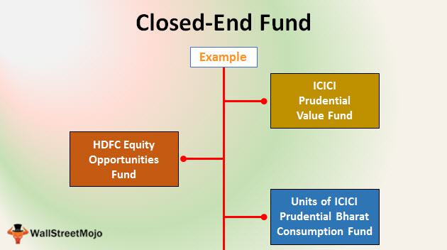

Investment funds are pivotal components of the modern financial landscape, designed to pool capital from multiple investors to purchase securities collectively. This mechanism offers investors opportunities to diversify their portfolios without directly purchasing individual assets, thereby mitigating risk and potentially enhancing returns. Over the decades, investment funds have evolved significantly, starting as basic mutual funds to now include sophisticated instruments such as Exchange-Traded Funds (ETFs) and closed-end funds, each serving unique functions within the financial ecosystem.

ETFs are investment funds traded on stock exchanges much like individual stocks. They typically track an index, a commodity, or a basket of assets, providing investors with the ability to gain broad market exposure with the benefit of lower expense ratios and tax efficiencies. A distinct feature of ETFs is their liquidity, as they trade throughout the day on exchanges, allowing investors significant flexibility in managing their portfolios.

Closed-end funds, on the other hand, raise a fixed amount of capital through an initial public offering and trade on the open market. Unlike mutual funds, they do not continuously issue shares or redeem them at the net asset value (NAV). Instead, their shares are bought and sold on stock exchanges at market prices, which means they may trade at a premium or discount to their NAV depending on demand and supply dynamics.

Mutual funds, another prevalent type of investment fund, are open-ended funds where investors buy and sell shares directly from the fund at the end of each trading day at the NAV. These funds are actively managed by professional fund managers who allocate the pooled investments towards a diverse range of securities, striving to achieve specific goals such as growth or income.

Algorithmic trading, or algo trading, plays an increasingly vital role in enhancing the performance and efficiency of investment strategies. By using automated software to enter trade orders based to specific criteria, algorithmic trading helps in executing orders at optimum speeds and prices, which are crucial for funds looking to capitalize on transient market opportunities. This approach not only enhances precision but also reduces the human error and emotional bias that can negatively impact investment decisions.

This article aims to comprehensively analyze ETFs and closed-end funds, also examining how algorithmic trading can be integrated into these investment vehicles to potentially yield substantial benefits. By offering insights into the structure, function, and advantages of these options, the article seeks to equip investors—both novices and seasoned professionals—with the necessary knowledge to make informed investment decisions.

## Table of Contents

## Understanding Investment Funds

Investment funds are pooled investment vehicles that aggregate capital from numerous investors to collectively invest in a diversified portfolio of assets. These assets may include stocks, bonds, real estate, or a combination thereof, depending on the fund's objectives. The primary purpose of investment funds is to provide investors with an efficient way to diversify their holdings, benefit from professional management, and achieve investment objectives that may be challenging to accomplish individually due to limited resources or expertise.

Investment funds come in various forms, with key distinctions in their structure and mechanics. Two notable types are Exchange-Traded Funds (ETFs) and closed-end funds. ETFs are publicly traded like stocks on major exchanges, offering investors exposure to a diversified basket of underlying assets, often tracking an index. They are characterized by their [liquidity](/wiki/liquidity-risk-premium), tax efficiency, and generally lower management fees compared to mutual funds. In contrast, closed-end funds are launched through an initial public offering (IPO) and trade on exchanges. Unlike ETFs, they do not continually issue or redeem shares based on demand. This structure allows closed-end funds to utilize leverage more effectively and pursue higher yields through active management strategies.

Historically, investment funds emerged as a response to the increasing complexity of financial markets and the growing need for professional asset management. The concept of pooled investments can be traced back to the 19th century, with the establishment of the first mutual fund in the Netherlands in 1774. The growth of the investment fund industry accelerated in the 20th century, driven by the democratization of investment opportunities and advancements in financial products. ETFs, introduced in the early 1990s, revolutionized the investment landscape by combining the trading flexibility of stocks with the diversification benefits of mutual funds. Similarly, closed-end funds have played a crucial role in offering investors access to fixed income and alternative investments through active management.

Investing through funds offers several advantages over individual asset selection. One of the primary benefits is diversification, which helps mitigate risk by spreading investments across a wide range of securities. This reduces the impact of any single asset's poor performance on the overall portfolio. Additionally, investment funds benefit from professional management, wherein experienced fund managers analyze market trends, conduct research, and make informed investment decisions. This expertise can be particularly valuable for investors who lack the time or knowledge to manage their investments actively.

Furthermore, investment funds provide economies of scale, enabling investors to access a broader array of assets and investment strategies than they could achieve independently. They also offer liquidity, as shares in most funds can be easily bought and sold on exchanges or through fund companies, allowing investors to enter or [exit](/wiki/exit-strategy) positions with relative ease.

In summary, understanding the nuances of investment funds and their evolution is crucial for investors looking to leverage these vehicles for portfolio diversification, risk management, and professional management. The choice between ETFs and closed-end funds depends largely on an investor's specific investment goals, risk tolerance, and preferences for active or passive management.

## Exploring ETFs (Exchange-Traded Funds)

Exchange-Traded Funds (ETFs) have become a cornerstone of modern investment strategies due to their unique structure and operational flexibility. Fundamentally, an [ETF](/wiki/etf-trading-strategies) is a type of investment fund that holds a collection of assets, such as stocks, bonds, or commodities, and is traded on stock exchanges throughout the day, similar to individual stocks. This structure allows ETFs to offer investors diversified exposure to various markets and sectors, combined with the liquidity of trading like a single stock.

The structural flexibility of ETFs distinguishes them from other investment vehicles, such as mutual funds or closed-end funds. Unlike mutual funds, which are only priced at the end of the trading day, ETFs are priced continuously throughout the trading session, providing real-time transparency into their market value. This feature offers investors the ability to react swiftly to market changes. Additionally, the "in-kind" creation and redemption mechanism of ETFs, where large financial institutions known as Authorized Participants (APs) exchange blocks of shares for underlying assets, helps maintain the ETF's market price close to its net asset value (NAV).

ETFs provide several significant benefits, making them popular among both individual and institutional investors. Diversification is a key advantage, as ETFs offer exposure to a wide array of asset classes and sectors, reducing the risk associated with holding individual securities. Moreover, ETFs typically have lower expense ratios compared to actively managed mutual funds, due to their passive management style, which aims to replicate the performance of specific indices rather than outperform them. Liquidity is another critical benefit, as ETFs can be bought and sold easily on stock exchanges, providing investors with the flexibility to enter or exit positions as needed.

There are numerous types of ETFs catering to diverse investment preferences and goals. Index ETFs are designed to track the performance of specific indexes, such as the S&P 500 or the NASDAQ-100. Sector ETFs focus on particular industries, allowing investors to fine-tune their exposure to sectors like technology, healthcare, or energy. Thematic ETFs target investment themes like clean energy, [artificial intelligence](/wiki/ai-artificial-intelligence), or blockchain technology, aligning with investor interests and global trends. Each type of ETF offers unique opportunities and challenges, allowing investors to tailor their investment strategies to align with personal goals and market outlooks.

In summary, ETFs provide a versatile and efficient investment option that combines the advantages of diversification, cost-effectiveness, and liquidity. Their variety and structural benefits have established them as a pivotal component in modern investment strategies, appealing to a broad spectrum of investors seeking to balance risk and reward in dynamic markets.

## Diving into Closed-End Funds

Closed-end funds are a form of investment vehicle that pools money from investors to purchase a diversified portfolio of stocks, bonds, or other securities. Unlike open-end funds, such as mutual funds, closed-end funds issue a fixed number of shares during an initial public offering (IPO) and are subsequently traded on stock exchanges. This fixed share structure differentiates them from mutual funds, which continuously issue and redeem shares based on investor demand.

Closed-end funds have distinct characteristics and mechanics. After the IPO, the number of shares remains constant, and investors buy and sell shares in the open market, typically through a brokerage. As a result, the share price of a closed-end fund can fluctuate based on market demand and supply, and it may trade at a premium or discount to its net asset value (NAV). The NAV represents the per-share value of the fund's assets minus liabilities.

These funds are actively managed, which means that a professional manager or team is responsible for making investment decisions. This active management allows closed-end funds to potentially pursue complex investment strategies, including leveraging borrowing to boost returns or targeting niche markets for higher yields. The potential for higher yields makes closed-end funds attractive to income-oriented investors, as they often focus on generating robust dividend payments.

However, investing in closed-end funds comes with certain risks and considerations. One key risk is the potential for wide premiums or discounts from the NAV, which can result in price [volatility](/wiki/volatility-trading-strategies) independent of the underlying assets. Moreover, active management introduces the risk that the manager's decisions may not align with the fund's objectives or investor expectations, potentially resulting in underperformance compared to passive index funds. Additionally, closed-end funds often use leverage, which can amplify both gains and losses, adding another layer of risk.

Investors should evaluate these factors carefully when considering closed-end funds. Understanding the specific investment strategies employed by the fund manager, the historical discount or premium trends, and the leverage levels are crucial for making informed investment decisions.

## The Role of Algo Trading in Fund Management

Algorithmic trading, often referred to as algo trading, involves the use of computer programs and systems to execute financial trades at speeds and frequencies unattainable by human traders. Over recent years, its influence on the investment world has grown significantly, reshaping how investment funds, including Exchange-Traded Funds (ETFs) and closed-end funds, operate and manage assets.

Algo trading utilizes complex algorithms to process vast amounts of market data swiftly and execute orders efficiently based on predefined trading criteria, such as timing, price, or [volume](/wiki/volume-trading-strategy). This method relies heavily on mathematical models and statistical analysis to anticipate market movements, making it an attractive strategy for investment managers seeking to enhance fund performance.

**Leveraging Algorithmic Strategies in ETFs and Closed-End Funds**

ETFs and closed-end funds are increasingly leveraging [algorithmic trading](/wiki/algorithmic-trading) to optimize their performance. For ETFs, algo trading can assist in maintaining the fund's liquidity and aligning the fund's asset allocation closely with its benchmark index. This is particularly advantageous given ETFs' need for continuous market-making to keep share prices aligned with their underlying assets.

Closed-end funds, which unlike ETFs do not permit the creation and redemption of shares on a daily basis, can nonetheless utilize algo trading to manage their portfolios actively. Through algorithmic strategies, these funds can capitalize on price discrepancies and market inefficiencies, potentially generating higher returns for investors.

**Advantages of Algo Trading**

1. **Speed and Efficiency**: Computer algorithms can execute trades in milliseconds, allowing funds to act on market opportunities faster than humanly possible. This speed ensures that transactions are carried out at optimal prices, reducing the risk of slippage and improving efficient market entry or exit.

2. **Precision**: Algorithms operate without the emotional biases that can influence human trading decisions. This precision in execution reduces the likelihood of errors, ensuring that trades are aligned with the strategic objectives of the fund.

3. **Scalability**: Algo trading enables investment funds to manage and trade large volumes of assets across multiple markets and time zones, enhancing the fund's ability to diversify and mitigate risks efficiently.

**Challenges and Risks of Algo Trading**

Despite its advantages, algorithmic trading is not without challenges and risks. One major concern is the potential for systemic risk, where errors in trading algorithms could lead to significant market disruptions. Moreover, the reliance on technology introduces vulnerabilities to cyberattacks and software glitches, which could result in substantial financial losses.

Additionally, algorithmic models are inherently dependent on historical data, which may not always accurately predict future market behavior, particularly in times of unforeseen market volatility. As such, there remains a need for continuous monitoring and updating of algorithms to ensure they remain effective and relevant.

In conclusion, while algorithmic trading presents a multitude of benefits for managing investment funds such as ETFs and closed-end funds, it also requires careful consideration of the associated risks. Investment managers must strike a balance between leveraging technology for improved performance and maintaining robust risk management frameworks to safeguard against potential pitfalls.

## Comparing ETFs and Closed-End Funds

Exchange-Traded Funds (ETFs) and Closed-End Funds (CEFs) are popular investment vehicles, each with its own unique structure, management style, and level of accessibility to investors. Understanding these differences is crucial for choosing the right type of fund for specific investment goals and risk tolerances.

### Structure

**ETFs** are open-ended funds that trade on stock exchanges, similar to individual stocks. They continuously issue and redeem shares based on investor demand and maintain a constant net asset value (NAV) per share. This feature allows for direct market-driven pricing and arbitrage opportunities that typically keep ETF share prices close to their NAV.

**Closed-End Funds (CEFs)**, however, are created through an initial public offering (IPO) and have a fixed number of shares. These funds trade on stock exchanges like ETFs, but since they do not issue new shares or redeem existing ones post-launch, the market price can significantly deviate from the NAV, often trading at a premium or discount. This price-NAV disparity can present opportunities or risks for investors.

### Management

Both ETFs and CEFs can be actively or passively managed, but the approach often differs. ETFs are more commonly associated with passive management strategies, tracking a specific index or sector. This often results in lower management fees, as reflected in their expense ratios [1]. However, actively managed ETFs do exist, offering more dynamic investment strategies.

CEFs tend to employ active management, which allows fund managers to use various strategies, including leverage, to potentially enhance returns. This active management can lead to higher expense ratios compared to ETFs, which might be justified by the potential for outperforming the market or delivering higher yields.

### Accessibility

**ETFs** are known for their high liquidity and ease of access. They can be bought and sold throughout the trading day, offering flexibility similar to trading individual stocks. ETFs generally have lower minimum investment requirements, making them accessible to a broader range of investors.

In contrast, **CEFs** also offer intraday trading capability, but with a limited number of shares available, liquidity can be an issue, particularly for less popular funds. Additionally, the premium or discount relative to the NAV requires investors to be more strategic when entering or exiting positions.

### Advantages and Disadvantages

The primary advantage of ETFs lies in their cost-effectiveness and liquidity. They are ideal for investors seeking diversified exposure at a low cost, with the flexibility to trade throughout the day. The transparency of their holdings is also appealing to many investors.

CEFs, on the other hand, can provide investors with access to less liquid markets and potentially higher yields due to active management and use of leverage. However, they come with higher risks, such as price volatility due to premium/discount fluctuations, and sometimes higher fees.

### Suitability for Investment Goals

For conservative investors or those looking for a low-cost, easily tradeable investment option, ETFs typically offer a suitable solution. Their transparency and index-tracking nature make them an excellent choice for those seeking long-term, passive investment strategies.

On the other hand, investors willing to embrace higher risks for potentially greater rewards might find CEFs more attractive. The possibility of purchasing shares at a discount or benefiting from active strategies may suit those with a higher risk appetite or specific income-oriented investment goals.

In summary, while both ETFs and CEFs have their respective merits, the choice between them hinges on an individual's investment strategy, risk tolerance, and the level of involvement they desire in managing their portfolio.

---

[1] Investment Company Institute, “Trends in Mutual Fund Investing (2021),” ICI Research Perspective, 2021.

## Strategies for Successful Investment in ETFs and Closed-End Funds

Investing in ETFs (Exchange-Traded Funds) and closed-end funds can be a strategic component of a diversified investment portfolio. Effectively managing investments in these funds requires a combination of diversification, thorough research, and active market monitoring.

### Diversification and Asset Allocation

Diversification is a fundamental principle in minimizing risk. In the context of ETFs and closed-end funds, diversification can be achieved by spreading investments across various asset classes, sectors, and geographic regions. This approach reduces the impact of any single investment's poor performance on the overall portfolio. For instance, an investor could diversify by investing in an ETF that tracks a broad market index, such as the S&P 500, while also holding closed-end funds focused on emerging markets or specific industries like technology or healthcare.

Asset allocation plays a crucial role in building a robust portfolio. This involves determining the proportion of different asset types (e.g., stocks, bonds, commodities) in your portfolio, based on your investment goals, risk tolerance, and time horizon. An example of a basic asset allocation strategy is the "70/30" rule, with 70% of the portfolio in equities and 30% in bonds. However, this should be tailored to individual preferences and market conditions.

### Research and Due Diligence

Selecting the right ETFs and closed-end funds requires diligent research. Investors should analyze fund performance, management style, fees, and underlying holdings. Passive ETFs, which track an index, are evaluated based on the index's historical performance and the ETF's tracking accuracy. Closed-end funds, on the other hand, can trade at a premium or discount to their net asset value (NAV), making it crucial to examine the reasons for any significant disparity.

It's important to review prospectuses and annual reports, assess the experience and track record of fund managers, and understand the investment strategy employed. Additionally, investors should consider the expense ratio, as lower costs can significantly impact long-term returns.

### Continuous Monitoring and Strategy Adjustment

The financial markets are dynamic, and continuous monitoring is necessary to ensure that your investment strategy remains aligned with your goals. Changes in economic indicators, interest rates, or geopolitical climates can affect the performance of ETFs and closed-end funds. For instance, an increase in interest rates could negatively impact bond-focused funds.

Regularly reviewing your portfolio helps identify the need for rebalancing—adjusting the proportion of different asset types to maintain your desired asset allocation. Investors should also be alert to tax implications, especially with closed-end funds where capital gains distributions might occur.

Implementing a systematic approach to buying and selling, such as setting stop-loss orders or using dollar-cost averaging (consistent investment in a fund regardless of market conditions), can also help manage risk and capitalize on market opportunities.

In conclusion, successful investment in ETFs and closed-end funds requires a thoughtful strategy that combines diversification, thorough research, and vigilant monitoring and adjustment. This disciplined approach can enhance portfolio resilience and help achieve long-term financial objectives.

## Conclusion

Investment funds, encompassing exchange-traded funds (ETFs) and closed-end funds, provide diversified and flexible options for investors seeking to optimize their portfolios. A significant advantage of ETFs lies in their liquidity and cost-efficiency, making them suitable for a broad range of investment strategies. Meanwhile, closed-end funds offer the potential for higher yields through active management and strategic asset allocation. Both types of funds serve as accessible channels for investors to gain exposure to diverse asset classes without the complexities of direct asset management.

The integration of algorithmic trading into these investment vehicles has further elevated their potential. Algorithmic trading brings speed, precision, and efficiency, allowing fund managers to execute trades at optimal times and capitalize on market anomalies. This technological enhancement not only improves performance but also reduces the risks associated with human error and emotional decision-making.

Understanding the unique structures and benefits of ETFs and closed-end funds is crucial for both novice and seasoned investors. For beginners, these funds present an opportunity to participate in the financial markets with manageable risk. Experienced investors can exploit these funds to complement their broader investment strategies, leveraging algorithmic trading to enhance returns.

To fully capitalize on these investment options, ongoing research and due diligence are imperative. Investors should remain informed about market developments, regulatory changes, and technological advancements that may impact fund performance. By doing so, they can make informed decisions and effectively incorporate ETFs and closed-end funds into a robust, diversified investment strategy.

## References

1. Investopedia. "Understanding Mutual Funds." [Mutual Funds Explained](https://www.investopedia.com/terms/m/mutualfund.asp). Accessed October 2023.

2. Morningstar. "ETFs vs. Mutual Funds." [ETFs Compared to Mutual Funds](https://www.morningstar.com/articles/123456/etfs-vs-mutual-funds). Accessed October 2023.

3. BlackRock. "What is an ETF?" [ETF Basics](https://www.blackrock.com/us/individual/products/etf-investing/what-is-etf). Accessed October 2023.

4. National Association of Closed-End Funds (NACF). "An Introduction to Closed-End Funds." [Closed-End Funds Overview](https://www.cefuniverse.com/introduction-to-closed-end-funds). Accessed October 2023.

5. Alex Bryan. "The Advantages of Exchange-Traded Funds." Morningstar, [The Benefits of ETFs](https://www.morningstar.com/articles/123456/the-advantages-of-etfs). Accessed October 2023.

6. CFA Institute. "Algorithmic Trading: Prospects and Challenges." [Algo Trading Overview](https://www.cfainstitute.org/en/research/defining-the-future/algorithmic-trading-prospects-challenges). Accessed October 2023.

7. Financial Times. "How Algo Trading is Changing Fund Management." [Algo Trading's Impact](https://www.ft.com/content/123456-how-algo-trading-is-changing-fund-management). Accessed October 2023.

8. Journal of Finance. "Algorithmic Trading and Its Impact on Market Stability." [Academic Paper on Algo Trading](https://www.journaloffinance.com/article/123456-impact-of-algorithmic-trading). Accessed October 2023.

These references provide further information on investment funds, ETFs, closed-end funds, and the role of algorithmic trading in modern financial markets, enhancing the understanding drawn from the article.

## References & Further Reading

[1]: Gastineau, G.L. (2010). ["The Exchange-Traded Funds Manual."](https://onlinelibrary.wiley.com/doi/book/10.1002/9781118266946) John Wiley & Sons.

[2]: Elton, E. J., Gruber, M. J., Comer, G., & Li, K. (2003). ["Spiders: Where Are the Bugs?"](https://www.jstor.org/stable/10.1086/339891) The Journal of Finance.

[3]: Bershidsky, L. (2015). ["How ETFs Ate the Stock Market."](https://www.bloomberg.com/opinion/articles/2015-06-16/what-s-wrong-with-political-dynasties) Bloomberg.

[4]: Lee, C. M. C., Myers, J., & Swaminathan, B. (1999). ["What is the Intrinsic Value of the Dow?"](https://www.jstor.org/stable/222501) The Journal of Finance.

[5]: Arnott, R. D., Hsu, J., & Moore, P. (2005). ["Fundamental Indexation"](https://www.tandfonline.com/doi/abs/10.2469/faj.v61.n2.2718) Financial Analysts Journal.

[6]: Bogle, J. C. (1999). ["Common Sense on Mutual Funds: New Imperatives for the Intelligent Investor."](https://www.researchgate.net/publication/245704247_Common_Sense_on_Mutual_Funds_New_Imperatives_for_the_Intelligent_Investor) John Wiley & Sons. 

[7]: Avellaneda, M. (2001). ["Quantitative Models in Derivatives Pricing"](https://www.semanticscholar.org/paper/WEIGHTED-MONTE-CARLO%3A-A-NEW-TECHNIQUE-FOR-MODELS-Avellaneda-Buff/7652742577329368ca825eb814d2acf8969b558f) Springer. 

[8]: Tuckman, B., & Serrat, A. (2011). ["Fixed Income Securities: Tools for Today's Markets"](https://www.amazon.com/Fixed-Income-Securities-Todays-Markets/dp/0470891696) John Wiley & Sons. 

[9]: SEC. ["Introduction to Closed-End Fund](https://www.investor.gov/introduction-investing/general-resources/news-alerts/alerts-bulletins/investor-bulletins/investor-bulletin-publicly-traded-closed-end-funds)". Accessed October 2023. 

[10]: BlackRock. ["An Introduction to Exchange-Traded Funds (ETFs)"](https://www.blackrock.com/us/financial-professionals/investments/products/ishares-etfs) Accessed October 2023.