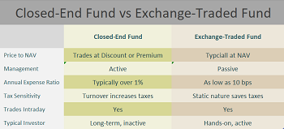

## Table of Contents

## What is an Exchange-Traded Fund (ETF)?

An Exchange-Traded Fund, or ETF, is a type of investment that works a lot like a mutual fund but is traded on a stock exchange, just like a stock. ETFs usually track a specific index, like the S&P 500, which means they hold the same stocks or assets as that index. This allows investors to buy a piece of a whole bunch of different stocks or assets all at once, instead of buying each one separately.

One of the big advantages of ETFs is that they tend to have lower fees than mutual funds. This is because ETFs are passively managed, meaning they just follow an index without a fund manager trying to pick the best stocks. This makes them a popular choice for people who want to invest in the market without spending a lot on fees. Plus, since ETFs are traded on an exchange, you can buy and sell them throughout the day, just like stocks, which gives you more flexibility than with mutual funds.

## What is a Closed-End Fund (CEF)?

A Closed-End Fund, or CEF, is another type of investment fund that's different from ETFs and mutual funds. Unlike ETFs, which can issue new shares whenever someone wants to buy them, CEFs have a fixed number of shares. This means that once all the shares are sold during the initial public offering (IPO), no new shares are created. If you want to buy shares in a CEF after the IPO, you have to buy them from another investor who's selling their shares.

CEFs often invest in a variety of assets, like stocks, bonds, or even real estate. They can use borrowed money, called leverage, to try to boost their returns, which can make them riskier but also potentially more rewarding. Because the number of shares is fixed, the price of a CEF can be higher or lower than the value of its underlying assets, which is called trading at a premium or a discount. This makes CEFs a bit more complex than ETFs, but they can be a good option for investors looking for something different.

## How do ETFs and CEFs differ in terms of structure?

ETFs and CEFs differ a lot in how they are set up. ETFs can create new shares whenever someone wants to buy them. This means that if more people want to invest in an [ETF](/wiki/etf-trading-strategies), the fund can just make more shares to meet the demand. On the other hand, CEFs have a set number of shares from the start. Once all the shares are sold in the initial offering, that's it—no more shares are made. So, if you want to buy into a CEF after that, you have to buy from someone else who is selling their shares.

Another big difference is how they are traded. ETFs trade on stock exchanges just like regular stocks, so you can buy and sell them anytime during the trading day. Their price usually stays pretty close to the value of the assets they hold. CEFs also trade on stock exchanges, but because they have a fixed number of shares, their price can be different from the value of their assets. Sometimes, CEFs trade at a price that's higher (a premium) or lower (a discount) than what their assets are actually worth. This can make CEFs a bit trickier to understand and invest in compared to ETFs.

## What are the main differences in how ETFs and CEFs are traded?

ETFs and CEFs both trade on stock exchanges, but there are key differences in how they are bought and sold. ETFs can be traded throughout the trading day, just like regular stocks. This means you can buy or sell them at any time during market hours. ETFs also usually trade very close to the value of the assets they hold, which makes their price pretty predictable. If you want to invest in an ETF, new shares can be created to meet the demand, so there's always a supply of shares available.

CEFs, on the other hand, have a fixed number of shares. Once all the shares are sold during the initial offering, no more shares are made. So, if you want to buy a CEF, you have to find someone who is selling their shares. This can make CEFs less liquid than ETFs. Also, the price of a CEF can be different from the value of its assets. Sometimes, CEFs trade at a price that's higher or lower than what their assets are actually worth, which is called trading at a premium or a discount. This can make CEFs a bit more complicated to trade compared to ETFs.

## How does the pricing of ETFs compare to that of CEFs?

ETFs usually trade very close to the value of the assets they hold. This means if an ETF owns stocks worth $100, the price of the ETF will be around $100 too. This is because ETFs can create new shares or get rid of old ones to keep the price in line with the value of their assets. So, when you buy or sell an ETF, you know you're getting a price that's fair and reflects what the ETF is actually worth.

CEFs, on the other hand, can be a bit trickier. They have a fixed number of shares, so if more people want to buy them than there are shares available, the price can go higher than the value of the assets inside the fund. This is called trading at a premium. If fewer people want to buy them, the price can drop below the value of the assets, which is called trading at a discount. This means when you're buying or selling a CEF, you have to think about whether you're getting a good deal or not, because the price might not match up with what the CEF is actually worth.

## What are the typical expense ratios for ETFs versus CEFs?

ETFs usually have lower expense ratios than CEFs. An expense ratio is like a fee you pay every year for owning the fund. For ETFs, this fee is often very small, usually between 0.03% and 0.50%. That means if you invest $10,000 in an ETF, you might pay between $3 and $50 a year in fees. ETFs are cheaper because they're designed to track an index without a lot of extra work from fund managers.

CEFs, on the other hand, tend to have higher expense ratios. This is because they often use more complex strategies and might use borrowed money to try to make more money. The expense ratios for CEFs can range from about 0.75% to 2.00% or even more. So, if you invest $10,000 in a CEF, you might pay between $75 and $200 a year in fees. The higher fees of CEFs can eat into your returns, so it's something to think about when choosing between ETFs and CEFs.

## How do the investment strategies of ETFs and CEFs generally differ?

ETFs usually follow a simple and straightforward investment strategy. They often track an index, like the S&P 500, which means they just try to match the performance of that index. This is called passive management. ETFs hold the same stocks or assets as the index they're tracking, so if the index goes up, the ETF goes up too. Because they're passively managed, ETFs don't need a lot of fancy work from fund managers, which keeps their costs low.

CEFs, on the other hand, often use more complex strategies. They can be actively managed, which means a fund manager is trying to pick the best stocks or assets to beat the market. CEFs might also use borrowed money, called leverage, to try to make bigger returns. This can make them riskier but also potentially more rewarding. Because of these active strategies and the use of leverage, CEFs usually have higher fees than ETFs.

## What are the tax implications of investing in ETFs compared to CEFs?

ETFs are usually more tax-friendly than CEFs. When you invest in an ETF, you might not have to pay as much in taxes because of how they work. ETFs often use a special way of trading that lets them avoid selling their assets to meet investor demand. This means they don't have to pay capital gains taxes as often. So, if you hold an ETF in a regular investment account, you might get fewer tax bills than with other kinds of funds.

CEFs, on the other hand, can lead to more tax headaches. Because CEFs are often actively managed, they might sell their assets more often. When they do this, they can create capital gains, which means you might have to pay taxes on those gains even if you haven't sold your shares in the CEF. Also, if a CEF uses borrowed money to invest, it might have to pay out more dividends, and those dividends can be taxed too. So, with CEFs, you might end up paying more in taxes than you would with ETFs.

## How do liquidity and trading volumes differ between ETFs and CEFs?

ETFs usually have better [liquidity](/wiki/liquidity-risk-premium) and higher trading volumes than CEFs. Liquidity means how easy it is to buy or sell something without affecting its price too much. Because ETFs can create new shares whenever people want to buy them, there are always plenty of shares available. This means lots of people can buy and sell ETFs every day, which makes them very liquid. High trading volumes also mean you can usually buy or sell ETFs at the price you want without waiting too long.

CEFs, on the other hand, can be less liquid and have lower trading volumes. Since CEFs have a fixed number of shares, if everyone wants to buy them at the same time, there might not be enough shares to go around. This can make it harder to buy or sell CEFs quickly, and you might have to wait or accept a price that's not exactly what you wanted. Lower trading volumes can also mean that the price of CEFs can move around more when people are buying or selling them.

## What are the advantages of ETFs over CEFs for a beginner investor?

For a beginner investor, ETFs are easier to understand and work with than CEFs. ETFs track a specific index, like the S&P 500, which means they try to do the same thing as that index. This makes it simple for beginners because you don't have to worry about a fund manager trying to pick the best stocks. ETFs also have lower fees because they're passively managed, so you keep more of your money. Plus, because ETFs can create new shares whenever someone wants to buy them, it's easy to buy and sell them whenever you want.

Another big advantage of ETFs for beginners is that they're very liquid and have high trading volumes. This means you can buy or sell ETFs without waiting too long and usually at the price you want. ETFs also tend to be more tax-friendly, so you might not have to pay as much in taxes compared to CEFs. All these things make ETFs a good choice for someone just starting out in investing because they're simple, affordable, and easy to trade.

## In what scenarios might a CEF be more suitable than an ETF for an expert investor?

For an expert investor, CEFs might be more suitable if they're looking for higher potential returns. CEFs can use borrowed money, called leverage, to try to make more money. This can be riskier, but it can also lead to bigger gains if the investments do well. An expert investor who understands how to handle this extra risk might find CEFs appealing because they offer a chance to beat the market.

Another scenario where CEFs could be better is if an expert investor wants to use more complex investment strategies. CEFs are often actively managed, which means a fund manager is trying to pick the best stocks or assets to outperform the market. If an investor believes in the skills of a particular fund manager, they might choose a CEF to take advantage of that expertise. Plus, because CEFs can trade at a premium or a discount to their actual asset value, an expert investor might find opportunities to buy low and sell high that aren't available with ETFs.

## How do the performance histories of ETFs and CEFs compare over the long term?

Over the long term, ETFs and CEFs have shown different performance histories. ETFs, which usually track an index like the S&P 500, tend to be more predictable. They aim to match the performance of the index they follow, so if the index does well over time, the ETF will too. Because ETFs are passively managed, they don't try to beat the market, but they can still give you steady returns. This makes them a good choice for investors who want to grow their money over the long term without taking too much risk.

CEFs, on the other hand, can have more ups and downs in their performance. Since CEFs are often actively managed, they try to beat the market by [picking](/wiki/asset-class-picking) the best stocks or assets. This can lead to bigger gains if the fund manager makes good choices, but it can also lead to bigger losses if they don't. CEFs might use borrowed money to try to make more money, which adds to the risk. Over the long term, some CEFs do better than the market, while others do worse. This makes them more suited for investors who are willing to take on more risk for the chance of higher returns.

## References & Further Reading

[1]: Gastineau, G.L. (2010). ["The Exchange-Traded Funds Manual."](https://onlinelibrary.wiley.com/doi/book/10.1002/9781118266946) John Wiley & Sons.

[2]: Elton, E. J., Gruber, M. J., Comer, G., & Li, K. (2003). ["Spiders: Where Are the Bugs?"](https://www.jstor.org/stable/10.1086/339891) The Journal of Finance.

[3]: Bershidsky, L. (2015). ["How ETFs Ate the Stock Market."](https://www.bloomberg.com/opinion/articles/2015-06-16/what-s-wrong-with-political-dynasties) Bloomberg.

[4]: Lee, C. M. C., Myers, J., & Swaminathan, B. (1999). ["What is the Intrinsic Value of the Dow?"](https://www.jstor.org/stable/222501) The Journal of Finance.

[5]: Arnott, R. D., Hsu, J., & Moore, P. (2005). ["Fundamental Indexation"](https://www.tandfonline.com/doi/abs/10.2469/faj.v61.n2.2718) Financial Analysts Journal.

[6]: Bogle, J. C. (1999). ["Common Sense on Mutual Funds: New Imperatives for the Intelligent Investor."](https://www.researchgate.net/publication/245704247_Common_Sense_on_Mutual_Funds_New_Imperatives_for_the_Intelligent_Investor) John Wiley & Sons. 

[7]: Avellaneda, M. (2001). ["Quantitative Models in Derivatives Pricing"](https://www.semanticscholar.org/paper/WEIGHTED-MONTE-CARLO%3A-A-NEW-TECHNIQUE-FOR-MODELS-Avellaneda-Buff/7652742577329368ca825eb814d2acf8969b558f) Springer. 

[8]: Tuckman, B., & Serrat, A. (2011). ["Fixed Income Securities: Tools for Today's Markets"](https://www.amazon.com/Fixed-Income-Securities-Todays-Markets/dp/0470891696) John Wiley & Sons. 

[9]: SEC. ["Introduction to Closed-End Fund](https://www.investor.gov/introduction-investing/general-resources/news-alerts/alerts-bulletins/investor-bulletins/investor-bulletin-publicly-traded-closed-end-funds)". Accessed October 2023. 

[10]: BlackRock. ["An Introduction to Exchange-Traded Funds (ETFs)"](https://www.blackrock.com/us/financial-professionals/investments/products/ishares-etfs) Accessed October 2023.