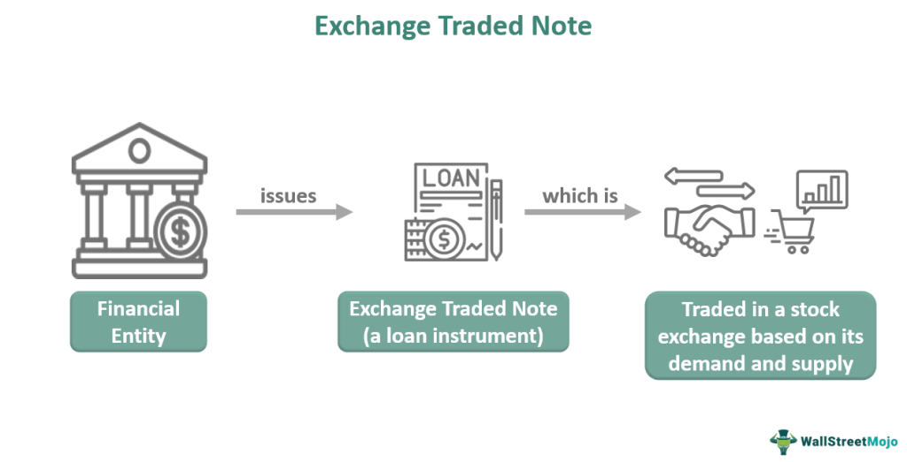

In recent years, the financial landscape has transformed with the emergence of various innovative instruments. Among these innovations are Exchange Traded Notes (ETNs), Exchange Traded Funds (ETFs), and the rise of algorithmic trading. These developments have altered traditional investment approaches, offering investors new ways to access markets and diversify portfolios. ETNs provide opportunities for exposure to specific asset classes and strategies, while ETFs have become popular for their liquidity and cost-effectiveness. Algorithmic trading has revolutionized the execution of trades, relying on sophisticated computer algorithms to optimize speed and efficiency. This article explores these financial tools and their growing influence on modern investing strategies. Understanding these concepts is important for both individual investors looking to harness new opportunities and financial professionals seeking to remain competitive in a rapidly evolving market. By comprehending the nuances of ETNs, ETFs, and algorithmic trading, market participants can better navigate the complex financial ecosystem and enhance their investment outcomes.

## Table of Contents

## Understanding Exchange Traded Notes (ETNs)

Exchange Traded Notes (ETNs) are innovative financial instruments providing investors with unique opportunities to diversify their portfolios. As unsecured debt securities, ETNs are issued by financial institutions and are designed to track the performance of a specific index, commodity, or asset. One of the primary distinctions between Exchange Traded Notes (ETNs) and Exchange Traded Funds (ETFs) is that ETNs do not physically hold the underlying assets they are intended to track. Instead, they rely on the creditworthiness of the issuer to fulfill the obligations of the note at maturity.

Investors often find ETNs appealing due to their tax efficiency and their potential to grant access to markets that are typically challenging to reach through conventional means. Unlike other investment vehicles, ETNs generally do not distribute interest or dividends. This can result in lower taxable events, as the principal tax liability is typically incurred upon the sale or maturity of the note. The tax implications provide a compelling reason for some investors to incorporate ETNs into their investment strategies.

It is crucial, however, for investors to account for the inherent risks associated with ETNs. Chief among these risks is issuer credit risk. Since ETNs are essentially unsecured debt obligations, the investor's ability to receive returns hinges completely on the issuer's financial health. Should the issuer experience financial distress or declare bankruptcy, investors may incur significant losses, irrespective of the performance of the underlying index or asset.

In summary, while ETNs offer considerable versatility and access distinct market niches, a thorough understanding and careful evaluation of these financial products are imperative before committing funds. The potential rewards can be attractive, yet the risks, particularly those associated with issuer solvency, are considerable and require vigilant attention. As such, ETNs can be valuable tools in a well-diversified investment portfolio, provided that investors approach them with the requisite caution and insight.

## Exploring Exchange Traded Funds (ETFs)

Exchange Traded Funds (ETFs) are investment vehicles that allow collective investment in a diversified portfolio of assets and trade on major stock exchanges just like individual stocks. This distinct feature enhances [liquidity](/wiki/liquidity-risk-premium) and offers investors the convenience of buying and selling [ETF](/wiki/etf-trading-strategies) shares throughout the trading day at market prices. 

### Diversification
ETFs provide exposure to a wide range of asset classes, including equities, fixed income, commodities, and even broad market indices. This characteristic is achieved because an ETF typically comprises a portfolio mirroring an index, sector, or theme. Consequently, investors can gain broad market exposure, reducing the impact of individual security [volatility](/wiki/volatility-trading-strategies) on their portfolios. For instance, investing in a stock market ETF can offer instant diversification across all the companies listed in an index, such as the S&P 500.

### Cost Efficiency
A key advantage of ETFs is their cost-effectiveness. They tend to have lower expense ratios compared to mutual funds because they are passively managed. This efficiency is primarily due to their management structure, which involves tracking an index rather than active stock [picking](/wiki/asset-class-picking). The lower fees can significantly bolster an investor's net returns over time.

### Tax Efficiency
ETFs are also recognized for their favorable tax treatment. They often incur fewer capital gains taxes than mutual funds because of the unique "in-kind" redemption process authorized by the U.S. Internal Revenue Service (IRS). This process limits taxable events and can defer capital gains taxation, representing a significant advantage for taxable accounts.

### Investment Strategies
The inherent flexibility of ETFs supports various investment strategies. Investors can easily target specific sectors (e.g., technology or healthcare), thematic investments (e.g., renewable energy), or regions (e.g., emerging markets). This adaptability allows investors to position themselves according to specific market trends or their risk tolerance preferences.

### Risks and Considerations
Despite the benefits, investors must remain conscious of certain risks and limitations associated with ETFs. Market risk remains a primary concern as the value of ETFs can fluctuate due to market conditions affecting the underlying assets. Additionally, liquidity concerns can arise, particularly for those ETFs that invest in less liquid securities. Lastly, tracking errors, which occur when an ETF's performance deviates from its benchmark index, can affect returns. These discrepancies can result from various factors, including management fees, rebalancing costs, or imperfect replication of the index.

Overall, Exchange Traded Funds serve as a versatile and efficient investment tool, providing access to a broad array of markets while maintaining favorable cost and tax benefits. However, investors should exercise due diligence, fully understanding the risks involved to align their investment choices with their financial objectives.

## The Role of Algorithmic Trading in Financial Markets

Algorithmic trading leverages sophisticated computer programs and algorithms to automate and accelerate the process of executing trades in financial markets. This technological approach to trading capitalizes on the power of computers to analyze market data at incredible speeds, often executing buy or sell orders in fractions of a second. The primary advantage of [algorithmic trading](/wiki/algorithmic-trading) lies in its ability to enhance both the efficiency and speed of transactions, qualities that are increasingly essential in today's fast-paced financial markets.

The implementation of algorithmic trading systems has profoundly altered traditional trading methods. These systems are designed to identify and respond to market inefficiencies by analyzing vast datasets, market trends, and patterns that are often missed or overlooked by human traders. By doing so, algorithmic trading effectively reduces the impact of human emotional biases, which can otherwise lead to suboptimal trading decisions. For instance, traders can code algorithms to follow specific strategies such as trend-following, [arbitrage](/wiki/arbitrage), or market-making, thereby ensuring that trades are executed based on predefined criteria rather than emotional influences.

High-frequency trading ([HFT](/wiki/high-frequency-trading-strategies)) represents a highly specialized subset of algorithmic trading characterized by the execution of a large number of orders at extremely high speeds. HFT strategies typically capitalize on small price discrepancies that may occur over very short time horizons, often in milliseconds or microseconds. This approach has fundamentally transformed market dynamics by increasing liquidity and narrowing bid-ask spreads, though it has also sparked debates regarding its impact on market volatility and fairness. Critics argue that HFT may contribute to market instability, as evidenced by incidents such as the "Flash Crash" of May 6, 2010, when major stock indices in the United States plunged and recovered abruptly within minutes.

Despite these concerns, algorithmic trading offers distinct advantages that extend beyond mere speed and efficiency. The automation of trading strategies can significantly reduce transaction costs by minimizing the need for human intervention and enabling the execution of trades at the most favorable prices. Furthermore, algos often provide superior consistency in executing complex trading strategies, helping investors achieve their financial objectives while maintaining risk management protocols.

However, the very attributes that make algorithmic trading attractive also introduce certain risks. The reliance on technology and automation increases the susceptibility to technical glitches and system failures, which can lead to unintended trades or even market disturbances. Moreover, the highly competitive and secretive nature of algorithmic trading has spurred a technological arms race among trading firms, with continuous investments in cutting-edge infrastructure and personnel a prerequisite for maintaining an edge in the market.

In conclusion, while algorithmic trading has ushered in a new era of trading marked by unparalleled speed and efficiency, it necessitates a careful assessment of its implications for market stability and investor protection. As financial markets continue to embrace technology, understanding the nuances of algorithmic trading and its potential effects remains critical for policymakers, market participants, and the investing public at large.

## Synergy between ETNs, ETFs, and Algorithmic Trading

ETNs (Exchange Traded Notes) and ETFs (Exchange Traded Funds) are financial instruments that benefit significantly from the application of algorithmic trading. The inherent characteristics of these instruments, such as their liquidity and volatility, make them suitable candidates for algorithmic trading strategies.

Algorithmic trading utilizes computer programs to execute trades based on pre-set criteria. Its role in enhancing the execution of complex investment strategies is particularly pronounced with ETNs and ETFs. With algorithms, investors can efficiently manage and execute trades that involve intricate strategies, such as pairs trading or [statistical arbitrage](/wiki/statistical-arbitrage). The speed and precision of algorithmic trading provide an edge in executing these strategies with minimal human intervention.

Moreover, algorithms facilitate efficient price discovery and market-making activities. ETNs and ETFs, being traded on exchanges like stocks, can experience price fluctuations based on market conditions. Algorithmic trading helps in rapidly adjusting the pricing of these instruments, ensuring that they remain aligned with their underlying indices or asset values. This rapid adjustment capability aids in maintaining market equilibrium and enhances liquidity.

Investors also employ algorithms to tap into arbitrage opportunities. For instance, discrepancies between the trading price of an ETF and its net asset value (NAV) can be swiftly identified and exploited using high-frequency trading algorithms. These algorithms can analyze vast data sets, identify potential arbitrage situations, and execute trades in milliseconds, thus capturing profit opportunities that might be inaccessible through manual trading.

Understanding the interplay between ETNs, ETFs, and algorithmic trading is crucial for optimizing trading efficiency. By leveraging technology, investors can enhance their ability to respond to market movements, reduce transaction costs, and improve the overall effectiveness of their trading strategies. As financial markets continue to evolve, the synergy between these instruments and algorithmic trading is expected to deepen, offering new possibilities for investors seeking to maximize returns.

## Regulatory Considerations and Challenges

Both Exchange Traded Notes (ETNs) and Exchange Traded Funds (ETFs) are subject to specific regulatory frameworks designed to ensure their issuance and trading meet standards of transparency and investor protection. Regulatory bodies, including the U.S. Securities and Exchange Commission (SEC) and the Financial Conduct Authority (FCA) in the UK, provide guidelines that govern the disclosure, reporting, and operational practices for these financial instruments.

ETNs, being unsecured debt securities, pose a unique set of regulatory challenges. Since they rely on the creditworthiness of the issuer, the primary concern for regulators is ensuring that the credit risk associated with ETNs is clearly communicated to investors. Regulations require issuers to regularly disclose financial information and potential risks that could affect their credit ratings. Additionally, regulators monitor the market for any indications of default risk or credit downgrades that might adversely impact ETN holders.

ETFs, on the other hand, are structured as pooled investment vehicles. Their regulatory requirements focus on the disclosure of the fund's holdings, expense ratios, and tracking performance. The Investment Company Act of 1940 in the United States, along with the Undertakings for Collective Investment in Transferable Securities (UCITS) directives in Europe, provides a framework for investor protection, aimed at ensuring that ETFs operate with transparency and accountability. These regulations also cover the operational aspects of ETFs, such as creation/redemption mechanisms, which contribute to maintaining liquidity and tracking accuracy.

Algorithmic trading introduces several challenges to market stability and fairness. High-frequency trading (HFT), a subset of algorithmic trading, has prompted particular concern due to its potential to exacerbate market volatility and create unfair advantages for technologically advanced trading firms. The so-called "flash crash" of May 6, 2010, where the Dow Jones Industrial Average briefly fell nearly 1,000 points before recovering, highlighted the volatility risks associated with algorithmic trading. In response, regulatory authorities have implemented measures such as circuit breakers and updated market access rules to mitigate the risks posed by high-speed electronic trading. These measures aim to curb excessive market fluctuations and ensure orderly trading.

Regulators work to balance the benefits of algorithmic trading, such as liquidity provision and enhanced price discovery, with the need to maintain market integrity. They emphasize transparency by requiring trading algorithms to be documented and stress-tested under different market conditions. Additionally, regulatory frameworks are evolving to address the 'unknown unknowns' of algorithmic trading, stressing the importance of robust risk management systems.

Navigating the regulatory environment is essential for firms engaged in these activities. Compliance with regulations requires continual adaptation to new rules and close collaboration with regulatory bodies. For firms, maintaining compliance involves regular audits, updates of trading algorithms to align with regulatory standards, and investment in technology to monitor and manage trading activities effectively. As regulations continue to evolve in response to technological advancements and market events, staying informed and adaptive remains crucial for financial firms participating in the dynamic landscape of ETNs, ETFs, and algorithmic trading.

## Conclusion

Exchange Traded Notes (ETNs), Exchange Traded Funds (ETFs), and algorithmic trading are pivotal innovations that have significantly transformed the landscape of modern finance. They provide investors with enhanced flexibility, diversified exposure, and efficient trade execution. The effectiveness of these tools heavily relies on the user's understanding and strategic implementation. For investors and companies alike, staying informed about these financial instruments and their implications is crucial.

The integration of ETNs and ETFs into investment portfolios provides access to a breadth of markets and asset classes that were previously challenging to navigate. Similarly, algorithmic trading, with its ability to process vast amounts of data and execute trades at unprecedented speeds, optimizes transaction costs and reduces exposure to market volatility.

As financial markets continue to evolve, the role of ETNs, ETFs, and algorithmic trading is set to become even more pronounced. Their ongoing development promises to bring forth new opportunities and possibly redefine investment strategies. The rapid pace of technological advancement in trading algorithms, combined with the growth of these exchange-traded products, underscores the need for continuous learning and adaptation by market participants.

Investors aiming to leverage the full potential of these advancements should engage diligently with ongoing educational resources and market research. Proper understanding and application of these financial tools can lead to significantly enhanced investment performance, underpinning a more resilient and adaptable financial ecosystem. The unfolding potential of ETNs, ETFs, and algorithmic trading promises a future ripe with innovation, shaping the contours of financial markets for years to come.

## References & Further Reading

[1]: ["Exchange-Traded Funds and the Financial Crisis"](https://www.annualreviews.org/content/journals/10.1146/annurev-financial-110716-032538) by Alvin L. Allison, Journal of Asset Management.

[2]: ["The Complete ETF Book: What You Need to Know About Exchange-Traded Funds"](https://www.amazon.com/ETF-Book-About-Exchange-Traded-Funds/dp/0470537469) by David J. Abner

[3]: ["Algorithmic Trading and DMA"](https://www.amazon.com/Algorithmic-Trading-DMA-introduction-strategies/dp/0956399207) by Barry Johnson

[4]: ["High-Frequency Trading: A Practical Guide to Algorithmic Strategies and Trading Systems"](https://www.ahmetbeyefendi.com/wp-content/uploads/2020/07/High-Frequency-Trading-Irene-Aldridge.pdf) by Irene Aldridge

[5]: ["Exchange-Traded Funds in Europe: Evidence on Growth, Investor Risks and Regulatory Challenges"](https://www.sciencedirect.com/book/9780128136393/exchange-traded-funds-in-europe) by Ajay Jani and Joseph Davidson, Journal of Financial Regulation and Compliance.

[6]: ["The Interaction of Trading Algorithms and Exchange-Traded Funds"](http://epub.lib.aalto.fi/en/ethesis/pdf/13232/hse_ethesis_13232.pdf) by Thomas H. McInish, American Economic Journal.