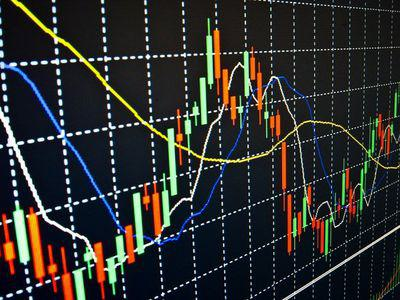

Technical analysis in trading encompasses a diverse set of tools and strategies designed to predict future price movements by analyzing historical market data. Among these analytical instruments, stochastic oscillators are particularly renowned for their ability to identify momentum within price trends. Created in the late 1950s, stochastic oscillators have become integral to traders seeking to understand potential turning points in the market.

This article focuses on the role of fast and slow stochastic oscillators in technical analysis, highlighting how these tools can be leveraged in algorithmic trading to optimize decision-making processes. Fast stochastic oscillators offer rapid signals that are highly responsive to market changes, while slow stochastic oscillators provide smoother signals that can help filter out market noise. Understanding the distinct characteristics and benefits of each type is crucial for traders looking to integrate them into a cohesive trading strategy. 



Additionally, the application of these oscillators in automated trading systems underscores their versatility and importance, allowing traders to programmatically detect overbought and oversold market conditions. By incorporating stochastic oscillators into their trading strategies, market participants can enhance their decision-making processes and better navigate the complexities of modern financial markets.

## Table of Contents

## Understanding Stochastics in Technical Analysis

Stochastics is a widely recognized momentum indicator in technical analysis, crucial for identifying overbought or oversold market conditions. Developed in the late 1950s by George Lane, the stochastic oscillator assesses the closing price's position relative to its price range over a specified period. This evaluation helps to anticipate potential price reversals, therefore being invaluable in predicting market movements.

The stochastic oscillator's typical configuration involves a 14-day period. It measures the relative position of the closing price within the set timeframe by comparing the current price to the recent highs and lows. The formula underlying this calculation is:

$$
K = \left( \frac{C - L}{H - L} \right) \times 100
$$

Where:
- $K$ is the current stochastic value,
- $C$ is the most recent closing price,
- $L$ is the lowest price in the specified period (commonly 14 days),
- $H$ is the highest price in the same period.

This formula produces a value between 0 and 100, indicating where the closing price sits relative to the set range of previous prices. A reading above 80 typically signifies an overbought condition, suggesting a potential downturn, while a reading below 20 indicates an oversold state, proposing an upward price correction.

This dynamic evaluation of price movements helps traders discern whether a current trend is likely to reverse, continuing in the same direction, or pause before reasserting itself. As a result, the stochastic oscillator is a preferred tool among technical analysts for its ability to yield timely insights into market [momentum](/wiki/momentum) and possible price reversals.

While typically configured to a 14-day period, traders can adjust this timeframe to suit different trading styles and asset characteristics. Shorter periods result in a more sensitive oscillator, privileging responsiveness over signal accuracy, whereas longer periods yield a smoother, less volatile curve. This versatility allows all traders, from short-term speculators to long-term investors, to tailor the stochastic oscillator to their strategy requirements.

## Differentiating Fast and Slow Stochastics

The primary distinction between fast and slow stochastic oscillators is their reaction speed to changes in market prices. Fast stochastics are designed to capture quick and immediate fluctuations in price, providing traders with rapid signals. This sensitivity makes fast stochastics more suitable for those traders who are looking to capitalize on short-term price movements. However, the high responsiveness of fast stochastics can also be a disadvantage, as it may result in an increased number of false signals, particularly in a volatile market.

The fast stochastic is composed of two lines: %K and %D. The %K line reflects the quickest changes and is calculated as follows:

$$
\%K = 100 \times \frac{\text{Current Close} - \text{Lowest Low}}{\text{Highest High} - \text{Lowest Low}}
$$

over a certain period, typically 14 days. The %D line, which is a moving average of the %K line, usually over a three-period span, helps smooth out the %K line's variations, aiding in signal confirmation.

Slow stochastics, on the other hand, aim to moderate the signals generated by fast stochastics by further smoothing the data. This is accomplished by averaging the %K line from the fast stochastics, creating a more stable representation that reduces the market noise. In the slow stochastic oscillator, the smoothed %K line becomes the new %D, while the %K line is subjected to additional smoothing. The slow stochastic formula can be expressed as:

$$
\text{Slow }\%K = \text{Fast }\%D
$$
$$
\text{Slow }\%D = \text{3-period simple moving average of Slow }\%K
$$

The Slow %K is equivalent to the Fast %D, and the new %D line is a further 3-period moving average of the Slow %K.

Through this additional smoothing, slow stochastics offer more reliable signals for traders focused on medium to long-term trends by filtering out short-lived market fluctuations. The application of slow stochastics is often more suitable for traders who prefer to avoid the whipsaws associated with rapid, minute-by-minute trading.

Ultimately, the choice between fast and slow stochastics should be guided by an individual trader's specific market strategy and time horizon. While the fast stochastic oscillator can be advantageous for panoptic assessments of quick price changes, the slow stochastic is better at identifying more substantial trends by minimizing market noise.

## Advantages and Disadvantages of Fast and Slow Stochastics

Fast stochastic oscillators are prized for their ability to provide rapid signals, making them particularly useful for traders who require quick entry and [exit](/wiki/exit-strategy) points. The fast stochastic indicator relies on the most recent price data, typically using a formula to calculate %K and %D lines, which are both used to identify potential buy and sell signals. The calculation for %K is given by:

$$
\%K = \frac{(C - L_{14})}{(H_{14} - L_{14})} \times 100
$$

where $C$ is the most recent closing price, $L_{14}$ is the lowest low over the last 14 periods, and $H_{14}$ is the highest high over the same period. The %D line, which acts as a signal line, is often a 3-day simple moving average of %K.

Despite its advantages, fast stochastic oscillators can generate false signals in volatile market conditions. This is due to their high sensitivity to price movements, which might lead to premature entries or exits. Traders who prefer shorter trading horizons might find this acceptable, but others may be caught in a whipsaw effect with multiple trades that do not hit their target profits.

On the other hand, slow stochastic oscillators address the issue of noise by smoothing out the signal. This is achieved by further averaging the %K line of the fast stochastic indicator to produce a slower %K, which diminishes short-term market fluctuations. The slower moving %D line, usually a moving average of the slow %K, provides additional confirmation of a trend change:

$$
\text{Slow } \%K = \text{SMA of Fast } \%K
$$

The slow stochastic's primary advantage is its ability to filter out noise, leading to more reliable signals that are less prone to the whipsaw effect common in fast stochastics. This can be particularly advantageous for traders who favor longer-term strategies and can afford to wait for more confirmed signals before executing trades. However, the trade-off is a delay in signals, which could result in missed opportunities during rapid price movements.

The choice between fast and slow stochastics ultimately depends on a trader's specific goals and risk tolerance. Fast stochastics serve those seeking agility and quick trades, suitable for [scalping](/wiki/gamma-scalping) or other short-term strategies. Conversely, slow stochastics cater to those prioritizing accuracy over speed, benefitting swing traders or those with a buy-and-hold philosophy. A balanced trading strategy often involves understanding these tools' strengths and weaknesses, allowing them to be integrated effectively based on the prevailing market conditions and individual trading objectives.

## Incorporating Stochastics in Algorithmic Trading

Incorporating stochastic oscillators into [algorithmic trading](/wiki/algorithmic-trading) systems can significantly enhance trading strategies by automating the identification of overbought and oversold market conditions. Fast and slow stochastics serve as integral indicators, each providing distinct advantages in optimizing algorithmic performance. The stochastic oscillator is a momentum indicator comparing a particular closing price to its price range over a specific period. Its formula is represented as:

$$

\%K = \frac{{\text{Current Closing Price} - \text{Lowest Low}}}{{\text{Highest High} - \text{Lowest Low}}} \times 100 
$$

For actual implementation, the slow stochastic is a smoothed version of the fast stochastic, where the %K line of the fast stochastic is further smoothed using a moving average, usually over three periods. This results in a more reliable signal by reducing market noise, which is beneficial in volatile market conditions.

Algorithmic traders can capitalize on stochastic indicators by integrating them into their systems through precise coding. For instance, using Python, one can utilize libraries such as NumPy and pandas to calculate stochastic oscillators efficiently and implement them within a trading algorithm. A simple Python snippet to calculate the fast stochastic %K might look as follows:

```python
import pandas as pd

def calculate_fast_stochastic(high, low, close, period=14):
    low_min = close.rolling(window=period).min()
    high_max = high.rolling(window=period).max()
    fast_k = 100 * ((close - low_min) / (high_max - low_min))
    return fast_k

# Example usage
data = pd.DataFrame({
    'high': [...],  # list of high prices
    'low': [...],   # list of low prices
    'close': [...]  # list of close prices
})
fast_k = calculate_fast_stochastic(data['high'], data['low'], data['close'])
```

In designing trading algorithms, it is critical to establish clear entry and exit criteria based on stochastic signals. A typical strategy might involve entering a position when the stochastic indicator crosses below a specific threshold (say, 20), indicating an oversold condition, and exiting when it crosses above another threshold (say, 80), suggesting an overbought state.

Furthermore, combining stochastic signals with other indicators, such as moving averages or the Relative Strength Index (RSI), can refine these strategies. This multi-faceted approach minimizes false signals, enhancing the predictive accuracy of algorithmic models. By precisely defining these conditions, traders can exploit stochastic oscillators' capabilities to improve trade timing and management, ultimately leading to better performance outcomes.

In summary, the integration of fast and slow stochastic oscillators in algorithmic trading systems allows for the systematic and automated exploitation of market momentum indicators, resulting in optimized trading strategies and improved decision-making in varying market conditions.

## Common Pitfalls and Best Practices

Relying solely on stochastic signals without other confirmation can lead to suboptimal trading decisions. While stochastic oscillators are powerful tools for identifying overbought and oversold conditions, their signals may suffer from noise, especially in volatile markets. For this reason, it's crucial to combine stochastic indicators with other technical analysis tools to validate signals and enhance decision-making.

One effective practice is to use stochastic oscillators in conjunction with trend indicators such as moving averages. A common strategy involves confirming stochastic signals with a simple moving average (SMA). For instance, if the stochastic oscillator indicates an oversold condition, a trader might wait for the price to cross above a 50-day SMA before confirming a buying opportunity. This combination helps filter out potential false signals caused by temporary market fluctuations.

Another best practice is to integrate stochastic indicators with support and resistance levels. Stochastic signals are more reliable when they coincide with significant support or resistance. Traders can use these levels to set stop-loss and take-profit points more effectively. For example, an oversold signal below a clearly defined support level can provide a higher confidence entry point for traders willing to take calculated risks in anticipation of a price bounce.

To further enhance signal accuracy, traders often pair stochastic oscillators with other momentum indicators, such as the Relative Strength Index (RSI). Using both indicators simultaneously can provide complementary perspectives on market conditions. When both the stochastic oscillator and RSI indicate overbought or oversold conditions, the probability of a correction increases, offering more compelling trading signals.

In algorithmic trading, codifying these best practices into trading strategies can optimize performance. For example, a Python-based algorithm can be developed to automate these rules:

```python
def trading_strategy(data):
    # Calculate the 14-day stochastic oscillator
    data['Stochastic'] = ((data['Close'] - data['Low'].rolling(window=14).min()) / 
                          (data['High'].rolling(window=14).max() - data['Low'].rolling(window=14).min())) * 100

    # Calculate the 14-day RSI
    delta = data['Close'].diff()
    gain = (delta.where(delta > 0, 0)).rolling(window=14).mean()
    loss = (-delta.where(delta < 0, 0)).rolling(window=14).mean()
    rs = gain / loss
    data['RSI'] = 100 - (100 / (1 + rs))

    # Define trading conditions
    for i in range(1, len(data)):
        if data['Stochastic'][i] < 20 and data['Closed'][i] > data['SMA'][i] and data['RSI'][i] < 30:
            data.loc[i, 'Signal'] = 'Buy'
        elif data['Stochastic'][i] > 80 and data['Closed'][i] < data['SMA'][i] and data['RSI'][i] > 70:
            data.loc[i, 'Signal'] = 'Sell'
    return data

data = trading_strategy(data)
```

Lastly, understanding the limitations and appropriate contexts for stochastic indicators is key. Avoid using stochastics in isolation, especially in a trendless market where they can produce misleading signals. Instead, be mindful of market conditions and adjust strategies accordingly to ensure that stochastics serve as a reliable component of your broader trading analysis framework.

## Conclusion

Fast and slow stochastic oscillators are indispensable in the universe of technical analysis, offering traders critical insights into market behavior. Fast stochastics, known for their sensitivity, are adept at providing quick signals that can aid in capturing rapid market movements. This sensitivity, however, can result in noise and potential false signals, which necessitates careful management. On the other hand, slow stochastic oscillators are designed to offer more stable signals by smoothing out the rapid fluctuations observed in fast stochastics. This makes them particularly valuable for traders focused on minimizing false positives and those looking for more reliable signals over longer time horizons.

Understanding the particular strengths and applications of fast and slow stochastic oscillators enables traders to leverage these tools effectively. By selectively applying each type of stochastic oscillator based on the trading scenario, traders can enhance their ability to anticipate price movements and make informed decisions. This strategic application not only refines market analysis but also improves trading outcomes.

Moreover, the utility of stochastic oscillators is significantly amplified in algorithmic trading. Here, their integration enables the automation of detecting overbought or oversold conditions, thus optimizing entry and exit strategies. Algorithmic systems can be programmed to execute trades based on specific stochastic signals, thereby increasing the precision and efficiency of trading operations in technologically advanced environments.

In sum, embracing both fast and slow stochastic oscillators, with their unique attributes, empowers traders to navigate the complexities of the market more effectively. Their incorporation in algorithmic trading highlights their continued relevance and adaptability in evolving financial landscapes.

## References & Further Reading

[1]: Lane, G. (1984). ["Lane's Stochastics"](https://www.scribd.com/document/75144586/Lane-s-Stochastics-1984-1998). Investopedia.

[2]: Pring, M. (2002). ["Technical Analysis Explained."](https://www.amazon.com/Technical-Analysis-Explained-Fifth-Successful/dp/0071825177) McGraw-Hill Education.

[3]: Wilder, J. W. (1978). ["New Concepts in Technical Trading Systems."](https://archive.org/details/newconceptsintec00wild) Trend Research.

[4]: Kaufman, P. J. (2013). ["Trading Systems and Methods,"](https://onlinelibrary.wiley.com/doi/book/10.1002/9781119202561) 5th Edition. Wiley.

[5]: Murphy, J. J. (1999). ["Technical Analysis of the Financial Markets: A Comprehensive Guide to Trading Methods and Applications."](https://archive.org/details/technicalanalysi0000murp) New York Institute of Finance.