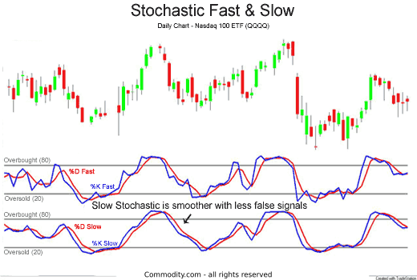

## Table of Contents

## What are Fast and Slow Stochastics?

Fast and Slow Stochastics are tools used in trading to help predict where a stock's price might go next. Fast Stochastics measure how the closing price of a stock compares to its price range over a recent period, usually 14 days. It gives traders a quick idea of whether a stock is overbought or oversold. If the Fast Stochastic line is above 80, it might mean the stock is overbought and could soon drop in price. If it's below 20, the stock might be oversold and could rise soon.

Slow Stochastics, on the other hand, are a bit smoother and less jumpy than Fast Stochastics. They are made by taking an average of the Fast Stochastic line, which helps to reduce sudden changes and false signals. This makes Slow Stochastics more reliable for many traders. Like Fast Stochastics, a reading above 80 suggests the stock might be overbought, and a reading below 20 suggests it might be oversold. Many traders prefer using Slow Stochastics because they provide a clearer picture of market trends over time.

## How do Fast and Slow Stochastics differ in their calculation?

Fast Stochastics are calculated by comparing the most recent closing price of a stock to its price range over a certain period, usually 14 days. This gives you two lines: the %K line, which is the raw calculation of where the closing price sits within the high-low range, and the %D line, which is a 3-day simple moving average of the %K line. The %K line is more sensitive to price changes because it reacts directly to the latest closing price.

Slow Stochastics take the Fast Stochastic calculation and make it smoother. Instead of using the %K line directly, Slow Stochastics use the %D line from the Fast Stochastics as their %K line. Then, they calculate a new %D line by taking a 3-day simple moving average of this new %K line. This double smoothing process makes Slow Stochastics less reactive to sudden price changes, which helps traders see clearer trends and avoid false signals.

## What is the significance of the %K and %D lines in both Fast and Slow Stochastics?

In Fast Stochastics, the %K line shows where the most recent closing price of a stock sits within its high-low range over a set period, usually 14 days. It's the raw data that reacts quickly to price changes. The %D line, on the other hand, is a 3-day moving average of the %K line. This makes it a bit smoother and helps traders see if the fast-moving %K line is giving a real signal or just reacting to a small price change. When the %K line crosses above or below the %D line, it can signal a potential change in the stock's direction.

In Slow Stochastics, the %K line is actually the %D line from the Fast Stochastics. This means it's already smoother than the original %K line in Fast Stochastics. The %D line in Slow Stochastics is then a 3-day moving average of this new %K line, making it even smoother. This double smoothing helps traders avoid false signals and see clearer trends. Just like in Fast Stochastics, traders look for crossovers between the %K and %D lines to find potential buy or sell signals, but these signals are generally more reliable in Slow Stochastics because of the extra smoothing.

## How do the default settings for Fast and Slow Stochastics vary?

The default settings for Fast Stochastics usually use a 14-day period to look at the price range. The %K line in Fast Stochastics is calculated directly from the latest closing price compared to the high and low prices over these 14 days. The %D line is then a 3-day moving average of the %K line. This means Fast Stochastics react quickly to price changes, making them sensitive but sometimes giving false signals.

Slow Stochastics take the %D line from Fast Stochastics and use it as their %K line. This already makes it smoother because it's based on the 3-day average from Fast Stochastics. Then, the %D line in Slow Stochastics is another 3-day moving average of this new %K line. This double smoothing makes Slow Stochastics less jumpy and more reliable for seeing trends. Both use the same 14-day period to start, but Slow Stochastics smooth out the data twice, making them better for avoiding false signals.

## What are the typical time frames used for Fast and Slow Stochastics?

Fast and Slow Stochastics are usually set to look at a stock's price over the last 14 days. This means they use the highest and lowest prices from the past 14 days to see where the current closing price fits in. Both Fast and Slow Stochastics start with this 14-day period, but they handle the data differently.

Fast Stochastics quickly react to price changes because they directly use the latest closing price in their calculations. This makes them sensitive and good for spotting quick changes, but they can sometimes give false signals. Slow Stochastics take the Fast Stochastic's data and smooth it out twice, which makes them less jumpy and better at showing clearer trends over time. This double smoothing helps traders avoid getting tricked by sudden price moves and focus on the bigger picture.

## How do Fast and Slow Stochastics help in identifying overbought and oversold conditions?

Fast and Slow Stochastics help traders figure out if a stock is overbought or oversold by looking at its price over the last 14 days. When the Stochastic lines go above 80, it means the stock might be overbought. This happens when the stock's price has been rising a lot and might be due for a drop. On the other hand, when the lines drop below 20, the stock is seen as oversold. This suggests the price has fallen a lot and could soon go back up. Traders watch these levels to decide when to buy or sell a stock.

Fast Stochastics react quickly to price changes because they use the latest closing price directly. This makes them good at spotting quick shifts in the market, but they can sometimes give false signals because they're so sensitive. Slow Stochastics smooth out the data twice, making them less jumpy and more reliable for seeing trends over time. By using Slow Stochastics, traders can better avoid getting tricked by sudden price moves and focus on the bigger picture of whether a stock is overbought or oversold.

## What are the common trading signals generated by Fast and Slow Stochastics?

Fast and Slow Stochastics help traders see when to buy or sell stocks by giving signals. One common signal is when the %K line crosses above the %D line. This is called a bullish crossover, and it suggests that the stock's price might start going up soon. Traders might see this as a good time to buy the stock. On the other hand, when the %K line crosses below the %D line, it's called a bearish crossover. This means the stock's price might start going down, and it could be a good time to sell.

Another signal traders watch for is when the Stochastic lines move into overbought or oversold areas. If the lines go above 80, the stock is seen as overbought, which means it might be time to sell because the price could drop soon. If the lines drop below 20, the stock is considered oversold, and it might be a good time to buy because the price could go up. These signals help traders decide when to make their moves based on where the Stochastic lines are on the chart.

Fast Stochastics give these signals quickly because they react fast to price changes. This can be good for catching quick moves in the market but can also lead to false signals. Slow Stochastics smooth out the data, making their signals more reliable and less likely to trick traders. By using Slow Stochastics, traders can better see the bigger trends and make more informed decisions about buying or selling stocks.

## How do the sensitivity and reliability of signals differ between Fast and Slow Stochastics?

Fast Stochastics are very sensitive to price changes. They react quickly because they use the latest closing price directly in their calculations. This means they can spot quick changes in the market, which is good for traders who want to catch fast moves. But, because they're so sensitive, they can also give false signals. This happens when the price moves suddenly but doesn't keep going in that direction. Traders need to be careful and might need to check other signs before acting on these signals.

Slow Stochastics, on the other hand, are less sensitive but more reliable. They smooth out the data twice, which makes their signals less jumpy. This means they're better at showing the bigger trends in the market. Because they're less likely to give false signals, traders can trust them more when deciding to buy or sell. Slow Stochastics help traders see a clearer picture of whether a stock is overbought or oversold, making their trading decisions more reliable.

## Can you explain the impact of using different moving averages in Slow Stochastics?

Using different moving averages in Slow Stochastics can change how quickly the lines react to price changes. If you use a shorter moving average, like a 2-day one instead of the usual 3-day, the lines will move faster. This makes Slow Stochastics more sensitive, kind of like Fast Stochastics. It can help you spot quick changes in the market, but it might also give you more false signals because it reacts too fast to small price moves.

On the other hand, if you use a longer moving average, like a 4-day or 5-day one, the lines will move slower. This makes Slow Stochastics less sensitive and smoother. It's better for seeing the bigger trends in the market and helps you avoid getting tricked by sudden price changes. By choosing the right moving average, you can make Slow Stochastics work better for your trading style, whether you want to catch fast moves or focus on long-term trends.

## What are the potential pitfalls of using Fast Stochastics for trading?

Using Fast Stochastics for trading can be tricky because they are very sensitive to price changes. This means they can give you signals quickly, which is good if you want to catch fast moves in the market. But the problem is, these signals can sometimes be wrong. Fast Stochastics might tell you to buy or sell a stock just because the price moved a little, but then the price might not keep going in that direction. This can lead to bad trading decisions if you act on these signals without checking other signs.

Another issue with Fast Stochastics is that they can make you trade too much. Because they react so quickly, you might see a lot of buy and sell signals in a short time. This can lead to overtrading, where you're buying and selling stocks too often. Overtrading can eat into your profits because of the fees you have to pay each time you make a trade. So, while Fast Stochastics can help you spot quick changes, they can also make your trading more risky and costly if you're not careful.

## How can Fast and Slow Stochastics be used together to improve trading decisions?

Using Fast and Slow Stochastics together can help traders make better decisions by combining the strengths of both. Fast Stochastics are good at spotting quick changes in the market because they react fast to price movements. This can be helpful for traders who want to catch these fast moves. But because Fast Stochastics can give false signals, it's smart to use them with Slow Stochastics. Slow Stochastics smooth out the data and are less likely to trick you with sudden price changes. So, when Fast Stochastics show a quick signal, you can check if Slow Stochastics agree with it to make a more reliable decision.

For example, if Fast Stochastics show a bullish crossover, meaning the %K line goes above the %D line, it might be a good time to buy. But before you do, you can look at Slow Stochastics to see if they also show a bullish crossover. If both are showing the same signal, it's more likely to be a real trend rather than a false signal. This way, you can use the quick signals from Fast Stochastics to find potential trading opportunities and then use the more reliable signals from Slow Stochastics to confirm them. This can help you avoid making bad trades based on false signals and improve your overall trading strategy.

## What advanced techniques can be applied to optimize the use of Fast and Slow Stochastics in various market conditions?

One advanced technique for optimizing Fast and Slow Stochastics is to adjust the time periods based on the market's volatility. In a fast-moving market, you might shorten the time period for both Fast and Slow Stochastics to make them more responsive to quick changes. For example, instead of using the usual 14-day period, you could use a 10-day or even a 7-day period. This can help you catch trends faster but be careful because it might also increase false signals. In a slower market, you could lengthen the time period to smooth out the data even more, like using a 20-day or 21-day period. This can help you see bigger trends and avoid getting tricked by small price moves.

Another technique is to use different moving averages in Slow Stochastics to match your trading style. If you want to catch quick moves, you could use a shorter moving average, like a 2-day instead of the usual 3-day. This makes Slow Stochastics more sensitive and closer to Fast Stochastics, helping you spot trends faster. But if you want to focus on long-term trends and avoid false signals, you could use a longer moving average, like a 4-day or 5-day. This makes Slow Stochastics smoother and more reliable for seeing the bigger picture. By adjusting the moving averages, you can make Slow Stochastics work better for your trading strategy, whether you're looking for quick trades or long-term investments.

## What is the role of stochastics in technical analysis?

Stochastics is a widely recognized momentum indicator in technical analysis, crucial for identifying overbought or oversold market conditions. Developed in the late 1950s by George Lane, the stochastic oscillator assesses the closing price's position relative to its price range over a specified period. This evaluation helps to anticipate potential price reversals, therefore being invaluable in predicting market movements.

The stochastic oscillator's typical configuration involves a 14-day period. It measures the relative position of the closing price within the set timeframe by comparing the current price to the recent highs and lows. The formula underlying this calculation is:

$$
K = \left( \frac{C - L}{H - L} \right) \times 100
$$

Where:
- $K$ is the current stochastic value,
- $C$ is the most recent closing price,
- $L$ is the lowest price in the specified period (commonly 14 days),
- $H$ is the highest price in the same period.

This formula produces a value between 0 and 100, indicating where the closing price sits relative to the set range of previous prices. A reading above 80 typically signifies an overbought condition, suggesting a potential downturn, while a reading below 20 indicates an oversold state, proposing an upward price correction.

This dynamic evaluation of price movements helps traders discern whether a current trend is likely to reverse, continuing in the same direction, or pause before reasserting itself. As a result, the stochastic oscillator is a preferred tool among technical analysts for its ability to yield timely insights into market [momentum](/wiki/momentum) and possible price reversals.

While typically configured to a 14-day period, traders can adjust this timeframe to suit different trading styles and asset characteristics. Shorter periods result in a more sensitive oscillator, privileging responsiveness over signal accuracy, whereas longer periods yield a smoother, less volatile curve. This versatility allows all traders, from short-term speculators to long-term investors, to tailor the stochastic oscillator to their strategy requirements.

## How do you differentiate between Fast and Slow Stochastics?

The primary distinction between fast and slow stochastic oscillators is their reaction speed to changes in market prices. Fast stochastics are designed to capture quick and immediate fluctuations in price, providing traders with rapid signals. This sensitivity makes fast stochastics more suitable for those traders who are looking to capitalize on short-term price movements. However, the high responsiveness of fast stochastics can also be a disadvantage, as it may result in an increased number of false signals, particularly in a volatile market.

The fast stochastic is composed of two lines: %K and %D. The %K line reflects the quickest changes and is calculated as follows:

$$
\%K = 100 \times \frac{\text{Current Close} - \text{Lowest Low}}{\text{Highest High} - \text{Lowest Low}}
$$

over a certain period, typically 14 days. The %D line, which is a moving average of the %K line, usually over a three-period span, helps smooth out the %K line's variations, aiding in signal confirmation.

Slow stochastics, on the other hand, aim to moderate the signals generated by fast stochastics by further smoothing the data. This is accomplished by averaging the %K line from the fast stochastics, creating a more stable representation that reduces the market noise. In the slow stochastic oscillator, the smoothed %K line becomes the new %D, while the %K line is subjected to additional smoothing. The slow stochastic formula can be expressed as:

$$
\text{Slow }\%K = \text{Fast }\%D
$$
$$
\text{Slow }\%D = \text{3-period simple moving average of Slow }\%K
$$

The Slow %K is equivalent to the Fast %D, and the new %D line is a further 3-period moving average of the Slow %K.

Through this additional smoothing, slow stochastics offer more reliable signals for traders focused on medium to long-term trends by filtering out short-lived market fluctuations. The application of slow stochastics is often more suitable for traders who prefer to avoid the whipsaws associated with rapid, minute-by-minute trading.

Ultimately, the choice between fast and slow stochastics should be guided by an individual trader's specific market strategy and time horizon. While the fast stochastic oscillator can be advantageous for panoptic assessments of quick price changes, the slow stochastic is better at identifying more substantial trends by minimizing market noise.

## What are the advantages and disadvantages of fast and slow stochastics?

Fast stochastic oscillators are prized for their ability to provide rapid signals, making them particularly useful for traders who require quick entry and [exit](/wiki/exit-strategy) points. The fast stochastic indicator relies on the most recent price data, typically using a formula to calculate %K and %D lines, which are both used to identify potential buy and sell signals. The calculation for %K is given by:

$$
\%K = \frac{(C - L_{14})}{(H_{14} - L_{14})} \times 100
$$

where $C$ is the most recent closing price, $L_{14}$ is the lowest low over the last 14 periods, and $H_{14}$ is the highest high over the same period. The %D line, which acts as a signal line, is often a 3-day simple moving average of %K.

Despite its advantages, fast stochastic oscillators can generate false signals in volatile market conditions. This is due to their high sensitivity to price movements, which might lead to premature entries or exits. Traders who prefer shorter trading horizons might find this acceptable, but others may be caught in a whipsaw effect with multiple trades that do not hit their target profits.

On the other hand, slow stochastic oscillators address the issue of noise by smoothing out the signal. This is achieved by further averaging the %K line of the fast stochastic indicator to produce a slower %K, which diminishes short-term market fluctuations. The slower moving %D line, usually a moving average of the slow %K, provides additional confirmation of a trend change:

$$
\text{Slow } \%K = \text{SMA of Fast } \%K
$$

The slow stochastic's primary advantage is its ability to filter out noise, leading to more reliable signals that are less prone to the whipsaw effect common in fast stochastics. This can be particularly advantageous for traders who favor longer-term strategies and can afford to wait for more confirmed signals before executing trades. However, the trade-off is a delay in signals, which could result in missed opportunities during rapid price movements.

The choice between fast and slow stochastics ultimately depends on a trader's specific goals and risk tolerance. Fast stochastics serve those seeking agility and quick trades, suitable for [scalping](/wiki/gamma-scalping) or other short-term strategies. Conversely, slow stochastics cater to those prioritizing accuracy over speed, benefitting swing traders or those with a buy-and-hold philosophy. A balanced trading strategy often involves understanding these tools' strengths and weaknesses, allowing them to be integrated effectively based on the prevailing market conditions and individual trading objectives.

## How can stochastics be incorporated in algorithmic trading?

Incorporating stochastic oscillators into [algorithmic trading](/wiki/algorithmic-trading) systems can significantly enhance trading strategies by automating the identification of overbought and oversold market conditions. Fast and slow stochastics serve as integral indicators, each providing distinct advantages in optimizing algorithmic performance. The stochastic oscillator is a momentum indicator comparing a particular closing price to its price range over a specific period. Its formula is represented as:

$$

\%K = \frac{{\text{Current Closing Price} - \text{Lowest Low}}}{{\text{Highest High} - \text{Lowest Low}}} \times 100 
$$

For actual implementation, the slow stochastic is a smoothed version of the fast stochastic, where the %K line of the fast stochastic is further smoothed using a moving average, usually over three periods. This results in a more reliable signal by reducing market noise, which is beneficial in volatile market conditions.

Algorithmic traders can capitalize on stochastic indicators by integrating them into their systems through precise coding. For instance, using Python, one can utilize libraries such as NumPy and pandas to calculate stochastic oscillators efficiently and implement them within a trading algorithm. A simple Python snippet to calculate the fast stochastic %K might look as follows:

```python
import pandas as pd

def calculate_fast_stochastic(high, low, close, period=14):
    low_min = close.rolling(window=period).min()
    high_max = high.rolling(window=period).max()
    fast_k = 100 * ((close - low_min) / (high_max - low_min))
    return fast_k

# Example usage
data = pd.DataFrame({
    'high': [...],  # list of high prices
    'low': [...],   # list of low prices
    'close': [...]  # list of close prices
})
fast_k = calculate_fast_stochastic(data['high'], data['low'], data['close'])
```

In designing trading algorithms, it is critical to establish clear entry and exit criteria based on stochastic signals. A typical strategy might involve entering a position when the stochastic indicator crosses below a specific threshold (say, 20), indicating an oversold condition, and exiting when it crosses above another threshold (say, 80), suggesting an overbought state.

Furthermore, combining stochastic signals with other indicators, such as moving averages or the Relative Strength Index (RSI), can refine these strategies. This multi-faceted approach minimizes false signals, enhancing the predictive accuracy of algorithmic models. By precisely defining these conditions, traders can exploit stochastic oscillators' capabilities to improve trade timing and management, ultimately leading to better performance outcomes.

In summary, the integration of fast and slow stochastic oscillators in algorithmic trading systems allows for the systematic and automated exploitation of market momentum indicators, resulting in optimized trading strategies and improved decision-making in varying market conditions.

## References & Further Reading

[1]: Lane, G. (1984). ["Lane's Stochastics"](https://www.scribd.com/document/75144586/Lane-s-Stochastics-1984-1998). Investopedia.

[2]: Pring, M. (2002). ["Technical Analysis Explained."](https://www.amazon.com/Technical-Analysis-Explained-Fifth-Successful/dp/0071825177) McGraw-Hill Education.

[3]: Wilder, J. W. (1978). ["New Concepts in Technical Trading Systems."](https://archive.org/details/newconceptsintec00wild) Trend Research.

[4]: Kaufman, P. J. (2013). ["Trading Systems and Methods,"](https://onlinelibrary.wiley.com/doi/book/10.1002/9781119202561) 5th Edition. Wiley.

[5]: Murphy, J. J. (1999). ["Technical Analysis of the Financial Markets: A Comprehensive Guide to Trading Methods and Applications."](https://archive.org/details/technicalanalysi0000murp) New York Institute of Finance.