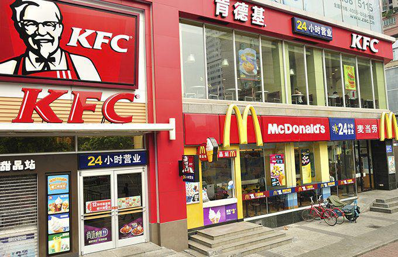

In today's culinary landscape, the terms 'fast-food' and 'fast-casual' are often used when discussing the dining options available to consumers. While both types of establishments offer quick meals, they cater to different consumer needs and expectations. Fast-food restaurants are typically characterized by their emphasis on speed and affordability, with a focus on standardized menus that promise consistent taste and experience across various locations. Well-known fast-food chains like McDonald's, KFC, and Taco Bell have established a global presence by leveraging these qualities.

On the other hand, fast-casual eateries aim to provide a more upscale dining experience by focusing on higher-quality ingredients, more customization options, and a generally more inviting atmosphere. Restaurants such as Chipotle and Panera Bread have carved out their niche by appealing to health-conscious diners and those seeking a more customized dining experience without the formality of full-service restaurants.



This article explores the differences between fast-food and fast-casual eateries, analyzing their growth, consumer behavior, and market strategies. The burgeoning popularity of fast-casual dining suggests a shift in consumer preferences towards quality and customization, which are becoming increasingly important in the decision-making process. Furthermore, we draw parallels with the world of algorithmic trading to highlight how technological advancements and evolving consumer preferences are reshaping industries. Algorithmic trading in financial markets, much like the fast-casual trend in dining, is a response to consumer demands for efficiency and innovation, leading to transformative changes in established practices. This phenomenon underlines the broader impact of technology and consumer needs in driving industry evolution.

## Table of Contents

## Defining Fast-Food and Fast-Casual Restaurants

Fast-food restaurants are a staple in the global dining industry, recognized for their rapid service, uniform menus, and cost-effective options. These establishments capitalize on a business model designed to serve large volumes of customers efficiently, often resulting in lower prices compared to other dining categories. McDonald's, KFC, and Taco Bell are prominent examples of fast-food chains that have established an extensive international presence. Their success can be attributed to consistent branding, operational efficiency, and strategic market positioning, all of which contribute to their ability to deliver food quickly and economically.

In contrast, fast-casual restaurants bridge the gap between traditional fast-food outlets and full-service dining experiences. They provide a dining environment perceived as more upscale without compromising on speed. Establishments such as Chipotle and Panera Bread exemplify the fast-casual sector by emphasizing high-quality ingredients and offering customization options. This model caters to a growing demographic of consumers who value fresh, organic, and diverse food options. The ability to tailor meals to individual preferences is a distinctive feature of fast-casual restaurants, setting them apart from the rigid offerings typical of fast-food venues.

Fast-casual dining initiatives often prioritize the use of fresher ingredients by minimizing processed components and showcasing transparency in food sourcing. This approach aligns with contemporary consumer trends favoring healthier lifestyles, thus capturing a market segment willing to pay a premium for perceived quality and ethical standards. Consequently, fast-casual restaurants position themselves competitively against traditional fast-food chains by focusing on a holistic dining experience that combines convenience with culinary excellence.

## Market Growth and Consumer Preferences

Fast-casual restaurants have experienced significant growth in recent years, outpacing the expansion of traditional fast-food chains. This trend is largely driven by a growing demographic of health-conscious consumers who prioritize menus featuring organic and fresh ingredients. These consumers are increasingly concerned with nutritional value and food sourcing, and fast-casual restaurants have effectively capitalized on this shift in preference.

Data from market research indicates that consumers, particularly millennials and Generation Z, are gravitating towards establishments that offer transparency in their ingredient sourcing and nutritional information. A survey by the NPD Group found that fast-casual restaurants experienced a 10% growth in traffic over a year, compared to a modest 1% growth for traditional fast-food outlets. This disparity highlights the strong consumer demand for healthier, more sustainable dining options.

Urban areas, known for diverse and trendsetting culinary cultures, have been at the forefront of this shift. Cities like New York, Los Angeles, and Chicago are seeing a proliferation of fast-casual brands that focus on customization, allowing consumers to tailor meals to their dietary preferences. For instance, restaurants such as Sweetgreen and Dig Inn offer salads and bowls that can be customized with a variety of locally sourced ingredients, appealing to consumers seeking fresh, healthful options.

Interestingly, suburban areas are also witnessing a similar trend, albeit influenced by slightly different factors. Suburban consumers, typically families and professionals seeking quick yet nutritious meal options, find the blend of convenience and quality offered by fast-casual restaurants particularly appealing. The growth in these areas reflects broader accessibility to and acceptance of fast-casual dining as a viable alternative to traditional fast-food meals.

Overall, the rise of fast-casual dining underscores a significant evolution in consumer behavior, with an evident preference for dining experiences that align with personal values regarding health, sustainability, and food integrity. The ongoing success and market expansion of fast-casual restaurants demonstrate the importance of adapting to these evolving consumer preferences in order to maintain competitive advantage in the food service industry.

## Algorithmic Trading: A Parallel in Industry Transformation

Algorithmic trading has transformed the financial landscape by incorporating automation and data analysis into investment strategies. This form of trading utilizes complex algorithms to evaluate and execute trades at speeds and frequencies impossible for a human trader, impacting markets significantly by improving efficiency and [liquidity](/wiki/liquidity-risk-premium).

Much like the fast-casual dining sector's challenge to the fast-food industry, [algorithmic trading](/wiki/algorithmic-trading) is reshaping traditional investment methodologies by prioritizing speed and precision. Both sectors harness technology to improve their respective processes; fast-casual restaurants use it for enhanced service and customized offerings, while algorithmic trading applies it for swift and accurate market movements.

At the core of algorithmic trading is the ability to process immense data volumes to identify market patterns and opportunities in real-time. By leveraging statistical models and quantitative analysis, algorithms can predict price movements and make trades based on predefined criteria without human intervention. A simple example might include a moving average crossover strategy, where the algorithm buys if a short-term moving average surpasses a long-term average, and sells in the opposite scenario.

Consider the basic Python code implementing this strategy:

```python
def moving_average(data, window_size):
    cumsum = [0]
    moving_averages = []

    for i, x in enumerate(data, 1):
        cumsum.append(cumsum[i-1] + x)
        if i >= window_size:
            moving_average = (cumsum[i] - cumsum[i-window_size]) / window_size
            moving_averages.append(moving_average)

    return moving_averages

# Example usage
prices = [110, 113, 115, 110, 108, 112, 115, 119]
short_term = moving_average(prices, 3)
long_term = moving_average(prices, 5)

# Trading Decision: Buy if short-term average > long-term average
if short_term[-1] > long_term[-1]:
    decision = "Buy"
else:
    decision = "Sell"
```

The rise of algorithmic trading can be attributed to its advantages over manual trading practices. It reduces transaction costs, minimizes the impact of emotional decision-making, and accesses multiple markets simultaneously, offering a competitive edge. Moreover, it parallels fast-casual's market disruption by addressing consumer demand for more sophisticated and personalized solutions.

Overall, the integration of technology in both fast-casual dining and algorithmic trading signifies a broader industry trend: the insatiable drive towards innovation and efficiency. By understanding these technological impacts, businesses across various fields can anticipate shifts in consumer behavior and adapt their strategies accordingly.

## Comparative Analysis: Success Metrics and Strategies

Success in the fast-casual restaurant sector is largely driven by an emphasis on quality, consumer engagement, and the integration of technology. Consumers increasingly seek out dining experiences that offer superior ingredients and customizable options, driving fast-casual establishments to focus on higher quality. This trend is mirrored in the use of technology to enhance the dining experience, from online ordering systems to personalized marketing strategies that engage consumers through digital channels.

In comparison, algorithmic traders rely heavily on speed, precision, and the strategic use of data. Technology plays a crucial role in algorithmic trading by enabling quick execution of trades and reducing the latency that human intervention can introduce. The focus on precision is underscored by complex algorithms that analyze vast amounts of data to identify optimal trading opportunities. The strategic use of data in algorithmic trading can be compared to how fast-casual restaurants employ customer data to tailor their offerings, thereby increasing consumer satisfaction and loyalty.

The alignment of these success metrics illustrates deeper insights into how industries adapt with technological advancements and changing consumer preferences. For example, both fast-casual restaurants and algorithmic trading platforms benefit from the integration of [machine learning](/wiki/machine-learning) and [artificial intelligence](/wiki/ai-artificial-intelligence). In the restaurant industry, AI can be used to predict consumer preferences and optimize menu offerings, much like algorithmic trading firms use these technologies to refine trading strategies and improve outcomes.

As Python is commonly used in both sectors, consider a basic example of how it might be used in algorithmic trading:

```python
import numpy as np
import pandas as pd
import matplotlib.pyplot as plt

# Generate random stock prices
np.random.seed(42)
dates = pd.date_range('20230101', periods=100)
stock_prices = pd.DataFrame(np.random.randn(100, 1), index=dates, columns=['Price'])

# Calculate moving averages
stock_prices['MA10'] = stock_prices['Price'].rolling(window=10).mean()
stock_prices['MA50'] = stock_prices['Price'].rolling(window=50).mean()

# Plot
plt.figure(figsize=(14, 7))
plt.plot(stock_prices['Price'], label='Stock Price')
plt.plot(stock_prices['MA10'], label='10-Day MA')
plt.plot(stock_prices['MA50'], label='50-Day MA')
plt.title('Stock Prices with Moving Averages')
plt.legend()
plt.show()
```

This Python snippet illustrates the use of rolling windows to calculate moving averages, a common technique in algorithmic trading for identifying trends. Just as algorithmic traders leverage data to optimize their strategies, fast-casual restaurants analyze consumer feedback and sales data to refine their offerings, demonstrating how both industries evolve through the strategic use of technology and data analysis.

## Conclusion

The fast-casual and fast-food sectors showcase how consumer demand for quality and convenience can drive transformative changes in the dining industry. As consumers increasingly seek out healthier, customizable, and higher-quality options, fast-casual restaurants have emerged as a formidable competitor to traditional fast-food establishments. This trend underscores the importance of aligning business models with evolving consumer preferences to remain competitive and relevant.

Similarly, the field of algorithmic trading illustrates the profound impact of technological advancements on long-standing industry practices. By employing algorithms for efficient and rapid trade execution, algorithmic trading has disrupted conventional investment methods, offering a modern solution to the complexities of financial markets. This shift highlights the potential for technology to enhance efficiency and decision-making, providing new opportunities for innovation and growth in finance.

Recognizing the parallels between these two industries offers valuable insights for businesses across various sectors. By understanding the synergy between consumer demand and technological innovation, companies can devise strategies that harness these dynamics to drive success. Whether in the dining scene or financial markets, adapting to change and leveraging technology can lead to significant advantages and sustainable growth in a fast-evolving economic landscape.

## References & Further Reading

[1]: ["Fast Food Nation: The Dark Side of the All-American Meal"](https://www.amazon.com/Fast-Food-Nation-Dark-All-American/dp/0547750331) by Eric Schlosser

[2]: Euromonitor International. (2019). ["Global Foodservice: Trends Impacting the Industry."](https://www.euromonitor.com/insights/consumer-foodservice)

[3]: Hill, H. E. (2021). ["Fast-Casual Restaurants: Growth, Food Safety, and Consumer Behavior."](https://www.researchgate.net/publication/349973318_Factors_Influencing_Customer_Satisfaction_and_Behavioral_Intention_for_Fast-Casual_Restaurants_A_Case_Study_in_a_Shopping_Center_Bangkok) Journal of Hospitality & Tourism Research.

[4]: Lopez de Prado, M. (2018). ["Advances in Financial Machine Learning"](https://www.amazon.com/Advances-Financial-Machine-Learning-Marcos/dp/1119482089) by Marcos Lopez de Prado

[5]: Gans, J. S. (2016). ["The Disruption Dilemma"](https://mitpress.mit.edu/9780262533621/the-disruption-dilemma/) by Joshua Gans

[6]: ["Global Fast Food Market Growth Report"](https://www.grandviewresearch.com/industry-analysis/fast-food-market) by Statista

[7]: ["Machine Learning for Algorithmic Trading"](https://github.com/stefan-jansen/machine-learning-for-trading) by Stefan Jansen

[8]: McKinsey & Company. (2020). ["The Next Normal: Retail’s New Front Lines"](https://www.mckinsey.com/featured-insights/the-next-normal/business-in-2020-and-beyond)

[9]: ["Quantitative Trading: How to Build Your Own Algorithmic Trading Business"](https://www.amazon.com/Quantitative-Trading-Build-Algorithmic-Business/dp/1119800064) by Ernest P. Chan