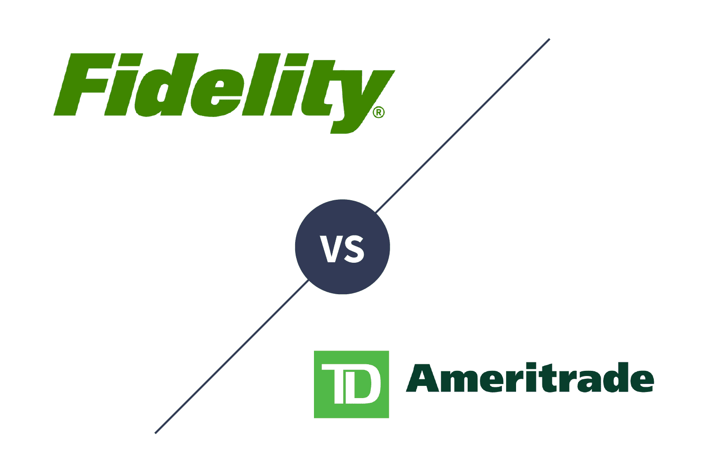

In the digital age, investment platforms have fundamentally transformed the trading landscape by providing extensive tools and resources tailored for investors at every level of expertise. Fidelity and TD Ameritrade emerge as prominent leaders among these platforms, each offering distinct advantages that cater to diverse trading needs. This article focuses on the benefits and features of Fidelity and TD Ameritrade, particularly their offerings in algorithmic trading—a domain that has increasingly influenced how traders strategize and execute transactions.

Algorithmic trading, often referred to as algo trading, involves the use of automated and complex mathematical models to make high-speed trading decisions. By leveraging cutting-edge technology, these platforms enable traders to deploy algorithms that can optimize trading strategies to potentially enhance returns.

Fidelity and TD Ameritrade have effectively incorporated advanced algorithmic tools into their ecosystems, providing both novice and seasoned traders the opportunity to refine their strategies with precision. Fidelity is recognized for its extensive research tools and user-friendly interfaces, making it a robust option for those interested in sophisticated trading methodologies. Conversely, TD Ameritrade's thinkorswim platform offers unparalleled capabilities for building and executing complex algorithms, appealing to active traders seeking innovative solutions.

Selecting the right platform is crucial for those engaged in algorithmic trading as it directly influences the effectiveness and potential outcomes of trading strategies. As technology continues to evolve, Fidelity and TD Ameritrade remain at the forefront, empowering traders to harness the full potential of algorithmic trading to achieve their investment objectives. This article will delve into how each platform leverages technology to enhance trading processes and why this choice is instrumental to traders striving for success in modern financial markets.

## Table of Contents

## Overview of Fidelity Investment Platform

Fidelity Investments stands out in the financial services industry as a leading platform offering comprehensive investment options and robust support for traders at every level. It provides a diverse array of financial products, including stocks, bonds, mutual funds, and exchange-traded funds (ETFs) designed to accommodate a wide range of investment strategies and objectives. This extensive selection allows investors to construct well-diversified portfolios that align with their individual risk tolerances and time horizons.

One of the hallmarks of Fidelity is its dedication to delivering high-quality research tools and educational resources. These offerings are instrumental in helping investors make informed decisions. The platform's research amenities include advanced screening tools, in-depth analyst reports, and real-time market data. These features equip users with the necessary insights to evaluate potential investments effectively.

Fidelity also takes pride in providing a user-friendly interface, enhancing the overall trading experience for its clientele. The platform is designed to be both intuitive and accessible, ensuring that investors, regardless of their experience level, can navigate the service effortlessly. The streamlined interface facilitates easy access to account management, trading, and analytical tools, creating a seamless user experience.

For those interested in [algorithmic trading](/wiki/algorithmic-trading), Fidelity offers sophisticated capabilities that support both novice and experienced investors. It provides a suite of advanced tools, including charting features, [backtesting](/wiki/backtesting) functionalities, and robust strategy-building interfaces, enabling traders to refine and automate their trading models. Fidelity's API further enhances these offerings by allowing traders to integrate custom algorithms and tailor their trading approaches. The platform remains committed to maintaining secure and reliable systems, ensuring that automated trading operations are executed efficiently and without interruption.

The distinguishing features of Fidelity make it a top choice for investors seeking a dependable and technologically-advanced platform for trading and investing. By combining a comprehensive range of investment products with cutting-edge tools and resources, Fidelity empowers traders to achieve their investment objectives efficiently and effectively.

## Features of TD Ameritrade Investment Platform

TD Ameritrade offers a comprehensive investment platform known for integrating innovation and expertise in financial markets. This platform stands out by providing users with access to a wide array of investment options, ensuring that traders can diversify their portfolios according to personal goals and risk tolerance. The diverse range of financial products on offer includes stocks, bonds, mutual funds, options, futures, and exchange-traded funds (ETFs), making it suitable for both conservative and aggressive trading strategies.

One of the most significant advantages of the TD Ameritrade platform is its advanced trading tool, thinkorswim. This platform is favored by active traders for its powerful capabilities in building and executing complex trading algorithms. Thinkorswim allows traders to tailor their strategies with features such as advanced charting tools, technical indicators, and customizable trading templates. For algorithm creators, thinkScript, the proprietary scripting language, enables the design and testing of trading scripts within the platform, fostering innovation and precision in trading strategies.

Algorithmic trading is further enhanced by TD Ameritrade’s robust support and resources. The platform offers extensive educational content and resources through the "Education" tab, where users can access a variety of learning materials, including webinars, articles, and tutorials. These resources are designed to improve user understanding of both basic and advanced trading concepts, empowering traders to optimize their trading strategies effectively.

Moreover, TD Ameritrade’s support extends to its dedicated client service teams, which are equipped to assist traders with queries and technical support needs. For traders practicing or testing new strategies, the paperMoney feature provides a virtual trading environment, allowing users to experiment with algorithmic strategies without financial risk.

The platform’s integration with third-party algorithms offers further flexibility, enabling traders to incorporate external algorithms into their trading activities seamlessly. This allows for greater adaptability and customization, catering to various trading styles and preferences.

In summary, TD Ameritrade’s investment platform combines extensive access to investment options, advanced trading tools, and innovative algorithmic capabilities with comprehensive support and educational resources. These features make it a preferred choice among traders looking to optimize their strategies and enhance their trading performance.

## Algorithmic Trading Capabilities of Fidelity

Fidelity's algorithmic trading capabilities empower investors by offering tools for automation and optimization of trading activities. One of the standout features is the availability of advanced charting tools that aid in the detailed analysis of market trends, enabling traders to make informed decisions. The platform provides backtesting capabilities that allow investors to test trading strategies against historical data. This functionality is crucial in assessing the potential effectiveness of a strategy before its implementation in live trading.

Fidelity offers strategy-building features that cater to both novice and experienced traders. These features enable users to construct and refine trading models according to their specific investment philosophies and market expectations. By utilizing these tools, traders can enhance their strategies and increase the likelihood of achieving desired financial outcomes.

The integration of Fidelity's API (Application Programming Interface) allows for seamless incorporation of personalized algorithms into the trading environment. This API supports the automation of trading processes, thereby reducing manual intervention and increasing efficiency. The API's flexibility facilitates the development of customized trading solutions tailored to individual investor needs.

Security and reliability are paramount at Fidelity, ensuring that automated trading systems function as expected in real-time market conditions. The platform employs stringent security measures and robust infrastructure to safeguard investor data and trading activities. This focus on reliability ensures traders that their automated systems will perform consistently.

Additionally, Fidelity provides ample support and guidance for investors seeking to enhance their algorithmic trading capabilities. Educational resources, tutorials, and customer support services are available to assist traders in navigating the complexities of algorithmic trading. This support system is instrumental in helping investors optimize their trading strategies and improve their overall trading performance.

## Exploring TD Ameritrade's Algorithm Trading Tools

TD Ameritrade offers advanced algorithmic trading tools primarily through its thinkorswim platform, which has become well-regarded for its powerful and versatile features. At the core of its appeal is the ability to utilize real-time data and customizable alerts, essential components for developing and testing trading strategies.

Thinkorswim enables traders to harness sophisticated scripting capabilities through its proprietary scripting language, thinkScript®. This language provides the flexibility to create custom indicators, strategies, and alerts. For instance, traders can script conditions to trigger alerts based on specific price levels or technical indicators, allowing for real-time monitoring and automated response to market changes.

Another important feature of TD Ameritrade's offering is paperMoney®, a simulated trading environment. This tool allows users to practice algorithmic trading strategies without financial risk, simulating real-time market conditions. Such practice facilities are invaluable for refining trading strategies and gaining confidence before deploying them in real markets.

Furthermore, TD Ameritrade offers integration with third-party algorithms, granting traders access to a broader ecosystem of trading systems. This integration intersects with various Application Programming Interfaces (APIs) that facilitate connections with external systems, enhancing the flexibility and innovation available to traders within the platform.

These robust features make TD Ameritrade a favored choice among active algorithmic traders. The seamless combination of real-time data, customizable scripting, and practice opportunities ensures that traders can fully capitalize on algorithmic trading's potential, enabling precise and informed trading decisions.

## Comparing Fidelity and TD Ameritrade for Algo Trading

Both Fidelity and TD Ameritrade provide comprehensive support for algorithmic trading, yet each has distinct features that cater to different types of traders. In this comparison, we examine various aspects such as user experience, tools, resources, cost structures, and how each platform aligns with different trading objectives.

**User Experience, Tools, and Resources**

Fidelity boasts a highly user-friendly interface, geared towards delivering an intuitive experience for both novice and experienced algorithm creators. Fidelity’s Active Trader Pro platform offers advanced charting tools, real-time analytics, and premium research options that enhance the user experience. Additionally, Fidelity's API provides seamless integration for personalized algorithmic solutions, enabling traders to automate and optimize their trading strategies efficiently.

On the other hand, TD Ameritrade's thinkorswim platform is renowned for its sophisticated trading capabilities. It offers a rich set of resources including backtesting functionalities, real-time data flows, and a robust scripting language called thinkScript, which allows users to build and customize complex algorithms. The paperMoney feature stands out by offering a virtual trading environment for practitioners to hone their strategies without financial risk.

**Cost Structures and Fees**

When it comes to cost structures, Fidelity offers $0 commission for U.S. stock trades, with additional fees applicable for options trading and other specific services. Its competitive pricing is appealing for traders focused on minimizing operational costs.

TD Ameritrade also provides $0 commissions for online equity trades, maintaining a similar fee structure with additional charges for options per contract. Both platforms offer competitive pricing, yet the nuances in service fees and margin rates may influence the choice depending on a trader's specific requirements.

**Alignment with Trading Objectives**

For day traders and those interested in high-frequency trading, TD Ameritrade, with its thinkorswim platform, offers advanced real-time data and robust tools for technical analysis, positioning it as a preferred option for active traders seeking intricate control over their trading strategies.

Conversely, Fidelity’s platform can be advantageous for traders focused on long-term investments. Its comprehensive research tools and educational resources provide a solid foundation for developing strategic algorithms that align with gradual, long-term market trends.

**Conclusion**

Ultimately, the best platform for algorithmic trading depends on individual requirements and trading styles. Fidelity’s strength lies in its user-centric design and integration capabilities, making it suitable for both beginners and those focused on long-term strategies. TD Ameritrade, with its potent thinkorswim platform, appeals to active traders who demand advanced customization and direct market access. Evaluating specific needs and trading objectives is crucial in selecting the platform that aligns best with your algorithmic trading goals.

## Conclusion

In the evolving landscape of trading, algorithmic platforms like Fidelity and TD Ameritrade play pivotal roles in shaping how investors approach the market. These platforms provide a vast range of innovative tools and reliable resources that cater to traders' varying needs, enhancing the ability to devise and execute successful trading strategies. As investors consider which platform to use, it is crucial to align the platform's capabilities with their individual trading goals and preferences. Factors such as user experience, tool sophistication, and cost structures should influence this decision, ensuring that the chosen platform optimally supports their algorithmic trading ambitions.

Algorithmic trading holds immense potential to revolutionize investment outcomes in today's markets. By automating the trading process, algorithms can execute strategies with precision and speed that would be unachievable manually. This technology enables traders to capitalize on fleeting market opportunities, manage risk more effectively, and potentially enhance returns. As markets become increasingly complex, algorithmic trading offers a level of adaptability and efficiency that can significantly benefit modern investors.

For those new to algorithmic trading, both Fidelity and TD Ameritrade offer platforms with educational resources and support to help navigate this advanced trading approach. By exploring these platforms, investors can begin their journey into algorithmic trading, leveraging technology to transform their investment strategies and achieve their financial objectives. As the trading industry continues to evolve, embracing algorithmic tools and platforms will be crucial for those looking to stay ahead and maximize their market performance.

## References & Further Reading

[1]: Bergstra, J., Bardenet, R., Bengio, Y., & Kégl, B. (2011). ["Algorithms for Hyper-Parameter Optimization."](https://papers.nips.cc/paper/4443-algorithms-for-hyper-parameter-optimization) Advances in Neural Information Processing Systems 24.

[2]: ["Advances in Financial Machine Learning"](https://www.amazon.com/Advances-Financial-Machine-Learning-Marcos/dp/1119482089) by Marcos Lopez de Prado

[3]: ["Evidence-Based Technical Analysis: Applying the Scientific Method and Statistical Inference to Trading Signals"](https://www.amazon.com/Evidence-Based-Technical-Analysis-Scientific-Statistical/dp/0470008741) by David Aronson

[4]: ["Machine Learning for Algorithmic Trading"](https://github.com/stefan-jansen/machine-learning-for-trading) by Stefan Jansen

[5]: ["Quantitative Trading: How to Build Your Own Algorithmic Trading Business"](https://www.amazon.com/Quantitative-Trading-Build-Algorithmic-Business/dp/1119800064) by Ernest P. Chan