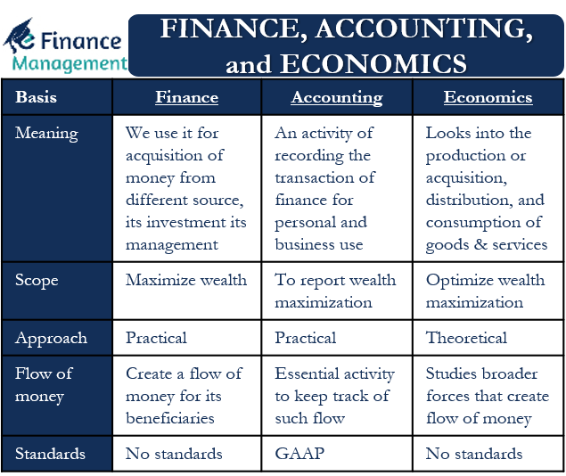

## Table of Contents

## What is finance and how does it differ from economics?

Finance is about managing money. It includes things like saving, investing, borrowing, and spending. People, businesses, and governments all use finance to make decisions about their money. For example, a person might use finance to decide how to save for retirement, while a business might use it to figure out how to fund a new project.

Economics, on the other hand, is a broader field that looks at how societies use resources. It studies things like production, distribution, and consumption of goods and services. Economics tries to understand how people make choices and how these choices affect the overall economy. While finance focuses on the management of money, economics looks at the bigger picture of how economies work and how different factors influence them.

## What are the main goals of studying finance versus economics?

The main goal of studying finance is to learn how to manage money well. This includes understanding how to save, invest, and borrow money in a way that helps individuals, businesses, and governments reach their financial goals. For example, someone studying finance might want to learn how to make smart investment choices to grow their wealth or how a company can use financial strategies to increase its profits.

The main goal of studying economics is to understand how societies use their resources. This involves learning about how goods and services are produced, distributed, and consumed. Economics helps people understand big issues like unemployment, inflation, and economic growth. By studying economics, someone might aim to figure out how government policies can improve the economy or how global trade affects different countries.

## How do finance and economics interact in the real world?

Finance and economics work together a lot in the real world. When a business wants to grow, it might need to borrow money. This is a finance decision. But how easy it is to borrow that money can depend on the overall economy, which is something economists study. If the economy is doing well, banks might be more willing to lend money. If the economy is not doing well, it might be harder to get a loan. So, finance decisions can be affected by what's happening in the economy.

Economics also helps us understand how finance works. For example, when people save money in a bank, the bank can use that money to give loans to others. This is part of finance. But if lots of people start saving more and spending less, it can slow down the economy. Economists study these kinds of patterns to help predict what might happen next. So, what people do with their money in finance can have big effects on the economy, and economists try to make sense of it all.

## What are the key concepts in finance that are not typically covered in economics?

In finance, one key concept that isn't usually covered in economics is personal financial planning. This includes things like budgeting, saving for retirement, and managing debt. When you study finance, you learn how to make a plan for your money so you can reach your goals, like buying a house or saving for your kids' education. Economics might talk about how people save and spend money in general, but it doesn't go into the details of how to make a personal budget or choose the best retirement plan for you.

Another important concept in finance is investment analysis. This is all about figuring out which investments, like stocks or bonds, are good choices. In finance, you learn how to look at a company's financial statements and decide if it's a good investment. You also learn about different ways to spread out your investments so you don't lose all your money if one investment does badly. Economics might talk about how investments affect the economy, but it doesn't usually cover the nitty-gritty of how to pick the right stocks or bonds for your portfolio.

Lastly, corporate finance is a big part of finance that you don't typically see in economics. This involves how businesses manage their money, like deciding whether to take out a loan or issue new stock to fund a new project. In finance, you learn how to analyze these choices to see which one is best for the company's growth and profitability. Economics might look at how these decisions affect the overall economy, but it doesn't dive into the details of how a company should manage its cash flow or decide on the best way to finance its operations.

## What are the fundamental theories in economics that are less emphasized in finance?

One big idea in economics that you don't hear much about in finance is the theory of supply and demand. This theory explains how the price of things like apples or cars is decided by how many people want them and how many are available. If lots of people want apples but there aren't many to go around, the price goes up. If there are too many apples and not enough people want them, the price goes down. Finance might talk about prices and how they affect investments, but it doesn't focus on the big picture of how prices are set across the whole economy.

Another important theory in economics is macroeconomics, which looks at the whole economy instead of just individual businesses or people. Macroeconomics studies things like inflation, unemployment, and how much money is moving around in the economy. Economists use these ideas to figure out if the economy is doing well or if it needs help. In finance, you might learn about how inflation affects your investments, but you won't spend as much time learning about what causes inflation or how to fix it if it gets too high.

Lastly, the concept of economic growth is a big deal in economics but less so in finance. Economic growth is about how fast the whole economy is getting bigger, usually measured by how much more stuff people are making and buying each year. Economists study what helps or hurts this growth, like new technology or changes in laws. In finance, you might care about economic growth because it can affect your investments, but you won't dig into the details of what makes the whole economy grow or shrink.

## How do financial markets function and what role does economics play in them?

Financial markets are places where people buy and sell things like stocks, bonds, and other investments. They help people and businesses get money they need by connecting those who have extra money with those who need it. For example, if a company wants to grow, it can sell stocks to raise money. People who buy these stocks hope the company will do well and the value of their stocks will go up. Financial markets also help set prices for these investments based on what people think they're worth. If lots of people want to buy a stock, its price goes up. If fewer people want it, the price goes down.

Economics plays a big role in financial markets because it helps explain why things happen the way they do. For example, if the economy is doing well, people might feel more confident about buying stocks, which can push prices up. On the other hand, if there's a lot of unemployment or if prices are rising too fast (which economists call inflation), people might be more worried about the future and less likely to invest. Economists also study how government policies, like changing interest rates, can affect financial markets. If the government makes borrowing money cheaper, more people might take out loans to invest, which can change how the markets work. So, understanding economics helps us see the bigger picture of what's going on in financial markets.

## What are the different career paths in finance and economics and how do they differ?

In finance, there are many different jobs you can do. You might work as a financial analyst, helping companies figure out how to use their money best. Or you could be a personal financial advisor, helping people plan their money so they can save for things like retirement or buying a house. Another job in finance is being an investment banker, where you help companies raise money by selling stocks or bonds. There are also jobs like accountants, who keep track of a company's money, and traders, who buy and sell investments to make money for their clients. All these jobs focus on managing and making decisions about money.

In economics, the career paths are a bit different. You could be an economist, studying how the whole economy works and trying to understand big issues like unemployment or inflation. Economists often work for the government or at universities, doing research and giving advice on economic policy. Another job is a policy analyst, where you help make rules and laws that affect the economy. You might also work as a market researcher, looking at how people spend their money and what they buy. These jobs focus more on understanding the big picture of how economies work and how to make them better, rather than managing money directly like in finance.

The main difference between careers in finance and economics is that finance jobs are more about managing money and making decisions for businesses or individuals, while economics jobs are more about understanding and improving the overall economy. Both fields are important and can sometimes overlap, but they have different focuses and require different skills.

## How do macroeconomic policies affect financial decision-making?

Macroeconomic policies, like those set by governments or central banks, can really change how people and businesses make financial decisions. For example, if the central bank decides to lower interest rates, it becomes cheaper to borrow money. This might make people more likely to take out loans for things like buying a house or starting a business. Companies might also decide to borrow more to grow or invest in new projects. On the other hand, if interest rates go up, borrowing becomes more expensive, and people might choose to save more instead of spending or investing.

Another way macroeconomic policies affect financial decisions is through government spending and taxes. If the government decides to spend more money on things like building roads or schools, it can boost the economy and make people feel more confident about their financial future. This might lead them to spend more or invest in the stock market. If the government raises taxes, people might have less money to spend or save, which could make them more cautious with their financial choices. So, these big economic policies can have a big impact on how people and businesses handle their money.

## What are the advanced mathematical tools used in finance that are also relevant in economics?

In both finance and economics, people use a lot of math to understand how money and the economy work. One important tool is calculus, which helps us figure out how things change over time. For example, in finance, calculus can be used to find the best time to buy or sell an investment by looking at how its value changes. In economics, it's used to study how things like prices or the amount of goods people want change as other things in the economy change.

Another tool that's really helpful is statistics. This helps us make sense of data and see patterns. In finance, statistics are used to predict how investments might do in the future by looking at past data. In economics, statistics help us understand big trends, like how unemployment or inflation rates change over time. Both fields use these numbers to make better guesses about what might happen next.

Linear algebra is also a key tool in both finance and economics. It helps with solving big sets of equations at once, which is useful for things like figuring out how different parts of the economy affect each other or how to spread out investments to reduce risk. By using linear algebra, people in finance can create models to see how different investments work together, while economists can use it to study how changes in one part of the economy, like interest rates, might affect other parts.

## How do behavioral economics principles influence financial markets and decisions?

Behavioral economics looks at how people's feelings and thoughts can affect their money choices. In financial markets, this means that people don't always make perfect decisions based on numbers alone. For example, if everyone is excited about a new company, they might buy its stocks even if the price is too high. This can create bubbles where prices go up a lot and then suddenly drop when people realize the price was too high. Also, people might be scared to lose money, so they hold onto losing investments too long, hoping they'll get better instead of selling and moving on.

These behaviors can make financial markets less predictable. Economists and financial experts use what they know about how people think to try to guess what might happen next in the markets. For instance, if people are feeling hopeful about the economy, they might spend and invest more, which can push up prices. But if they're worried, they might save more and spend less, which can slow down the economy. Understanding these patterns helps people in finance make better plans and helps economists come up with ways to keep the economy stable.

## What are the current trends in finance and economics research?

In finance, one big trend is looking into how new technology like artificial intelligence and blockchain can change the way money is handled. People are using AI to make better guesses about the stock market and to help with things like picking the best investments. Blockchain, which is the tech behind things like Bitcoin, is being studied to see if it can make buying and selling things safer and easier without needing banks or other middlemen. Another trend is figuring out how to make money choices that are good for the environment, like investing in companies that help fight climate change. This is called sustainable finance, and it's becoming more important as people care more about the planet.

In economics, researchers are really interested in understanding how the world's economy is becoming more connected. They're looking at how things like trade deals and international money movements affect different countries. Another big area is studying how inequality is growing and what can be done about it. Economists are trying to find out why some people are getting richer while others are not, and what policies could help make things more fair. There's also a lot of work on how new technology is changing jobs and the economy, like how robots and computers might take over some jobs, and what that means for workers and the economy as a whole.

## How do global economic events impact financial strategies and economic policies?

Global economic events, like a big country changing its money policies or a worldwide health crisis, can really shake things up for financial strategies and economic policies. When something big happens, like a country's central bank deciding to change interest rates, it can affect how much it costs to borrow money all over the world. If borrowing gets cheaper, more people and businesses might take out loans to spend or invest, which can change how they plan their money. On the other hand, if borrowing gets more expensive, people might save more and spend less, leading to different financial strategies focused on saving rather than spending.

These events also push governments and central banks to change their economic policies. For example, if there's a global economic downturn, like during a recession, governments might decide to spend more money on things like building roads or helping people who lost their jobs. This is to help get the economy moving again. At the same time, central banks might lower interest rates to make it easier for everyone to borrow and spend, hoping to boost the economy. So, global economic events can lead to big shifts in how countries manage their money and plan for the future.

## How can one manage money and investments effectively in the realm of finance?

Finance is a discipline that derives from economics, focusing on the management, creation, and study of money, banking, credit, and investments. The field encompasses three primary categories: public finance, corporate finance, and personal finance.

Public finance involves the management of a country's revenue, expenditures, and debt load through various government and quasi-government institutions. Key aspects of public finance include fiscal policy, government budgets, taxation, and public expenditure. Governments leverage public finance mechanisms to stimulate economic growth, distribute resources, and stabilize the economy.

Corporate finance, on the other hand, is concerned with the financial activities related to running a corporation. Its primary goal is to maximize shareholder value through long-term and short-term financial planning and the implementation of various strategies. Fundamental topics within corporate finance include capital structure, funding sources, investment decisions, and valuation. Techniques such as net present value (NPV) and internal rate of return (IRR) are commonly used to evaluate potential investment opportunities.

Personal finance refers to the management of an individual's or a family's financial decisions, including budgeting, savings, investments, retirement planning, and estate planning. It emphasizes the importance of setting financial goals, managing debt, and planning for unforeseen expenses.

Key concepts in finance like the time value of money (TVM) and risk management are pivotal in making informed financial decisions. The time value of money is a core principle in finance; it implies that a unit of currency today is worth more than the same amount in the future due to its potential [earning](/wiki/earning-announcement) capacity. This principle is typically expressed through present value (PV) and future value (FV) calculations, using the formula:

$$

FV = PV \times (1 + r)^n 
$$

where $FV$ is the future value, $PV$ is the present value, $r$ is the interest rate, and $n$ is the number of periods.

Risk management in finance involves identifying, assessing, and prioritizing risks followed by the application of resources to minimize, control, or eliminate the probability or impact of unfortunate events. This can include various forms of insurance, diversification of assets, and hedging strategies.

While finance is an applied field, dealing with real-world financial systems, it provides essential tools and insights for understanding and leveraging markets effectively. It bridges the gap between theoretical economic principles and their practical applications in real-world financial scenarios, enabling individuals, corporations, and governments to optimize their financial resources efficiently.

## How do Finance, Economics, and Algorithmic Trading compare?

Finance and economics are often interconnected but differ in their approaches and focus areas. Finance, primarily concerned with money management, relies on the principles and theories of economics to implement practical investment strategies. Economics, as a broader field, examines resource allocation, production, and consumption, offering insights into market dynamics and policy effects.

Economics aids finance by providing a comprehensive understanding of market trends and macroeconomic phenomena. For instance, the analysis of inflation rates, unemployment data, and GDP growth helps financial experts anticipate shifts in market conditions and make educated investment decisions. Investors use such economic insights to forecast asset performance and assess risk factors. An economic indicator, like the Consumer Price Index (CPI), can assist financial analysts in determining the real [interest rate](/wiki/interest-rate-trading-strategies) using the formula:

$$
\text{Real Interest Rate} = \text{Nominal Interest Rate} - \text{Inflation Rate}
$$

Algorithmic trading incorporates these insights, enhancing them with technology for higher precision and efficiency. By employing computer algorithms, this form of trading automates decision-making processes based on predefined criteria derived from both financial analyses and economic theories. Algorithms are programmed to recognize patterns, such as the relationships between economic indicators and financial markets, to execute trades at optimal moments, minimizing the lag often associated with human intervention.

This integration exemplifies the convergence of finance, economics, and data analysis. In algorithmic trading, economic forecasts and finance-driven risk assessments are translated into mathematical models that drive automated trading strategies. Such strategies may include mean reversion or [momentum](/wiki/momentum) trading, where algorithms might use Python libraries like NumPy or pandas to process large datasets and backtest trading conditions efficiently.

Here is an example of a simple Python code snippet that might be used in an algorithmic trading strategy to calculate a moving average, a common technical indicator:

```python
import pandas as pd

# Assuming 'data' is a pandas DataFrame with a 'price' column
def calculate_moving_average(data, window_size=20):
    return data['price'].rolling(window=window_size).mean()

# Example usage
data = pd.DataFrame({'price': [100, 101, 102, 103, 104, 105, 106]})
moving_average = calculate_moving_average(data)
print(moving_average)
```

Algorithmic trading exemplifies how the precise application of financial insights and economic understanding can be enhanced by technological innovation. This synergy not only improves trade execution speed but also allows for more sophisticated risk management and strategy implementation. Consequently, the integration of these disciplines enables more informed and efficient market participation.

## References & Further Reading

[1]: Bergstra, J., Bardenet, R., Bengio, Y., & Kégl, B. (2011). ["Algorithms for Hyper-Parameter Optimization."](https://papers.nips.cc/paper/4443-algorithms-for-hyper-parameter-optimization) Advances in Neural Information Processing Systems 24.

[2]: ["Advances in Financial Machine Learning"](https://www.amazon.com/Advances-Financial-Machine-Learning-Marcos/dp/1119482089) by Marcos Lopez de Prado

[3]: ["Evidence-Based Technical Analysis: Applying the Scientific Method and Statistical Inference to Trading Signals"](https://www.amazon.com/Evidence-Based-Technical-Analysis-Scientific-Statistical/dp/0470008741) by David Aronson

[4]: ["Machine Learning for Algorithmic Trading"](https://github.com/stefan-jansen/machine-learning-for-trading) by Stefan Jansen

[5]: ["Quantitative Trading: How to Build Your Own Algorithmic Trading Business"](https://www.amazon.com/Quantitative-Trading-Build-Algorithmic-Business/dp/1119800064) by Ernest P. Chan