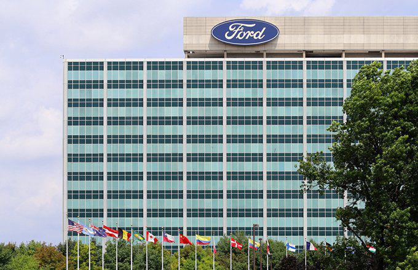

The automotive industry holds a pivotal role in the global economy, exemplifying both economic might and innovation. Dominating this landscape are two formidable entities, General Motors (GM) and Ford, whose vast legacies have been carved through their substantial presence in the U.S. market. These industry titans consistently adapt to shifting consumer preferences and technological advancements, maintaining relevance in a competitive arena.

A notable trend associated with these companies is algorithmic trading, more commonly referred to as algo trading. This technological innovation significantly impacts how their stocks are managed and traded within financial markets. Algo trading enables investors to execute trades based on complex algorithms that analyze market data at high speed, thereby facilitating more informed decision-making processes.

In this article, we will examine the dynamics propelling GM and Ford, focusing on their strategies for competitive positioning in a rapidly changing market. Additionally, we will assess the influence of algorithmic trading on their stock performance, providing insights into the intersection of automotive innovation and financial technology.

## Table of Contents

## Overview of General Motors and Ford

General Motors (GM) and Ford are prominent figures in the history of U.S. automobile manufacturing, each with a rich legacy of producing popular vehicles. Both companies have established a formidable presence in the automotive industry with a diverse lineup of models catering to various consumer preferences.

General Motors leads the U.S. market share with a range of brands, most notably Chevrolet and Cadillac. Chevrolet has become synonymous with reliable and affordable vehicles, offering models ranging from efficient sedans to robust trucks. Cadillac, GM's luxury division, has garnered attention for its innovative designs and advanced technology features, appealing to the premium market segment.

Ford, another cornerstone of American automotive history, is widely recognized for its iconic models such as the Mustang and its F-Series trucks. The Ford Mustang, an emblem of American muscle cars, continues to captivate car enthusiasts with its performance and style. The F-Series trucks, particularly the F-150, have long been top sellers, dominating the pickup truck market with their durability and versatility.

Both GM and Ford are actively pivoting toward electric vehicles (EVs) as they acknowledge the potential and consumer demand for greener technology. This strategic pivot is driven by environmental concerns, regulatory pressures, and the burgeoning market for sustainable transportation solutions. General Motors has announced ambitious plans to offer an entirely electric vehicle lineup by 2035, showcasing its commitment to sustainability. Ford, similarly, has made significant investments in electrifying its model range, including the introduction of the electric F-150 Lightning and the Mustang Mach-E.

The ability of these companies to innovate and adapt reinforces their continuous rivalry and significantly influences their market strategies and consumer appeal. As they invest in cutting-edge technology to enhance vehicle efficiency and autonomous driving capabilities, GM and Ford are shaping the future of automotive technology. Their focus on research and development ensures they remain competitive in an industry characterized by rapid technological advancements and shifting consumer preferences.

## Market Performance and Financial Health

An evaluation of recent financial data reveals General Motors (GM) as a strong performer in the automotive sector, marked by consistent revenue growth and increasing net income. According to GM's latest financial reports, the company experienced a revenue increase in the most recent fiscal year, driven by its strategic initiatives in cost management and advancing technological innovations. This upward trajectory in revenue aligns with their strategic focus on streamlining production processes and enhancing operational efficiency.

In contrast, Ford Motor Company, despite its reputation as a formidable competitor, has encountered challenges, particularly within its electric vehicle (EV) division. The push towards electrification has resulted in higher operational costs for Ford, impacting its profit margins. As the company strives to transition to a more sustainable product line, these expenses reflect its ongoing efforts to retool and innovate, though they present short-term financial hurdles.

When analyzing stock performance, General Motors appears to be a more strategic investment. The company's sound financial planning, coupled with cost reduction initiatives, has bolstered investor confidence, evident in its stock's stability and favorable performance metrics. Conversely, Ford's stock has experienced [volatility](/wiki/volatility-trading-strategies), partly owing to the costs associated with its EV initiatives and the broader challenges facing the automotive industry.

Both GM and Ford possess solid [liquidity](/wiki/liquidity-risk-premium) positions, essential for navigating short-term market fluctuations. Maintaining robust liquidity ensures that both companies can capitalize on investment opportunities and manage unforeseen contingencies effectively. This financial agility is crucial, especially as the automotive industry undergoes significant transformations with the rising influence of electric vehicles and new technologies.

Overall, the analysis underscores General Motors' adeptness in executing strategic financial decisions that have fortified its market standing, while Ford continues to address the financial implications of its progressive shift towards electrification.

## Brand Strategy and Innovation

Ford's 'One Ford' approach embodies a strategy of unifying its global operations to create a cohesive brand image and streamline its product offerings. This strategy emphasizes optimizing resources and scaling production efficiencies across its brands, primarily focusing on the Ford and Lincoln names. The approach aims to eliminate redundancies, reduce costs, and deliver scalable models that cater to a global audience's diverse needs.

In contrast, General Motors (GM) adopts a more diversified brand strategy, leveraging its distinct brands like Chevrolet, GMC, and Cadillac. By maintaining a varied portfolio, GM caters to a broader customer base, offering a wide range of vehicles from mass-market to luxury options. This diversification allows GM to capture different market segments and respond to varying consumer preferences effectively.

Both Ford and GM emphasize sustainability in their brand strategies, making significant investments in electric vehicles (EVs) and related technologies. The push toward EVs is driven by the growing demand for environmentally friendly transportation solutions and regulatory pressures to reduce carbon emissions. Ford has committed to electrifying significant portions of its lineup and aims to achieve carbon neutrality by 2050. Similarly, GM has announced ambitious plans to phase out gasoline and diesel-powered vehicles, targeting to become a fully electric carmaker by 2035.

Strategic partnerships and innovations showcase the dedication of both companies to lead in the EV transformation. Ford's collaboration with companies such as Volkswagen in developing EV platforms highlights its strategy to leverage existing technology to accelerate its EV market entry. On the other hand, GM focuses on advancing its proprietary Ultium battery technology, which promises to offer improved performance and range at lower costs.

This commitment to brand strategy and innovation ensures that both Ford and GM remain competitive in the rapidly evolving automotive landscape. Their focus on operational efficiency and sustainability aligns with global shifts towards greener transportation solutions, positioning them as leaders in the ongoing transformation of the automotive industry.

## Algorithmic Trading and Its Impact

Algorithmic trading, often referred to as algo trading, is increasingly influencing how stocks of major automotive companies like General Motors (GM) and Ford are traded on financial markets. This sophisticated approach employs algorithms to execute trades rapidly, offering a competitive edge by leveraging real-time data analysis. The algorithms can process vast quantities of information to identify trading opportunities, often executing orders at a speed and frequency unachievable by human traders.

The primary advantage of [algorithmic trading](/wiki/algorithmic-trading) lies in its ability to make data-driven decisions almost instantaneously, minimizing human errors and emotional biases that often accompany traditional trading. This is particularly beneficial in fast-moving markets, where the ability to respond to price fluctuations swiftly is crucial. For companies like GM and Ford, whose market dynamics can shift rapidly due to factors such as new product announcements, regulatory changes, or alterations in consumer preferences, algo trading ensures more efficient price discovery and liquidity provision.

Automotive stocks, such as those of GM and Ford, are intrinsically volatile due to the industry's cyclical nature and sensitivity to economic conditions. This volatility, combined with substantial trading volumes, makes them ideal candidates for algorithmic trading. Algo strategies might include statistical [arbitrage](/wiki/arbitrage), where algorithms identify price inefficiencies between related financial instruments, or [momentum](/wiki/momentum) strategies that capitalize on established market trends.

Investors considering GM and Ford stocks must be mindful of the influence of algorithmic trading on stock performance and valuation. The presence of algorithm-driven activity can amplify market trends, both upward and downward, potentially leading to increased short-term volatility. Furthermore, these strategies can affect stock liquidity—a crucial [factor](/wiki/factor-investing) impacting the capacity to buy or sell stocks without causing significant price changes.

Moreover, as algorithmic trading becomes more prevalent, understanding its mechanics can help investors better navigate the complexities of the financial markets. For instance, recognizing when automated trading is driving stock movements may aid in making informed investment decisions or in developing complementary trading strategies.

In conclusion, algorithmic trading is a transformative force in the trading of automotive stocks like GM and Ford. Its implications for market performance and stock valuation necessitate a reevaluation of traditional investment approaches. Therefore, astute investors will benefit from considering the role of algorithmic trading in their analyses and strategies.

## Conclusion

General Motors and Ford continue to stand as key players within the American automotive industry, reflecting not only historical dependability but also promising potential for investors. Their ability to balance legacy elements of automotive engineering with the demand for new, efficient technologies characterizes their current strategic directions. This equilibrium between tradition and innovation is critical as both companies navigate toward electrification and advanced vehicle technologies.

Algorithmic trading has emerged as a significant factor affecting the financial maneuvering of these automotive titans. By enabling swift, data-driven trading decisions, algorithmic trading contributes to the volatility and, potentially, the attractiveness of these stocks. For investors, understanding these automated trading systems can offer valuable insights into market dynamics, providing an edge in making informed investment choices.

As the automotive sector progresses towards broader technological adaptations, staying updated on shifts within the industry becomes paramount for successful investing. By analyzing both the traditional and evolving aspects of GM and Ford, including the impact of algorithmic trading, stakeholders can better position themselves to capitalize on forthcoming opportunities within the automotive market.

## References & Further Reading

[1]: ["Advances in Financial Machine Learning"](https://www.amazon.com/Advances-Financial-Machine-Learning-Marcos/dp/1119482089) by Marcos Lopez de Prado

[2]: ["Quantitative Trading: How to Build Your Own Algorithmic Trading Business"](https://www.amazon.com/Quantitative-Trading-Build-Algorithmic-Business/dp/1119800064) by Ernest P. Chan

[3]: ["Machine Learning for Algorithmic Trading"](https://github.com/stefan-jansen/machine-learning-for-trading) by Stefan Jansen

[4]: ["Evidence-Based Technical Analysis: Applying the Scientific Method and Statistical Inference to Trading Signals"](https://www.amazon.com/Evidence-Based-Technical-Analysis-Scientific-Statistical/dp/0470008741) by David Aronson

[5]: Bergstra, J., Bardenet, R., Bengio, Y., & Kégl, B. (2011). ["Algorithms for Hyper-Parameter Optimization."](https://dl.acm.org/doi/10.5555/2986459.2986743) Advances in Neural Information Processing Systems 24.