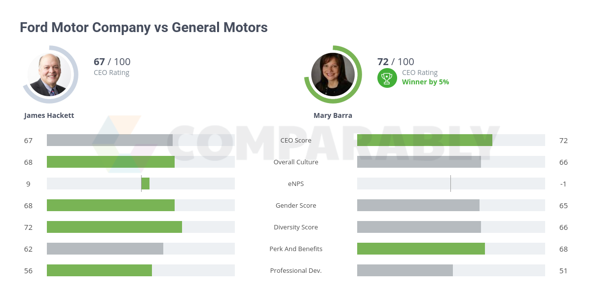

## Table of Contents

## What are Ford and General Motors?

Ford is a big car company that started in 1903. They make cars, trucks, and other vehicles. Ford is known for making cars that many people can afford. They have factories all over the world and sell their cars in many countries. The first car they made was called the Model T, and it changed how people thought about cars.

General Motors, often called GM, is another big car company. It started in 1908. GM makes many different kinds of vehicles, like cars, trucks, and SUVs. They own brands like Chevrolet, Buick, and Cadillac. GM also has factories around the world and sells cars in many places. They are known for making a wide range of vehicles for different kinds of buyers.

## When were Ford and General Motors founded?

Ford was founded in 1903. It started making cars that many people could buy. The first car they made was the Model T, which was very popular.

General Motors, or GM, was founded in 1908. They make different kinds of vehicles like cars, trucks, and SUVs. GM owns brands like Chevrolet, Buick, and Cadillac.

## What are the most popular car models from Ford and General Motors?

Ford has some very popular car models. One of the most well-known is the Ford F-150. It's a truck that many people in the United States buy because it's strong and reliable. Another popular model is the Ford Mustang. It's a sporty car that people like because it's fast and fun to drive. Ford also makes the Ford Escape, which is a smaller car that many families choose because it's easy to drive and has lots of space inside.

General Motors, or GM, has several popular car models too. One of the most popular is the Chevrolet Silverado. It's a truck that many people like because it can carry heavy things and is good for work. Another popular model is the Chevrolet Malibu, which is a car that many people buy because it's comfortable and good on gas. GM also makes the Cadillac Escalade, which is a big SUV that people like because it's fancy and has lots of features.

## How do the sales figures of Ford and General Motors compare?

Ford and General Motors are both big car companies, but their sales figures can be different depending on the year and the market. In recent years, Ford has been doing well with their trucks like the F-150. This truck is very popular in the United States, and it helps Ford sell a lot of cars. Ford also sells cars in many countries around the world, which adds to their total sales numbers.

General Motors, or GM, also has strong sales, especially with their trucks like the Chevrolet Silverado. GM sells cars under different brands like Chevrolet, Buick, and Cadillac, which helps them reach different kinds of buyers. In some years, GM might sell more cars than Ford, and in other years, Ford might sell more. Both companies keep working hard to make cars that people want to buy.

## What are the key differences in the business models of Ford and General Motors?

Ford and General Motors have different ways of doing business. Ford focuses a lot on making vehicles that many people can afford. They are known for their trucks like the F-150, which is very popular in the United States. Ford also sells cars around the world, but they put a big effort into making strong, reliable vehicles that last a long time. Their business model is about making cars that work well for everyday people and businesses.

General Motors, or GM, has a different approach. They own several brands like Chevrolet, Buick, and Cadillac, which lets them sell cars to different kinds of customers. GM makes everything from trucks like the Silverado to fancy SUVs like the Cadillac Escalade. Their business model is about offering a wide range of vehicles so they can meet the needs of many different buyers. This way, they can appeal to people who want affordable cars and those who want luxury vehicles.

## How do Ford and General Motors approach electric vehicles?

Ford is working hard on electric vehicles. They have a plan to make more electric cars and trucks. One of their popular electric vehicles is the Ford Mustang Mach-E, which is like a sporty SUV. Ford also makes the F-150 Lightning, which is an electric version of their famous truck. They want to make electric vehicles that people can use every day and that are easy to charge. Ford is spending a lot of money to build factories just for making electric cars.

General Motors, or GM, is also focusing on electric vehicles. They have a goal to make all their cars electric by 2035. GM makes the Chevrolet Bolt, which is an affordable electric car. They also have the GMC Hummer EV, which is a big, powerful electric truck. GM is working on new technology to make their electric cars better and cheaper. They want to make electric vehicles that work well for different kinds of people, from those who want a small car to those who need a big truck.

## What are the financial performances of Ford and General Motors in the last five years?

In the last five years, Ford has had ups and downs in their financial performance. In 2019, Ford made a profit of about $47 million, but then the year 2020 was tough because of the global health crisis, and they lost about $1.3 billion. Things started to get better in 2021, and Ford made a profit of around $17.9 billion, thanks to strong sales of their trucks like the F-150. In 2022, they made about $10.4 billion in profit, but 2023 saw a drop to around $4.3 billion because of challenges like supply chain issues and higher costs. Overall, Ford has been working hard to improve their electric vehicles and keep their traditional vehicles popular.

General Motors, or GM, has also seen changes in their financial performance over the last five years. In 2019, GM made a profit of about $6.7 billion. The year 2020 was challenging, and they made a profit of around $6.4 billion, which was good considering the global health crisis. In 2021, GM's profit jumped to about $10 billion, thanks to strong sales of their vehicles like the Silverado. The year 2022 was even better, with a profit of around $14.5 billion. However, in 2023, their profit was about $10.1 billion, showing a slight decrease due to various market challenges. GM has been focusing on growing their electric vehicle lineup and maintaining a strong presence in the market.

## How do Ford and General Motors differ in terms of global market presence?

Ford has a strong presence in many countries around the world. They sell cars in places like North America, Europe, and Asia. Ford is especially popular in the United States because of their trucks like the F-150. They also have factories in different countries to make cars closer to where people buy them. This helps Ford reach more customers and sell more cars globally. However, Ford has faced some challenges in certain markets, like Europe, where they've had to close some factories to save money.

General Motors, or GM, also has a big global market presence. They sell cars in many countries, including the United States, China, and South America. GM owns different brands like Chevrolet, Buick, and Cadillac, which helps them sell to different kinds of customers around the world. They have a strong presence in China, where they sell a lot of cars. GM has factories in many countries, which helps them make cars that fit the needs of local buyers. Like Ford, GM has also faced challenges in some markets, but they keep working to grow their global reach.

## What technological innovations have Ford and General Motors introduced recently?

Ford has been working on many new technologies. One big thing they did is make the F-150 Lightning, which is an electric truck. It can power tools or even a house during a power outage. Ford also made the Mustang Mach-E, an electric SUV that is fun to drive. They are using technology to make their cars safer too. For example, they have systems that can help the car drive itself a little bit, like keeping it in the lane or stopping if something is in the way. Ford is also working on making their factories better with robots and other smart machines.

General Motors, or GM, has been busy with new technology too. They made the Chevrolet Bolt, which is an affordable electric car. GM also introduced the GMC Hummer EV, a big electric truck with lots of power. They are working on something called Ultium, which is a new kind of battery that can make their electric cars go farther on one charge. GM is also using technology to make their cars safer, like systems that can help the car avoid crashes. They are putting a lot of effort into making their factories more high-tech, using robots and other smart systems to build cars faster and better.

## How do Ford and General Motors handle their supply chain and manufacturing processes?

Ford works hard to make sure their supply chain and manufacturing processes run smoothly. They have factories all over the world where they build cars. Ford uses a lot of technology to keep track of their parts and make sure they always have what they need. They work closely with their suppliers to get the best materials at the right time. Ford also uses robots and other smart machines in their factories to build cars faster and better. This helps them make a lot of cars and keep the quality high.

General Motors, or GM, also focuses on making their supply chain and manufacturing efficient. They have factories in many countries and work with a lot of suppliers to get the parts they need. GM uses technology to manage their supply chain, making sure they have the right parts when they need them. They also use advanced systems in their factories to build cars. Robots and other smart machines help GM make cars quickly and keep the quality good. Both Ford and GM are always trying to improve their processes to make better cars and keep their customers happy.

## What are the sustainability initiatives undertaken by Ford and General Motors?

Ford is working on many things to help the environment. They want to make more electric cars like the F-150 Lightning and the Mustang Mach-E. These cars do not use gas, so they do not make as much pollution. Ford also wants to use less water and energy in their factories. They are trying to use more recycled materials in their cars too. Ford has a goal to be carbon neutral by 2050, which means they want to stop adding to the pollution in the air.

General Motors, or GM, is also doing a lot for the environment. They have a plan to make all their cars electric by 2035. This means they will stop making cars that use gas. GM is working on new batteries that help their electric cars go farther. They also want to use less water and energy in their factories. GM is trying to use more recycled materials in their cars and has a goal to be carbon neutral by 2040. Both Ford and GM are working hard to make the world a cleaner place.

## How do Ford and General Motors compare in terms of corporate governance and company culture?

Ford and General Motors have different ways of running their companies and treating their employees. Ford focuses a lot on working together and making sure everyone feels important. They have a board of directors that helps make big decisions for the company. Ford also tries to keep their employees happy by offering good benefits and chances to grow in their jobs. They believe in being open about how they do things and making sure everyone knows what's going on.

General Motors, or GM, also has a strong way of running their company. They have a board of directors too, but they focus a lot on making sure their different car brands like Chevrolet, Buick, and Cadillac work well together. GM tries to make their employees feel valued by giving them good benefits and chances to learn new things. They also care about being clear about their plans and making sure everyone knows what the company is doing. Both Ford and GM want to be good places to work and make sure their employees feel part of the team.

## References & Further Reading

[1]: ["Advances in Financial Machine Learning"](https://www.amazon.com/Advances-Financial-Machine-Learning-Marcos/dp/1119482089) by Marcos Lopez de Prado

[2]: ["Quantitative Trading: How to Build Your Own Algorithmic Trading Business"](https://www.amazon.com/Quantitative-Trading-Build-Algorithmic-Business/dp/1119800064) by Ernest P. Chan

[3]: ["Machine Learning for Algorithmic Trading"](https://github.com/stefan-jansen/machine-learning-for-trading) by Stefan Jansen

[4]: ["Evidence-Based Technical Analysis: Applying the Scientific Method and Statistical Inference to Trading Signals"](https://www.amazon.com/Evidence-Based-Technical-Analysis-Scientific-Statistical/dp/0470008741) by David Aronson

[5]: Bergstra, J., Bardenet, R., Bengio, Y., & Kégl, B. (2011). ["Algorithms for Hyper-Parameter Optimization."](https://dl.acm.org/doi/10.5555/2986459.2986743) Advances in Neural Information Processing Systems 24.