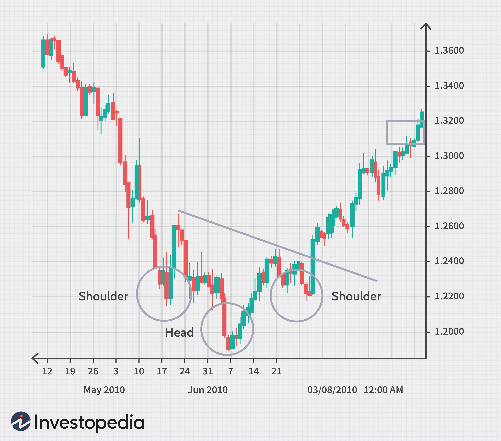

## Table of Contents

## What is Forex trading and how does it differ from stock trading?

Forex trading, short for foreign exchange trading, involves buying and selling currencies on the global market. Traders aim to profit from the fluctuations in exchange rates between different currencies. For example, if you think the Euro will rise against the US Dollar, you might buy Euros with Dollars, then sell the Euros back for Dollars later at a higher rate. The forex market operates 24 hours a day, five days a week, and is the largest financial market in the world, with a daily trading volume of over $6 trillion.

Stock trading, on the other hand, involves buying and selling shares of companies listed on stock exchanges like the New York Stock Exchange or NASDAQ. When you buy a stock, you are purchasing a small piece of ownership in that company. The goal is to buy stocks at a low price and sell them at a higher price, or to earn dividends from the company. Unlike the forex market, stock markets have set trading hours and are closed on weekends and holidays. The stock market is also generally more regulated than the forex market, which can affect how trading is conducted.

The main differences between forex and stock trading lie in what is being traded, the market's operating hours, and the level of regulation. Forex trading deals with currency pairs and is available around the clock during the business week, while stock trading involves company shares and operates within specific hours. Additionally, the forex market tends to be less regulated, which can lead to different trading strategies and risks compared to the more structured stock market environment.

## What are the basic requirements to start trading in Forex and stocks?

To start trading in Forex, you need a few basic things. First, you need a computer or a smartphone with an internet connection. This lets you access trading platforms where you can buy and sell currencies. Next, you need to open an account with a Forex broker. Brokers are companies that help you trade by connecting you to the Forex market. They usually ask for some personal information and might require a minimum deposit to start trading. It's also a good idea to learn about Forex trading before you start. You can do this by reading [books](/wiki/algo-trading-books), taking online courses, or using demo accounts that let you practice trading without real money.

To start trading in stocks, you also need a computer or smartphone with internet access. You'll need to open an account with a stockbroker, which is similar to a Forex broker but for stocks. Stockbrokers will ask for your personal information and may require a minimum amount of money to open an account. Once your account is set up, you can use their trading platform to buy and sell stocks. It's important to learn about the stock market and how it works before you start trading. You can find plenty of resources online, like tutorials and demo accounts, to help you get started and practice without risking real money.

## How do the market hours of Forex and stock markets compare?

Forex markets are open 24 hours a day from Monday to Friday. This means you can trade currencies anytime during the week, except for weekends. The Forex market starts in Australia on Sunday evening (New York time) and goes through Europe and then North America, before closing on Friday evening (New York time). This long schedule is because Forex trading happens all over the world.

Stock markets, on the other hand, have set hours and are closed on weekends and holidays. For example, the New York Stock Exchange is open from 9:30 AM to 4:00 PM Eastern Time, Monday through Friday. Other stock markets around the world have their own specific hours, but they all have set times when they open and close. This means you can only trade stocks during those specific hours.

## What are the typical costs associated with trading Forex versus stocks?

When you trade Forex, you mainly have to pay something called a spread. This is the difference between the price to buy a currency and the price to sell it. The spread is how Forex brokers make money. Sometimes, you might also pay a commission, but many brokers offer commission-free trading and make their money from the spread alone. Another cost to watch out for is the swap or rollover fee, which you might have to pay if you keep a trade open overnight. These costs can add up, so it's good to understand them before you start trading.

Trading stocks also comes with costs. When you buy or sell a stock, you usually have to pay a commission to your broker. This is a fee for using their service to trade. The commission can be a flat fee or a percentage of the trade value. Some brokers offer commission-free trading, but they might make money in other ways, like through payment for order flow. Besides commissions, you might also face other fees, like account maintenance fees or fees for not keeping a minimum balance. It's important to know all these costs because they can affect how much money you make or lose when trading stocks.

## How does leverage work in Forex and stocks, and what are the risks involved?

Leverage in Forex and stocks lets you trade with more money than you actually have. In Forex, you might use a small amount of your own money, called margin, to control a much larger position. For example, with a 100:1 leverage, you can control $100,000 with just $1,000. This can make your profits bigger if the market moves your way, but it can also make your losses bigger if the market goes against you. In stocks, leverage often comes from buying on margin, where you borrow money from your broker to buy more stocks. The risks are similar: you can make more money, but you can also lose more than what you started with.

The main risk with leverage is that it can lead to big losses. If the market moves against your trade, you could lose your entire investment quickly. In Forex, if your losses get too big, you might get a margin call, where you need to add more money to your account or close your trade. In stocks, if the value of your stocks drops a lot, you might have to sell them at a loss to cover the loan from your broker. Both types of trading with leverage need careful management and understanding of the market to avoid big financial problems.

## What are the key factors that influence Forex and stock prices?

Forex prices are mainly influenced by things like interest rates, economic news, and how countries are doing economically. When a country's central bank changes interest rates, it can make its currency more or less attractive to investors. For example, if the US raises interest rates, the US dollar might get stronger because people want to invest there for better returns. Also, if a country's economy is doing well, its currency might go up in value. News like employment rates, inflation, and big events like elections can also move Forex prices a lot. Traders watch these things closely to guess where currency prices might go next.

Stock prices are affected by how well a company is doing, the overall economy, and what investors think about the future. If a company makes more money than expected, its stock price might go up because people think it's doing well. On the other hand, if a company has bad news, like lower profits or losing a big customer, its stock price might drop. The economy also plays a big role; if the economy is growing, stock prices tend to rise. Investors' feelings about the future are important too. If they think the market will do well, they might buy more stocks, pushing prices up. But if they're worried, they might sell, which can make prices go down.

## How do the liquidity levels in Forex and stock markets affect trading?

The Forex market has very high [liquidity](/wiki/liquidity-risk-premium) because it's the biggest financial market in the world. This means you can buy and sell currencies easily without big changes in price. When you trade Forex, you can usually get in and out of trades quickly. This is good because it makes it easier to make money if the market moves your way. But it also means that big players, like banks, can move the market a lot if they want to.

In the stock market, liquidity can be different depending on the stock you're trading. Big company stocks, like Apple or Microsoft, are usually very liquid. This means you can trade them easily without affecting the price too much. But smaller company stocks might not be as liquid. If you try to buy or sell a lot of these stocks, you might move the price a lot. This can make it harder to trade and might mean you can't get the price you want. So, when you're trading stocks, it's important to think about how liquid the stock is before you make a trade.

## What are the common strategies used in Forex trading compared to stock trading?

In Forex trading, common strategies include [scalping](/wiki/gamma-scalping), where traders make many small trades to profit from tiny price changes, and [day trading](/wiki/day-trading-spy), where traders open and close positions within the same day. Another popular strategy is swing trading, where traders hold positions for a few days to a few weeks to catch bigger price moves. Forex traders also use technical analysis a lot, looking at charts and patterns to guess where prices might go next. They might use indicators like moving averages or the Relative Strength Index (RSI) to help them decide when to buy or sell. Because Forex is a 24-hour market, traders can use different strategies at different times of the day, depending on which markets are open.

In stock trading, common strategies include buy-and-hold, where investors buy stocks and keep them for a long time, hoping the company will grow and the stock price will go up. Another strategy is value investing, where investors look for stocks they think are undervalued and buy them, expecting the price to rise as the market realizes the true value. Day trading is also used in stocks, where traders buy and sell stocks within the same day to make quick profits. Stock traders often use both technical analysis, like Forex traders, and [fundamental analysis](/wiki/fundamental-analysis), where they look at a company's financial health, earnings, and other factors to decide if a stock is a good buy. Because stock markets have set hours, stock traders need to plan their strategies around these times.

## How can one manage risk in Forex and stock investments?

Managing risk in Forex trading starts with using stop-loss orders. A stop-loss order is like a safety net that automatically closes your trade if the price goes against you by a certain amount. This can help you not lose too much money. Another way to manage risk is by not using too much leverage. Leverage can make your profits bigger, but it can also make your losses bigger, so it's good to use it carefully. Also, it's smart to spread your money around by trading different currency pairs. This way, if one trade goes bad, you won't lose all your money.

In stock investments, risk management can be done by diversifying your portfolio. This means buying stocks from different companies and different industries. If one stock goes down, the others might go up and balance it out. Using stop-loss orders here too can protect you from big losses. Another thing to do is to keep an eye on how much of your money you're putting into stocks. Don't put all your money into one stock or even one type of investment. It's also a good idea to keep learning about the companies you're investing in and the market in general, so you can make better decisions and manage your risks better.

## What are the tax implications of profits from Forex and stock trading?

When you make money from Forex trading, you have to pay taxes on your profits. In many places, these profits are seen as income, so you'll pay income tax on them. The exact amount of tax you pay can depend on how much money you make and where you live. Some countries treat Forex profits as capital gains, which might have different tax rates. It's a good idea to keep track of all your trades and profits, so you can report them correctly when you do your taxes. Talking to a tax professional can help you understand how much tax you need to pay and how to report your Forex trading income.

When it comes to stock trading, the tax rules are a bit different but still important. If you buy a stock and sell it for more money than you paid, that profit is called a capital gain. Depending on how long you held the stock, the gain might be short-term or long-term. Short-term capital gains, from stocks held for a year or less, are usually taxed at your regular income tax rate. Long-term capital gains, from stocks held for more than a year, often have a lower tax rate. Just like with Forex, it's important to keep good records of all your stock trades and talk to a tax professional to make sure you're paying the right amount of tax on your stock trading profits.

## How do global economic events impact Forex and stock markets differently?

Global economic events can shake up the Forex market a lot. When big news comes out, like a country changing its interest rates or having a big election, it can make currencies move a lot. For example, if the US says its economy is doing great, the US dollar might go up because people want to invest there. But if there's bad news, like a big drop in jobs, the dollar might go down because people get worried. Traders in the Forex market watch these events closely because they can make quick money if they guess right, but they can also lose money fast if they guess wrong.

Stock markets also feel the effects of global economic events, but in a different way. When good news comes out about a company or the economy, stock prices might go up because people think they'll make more money. But if there's bad news, like a company not making as much money as expected or a big economic problem, stock prices can go down fast. Unlike Forex, where you can trade 24 hours a day, stock markets have set hours, so big news after hours might make prices jump a lot when the market opens again. Investors need to keep an eye on these events and think about how they might affect the companies they own stocks in.

## What advanced tools and indicators are used by expert traders in Forex and stock markets?

Expert Forex traders use a lot of advanced tools and indicators to help them make smart trades. One popular tool is the moving average, which helps them see the average price of a currency over time. They might use different types of moving averages, like the simple moving average or the exponential moving average, to spot trends. Another tool they use is the Relative Strength Index (RSI), which tells them if a currency is overbought or oversold. This can help them decide when to buy or sell. They also look at the Fibonacci retracement levels to find good points to enter or [exit](/wiki/exit-strategy) trades. Expert Forex traders often use a mix of these tools along with others like the MACD (Moving Average Convergence Divergence) and Bollinger Bands to get a better picture of the market and make better trading decisions.

In the stock market, expert traders also use advanced tools and indicators to guide their trading. They might use the same moving averages and RSI as Forex traders, but they apply them to stock prices. Another key tool for stock traders is the [volume](/wiki/volume-trading-strategy) indicator, which shows how many shares are being traded. High volume can mean a stock is more likely to keep moving in the same direction. They also use the Price-to-Earnings (P/E) ratio to see if a stock is a good value. Expert stock traders often look at earnings reports and use fundamental analysis to understand a company's financial health. They might combine these tools with technical analysis to make more informed decisions about which stocks to buy or sell.

## References & Further Reading

[1]: Bergstra, J., Bardenet, R., Bengio, Y., & Kégl, B. (2011). ["Algorithms for Hyper-Parameter Optimization."](https://proceedings.neurips.cc/paper/2011/file/86e8f7ab32cfd12577bc2619bc635690-Paper.pdf) Advances in Neural Information Processing Systems 24.

[2]: ["Advances in Financial Machine Learning"](https://www.amazon.com/Advances-Financial-Machine-Learning-Marcos/dp/1119482089) by Marcos Lopez de Prado

[3]: ["Evidence-Based Technical Analysis: Applying the Scientific Method and Statistical Inference to Trading Signals"](https://www.amazon.com/Evidence-Based-Technical-Analysis-Scientific-Statistical/dp/0470008741) by David Aronson

[4]: ["Machine Learning for Algorithmic Trading"](https://github.com/stefan-jansen/machine-learning-for-trading) by Stefan Jansen

[5]: ["Quantitative Trading: How to Build Your Own Algorithmic Trading Business"](https://github.com/LucindaYa/quant-resources/blob/master/Quantitative%20Trading%20How%20to%20Build%20Your%20Own%20Algorithmic%20Trading%20Business.pdf) by Ernest P. Chan