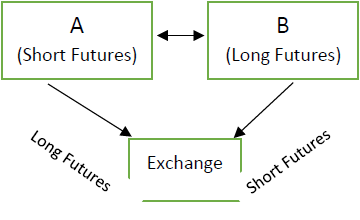

In today's dynamic financial landscape, understanding financial derivatives is crucial for both investors and traders. Among the most important derivatives are futures contracts, forward contracts, and the sophisticated domain of algorithmic trading, which have collectively revolutionized the operations of financial markets. This article provides insights into these elements, including their mechanics, differences, and the ways algorithmic trading enhances trading strategies.

For investors and newcomers alike, grasping the complexities of these financial instruments is essential. Futures and forward contracts, despite their shared purpose of managing financial risk, offer distinct features and advantages. While futures are standardized and traded on exchanges, forwards are customizable, traded over-the-counter, and cater to specific risk management needs.



Algorithmic trading further enhances these tools by employing complex algorithms to execute trades faster and more efficiently than human traders ever could. By analyzing market data at high speeds, algorithmic trading eliminates human emotional bias and reduces transaction costs, dramatically improving the execution of trading strategies.

This guide aims to clarify how these instruments function both independently and in tandem, creating robust and effective trading strategies. By the end of this exploration, readers should have a comprehensive understanding of financial derivatives and algorithmic trading, equipped with the knowledge to navigate today's intricate financial markets with increased accuracy and speed.

Let's embark on this journey into the intricate world of financial derivatives and algorithmic trading.

## Table of Contents

## Understanding Financial Derivatives

Financial derivatives are intricate financial instruments whose value depends on the performance of an underlying asset such as stocks, bonds, commodities, or currencies. They function as agreements between two or more parties, where future transactions are determined by changes in the underlying asset's market value. Key types of derivatives include futures, forwards, and options, each offering unique applications in both hedging and speculative activities.

Derivatives are integral to financial markets due to their leverage potential, which allows investors to control large positions with a relatively small investment. This characteristic can magnify both potential gains and losses, making them attractive yet risky. As a result, derivatives can significantly influence market dynamics, impacting prices, market behavior, and [liquidity](/wiki/liquidity-risk-premium).

A futures contract is a standardized agreement to buy or sell an asset at a future date and at a predetermined price. These contracts are traded on exchanges, offering liquidity and mitigating counterparty risk through a clearinghouse that marks contracts to market on a daily basis. They are used extensively for hedging risks, particularly in volatile markets, by providing a mechanism to lock in prices for commodities, equity indexes, and other financial instruments.

Forward contracts, by contrast, are customizable agreements traded over-the-counter (OTC), allowing two parties to tailor the terms to fit their specific needs. While they offer flexibility, forwards come with heightened counterparty risk and are usually settled at the contract's end date. They are commonly used by corporations aiming to manage anticipated price fluctuations in commodities or foreign exchange markets.

Financial derivatives are complex, and their effective utilization requires a thorough understanding of their mechanics. In volatile markets, the right application of derivatives can be crucial for maintaining stability and enabling price predictability. Historically, derivatives have played a pivotal role in stabilizing markets and facilitating efficient functioning by providing tools for risk management and speculative opportunities. The continual evolution of these instruments underscores the necessity for market participants to have a deep comprehension of their structures and implications.

## Futures Contracts: Structured Trading

Futures contracts represent standardized agreements to buy or sell an asset at a predetermined price on a specified future date. Unlike forward contracts, which are customized and traded over-the-counter, futures contracts are traded on organized exchanges. This standardization facilitates liquidity and allows for transparent price discovery.

A key feature of futures contracts is their daily mark-to-market process. At the end of each trading day, the contract's value is adjusted in relation to its settlement price, ensuring that gains and losses are accounted for daily. The participants must maintain a margin account with the exchange, which holds an initial margin deposit. If the market moves against a participant’s position, they may need to post additional funds, known as variation margin, to maintain their position. This daily settlement process mitigates counterparty risk, a significant advantage over more opaque forward contracts.

Futures contracts serve multiple purposes, such as hedging against price fluctuations in commodities, equity indexes, and interest rates. Commodities like oil, wheat, and gold often see substantial futures market activity as producers and consumers use these contracts to lock in future prices and manage risk associated with price [volatility](/wiki/volatility-trading-strategies). Similarly, financial futures formed on indices like the S&P 500 allow investors to hedge against movements in equity markets.

Regulation plays a significant role in the futures market. In the United States, the Commodity Futures Trading Commission (CFTC) oversees the futures and options markets to protect market participants against fraud and manipulation. This regulatory framework enhances market integrity and fosters participant confidence.

Futures exchanges, like the Chicago Mercantile Exchange (CME) and the Intercontinental Exchange (ICE), provide platforms for transparent trading operations. They standardize contract specifications and ensure compliance with fair trading practices, enhancing accountability in the marketplace.

In summary, futures contracts offer a standardized, liquid way to hedge against market fluctuations and facilitate speculative opportunities while reducing counterparty risk through structured regulatory oversight and daily settlement procedures.

## Exploring Forward Contracts

Forward contracts represent a pivotal tool within the realm of financial derivatives, offering a bespoke approach to contracting between two parties aiming to transact an asset at a predetermined price in the future. These contracts stand apart from their futures counterparts due to their inherent customizability and lack of standardization. Crucially, forward contracts are traded over-the-counter (OTC), which enables the involved parties to tailor terms and conditions to suit their specific needs.

Despite their flexibility, forward contracts present a heightened counterparty risk, as the success of the contract's settlement highly depends on each party's ability to fulfill their obligations. This risk is accentuated by the absence of a clearing house, which is typically found in exchange-traded futures. Due to this increased risk [factor](/wiki/factor-investing), forward contracts are predominantly leveraged in hedging strategies, particularly by corporations aiming to mitigate potential future price volatilities.

One distinguishing feature of forward contracts is their settlement process. Unlike futures, which are marked-to-market daily, forward contracts are settled at the maturity of the contract. This means that any profits or losses are only realized at the contract's conclusion, adding a layer of opacity to their operation.

Industries with substantial exposure to fluctuating commodity prices, notably agriculture and energy sectors, frequently employ forward contracts to safeguard against price uncertainties. For instance, an agricultural producer might lock in a future sale price for its harvest, thus protecting against adverse price moves. Similarly, energy companies could utilize forwards to stabilize revenues from oil or gas production in volatile markets.

This strategic use of forward contracts underscores their importance in risk management frameworks, providing businesses with the predictability needed in often unpredictable market environments.

## Key Differences between Forwards and Futures

While both forwards and futures contracts aim at risk management, their operational frameworks and trading environments differ significantly. Here's an exploration of their key distinctions:

1. **Standardization and Trading Venues**: Futures contracts are highly standardized and traded on organized exchanges, which ensures a uniform structure across contracts. This standardization is beneficial for providing high liquidity, as any market participant can engage in these trades knowing the terms are consistent. For example, a futures contract for crude oil will have the same size, quality stipulations, and expiration terms, regardless of the trading party.

2. **Counterparty Risk**: Futures contracts inherently possess lower counterparty risk. This reduced risk is due to the presence of a clearinghouse in exchange-traded markets, which acts as an intermediary ensuring contract performance. The clearinghouse guarantees that the counterparty risks are minimal. In contrast, forward contracts are bilateral agreements executed over-the-counter (OTC), leading to increased counterparty risk since they depend solely on the creditworthiness of the contracting parties.

3. **Settlement and Interim Cash Flows**: One of the defining characteristics of futures is their daily settlement process known as "marking to market." This mechanism adjusts the contract's value daily, requiring parties to settle gains or losses and thereby reducing the risk of default at contract expiration. Forwards do not have such interim settlements; they are only reconciled at maturity, making them less transparent.

4. **Margin Requirements**: Futures transactions necessitate both initial and maintenance margins. These are performance bonds, ensuring that parties can cover potential losses. Margins help in sustaining the market's integrity by making sure participants have some upfront skin in the game. On the flip side, forwards typically lack such requirements since they are bespoke agreements tailored to the needs of the trading parties and are often cash-settled at maturity.

5. **Flexibility and Customization**: Forwards offer unparalleled flexibility in terms of contract terms like quantity, price, delivery dates, and quality of the underlying asset. This customization allows parties to cater specifically to their particular hedging or investment needs, which is not feasible with the rigid nature of futures contracts.

The decision to use forwards or futures largely depends on the specific objectives and requirements of the trading entities, including their need for customization, risk exposure tolerance, and compliance with regulatory standards. These factors dictate the suitability of each instrument within a given context.

## Algorithmic Trading: The Digital Edge

Algorithmic trading, commonly known as algo trading, utilizes computer systems programmed to perform defined rules for trading. These rules are designed to exploit market opportunities with precision and speed that human traders cannot match. The automated nature of [algorithmic trading](/wiki/algorithmic-trading) allows for executing complex strategies across various financial instruments, including derivatives such as futures and options.

Algorithms analyze vast quantities of high-frequency data, which is crucial in executing strategies like market-making, [arbitrage](/wiki/arbitrage), and trend-following. Market-making involves providing liquidity to the market by quoting both buy and sell prices, allowing the trader to profit from the spread. Arbitrage strategies search for price discrepancies between related financial instruments or markets, executing trades to lock in risk-free profits. Trend-following algorithms, on the other hand, identify and capitalize on directional market movements, a task that necessitates rapid order execution and precision.

One of the main advantages of algorithmic trading is its speed, significantly reduced transaction costs, and the reduction of human emotional biases that might otherwise affect trading decisions. By automating the trading process, algorithms can execute orders in fractions of a second, far quicker than manual trading. Furthermore, by automating the execution of trading strategies, traders can capitalize on market conditions instantly, minimizing the impact of execution costs that can erode profits.

Algorithmic trading also benefits greatly from advancements in [machine learning](/wiki/machine-learning) and advanced analytics. Machine learning introduces the ability for algorithms to learn from past market data and adapt trading strategies in real-time. This adaptability increases the robustness of trading strategies, enabling them to perform effectively in diverse market conditions. Advanced analytics enhance the interpretative power of algo trading systems, allowing them to process and react to incoming data streams with increased sophistication and accuracy.

In conclusion, algorithmic trading represents a significant evolution in trading methodologies, combining speed, precision, and advanced data analysis to optimize trading outcomes. As technological advancements continue, the scope and effectiveness of algorithmic trading are expected to expand, further transforming financial markets and their operational dynamics.

## The Intersection of Derivatives and Algo Trading

Algorithmic trading markedly enhances the efficiency of trading in futures and forward contracts, primarily by enabling real-time risk management and swift decision-making. Through the use of sophisticated algorithms, traders can instantaneously assess market conditions, optimizing trade execution in dynamic and often volatile environments. This integration of algorithmic strategies with derivatives trading holds significant potential for both profit maximization and risk mitigation.

The use of advanced algorithms allows firms to analyze vast amounts of market data at high speed, executing orders with precision that manual trading cannot match. For instance, these algorithms can identify arbitrage opportunities across different exchanges and markets, enabling traders to exploit price differences quickly before they disappear. Additionally, algorithms can implement trend-following strategies, automatically reacting to market movements based on predefined criteria, which enhances decision-making processes.

Moreover, the combination of derivatives like futures and forwards with algo trading provides firms significant leverage opportunities. The standardization and predictability of futures contracts, when combined with the customizable flexibility of forward contracts, enable firms to construct sophisticated hedging positions. This allows them to manage exposure to price fluctuations better and protect against potential losses. 

A practical example of algorithmic trading could be employing a Python script using libraries such as NumPy and Pandas for data manipulation and analysis, Scikit-learn for implementing machine learning algorithms, and APIs to execute trades. 

```python
import numpy as np
import pandas as pd
from sklearn.ensemble import RandomForestRegressor
from trading_api import execute_trade

# Sample function to predict future asset price
def predict_price(data):
    X = data[['feature1', 'feature2', 'feature3']].values
    y = data['target'].values
    model = RandomForestRegressor(n_estimators=100)
    model.fit(X, y)
    return model.predict(X[-1].reshape(1, -1))

# Simulation of algo trading decision-making
def trade_decision(data):
    predicted_price = predict_price(data)
    current_price = data['target'].values[-1]

    if predicted_price > current_price:
        execute_trade('BUY')
    else:
        execute_trade('SELL')

# Assume we have a DataFrame 'market_data' with features and target
market_data = pd.DataFrame({
    'feature1': np.random.rand(100),
    'feature2': np.random.rand(100),
    'feature3': np.random.rand(100),
    'target': np.random.rand(100)
})

trade_decision(market_data)
```

As technology continues to advance, both algo trading and financial derivatives are expected to play increasingly pivotal roles in the ongoing transformation of financial markets. This evolving integration will likely foster novel trading strategies, improved market efficiencies, and more robust risk management frameworks, positioning participants to navigate complexities and capitalize on emerging opportunities.

## Conclusion

The landscape of financial derivatives, encompassing futures and forwards, is complex but provides powerful tools for investors and traders. A solid understanding of these instruments, alongside their interaction with algorithmic trading, is vital for effective risk management and strategic planning. Each instrument serves distinct purposes; for example, futures offer standardized, exchange-traded opportunities, whereas forwards provide customizable, over-the-counter solutions. However, their combined application with technological advancements like algorithmic trading can significantly enhance trading capabilities.

Algorithmic trading enables rapid execution and efficiency in handling derivatives, capitalizing on market opportunities with greater precision. By processing vast amounts of data quickly, these systems reduce human error and transaction costs, increasing the likelihood of favorable outcomes.

Informed market participants who leverage these tools can better navigate the complexities of modern financial markets, capitalizing on opportunities with increased accuracy and speed. As technology continues to evolve, the seamless integration of derivatives with algorithmic trading strategies is expected to further transform financial markets. This progression promises not only to address challenges but also to unlock the vast potential these financial instruments hold.

## References & Further Reading

[1]: Hull, J. C. (2017). ["Options, Futures, and Other Derivatives"](https://www.semanticscholar.org/paper/Options%2C-Futures%2C-and-Other-Derivatives-Hull/89bdee500c8623864fc9eb7a471546aa713acc44). Pearson Education.

[2]: De Prado, M. L. (2018). ["Advances in Financial Machine Learning"](https://www.amazon.com/Advances-Financial-Machine-Learning-Marcos/dp/1119482089) by Marcos Lopez de Prado.

[3]: Chan, E. P. (2009). ["Quantitative Trading: How to Build Your Own Algorithmic Trading Business"](https://github.com/ftvision/quant_trading_echan_book). Wiley Trading.

[4]: Jorion, P. (2007). ["Value at Risk: The New Benchmark for Managing Financial Risk"](https://link.springer.com/article/10.1007/s11408-007-0057-3). McGraw-Hill.

[5]: Wilmott, P. (2006). ["Paul Wilmott Introduces Quantitative Finance"](https://www.amazon.com/Paul-Wilmott-Introduces-Quantitative-Finance/dp/0470319585). Wiley.

[6]: Harris, L. (2003). ["Trading and Exchanges: Market Microstructure for Practitioners"](https://www.amazon.com/Trading-Exchanges-Market-Microstructure-Practitioners/dp/0195144708). Oxford University Press.