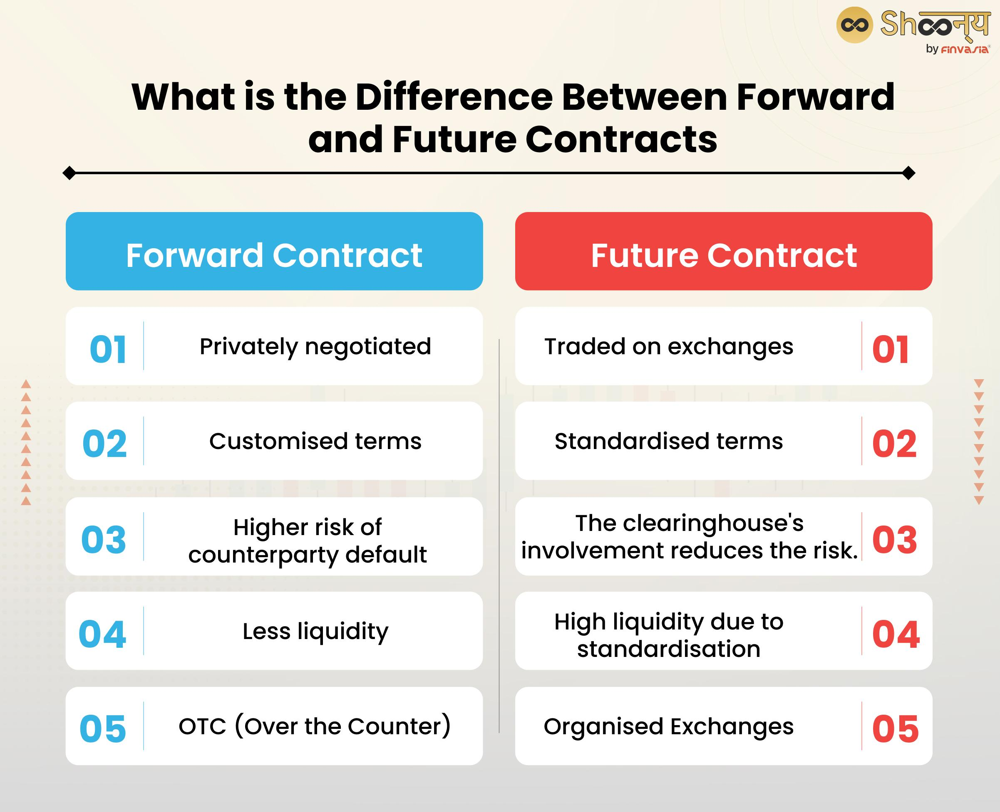

## Table of Contents

## What are forward contracts?

A forward contract is a private agreement between two parties to buy or sell an asset at a specific price on a future date. It's like making a promise today about a transaction that will happen later. For example, a farmer might enter into a forward contract with a buyer to sell a certain amount of wheat at a set price, even if the market price changes before the delivery date.

These contracts are used to manage risk, especially in industries where prices can be unpredictable. By locking in a price now, both the buyer and the seller can protect themselves from future price changes. However, forward contracts are not traded on public exchanges, so they can be customized to fit the needs of the parties involved. This flexibility is a big advantage, but it also means there's more risk if one party doesn't fulfill their part of the deal.

## What are futures contracts?

Futures contracts are like forward contracts but with a big difference: they are traded on public exchanges. This means anyone can buy or sell them, not just the two parties who made the deal. A futures contract is an agreement to buy or sell something, like corn or oil, at a set price on a specific future date. It's a way for people to protect themselves from price changes. For example, a cereal company might use a futures contract to lock in the price of corn they'll need in six months.

Because futures contracts are on public exchanges, they have rules and are watched closely to make sure everyone follows them. This makes them less risky than forward contracts. If you want to get out of a futures contract, you can just sell it to someone else on the exchange. This is different from a forward contract, where you'd have to find the other party and agree to cancel or change the deal. So, futures contracts give more flexibility and safety, but they're also less customizable than forward contracts.

## How do forward and futures contracts differ in terms of customization?

Forward contracts are very flexible. You can change them to fit exactly what you and the other person need. For example, if you're a farmer, you can make a forward contract to sell a special type of wheat at a certain price on a date that works for both you and the buyer. Because forward contracts are private deals, you can set the terms however you want. This is great if you need something specific, but it also means there's more risk because there's no big exchange making sure everyone follows the rules.

Futures contracts, on the other hand, are not as flexible. They are traded on public exchanges, so everyone uses the same standard contract. You can't change the terms to fit your special needs. For example, if you want to buy corn, you have to take the standard futures contract for corn that's available on the exchange. This makes futures contracts less customizable, but it also means they're safer because the exchange watches over everything and makes sure people stick to the deal.

## What is the role of a clearinghouse in futures contracts?

A clearinghouse is like a referee for futures contracts. When people buy or sell futures contracts on an exchange, the clearinghouse steps in to make sure everything goes smoothly. It does this by standing between the buyer and the seller, making sure that if one person can't pay up, the other person still gets what they're owed. This helps to reduce the risk that someone might not follow through on their part of the deal.

The clearinghouse also keeps track of all the money that people put up as a promise to follow through on their contracts. This money is called margin. If the price of the thing you're buying or selling changes a lot, the clearinghouse might ask for more margin to make sure there's enough money to cover any losses. By doing all this, the clearinghouse makes futures contracts safer and more reliable for everyone involved.

## How does the trading process differ between forward and futures contracts?

The trading process for forward contracts is very straightforward but private. When you want a forward contract, you find someone who wants to make the opposite deal. For example, if you want to buy wheat in the future, you find a farmer who wants to sell wheat in the future. You both agree on the price and the date, and then you have a deal. There's no big exchange or public market involved. It's just between the two of you. If you want to get out of the deal later, you have to talk to the other person and see if you can agree to cancel or change it.

Futures contracts are traded on a public exchange, which makes the process different. If you want a futures contract, you go to the exchange and find someone who wants to make the opposite deal. The exchange has standard contracts for different things like corn or oil, so you pick the one you need. When you buy or sell, the exchange and a clearinghouse keep track of everything and make sure everyone follows the rules. If you want to get out of the deal later, you don't need to talk to the other person. You can just sell your contract to someone else on the exchange. This makes futures contracts easier to trade and less risky.

## What are the typical uses of forward contracts?

Forward contracts are often used by businesses that want to lock in prices for things they need in the future. For example, a company that makes chocolate might use a forward contract to buy cocoa at a set price, even if the price of cocoa goes up before they get it. This helps the company know exactly how much they'll have to pay and plan their budget better. Farmers also use forward contracts a lot. They can agree to sell their crops, like corn or wheat, at a certain price before they even harvest them. This way, they know how much money they'll get and can plan their finances without worrying about price changes.

Another common use of forward contracts is in the currency market. Companies that do business in different countries often use forward contracts to protect themselves from changes in exchange rates. For example, if a U.S. company is going to pay a supplier in Europe in six months, they might use a forward contract to lock in the exchange rate now. This way, they know exactly how many dollars they'll need to buy the euros they need, no matter what happens to the exchange rate in the meantime. Forward contracts help businesses manage their risks and plan for the future with more certainty.

## What are the typical uses of futures contracts?

Futures contracts are often used by people who want to protect themselves from price changes. For example, a farmer might use a futures contract to lock in the price of corn they plan to sell in the future. This way, they know how much money they'll get, even if the price of corn goes down. Companies that need to buy things like oil or wheat also use futures contracts. They can lock in a price now, so they know how much they'll have to pay later, no matter what happens to the market price.

Another big use of futures contracts is by investors who want to make money from price changes. They can buy or sell futures contracts hoping that the price will go in their favor. For example, if someone thinks the price of gold will go up, they can buy a futures contract for gold. If the price does go up, they can sell the contract for more than they paid for it and make a profit. Futures contracts are also used by people who want to spread their risk across different investments. They can buy and sell different kinds of futures contracts to balance out their gains and losses.

## How do the pricing mechanisms of forward and futures contracts compare?

Forward contracts are priced based on what the buyer and seller agree to. They look at things like the current market price of the thing they're buying or selling, how long it will be until the deal happens, and how risky it is. Because forward contracts are private, the price can be whatever the two people decide. If the market price changes before the deal is done, the price of the forward contract stays the same, unless the two people agree to change it.

Futures contracts are different because they are traded on public exchanges. The price of a futures contract changes all the time as people buy and sell them. It's based on what people think the price of the thing will be in the future, plus things like interest rates and how much it costs to store the thing until the deal is done. The exchange makes sure everyone knows the current price, so it's easy to see how much a futures contract is worth at any time.

## What are the risks associated with forward contracts?

Forward contracts come with a few risks. One big risk is that one of the people in the deal might not do what they promised. Because forward contracts are private deals, there's no big exchange watching over everything. If the other person can't or won't pay up, you might be stuck with a big problem. This is called counterparty risk. Another risk is that the price of what you're buying or selling might change a lot. If you locked in a price and the market price goes the other way, you might miss out on making more money or have to pay more than you would have if you waited.

Another risk with forward contracts is that they're not very easy to get out of. If you want to cancel or change the deal, you have to talk to the other person and see if they agree. This can be tricky and might not work out. Also, because forward contracts are customized, they can be hard to understand and value. If things change, like interest rates or the cost of storing what you're buying or selling, it can be hard to figure out what the contract is really worth. This makes forward contracts more complicated and riskier than other kinds of deals.

## What are the risks associated with futures contracts?

Futures contracts have some risks too. One risk is that the price of what you're buying or selling might change a lot. If you locked in a price and the market price goes the other way, you could lose money. For example, if you bought a futures contract for oil and the price of oil goes down, you might have to pay more than if you waited. Another risk is that you have to put up money as a promise to follow through on your deal. This is called margin. If the price changes a lot, you might have to put up more margin, and if you can't, you might have to close your deal at a loss.

Another risk with futures contracts is that they can be hard to understand. They're based on what people think the price will be in the future, and that can be hard to guess right. Also, because futures contracts are traded on an exchange, they can move quickly. If you're not watching closely, you might miss out on changes that affect your deal. But the good thing about futures contracts is that the exchange and a clearinghouse help make sure everyone follows the rules, so the risk of someone not paying up is lower than with forward contracts.

## How do regulatory requirements differ between forward and futures contracts?

Forward contracts have fewer rules to follow because they are private deals between two people. There's no big exchange watching over them, so the government doesn't have as many rules for them. But if you're using forward contracts for things like currency or commodities, there might be some rules to follow, like reporting big deals to the government. This is to make sure no one is doing anything shady. But overall, forward contracts are less regulated than futures contracts.

Futures contracts have a lot more rules because they are traded on public exchanges. The government and the exchange have strict rules to make sure everything is fair and safe. For example, you have to follow rules about how much money you need to put up as a promise to follow through on your deal. There are also rules about who can trade futures and how they have to report their deals. These rules help make futures contracts safer but also mean there's less freedom in how you can use them.

## What are the settlement procedures for forward and futures contracts?

Forward contracts are settled directly between the two people who made the deal. When the date comes, the person who agreed to buy has to pay the price they agreed on, and the person who agreed to sell has to give them the thing they promised. If it's something like wheat, the seller gives the wheat to the buyer. If it's money, like in a currency forward, the buyer pays the seller the amount they agreed on in the currency they chose. Sometimes, instead of actually giving the thing, the two people might just pay each other the difference between the agreed price and the current market price. This is called cash settlement. Because forward contracts are private, the two people have to work out how to settle the deal themselves.

Futures contracts are settled through the exchange and a clearinghouse. On the date the deal was set for, the person who agreed to buy has to take the thing they bought, like corn or oil, and the person who agreed to sell has to give it to them. This is called physical delivery. But most of the time, people don't actually want the thing, so they settle the deal in cash instead. The clearinghouse figures out how much money the buyer and seller need to pay each other based on the difference between the price they agreed on and the current market price. The clearinghouse makes sure everything goes smoothly and that everyone gets what they're supposed to get. This makes futures contracts safer and easier to settle than forward contracts.

## References & Further Reading

[1]: Hull, J. C. (2017). ["Options, Futures, and Other Derivatives"](https://www.semanticscholar.org/paper/Options%2C-Futures%2C-and-Other-Derivatives-Hull/89bdee500c8623864fc9eb7a471546aa713acc44). Pearson Education.

[2]: De Prado, M. L. (2018). ["Advances in Financial Machine Learning"](https://www.amazon.com/Advances-Financial-Machine-Learning-Marcos/dp/1119482089) by Marcos Lopez de Prado.

[3]: Chan, E. P. (2009). ["Quantitative Trading: How to Build Your Own Algorithmic Trading Business"](https://github.com/ftvision/quant_trading_echan_book). Wiley Trading.

[4]: Jorion, P. (2007). ["Value at Risk: The New Benchmark for Managing Financial Risk"](https://link.springer.com/article/10.1007/s11408-007-0057-3). McGraw-Hill.

[5]: Wilmott, P. (2006). ["Paul Wilmott Introduces Quantitative Finance"](https://www.amazon.com/Paul-Wilmott-Introduces-Quantitative-Finance/dp/0470319585). Wiley.

[6]: Harris, L. (2003). ["Trading and Exchanges: Market Microstructure for Practitioners"](https://www.amazon.com/Trading-Exchanges-Market-Microstructure-Practitioners/dp/0195144708). Oxford University Press.