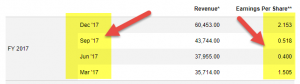

In the fast-paced world of financial trading, understanding key metrics is crucial for success. Among these metrics, the trailing and forward Price-to-Earnings (P/E) ratios are fundamental in evaluating stock performance. The P/E ratio, a measure of how much investors are willing to pay per dollar of earnings, serves as a benchmark for assessing a company's valuation. The trailing P/E ratio, based on past earnings, provides insights into how a company has performed, while the forward P/E ratio uses projected earnings to gauge future potential. In algorithmic trading, where rapid decision-making with precise calculations is essential, these ratios become particularly relevant.

Algorithmic trading, characterized by the use of automated and quantitative models to execute trades, relies heavily on financial data-driven insights. P/E ratios, being quantifiable and directly reflective of both market sentiment and company performance, are integral in shaping trading algorithms. By evaluating historical data through trailing P/E ratios and anticipating future trends with forward P/E ratios, algorithms can make informed predictions and trade executions. 



In this article, we will explore what trailing and forward P/E ratios are and their significance in the context of algo trading. Our goal is to equip you with the knowledge to leverage these metrics for better trading outcomes. Understanding these ratios can enhance your trading strategy by providing a balanced view of both historical performance and future projections, ultimately leading to more informed and potentially profitable trading decisions.

## Table of Contents

## Understanding P/E Ratios: Trailing vs Forward

The Price-to-Earnings (P/E) ratio is a pivotal indicator employed by traders and investors to evaluate a company's stock valuation. It serves as a measure of investor expectations and reflects how much investors are willing to pay per dollar of earnings. There are two primary types of P/E ratios used in financial analysis: the trailing P/E ratio and the forward P/E ratio, each serving distinct analytical purposes.

The trailing P/E ratio, also referred to as the current P/E ratio, is calculated using the actual earnings recorded over the previous 12 months. This backward-looking metric provides insights into a company’s past performance and earnings capability. Mathematically, it is expressed as follows:

$$
\text{Trailing P/E Ratio} = \frac{\text{Current Share Price}}{\text{Earnings Per Share (EPS) over the past 12 months}}
$$

This ratio helps investors understand how the market has valued a company's historical earnings and can serve as a benchmark for comparing a company's performance against its peers or the industry average.

In contrast, the forward P/E ratio leverages projected earnings for the upcoming 12 months, thus offering a forward-looking perspective. The calculation of the forward P/E ratio is similar, but it uses forecasted earnings instead:

$$
\text{Forward P/E Ratio} = \frac{\text{Current Share Price}}{\text{Estimated EPS over the next 12 months}}
$$

By focusing on expected future performance, the forward P/E ratio reflects market expectations about a company's growth potential and profitability prospects. This can be especially useful for assessing how well a company is poised to capitalize on emerging opportunities or navigate upcoming challenges.

Both trailing and forward P/E ratios provide valuable insights for investors, but they cater to different analytical perspectives: the trailing P/E focuses on historical performance, while the forward P/E considers future expectations. A thorough comprehension of both ratios aids traders in determining whether a stock is undervalued or overvalued relative to its earnings history and future potential. This evaluation can influence investment decisions and strategy adjustments, especially in rapidly changing markets where swift decision-making is essential.

## The Role of P/E Ratios in Algorithmic Trading

Algorithmic trading, also known as algo trading, involves using computer programs to execute trades based on predefined criteria without human intervention. This method requires rapid and precise decision-making, heavily reliant on data analysis. Among the various metrics used in these algorithms, Price-to-Earnings (P/E) ratios, both trailing and forward, serve as critical tools for evaluating stock value and predicting future performance.

P/E ratios provide key insights into a company's financial health. The trailing P/E ratio, based on actual earnings from the past 12 months, offers a factual foundation for assessing a stock's current valuation. It reflects the historical performance, allowing algorithms to establish a reliability benchmark for stock assessment. This historical perspective assists in reducing the [volatility](/wiki/volatility-trading-strategies) and risk associated with trading decisions.

Forward P/E ratios, on the other hand, are projections based on expected future earnings. These ratios gauge market expectations and potential future growth, providing algorithms with data to forecast performance. By leveraging both trailing and forward P/E ratios, algorithms gain a dual perspective—anchoring decisions in historical data while simultaneously considering future expectations. This dual approach enhances the capacity to identify trading opportunities through a comprehensive understanding of market dynamics and investor sentiment.

The integration of P/E ratios into trading algorithms allows for more sophisticated analyses. For instance, patterns discerned from P/E ratio trends can signal when stocks might be overvalued or undervalued, prompting buying or selling decisions. The ability to swiftly act on such insights affords algorithmic traders a distinct advantage, particularly important for institutional investors who require high efficiency and speed in their trading operations.

In conclusion, the incorporation of trailing and forward P/E ratios into [algorithmic trading](/wiki/algorithmic-trading) models offers powerful advantages in assessing market scenarios. By balancing historical performance data with future projections, these ratios provide a comprehensive framework for making informed trading decisions quickly. Consequently, algorithmic systems that effectively utilize P/E ratios can achieve enhanced accuracy and competitiveness in financial markets.

## Advantages and Limitations of Using P/E Ratios for Algo Trading

P/E ratios offer a straightforward and quantifiable approach to evaluating stock performance, making them particularly appealing to algorithmic trading systems. The trailing P/E ratio, based on actual earnings figures from the past 12 months, provides an objective measure of a company's historical performance. This grounding in real data serves as a counterbalance to over-reliance on potentially inflated growth projections. A low trailing P/E ratio might indicate that a stock is undervalued, while a high ratio could suggest overvaluation.

Forward P/E ratio, on the other hand, projects market expectations by assessing anticipated earnings over the next 12 months. This metric highlights potential growth and helps traders make informed decisions about future valuation trends. A forward P/E ratio might suggest optimism or caution among investors regarding a company's future performance.

However, P/E ratios have limitations and can be misleading if used in isolation. Sector-specific factors can significantly influence these ratios, as different industries have varying growth expectations and capital structures. For instance, technology companies typically exhibit higher P/E ratios compared to utilities due to growth potential. Additionally, macroeconomic conditions—such as [interest rate](/wiki/interest-rate-trading-strategies) changes or geopolitical disruptions—affect earnings projections and, consequently, the P/E ratios.

To maximize the utility of P/E ratios within algorithmic trading, traders should incorporate them alongside other financial indicators. Metrics such as debt-to-equity ratios, price-to-book ratios, and earnings growth rates can provide a more comprehensive picture of a stock's value. By deploying a multi-faceted strategy, algo trading systems can enhance predictive accuracy and decision-making efficacy. Using tools like Python, traders can integrate data inputs from various sources to build robust models:

```python
import numpy as np

# Example of calculating trailing and forward P/E ratios
def calculate_pe_ratios(price, earnings, projected_earnings):
    trailing_pe = price / earnings if earnings > 0 else np.nan
    forward_pe = price / projected_earnings if projected_earnings > 0 else np.nan
    return trailing_pe, forward_pe
```

Incorporating P/E ratio analysis with supplementary indicators ensures a balanced strategy, reducing the risk of misinterpretation and improving overall trading performance.

## Strategies for Incorporating P/E Ratios in Algorithmic Models

Incorporating P/E ratios into algorithmic trading models involves a blend of historical data analysis and predictive modeling techniques to optimize trading decisions. The trailing P/E ratio serves as a benchmark to assess the historical performance of a stock. This metric, derived from the past 12 months of earnings, can help monitor consistency in a company’s performance before executing a trade. By ensuring that a company has demonstrated stable earnings over time, traders can mitigate the risk associated with buying into volatile stocks.

Conversely, the forward P/E ratio plays a critical role in projecting stock performance. By leveraging analyst earnings forecasts for the upcoming 12 months, traders can use the forward P/E to make probabilistic forecasts within their algorithms. This forward-looking approach offers insights into market expectations and potential growth trajectories of stocks. In Python, the incorporation of forward P/E ratios in predictive models might resemble the following pseudocode structure:

```python
def forecast_stock_performance(forward_pe, expected_earnings_growth):
    projected_performance = forward_pe * expected_earnings_growth
    return projected_performance
```

Risk management is an essential aspect to address while integrating P/E ratios in trading models. Utilizing P/E ratio trends can aid in setting appropriate stop-loss and take-profit levels, allowing traders to cap potential losses and maximize gains. For example, a declining P/E ratio might signal an impending downturn, prompting the need for tighter stop-loss thresholds.

To enhance the accuracy of predictions and execution, balancing P/E ratio insights with real-time market data is crucial. This approach ensures that the algorithmic models remain responsive to market conditions and other external factors that might affect stock prices. By continuously adjusting the P/E-based strategy with live data feeds, traders can refine their models to adapt to market volatility.

Ultimately, integrating P/E ratios into algorithmic models requires a sophisticated balance between historical performance analysis and forward-looking predictions. By leveraging both trailing and forward P/E ratios judiciously, traders can improve both the precision and the outcomes of their algorithmic trades.

## Conclusion

Trailing and forward Price-to-Earnings (P/E) ratios are indispensable for algorithmic traders seeking to optimize their strategies and achieve superior trading outcomes. By offering insights into both historical performance and future market expectations, these ratios serve as vital tools for informed decision-making in financial markets. The integration of P/E ratios into trading algorithms facilitates a more comprehensive analysis of stock valuations, thereby enhancing the precision and reliability of trade execution.

An effective use of trailing and forward P/E ratios requires an appreciation of their distinct nuances. Trailing P/E, based on past earnings, provides a historical perspective that can highlight a stock's consistent performance or uncover potential discrepancies in its valuation. Forward P/E, on the other hand, reflects market sentiment and forecasts, enabling traders to anticipate future price movements and market opportunities. Together, these metrics allow for a balanced view of a stock's prospects, aiding in the development of adaptable trading algorithms.

Refining algorithmic models with P/E ratios not only improves the accuracy of trades but also underscores the need for continuous model adjustment and validation. The dynamic nature of financial markets requires traders to adapt their strategies regularly, leveraging updated data and evolving market conditions. By mastering P/E ratios, traders can fine-tune their algorithms to better align with market trends, ultimately securing a competitive edge.

In summary, an adept understanding and application of trailing and forward P/E ratios within algorithmic trading frameworks can yield significant advantages. These metrics, when integrated thoughtfully, empower traders with the necessary tools to navigate complex market environments, ultimately driving better performance in the fast-paced world of financial trading.

## References & Further Reading

[1]: ["Valuation: Measuring and Managing the Value of Companies, University Edition"](https://www.wiley.com/en-us/Valuation%3A+Measuring+and+Managing+the+Value+of+Companies%2C+University+Edition%2C+7th+Edition-p-9781119611868) by McKinsey & Company Inc.

[2]: ["Common Stocks and Uncommon Profits and Other Writings"](https://www.amazon.com/Common-Stocks-Uncommon-Profits-Writings/dp/0471445509) by Philip A. Fisher

[3]: ["Security Analysis: Sixth Edition, Foreword by Warren Buffett"](https://www.amazon.com/Security-Analysis-Foreword-Buffett-Editions/dp/0071592539) by Benjamin Graham and David Dodd

[4]: ["The Intelligent Investor: The Definitive Book on Value Investing"](https://www.amazon.com/Intelligent-Investor-Third-Definitive-Investing/dp/0063423537) by Benjamin Graham

[5]: ["The Book of Why: The New Science of Cause and Effect"](https://en.wikipedia.org/wiki/The_Book_of_Why) by Judea Pearl and Dana Mackenzie