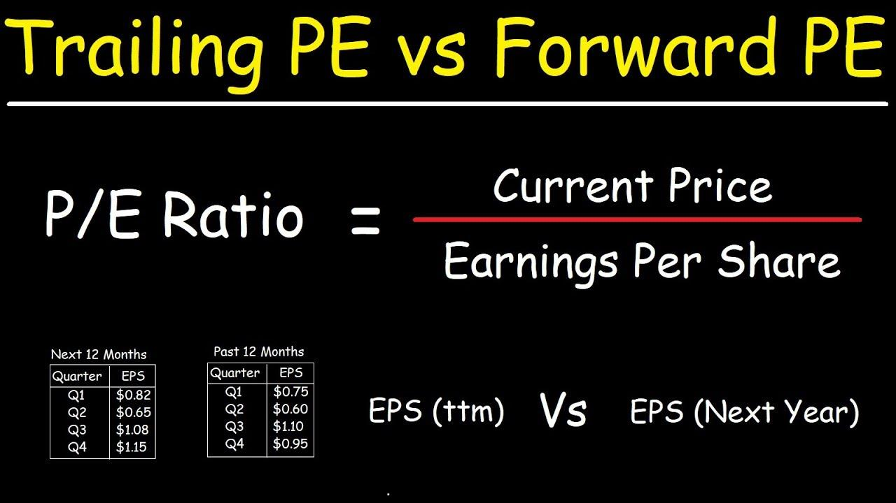

## Table of Contents

## What is a P/E ratio?

The P/E ratio, or Price-to-Earnings ratio, is a way to figure out how much people are willing to pay for a company's earnings. It's calculated by taking the current stock price of a company and dividing it by the company's earnings per share (EPS). The P/E ratio tells investors how much they are paying for each dollar of a company's earnings. A high P/E ratio might mean that investors expect the company to grow a lot in the future, while a low P/E ratio might mean the company is not expected to grow as much or could be undervalued.

Understanding the P/E ratio can help investors make better decisions about buying or selling stocks. For example, if a company has a P/E ratio that's lower than others in its industry, it might be a good buy because it could be undervalued. On the other hand, if a company's P/E ratio is much higher than its peers, it might be overvalued, and investors might want to be cautious. It's important to compare P/E ratios within the same industry because different industries can have different average P/E ratios.

## What is the difference between forward and trailing P/E ratios?

The trailing P/E ratio looks at a company's past earnings. It uses the earnings per share from the last 12 months to calculate the ratio. This gives investors an idea of how the company has been doing recently. It's like looking in the rearview mirror to see what's already happened. The trailing P/E ratio is useful because it's based on real, reported numbers, so it's more certain.

The forward P/E ratio, on the other hand, looks at what investors think the company will earn in the future. It uses the forecasted earnings per share for the next 12 months to calculate the ratio. This can be helpful because it shows what investors expect to happen. But, it's also less certain because it's based on guesses about the future. Both ratios are important, but they tell different stories about a company's value.

## How is the forward P/E ratio calculated?

The forward P/E ratio is calculated by dividing the current stock price by the forecasted earnings per share for the next 12 months. This forecast is usually made by analysts who study the company and its industry. They look at things like how fast the company is growing, what's happening in the market, and any changes in the company's costs or sales.

Because the forward P/E ratio uses predictions about the future, it can be different from the trailing P/E ratio, which uses actual past earnings. If analysts think a company will do better in the future, the forward P/E ratio might be lower than the trailing P/E ratio. But if they think the company will have a hard time, the forward P/E ratio might be higher. It's important to remember that these forecasts are just guesses, so they can be wrong.

## How is the trailing P/E ratio calculated?

The trailing P/E ratio is figured out by taking the current price of a stock and dividing it by the earnings per share (EPS) from the last 12 months. The EPS is found by taking the company's total earnings for the past year and dividing it by the number of shares that are out there. This gives you a number that shows how much you're paying for each dollar of the company's past earnings.

This ratio is handy because it uses real numbers that the company has already reported. It's like looking at a report card to see how the company did over the last year. Investors use the trailing P/E ratio to compare different companies and see if a stock might be a good buy based on its past performance.

## Why might an investor prefer to use the forward P/E ratio over the trailing P/E ratio?

An investor might prefer to use the forward P/E ratio because it gives them a peek into what they think the company will do in the future. Instead of just looking at what the company has already done, the forward P/E ratio uses guesses about next year's earnings. This can be really helpful if an investor thinks a company is about to grow a lot or if they believe the company will face some challenges. By using the forward P/E ratio, investors can make choices based on where they think the company is headed, not just where it's been.

However, it's important to remember that the forward P/E ratio is based on predictions, and those predictions can be wrong. If an investor is more comfortable with solid, known numbers, they might stick with the trailing P/E ratio. But for those who are willing to take a bit of a risk and want to base their decisions on future potential, the forward P/E ratio can be a valuable tool. It allows them to see if a stock might be a good buy because it's expected to do well in the coming year.

## Why might an investor prefer to use the trailing P/E ratio over the forward P/E ratio?

An investor might prefer to use the trailing P/E ratio because it's based on real numbers from the past year. This makes it more reliable since it uses actual earnings that the company has already reported. When you're trying to figure out if a stock is a good buy, knowing what the company has done in the past can be really helpful. It's like looking at a report card to see how well the company has performed.

On the other hand, the forward P/E ratio is based on guesses about the future, which can be tricky. If those guesses are wrong, the forward P/E ratio might not give you a good picture of the company's value. Some investors feel more comfortable sticking with the trailing P/E ratio because it's more certain and less likely to lead them astray. It helps them make decisions based on solid, known information rather than predictions that might not come true.

## What are the limitations of using forward P/E ratios?

One big problem with using forward P/E ratios is that they're based on guesses about the future. Analysts try to predict what a company will earn next year, but they can get it wrong. If they think a company will do better than it actually does, the forward P/E ratio might make the stock look like a better deal than it really is. On the flip side, if they think the company will do worse than it actually does, the stock might look more expensive than it should.

Another issue is that different analysts can have different predictions about the same company. This means that the forward P/E ratio can change depending on whose numbers you use. It can be confusing for investors because they might see different forward P/E ratios for the same stock. This makes it hard to compare stocks and make good choices. So, while forward P/E ratios can give you a peek into the future, they come with a lot of uncertainty.

## What are the limitations of using trailing P/E ratios?

One big problem with using trailing P/E ratios is that they only look at what a company has done in the past. They don't tell you anything about what might happen next. A company could have had a really good year last year, but that doesn't mean it will do well this year. If a company is about to go through some big changes or if the market is changing, the trailing P/E ratio won't show that. It's like driving a car by only looking in the rearview mirror—you might miss what's coming up ahead.

Another issue is that the trailing P/E ratio can be thrown off by one-time events. For example, if a company sold a big piece of property last year, that could make their earnings look a lot better than they really are. Or if they had to pay a huge fine, their earnings might look worse than usual. These one-time events can make the trailing P/E ratio misleading because they don't show what the company's normal earnings are like. So, while the trailing P/E ratio is based on real numbers, it still has its limits and can be tricky to use without understanding the full story behind those numbers.

## How can forward and trailing P/E ratios be used together to assess a stock's valuation?

Using forward and trailing P/E ratios together can give you a fuller picture of a stock's value. The trailing P/E ratio tells you how much you're paying for the earnings the company made over the last year. It's based on real numbers, so it's a good way to see how the company has been doing recently. If the trailing P/E ratio is low, it might mean the stock is a good buy because it's cheap compared to what the company has earned. But if it's high, the stock might be expensive compared to its past earnings.

The forward P/E ratio, on the other hand, looks at what analysts think the company will earn next year. This can help you see if the company is expected to grow or if it might have a tough time. If the forward P/E ratio is lower than the trailing P/E ratio, it might mean that analysts think the company will do better in the future. But if the forward P/E ratio is higher, it could mean they expect the company's earnings to drop. By looking at both ratios, you can get a sense of whether the stock is a good buy based on its past performance and future potential.

## What industries or sectors typically have higher forward P/E ratios and why?

Some industries, like technology and biotech, often have higher forward P/E ratios. These sectors are known for growing fast and coming up with new ideas. Investors are willing to pay more for stocks in these industries because they think the companies will make a lot more money in the future. For example, a tech company working on a new kind of computer might not be making much money right now, but if investors think that computer will be a big hit, they'll pay more for the stock.

Another reason why some sectors have higher forward P/E ratios is because they are seen as safer bets for the future. For instance, companies in the healthcare sector might have higher forward P/E ratios because people always need healthcare, no matter what's going on in the economy. Investors are willing to pay more for these stocks because they think the companies will keep making money, even if times get tough. So, it's not just about growth; it's also about how sure investors are that a company will do well in the future.

## How do economic cycles affect the reliability of forward versus trailing P/E ratios?

Economic cycles can make forward P/E ratios less reliable because they are based on guesses about the future. When the economy is doing well, people might be too hopeful about how much money companies will make, so they might pay too much for stocks based on forward P/E ratios. But if the economy starts to slow down or goes into a recession, those guesses can be way off. Companies might not make as much money as expected, which means the forward P/E ratio can make stocks look cheaper than they really are. So, during different parts of the economic cycle, forward P/E ratios can be tricky to use because they depend a lot on what people think will happen, not what is actually happening.

On the other hand, trailing P/E ratios are more reliable during economic cycles because they use real numbers from the past. If the economy has been doing well, the trailing P/E ratio will show that companies have been making more money. But if the economy has been struggling, the trailing P/E ratio will show that companies have been making less money. The problem is that trailing P/E ratios don't tell you anything about what might happen next. So, while they are more reliable because they are based on what has already happened, they might not be as helpful if you want to know how a company will do in the future, especially if the economy is about to change.

## Can you provide a case study where the choice between forward and trailing P/E ratios significantly impacted investment decisions?

Let's look at a case study involving a tech company called "TechGrow." A few years ago, TechGrow was working on a new kind of smartphone that they believed would be a game-changer. At the time, their trailing P/E ratio was very high because they hadn't made much money in the last year while they were developing the phone. But analysts were excited about the new product and predicted that TechGrow would start making a lot more money once it hit the market. This led to a much lower forward P/E ratio, suggesting the stock was a good buy if you believed in the company's future.

An investor named Sarah was looking at TechGrow's stock. She saw the high trailing P/E ratio and thought the stock was too expensive based on what the company had earned in the past. But when she looked at the forward P/E ratio, it told a different story. It showed that if TechGrow's new smartphone was a hit, the stock could be a great investment. Sarah decided to buy the stock based on the forward P/E ratio, believing in the company's future potential. A year later, when the smartphone became a huge success, TechGrow's earnings soared, and Sarah's investment paid off big time. This case shows how using both forward and trailing P/E ratios can help investors make better decisions, especially when a company is on the brink of big changes.

## What is the difference between Trailing and Forward P/E Ratios?

The Price-to-Earnings (P/E) ratio is a pivotal indicator employed by traders and investors to evaluate a company's stock valuation. It serves as a measure of investor expectations and reflects how much investors are willing to pay per dollar of earnings. There are two primary types of P/E ratios used in financial analysis: the trailing P/E ratio and the forward P/E ratio, each serving distinct analytical purposes.

The trailing P/E ratio, also referred to as the current P/E ratio, is calculated using the actual earnings recorded over the previous 12 months. This backward-looking metric provides insights into a company’s past performance and earnings capability. Mathematically, it is expressed as follows:

$$
\text{Trailing P/E Ratio} = \frac{\text{Current Share Price}}{\text{Earnings Per Share (EPS) over the past 12 months}}
$$

This ratio helps investors understand how the market has valued a company's historical earnings and can serve as a benchmark for comparing a company's performance against its peers or the industry average.

In contrast, the forward P/E ratio leverages projected earnings for the upcoming 12 months, thus offering a forward-looking perspective. The calculation of the forward P/E ratio is similar, but it uses forecasted earnings instead:

$$
\text{Forward P/E Ratio} = \frac{\text{Current Share Price}}{\text{Estimated EPS over the next 12 months}}
$$

By focusing on expected future performance, the forward P/E ratio reflects market expectations about a company's growth potential and profitability prospects. This can be especially useful for assessing how well a company is poised to capitalize on emerging opportunities or navigate upcoming challenges.

Both trailing and forward P/E ratios provide valuable insights for investors, but they cater to different analytical perspectives: the trailing P/E focuses on historical performance, while the forward P/E considers future expectations. A thorough comprehension of both ratios aids traders in determining whether a stock is undervalued or overvalued relative to its earnings history and future potential. This evaluation can influence investment decisions and strategy adjustments, especially in rapidly changing markets where swift decision-making is essential.

## References & Further Reading

[1]: ["Valuation: Measuring and Managing the Value of Companies, University Edition"](https://www.wiley.com/en-us/Valuation%3A+Measuring+and+Managing+the+Value+of+Companies%2C+University+Edition%2C+7th+Edition-p-9781119611868) by McKinsey & Company Inc.

[2]: ["Common Stocks and Uncommon Profits and Other Writings"](https://www.amazon.com/Common-Stocks-Uncommon-Profits-Writings/dp/0471445509) by Philip A. Fisher

[3]: ["Security Analysis: Sixth Edition, Foreword by Warren Buffett"](https://www.amazon.com/Security-Analysis-Foreword-Buffett-Editions/dp/0071592539) by Benjamin Graham and David Dodd

[4]: ["The Intelligent Investor: The Definitive Book on Value Investing"](https://www.amazon.com/Intelligent-Investor-Third-Definitive-Investing/dp/0063423537) by Benjamin Graham

[5]: ["The Book of Why: The New Science of Cause and Effect"](https://en.wikipedia.org/wiki/The_Book_of_Why) by Judea Pearl and Dana Mackenzie