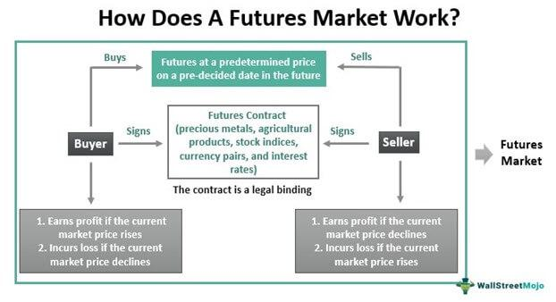

In the world of investing, traders are presented with a variety of avenues to grow their wealth, notably through futures trading, stock trading, and algorithmic trading. Each of these trading methodologies offers distinct mechanisms, advantages, and challenges, appealing to different types of investors.

Futures trading involves the buying and selling of contracts that mandate the exchange of an asset at a predetermined price on a specific future date. This method is highly leveraged, allowing significant market exposure with a relatively small initial investment. It is especially prevalent in the trading of commodities, currencies, and indices, offering a way to hedge against price fluctuations. Meanwhile, stock trading pertains to purchasing and selling shares of ownership in publicly-listed companies. This traditional method enables investors to earn through capital appreciation and dividends, while also participating in the economic growth and governance of these entities. The stock market is known for its liquidity and extensive trading hours, attributes that enhance its appeal as an investment strategy.



Recently, algorithmic trading has emerged as a transformative force in financial markets. Utilizing pre-programmed algorithms, this approach automates trading decisions, executing trades with minimal human intervention. By processing vast amounts of data rapidly, algorithmic trading can make precise, efficient decisions based on predetermined strategies, reducing the impact of emotional biases that often affect human traders.

This article seeks to furnish a thorough comparison of these trading methodologies, equipping investors with the necessary insights to make informed decisions. Furthermore, it will examine the revolutionary impact of algorithmic trading in reshaping investment strategies, enabling sophisticated techniques like statistical arbitrage, momentum trading, and more. Navigating through these diverse trading strategies can empower investors to balance risks and optimize returns.

## Table of Contents

## Understanding Stock Trading

Stock trading encompasses the buying and selling of shares in publicly traded companies, serving as a fundamental component of the financial markets. It is a mechanism through which companies raise capital and investors seek to attain financial returns. At its core, stock trading is based on the fluctuations in stock prices and the potential for dividends.

### Capital Gains and Dividends

Investors in stock markets primarily earn returns through two key methods: capital gains and dividends. Capital gains occur when an investor sells a stock at a higher price than the purchase price, resulting in profit. The formula to calculate capital gains is:

$$
\text{Capital Gain} = \text{Selling Price} - \text{Purchase Price}
$$

Dividends, on the other hand, are periodic payments made by a company to its shareholders out of its profits. These payments can provide a consistent income stream. Companies may offer dividends as a way of distributing a portion of their earnings directly to shareholders, typically on a quarterly basis.

### Liquidity and Growth Participation

One of the significant advantages of stock trading is [liquidity](/wiki/liquidity-risk-premium). Stocks are generally considered liquid assets because they can be quickly bought or sold on the stock exchange with minimal price changes. This liquidity provides flexibility, allowing investors to enter or [exit](/wiki/exit-strategy) positions conveniently, which is beneficial during volatile market conditions.

Stock trading also allows investors to participate in a company's growth. As a company expands its operations and revenues, its stock price may increase, thereby providing capital gains to shareholders. This participation in growth is particularly appealing for long-term investors who are interested in holding stocks over extended periods to capitalize on potential market trends and company developments.

In conclusion, stock trading provides avenues for capital appreciation through both price appreciation and dividend income. Its inherent liquidity and potential growth advantages make it a compelling option for investors aiming to benefit from the dynamic nature of financial markets.

## Exploring Futures Trading

Futures trading is a form of financial trading involving contracts that obligate the parties to transact an asset at a predetermined future date and price. These contracts, known as futures contracts, bind the buyer to purchase the asset or the seller to sell the asset at the specified price, regardless of the current market conditions at the date of expiration.

A key feature of futures trading is its leverage. Leverage allows traders to control a large contract value with a relatively small amount of capital. This is achieved through the initial margin requirement, a fraction of the contract's total value, which must be deposited to enter into a trading position. High leverage can significantly amplify potential returns, but it also entails greater risk, as losses can exceed the initial investment. 

Futures contracts are utilized across various asset classes, most notably commodities, currencies, and financial indexes. In commodities, futures trading encompasses a wide array of physical goods including oil, gold, and agricultural products such as wheat and corn. Currency futures enable traders to hedge or speculate on the future value of different currencies, while index futures involve contracts based on stock or bond indices, allowing investors to gain exposure to broad market movements.

A primary advantage of futures trading lies in its hedging capabilities. Businesses and investors use futures to mitigate risks associated with price fluctuations. For instance, a farmer may sell agricultural futures to lock in prices and protect against a fall in crop prices, while an airline might buy oil futures to safeguard against rising fuel costs. This aspect of futures trading is crucial for industries where price stability directly impacts profitability.

In the context of math, futures trading can involve calculating potential gains or losses based on price changes. For example, consider a futures contract with a nominal value of $N$, an initial margin $M$, and a price change $\Delta P$. The profit or loss from the trade can be calculated as:

$$
\text{Profit/Loss} = N \times \Delta P
$$

Leveraging Python, traders can build simulations or models to assess potential outcomes. Here's a simple script to calculate the profit or loss from a hypothetical futures trade:

```python
def calculate_profit_loss(contract_value, price_change):
    return contract_value * price_change

# Example usage
nominal_value = 10000  # Contract nominal value
price_change = 0.02    # 2% price change

profit_loss = calculate_profit_loss(nominal_value, price_change)
print(f"Profit/Loss: ${profit_loss}")
```

In summary, futures trading offers significant opportunities for both speculation and risk management. Its high leverage and diverse applicability across asset classes make it an attractive option for investors looking to capitalize on market fluctuations or hedge against potential financial uncertainties.

## Advantages of Futures over Stocks

Futures trading offers several advantages over stock trading, making it an attractive option for many investors. One of the primary benefits is the greater leverage it provides. Leverage in futures trading is achieved through margin, allowing traders to control a larger position with a relatively small amount of capital. This is possible because futures contracts require only a fraction of the contract's value as an initial margin. For instance, if an asset costs $100,000 and the margin requirement is 10%, an investor only needs to commit $10,000 to control the $100,000 asset. This high leverage can amplify both potential gains and losses, making it a double-edged sword.

Another advantage of futures trading is the lower trading costs associated with it. Since futures are often traded on standardized contracts and through centralized exchanges, the costs per transaction tend to be lower. This can be particularly beneficial for high-frequency traders who execute a large number of trades in a short period. Additionally, the fact that futures contracts have standardized terms and are settled daily reduces the overhead related to trading.

Futures markets provide longer trading hours compared to most stock markets. Many futures exchanges operate nearly 24 hours a day, allowing traders to respond more swiftly to global events or shifts in market conditions. This round-the-clock trading can be vital for international investors or those who aim to manage risk in volatile markets.

Moreover, futures allow investors to benefit from market movements without the need to own the underlying assets. This means investors can speculate on the price movements of commodities, currencies, or indices without having the physical burden of owning them. For instance, an investor can take a long position in [crude oil](/wiki/crude-oil) futures expecting prices to rise, or short the same if they anticipate a decline, with no need to store or handle the physical oil.

In summary, the advantages of futures trading over stocks include its leverage, reduced trading costs, extended trading hours, and the opportunity to capitalize on market movements without asset ownership. These characteristics make futures a powerful tool for traders seeking to maximize their capital efficiency and market engagement.

 to Algo Trading

Algorithmic trading, also known as algo trading, refers to the use of computer programs to execute trades based on predetermined criteria without human intervention. This method has revolutionized the trading landscape by leveraging high-frequency data, allowing for rapid and efficient trade execution. The core principle behind [algorithmic trading](/wiki/algorithmic-trading) is the automation of trading strategies, which can be based on various inputs such as timing, price, quantity, or any other mathematical model.

Algo trading takes advantage of the speed and processing power of computers to scan multiple markets and assets simultaneously, execute orders in milliseconds, and capitalize on short-lived trading opportunities. Due to its efficiency, algorithmic trading is widely used by hedge funds, investment banks, and institutional traders.

One of the main benefits of algorithmic trading is the reduction of emotions in trading decisions. Human traders are often influenced by cognitive biases or emotional reactions, such as fear or greed, which can adversely affect their performance. By automating the process, algorithms can consistently execute trades based on logic and predefined rules, reducing the influence of emotional biases.

Moreover, algorithms can process and analyze large volumes of data in real-time, enabling them to identify patterns or trends that human traders might miss. This capability is particularly advantageous in high-frequency trading ([HFT](/wiki/high-frequency-trading-strategies)), where milliseconds can determine the success or failure of a trade. Algorithmic trading systems can utilize various strategies, including [trend following](/wiki/trend-following), [arbitrage](/wiki/arbitrage), market-making, and [statistical arbitrage](/wiki/statistical-arbitrage).

Python is often used in developing algorithmic trading systems due to its flexibility and the availability of numerous libraries for data analysis and [machine learning](/wiki/machine-learning). A simple example of an algorithmic trading strategy in Python might involve using moving averages to generate buy or sell signals:

```python
import pandas as pd

# Load historical price data into a DataFrame
data = pd.read_csv('historical_data.csv')

# Calculate short and long moving averages
data['short_ma'] = data['Close'].rolling(window=10).mean()
data['long_ma'] = data['Close'].rolling(window=50).mean()

# Generate buy/sell signals
data['signal'] = 0
data['signal'][data['short_ma'] > data['long_ma']] = 1  # Buy signal
data['signal'][data['short_ma'] < data['long_ma']] = -1  # Sell signal
```

In this code, moving averages are used to determine market trends. When the short moving average crosses above the long moving average, the strategy generates a buy signal. Conversely, when the short moving average falls below the long moving average, a sell signal is triggered. This simple model can be further enhanced by incorporating additional indicators and risk management protocols.

Algorithmic trading continues to evolve with advancements in technology, particularly in [artificial intelligence](/wiki/ai-artificial-intelligence) and machine learning, which are being integrated to improve predictive analytics and decision-making capabilities. As algo trading grows more sophisticated, it is poised to play an even more significant role in shaping modern investment strategies.

## Comparing Trading Strategies

Stock, futures, and algorithmic trading embody diverse strategies and risk profiles that cater to different investor needs and market conditions. Stock trading primarily involves the direct buying and selling of shares of publicly traded companies, making it highly accessible and liquid. The strategy often revolves around analyzing a company’s fundamentals and market conditions to predict share price movements, aiming for capital gains or income from dividends.

Futures trading, on the other hand, centers around contracts obligating the buyer to purchase, or the seller to sell, an asset at a predetermined future date and price. This strategy is particularly beneficial for hedgers and speculators looking for leverage to enhance potential returns or mitigate risks. The inherent leverage in futures can amplify both gains and losses, necessitating careful risk management.

Algorithmic trading employs computer algorithms to execute trades based on predetermined criteria such as timing, price, and [volume](/wiki/volume-trading-strategy). By leveraging high-frequency data, algorithmic trading can optimize the entry and exit points, minimizing human emotional biases, and enhancing efficiency and execution speed. This method allows traders to implement complex strategies that are challenging to execute manually, enabling the exploitation of short-lived market opportunities.

Investors must carefully evaluate their risk tolerance, financial goals, and prevailing market conditions when choosing between these trading strategies. Stock trading may appeal to those seeking steady long-term growth with moderate risk. Futures trading could attract those willing to accept higher risks for potential significant returns. Meanwhile, algorithmic trading can be advantageous for those with the technical prowess to harness technology effectively.

A hybrid approach, combining traditional and algorithmic trading methods, can optimize an investment portfolio by balancing risks and maximizing potential returns. For instance, algorithms can be deployed to execute trades within a broader stock or futures strategy, facilitating improved timing and efficiency. This integrative approach allows investors to capitalize on the systematic advantages of algorithmic methods while benefiting from traditional market insights.

By applying a strategic blend of these trading methods, investors can navigate market [volatility](/wiki/volatility-trading-strategies) more effectively and enhance their overall investment performance.

## The Impact of Technology on Trading

Technology has significantly enhanced the capabilities of trading platforms, fundamentally transforming how transactions are conducted across financial markets. One of the notable advancements is automated trading, which leverages pre-programmed algorithms to execute trades. This form of trading has a twofold advantage. Firstly, it mitigates emotional biases that can cloud human judgment, leading to more rational trading decisions. Secondly, automated systems enhance execution speed, allowing traders to capitalize on fleeting market opportunities that might be missed in manual trading environments.

Emerging technologies such as Artificial Intelligence (AI) are playing a pivotal role in further refining trading strategies. AI algorithms are adept at analyzing vast datasets with high efficiency, extracting patterns, and generating predictive insights that inform trading decisions. Machine learning models, a subset of AI, can adapt to new data inputs and improve their predictions over time, making them invaluable for developing robust trading strategies. For instance, models like neural networks can be trained to recognize complex patterns in price data, offering traders a predictive edge.

Python, a popular programming language in data science and finance, provides an accessible platform for implementing algorithmic trading strategies. For example, using libraries such as TensorFlow or scikit-learn, traders can build models to forecast market trends based on historical data. Here is a simple Python code snippet utilizing a basic machine learning model for prediction:

```python
import numpy as np
from sklearn.model_selection import train_test_split
from sklearn.ensemble import RandomForestRegressor

# Sample data
X = np.random.rand(100, 10)  # Features
y = np.random.rand(100)      # Target variable

# Splitting the data into training and test sets
X_train, X_test, y_train, y_test = train_test_split(X, y, test_size=0.2, random_state=42)

# Model initialization
model = RandomForestRegressor(n_estimators=100, random_state=42)

# Training the model
model.fit(X_train, y_train)

# Predicting
predictions = model.predict(X_test)
```

In addition to improving trading strategy development, technology also enhances other facets of trading such as risk management and compliance. Advanced analytics and AI models can evaluate risk exposures in real-time, offering insights that help in maintaining a balanced risk-reward ratio. Moreover, trading platforms equipped with sophisticated algorithms can automatically comply with regulatory requirements, reducing the compliance burden on financial institutions.

The integration of technology in trading is not just limited to systems development; it also fosters innovation in new trading products and services, such as cryptocurrencies and decentralized finance platforms. These innovations challenge traditional market structures and offer diverse avenues for investment.

In summary, technology is a driving force in modern trading, offering tools that enhance efficiency, accuracy, and strategic depth. As technologies continue to evolve, their impact on trading strategies and market dynamics is likely to further increase, opening new possibilities for investors worldwide.

## Choosing the Right Approach

Selecting the appropriate trading method—whether it be stock, futures, or algorithmic trading—largely hinges on an investor's specific preferences, resources, and expertise. Each trading type presents unique benefits and challenges that align differently with individual financial goals and risk appetites.

To determine the optimal approach, investors should first assess their available resources, such as capital and technological tools. Stock trading typically requires substantial capital to build a diversified portfolio, especially if aiming to realize significant returns through capital gains or dividends. In contrast, futures trading can be more accessible in terms of initial capital requirements due to its leveraged nature, allowing traders to control large positions with a relatively small margin deposit. Algorithmic trading, however, necessitates access to advanced technological resources, including sophisticated software and powerful computational infrastructure, to effectively execute high-frequency trades.

Expertise also plays a pivotal role in selecting a trading strategy. Stock trading may appeal to investors with a deep understanding of specific companies or industries, enabling informed decisions based on qualitative and quantitative analyses. Futures trading demands proficiency in market predictions and an understanding of leverage and margin requirements, as missteps can lead to amplified losses. Algorithmic trading requires a different skill set, primarily focused on quantitative analysis and programming capabilities, to develop and optimize trading algorithms that can swiftly react to market conditions.

Market insights are integral to tailoring trading strategies to current conditions. A comprehensive understanding of economic indicators, market trends, and geopolitical events is essential for stock and futures traders to capitalize on potential market movements. Algorithmic trading leverages these insights differently, employing data-driven algorithms to forecast trends and make real-time decisions, potentially providing an edge in volatile markets.

Diversification across these trading methods can help investors balance risks and rewards. For example, while futures offer opportunities for significant returns through leverage, they also [carry](/wiki/carry-trading) higher risk, which can be countered by the stability and potential steady growth of a well-chosen stock portfolio. Algorithmic techniques can further enhance a traditional trading strategy by providing speed and efficiency, reducing the emotional biases that often accompany manual trading.

In conclusion, the choice of trading strategy should be measured against an investor's capital availability, expertise, and market insights. By diversifying across different trading types and leveraging the strengths of each, investors can create a balanced portfolio that aligns with their risk tolerance and financial objectives.

## Conclusion

Both futures and stock trading present distinct advantages and challenges for investors, contributing to a well-rounded investment portfolio. Futures trading offers significant leverage, allowing investors to control large positions with a relatively small amount of capital. This aspect makes it particularly appealing for those looking to hedge or speculate on price movements in commodities, currencies, and indices. However, the high leverage also entails increased risk, making it crucial for traders to employ stringent risk management practices.

Stock trading, on the other hand, provides investors with the opportunity to earn through capital gains and dividends by owning shares of publicly traded companies. It is characterized by greater market liquidity and the potential to benefit from long-term growth and appreciation. Nevertheless, stock trading requires a robust understanding of market trends and the ability to respond quickly to changes to capitalize on opportunities.

Algorithmic trading propels these traditional methods into the modern age by leveraging automated systems for executing trades with precision and speed. By minimizing human intervention, algorithmic trading enhances efficiency, reduces emotional bias, and enables the execution of complex trading strategies that are otherwise challenging to implement manually. This technology-driven approach offers a competitive edge in the fast-paced trading environment.

An informed strategy, balancing the merits of futures, stock, and algorithmic trading, can lead to successful investment outcomes. Investors should carefully assess their risk tolerance, financial objectives, and market acumen when determining their approach. Embracing a diversified strategy that incorporates various trading techniques can optimize returns while mitigating potential risks. By staying informed and adaptable in an ever-evolving market landscape, investors can effectively navigate the complexities of trading and achieve their financial goals.

## References & Further Reading

[1]: Hull, J. C. (2014). ["Options, Futures, and Other Derivatives"](https://www.amazon.com/Options-Futures-Other-Derivatives-9th/dp/0133456315). Pearson Education.

[2]: Aldridge, I. (2013). ["High-Frequency Trading: A Practical Guide to Algorithmic Strategies and Trading Systems"](https://www.amazon.com/High-Frequency-Trading-Practical-Algorithmic-Strategies/dp/1118343506). Wiley Finance.

[3]: Chan, E. P. (2009). ["Quantitative Trading: How to Build Your Own Algorithmic Trading Business"](https://github.com/ftvision/quant_trading_echan_book). Wiley.

[4]: Aronson, D. R. (2007). ["Evidence-Based Technical Analysis: Applying the Scientific Method and Statistical Inference to Trading Signals"](https://www.amazon.com/Evidence-Based-Technical-Analysis-Scientific-Statistical/dp/0470008741). Wiley.

[5]: Jansen, S. (2018). ["Machine Learning for Algorithmic Trading"](https://searchworks.stanford.edu/view/13246850). Packt Publishing.