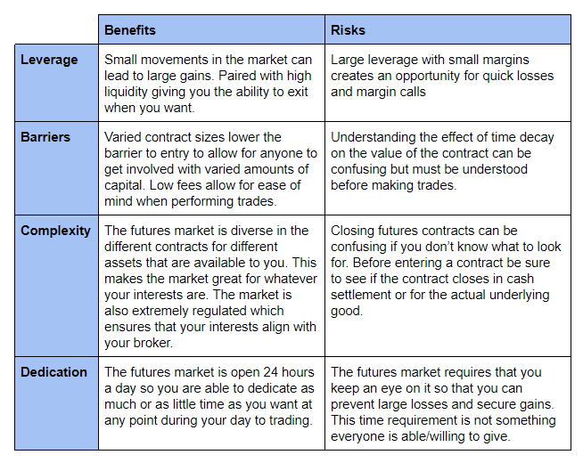

## Table of Contents

## What are futures and how do they differ from stocks?

Futures are contracts to buy or sell an asset at a set price on a future date. They are used by investors to bet on the future price of things like oil, gold, or stock indexes. Unlike stocks, which you own outright, futures are agreements that you have to fulfill or close out before they expire. This means you're not actually buying the asset right away, but agreeing to a transaction that will happen later.

Stocks, on the other hand, represent ownership in a company. When you buy a stock, you own a piece of that company and can benefit from its growth through rising stock prices or dividends. Stocks are generally seen as long-term investments, while futures are often used for short-term trading or to hedge against price changes. The key difference is that stocks give you a stake in a company, whereas futures are more about predicting and managing future price movements of various assets.

## What are the basic advantages of trading stocks for beginners?

Trading stocks can be a good way for beginners to start investing. One big advantage is that you can start with a small amount of money. Many brokers let you buy pieces of stocks, so you don't need a lot of money to begin. This makes it easier for new investors to get started without feeling overwhelmed. Also, stocks are easy to understand. You're buying a part of a company, and if the company does well, the value of your stock might go up. This simplicity can help beginners feel more comfortable as they learn about investing.

Another advantage is that stocks can grow over time. If you pick good companies and hold onto your stocks, you might see your investment increase in value. Plus, some companies pay dividends, which are like little bonuses that can add up over time. This can be a great way to build wealth slowly. Stocks also give you a lot of choices. There are thousands of companies to choose from, so you can find ones that match your interests or beliefs. This variety can make investing more fun and engaging for beginners.

## How can futures trading benefit someone starting their investment journey?

Futures trading can be a good way for someone starting their investment journey because it lets you use leverage. This means you can control a big investment with just a small amount of money. For example, instead of buying a lot of oil, you can buy a futures contract that lets you bet on the price of oil without actually owning it. This can make your money grow faster, but it's also riskier, so beginners need to be careful and learn a lot before they start.

Another benefit of futures trading for new investors is that it can help you learn about different markets. Futures are available for things like farm products, metals, and even stock indexes. By trading futures, you can get a feel for how these different markets work and how prices can change. This knowledge can make you a smarter investor overall. Plus, futures can be a way to protect other investments you might have. If you're worried about prices going down, you can use futures to balance out those risks.

## What are the key risks associated with futures trading compared to stock trading?

Futures trading can be riskier than stock trading because of something called leverage. When you trade futures, you can control a big investment with just a small amount of money. This means you can make a lot of money quickly if things go your way, but you can also lose a lot if they don't. It's like using a magnifying glass on your money - it can make both gains and losses bigger. In stock trading, you usually need more money to start, and the changes in your investment are usually slower and less dramatic.

Another big risk with futures trading is that you have to meet something called margin calls. This means if the price of what you're betting on goes against you, you might need to add more money to your account to keep your position open. If you can't add more money, your position might be closed out, and you could lose what you've invested. With stocks, you don't usually have to worry about margin calls unless you're using borrowed money. Futures also have a set end date, so you have to close your position before it expires, which can add pressure and risk that you don't have with stocks, which you can hold for as long as you want.

## How does the leverage in futures trading compare to stock trading and what are the implications?

Leverage in futures trading lets you control a big investment with just a small amount of money. For example, if you want to bet on the price of oil, you can buy a futures contract without actually buying the oil. This means you can make a lot more money if the price goes the way you expect. But it also means you can lose a lot more if it doesn't. In stock trading, you usually need more money to start, and the leverage is less. You can use something called margin to borrow money for stocks, but it's not as high as in futures.

The big difference in leverage between futures and stocks has big implications. In futures, because you're using so much leverage, your money can grow or shrink very quickly. This can be exciting but also very risky, especially for beginners. With stocks, the changes in your investment are usually slower and less dramatic. This means you might not make as much money as fast, but you're also less likely to lose it all in a short time. So, futures can be a bit like riding a roller coaster, while stocks might feel more like a steady drive.

## Can you explain the liquidity differences between futures and stock markets?

The futures market can be very liquid, which means it's easy to buy and sell futures contracts quickly. This is because a lot of people and big companies trade futures every day. They use futures to bet on prices or protect themselves from price changes. Because so many people are trading, you can usually find someone to buy or sell to you without waiting long. This makes futures a good choice if you want to get in and out of trades fast.

The stock market is also liquid, but it can vary a lot depending on which stocks you're looking at. Big, well-known companies usually have very liquid stocks. You can buy and sell these stocks easily because lots of people are trading them. But smaller companies might have less liquid stocks. It can take longer to find someone to buy or sell these stocks, and the price might change more when you do trade. So, if you're trading stocks, you might need to think about how easy it will be to sell them later.

## What are the tax implications of trading futures versus stocks?

When you trade futures, the tax rules are a bit different from stocks. In the U.S., futures are taxed under Section 1256 of the tax code. This means that no matter how long you hold a futures contract, 60% of your gains or losses are treated as long-term capital gains, and 40% as short-term capital gains. Long-term capital gains are usually taxed at a lower rate than your regular income, which can be a good thing. But, you have to report these gains every year, even if you didn't close out your futures position.

With stocks, the tax rules depend on how long you hold them. If you hold a stock for more than a year before selling it, any profit you make is considered a long-term capital gain, and it's taxed at a lower rate. If you sell a stock within a year, the profit is a short-term capital gain, and it's taxed as regular income, which could be higher. Also, if you get dividends from stocks, those are usually taxed as regular income too. So, the tax you pay on stocks can be different depending on how long you keep them and whether you get dividends.

## How do the trading hours for futures compare to those for stocks and what advantages does this provide?

Futures trading hours are longer than stock trading hours. While the stock market is usually open from 9:30 AM to 4:00 PM Eastern Time, Monday through Friday, futures markets can be open almost all the time. Some futures markets start trading at 6:00 PM Eastern Time the day before and go until 5:00 PM the next day. This means you can trade futures at night, on weekends, or even early in the morning before the stock market opens.

The longer hours for futures trading can be a big advantage. It lets you react to news and events that happen outside of regular stock market hours. For example, if something important happens in another country overnight, you can trade futures right away instead of waiting for the stock market to open. This can help you make decisions faster and maybe make more money. Plus, if you have a job during the day, you can still trade futures in the evening or on weekends when you have more time.

## What role do futures play in portfolio diversification compared to stocks?

Futures can help you spread out your investments in ways that stocks alone can't. When you add futures to your portfolio, you're not just betting on one company or a few companies like you do with stocks. Futures let you bet on the price of things like oil, gold, or even the overall stock market. This means you can add different kinds of investments to your portfolio, which can help balance out the risk. If the stock market goes down, maybe the price of gold will go up, and your futures on gold can help make up for the losses in your stocks.

Using futures for diversification also lets you protect your investments from big changes in prices. For example, if you're worried that the price of oil might go up and hurt your other investments, you can buy futures that will make money if the price of oil does go up. This way, you're not just hoping that all your investments will do well at the same time. Futures give you more tools to manage risk and keep your portfolio steady, even when the market is unpredictable.

## How do the margin requirements for futures trading differ from those for stock trading?

Margin requirements for futures trading are usually lower than for stock trading. When you trade futures, you only need to put down a small amount of money, called the initial margin, to open a position. This can be just a few percent of the total value of the contract. For example, if you want to trade a futures contract worth $100,000, you might only need to put down $5,000. This makes it easier to start trading futures, but it also means you're using a lot of leverage, which can be risky.

In stock trading, the margin requirements are higher. If you want to buy stocks on margin, you usually need to put down at least 50% of the total cost of the stock. So, if you want to buy $10,000 worth of stock, you'd need to have $5,000 in your account. This higher margin requirement means you're not using as much leverage as with futures, which can make stock trading less risky. But it also means you need more money to start trading stocks on margin.

## What advanced strategies can be employed in futures trading that are not typically used in stock trading?

In futures trading, one advanced strategy you can use is called spreading. This means you buy one futures contract and sell another one at the same time. The idea is to make money from the difference in prices between the two contracts. For example, you might buy a futures contract for oil that expires in three months and sell one that expires in six months. If the price difference between these two contracts changes in a way you expect, you can make money. This strategy can help you manage risk because you're not just betting on the price going up or down, but on how the prices change relative to each other.

Another strategy is called hedging. This is when you use futures to protect other investments you have. For example, if you own a farm and you're worried that the price of corn might go down before you sell your crop, you can sell corn futures. If the price of corn does go down, you'll lose money on your actual corn, but you'll make money on your futures contract, which can help balance out the loss. This kind of strategy is not as common in stock trading because stocks don't usually have the same kind of direct connection to other assets that futures do.

## How do market volatility and economic indicators affect futures and stock trading differently?

Market [volatility](/wiki/volatility-trading-strategies) and economic indicators can affect futures and stock trading in different ways. Futures are often more sensitive to quick changes in the market because they are used to bet on the future prices of things like oil, gold, or stock indexes. When there's a lot of volatility, the prices of futures can swing a lot in a short time. This can be good if you guess right and make money quickly, but it can also be bad if you lose money fast. Economic indicators, like reports on jobs or inflation, can also make futures prices move a lot because they give traders new information to bet on.

Stocks, on the other hand, can be affected by market volatility too, but usually in a slower and less dramatic way. When the market is volatile, stock prices might go up and down, but the changes are often not as big as with futures. This is because stocks represent ownership in a company, and the value of a company doesn't usually change as fast as the price of a commodity. Economic indicators can also move stock prices, but the impact might be more spread out over time. For example, a good jobs report might make people feel more confident about the economy, which can slowly push stock prices up as more people want to invest.

## What is Understanding Stock Trading?

Stock trading encompasses the buying and selling of shares in publicly traded companies, serving as a fundamental component of the financial markets. It is a mechanism through which companies raise capital and investors seek to attain financial returns. At its core, stock trading is based on the fluctuations in stock prices and the potential for dividends.

### Capital Gains and Dividends

Investors in stock markets primarily earn returns through two key methods: capital gains and dividends. Capital gains occur when an investor sells a stock at a higher price than the purchase price, resulting in profit. The formula to calculate capital gains is:

$$
\text{Capital Gain} = \text{Selling Price} - \text{Purchase Price}
$$

Dividends, on the other hand, are periodic payments made by a company to its shareholders out of its profits. These payments can provide a consistent income stream. Companies may offer dividends as a way of distributing a portion of their earnings directly to shareholders, typically on a quarterly basis.

### Liquidity and Growth Participation

One of the significant advantages of stock trading is [liquidity](/wiki/liquidity-risk-premium). Stocks are generally considered liquid assets because they can be quickly bought or sold on the stock exchange with minimal price changes. This liquidity provides flexibility, allowing investors to enter or [exit](/wiki/exit-strategy) positions conveniently, which is beneficial during volatile market conditions.

Stock trading also allows investors to participate in a company's growth. As a company expands its operations and revenues, its stock price may increase, thereby providing capital gains to shareholders. This participation in growth is particularly appealing for long-term investors who are interested in holding stocks over extended periods to capitalize on potential market trends and company developments.

In conclusion, stock trading provides avenues for capital appreciation through both price appreciation and dividend income. Its inherent liquidity and potential growth advantages make it a compelling option for investors aiming to benefit from the dynamic nature of financial markets.

## What is Exploring Futures Trading?

Futures trading is a form of financial trading involving contracts that obligate the parties to transact an asset at a predetermined future date and price. These contracts, known as futures contracts, bind the buyer to purchase the asset or the seller to sell the asset at the specified price, regardless of the current market conditions at the date of expiration.

A key feature of futures trading is its leverage. Leverage allows traders to control a large contract value with a relatively small amount of capital. This is achieved through the initial margin requirement, a fraction of the contract's total value, which must be deposited to enter into a trading position. High leverage can significantly amplify potential returns, but it also entails greater risk, as losses can exceed the initial investment. 

Futures contracts are utilized across various asset classes, most notably commodities, currencies, and financial indexes. In commodities, futures trading encompasses a wide array of physical goods including oil, gold, and agricultural products such as wheat and corn. Currency futures enable traders to hedge or speculate on the future value of different currencies, while index futures involve contracts based on stock or bond indices, allowing investors to gain exposure to broad market movements.

A primary advantage of futures trading lies in its hedging capabilities. Businesses and investors use futures to mitigate risks associated with price fluctuations. For instance, a farmer may sell agricultural futures to lock in prices and protect against a fall in crop prices, while an airline might buy oil futures to safeguard against rising fuel costs. This aspect of futures trading is crucial for industries where price stability directly impacts profitability.

In the context of math, futures trading can involve calculating potential gains or losses based on price changes. For example, consider a futures contract with a nominal value of $N$, an initial margin $M$, and a price change $\Delta P$. The profit or loss from the trade can be calculated as:

$$
\text{Profit/Loss} = N \times \Delta P
$$

Leveraging Python, traders can build simulations or models to assess potential outcomes. Here's a simple script to calculate the profit or loss from a hypothetical futures trade:

```python
def calculate_profit_loss(contract_value, price_change):
    return contract_value * price_change

# Example usage
nominal_value = 10000  # Contract nominal value
price_change = 0.02    # 2% price change

profit_loss = calculate_profit_loss(nominal_value, price_change)
print(f"Profit/Loss: ${profit_loss}")
```

In summary, futures trading offers significant opportunities for both speculation and risk management. Its high leverage and diverse applicability across asset classes make it an attractive option for investors looking to capitalize on market fluctuations or hedge against potential financial uncertainties.

## References & Further Reading

[1]: Hull, J. C. (2014). ["Options, Futures, and Other Derivatives"](https://www.amazon.com/Options-Futures-Other-Derivatives-9th/dp/0133456315). Pearson Education.

[2]: Aldridge, I. (2013). ["High-Frequency Trading: A Practical Guide to Algorithmic Strategies and Trading Systems"](https://www.amazon.com/High-Frequency-Trading-Practical-Algorithmic-Strategies/dp/1118343506). Wiley Finance.

[3]: Chan, E. P. (2009). ["Quantitative Trading: How to Build Your Own Algorithmic Trading Business"](https://github.com/ftvision/quant_trading_echan_book). Wiley.

[4]: Aronson, D. R. (2007). ["Evidence-Based Technical Analysis: Applying the Scientific Method and Statistical Inference to Trading Signals"](https://www.amazon.com/Evidence-Based-Technical-Analysis-Scientific-Statistical/dp/0470008741). Wiley.

[5]: Jansen, S. (2018). ["Machine Learning for Algorithmic Trading"](https://searchworks.stanford.edu/view/13246850). Packt Publishing.