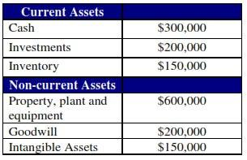

## Table of Contents

## What is goodwill?

Goodwill is a special kind of value that a business has, which goes beyond its physical assets like buildings or machines. It represents the worth of things like a company's reputation, customer loyalty, and strong relationships with suppliers. When one company buys another, the price paid can be higher than the value of the physical assets. The extra amount paid is called goodwill, and it shows how much the buyer values the intangible benefits of the business they are buying.

Goodwill can be important for a company because it can help attract more customers and keep them coming back. For example, if a company is well-known for good service, people might choose it over others even if it costs a bit more. This kind of reputation can be very valuable and is part of what makes up goodwill. However, goodwill is not something you can touch or see; it's more about how people feel about the company. Because of this, it can be hard to measure exactly, but it's still a key part of a company's overall value.

## What are intangible assets?

Intangible assets are things a company owns that you can't touch or see. They are different from things like buildings or trucks, which are called tangible assets. Intangible assets include things like a company's brand name, patents, copyrights, and even the knowledge and skills of its employees. These assets can be very important because they can help a company make money and stand out from others.

For example, a famous brand name like Coca-Cola is an intangible asset. People around the world recognize and trust the Coca-Cola brand, which helps the company sell its products. Another example is a patent, which gives a company the right to be the only one to make or sell a new invention for a certain time. This can be very valuable because it can stop other companies from copying the invention and taking away business. Even though you can't see or touch these things, they can be worth a lot of money and are a big part of what makes a company successful.

## How is goodwill recognized on a company's balance sheet?

Goodwill is shown on a company's balance sheet when one company buys another for more money than the value of the things the bought company owns. This extra money paid is called goodwill, and it shows how much the buying company thinks the brand, customers, and other special things about the bought company are worth. You can find goodwill listed under the "Assets" part of the balance sheet, usually in a section called "Intangible Assets."

Goodwill doesn't go away quickly like some other things on the balance sheet. It stays on the [books](/wiki/algo-trading-books) unless the company thinks it's worth less now, which is called an impairment. If that happens, the company has to lower the value of goodwill on the balance sheet. But if the company thinks the goodwill is still worth what they paid, it just stays the same on the balance sheet from year to year.

## What are examples of intangible assets?

Intangible assets are things a company owns that you can't touch or see. Some examples are brand names and trademarks. If you think about famous brands like Nike or Apple, their names are worth a lot of money because people know and trust them. Another example is patents. A patent is a special right that lets a company be the only one to make or sell a new invention for a while. This can be really important because it stops other companies from copying the invention and taking away business.

Other examples of intangible assets include copyrights and trade secrets. A copyright protects things like books, music, and movies, so only the owner can make money from them. A trade secret is something special that a company knows, like a recipe or a way of doing business, that they keep secret to stay ahead of others. Lastly, the knowledge and skills of a company's employees are also intangible assets. When employees know a lot about their jobs and how to do them well, it helps the company make more money and be successful.

## How do goodwill and intangible assets differ in their accounting treatment?

Goodwill and other intangible assets are both things you can't touch or see that a company owns, but they are treated differently in accounting. Goodwill shows up on a company's balance sheet when it buys another company for more money than the value of the things the bought company owns. This extra money is called goodwill, and it stays on the balance sheet under "Intangible Assets." Goodwill doesn't go away quickly; it only changes if the company thinks it's worth less now, which is called an impairment. If that happens, the company has to lower the value of goodwill on the balance sheet.

Other intangible assets, like patents, trademarks, and copyrights, are also listed under "Intangible Assets" on the balance sheet. But these assets can be different because they often have a set time they last, like a patent that lasts for 20 years. During this time, the company has to slowly reduce the value of these assets on the balance sheet, a process called amortization. This means the value of these assets goes down a little bit each year until they reach zero or until they are no longer useful. So, while goodwill stays the same unless it's impaired, other intangible assets usually get smaller over time through amortization.

## What is the process of valuing goodwill?

Valuing goodwill can be a bit tricky because it's not something you can touch or see. It's about figuring out how much a company's reputation, customer loyalty, and other special things are worth. One common way to do this is called the excess earnings method. This method looks at how much money the company makes and then takes away what it would cost to replace all the things the company owns, like buildings and machines. The extra money left over is thought to come from goodwill, and that's how much it might be worth.

Another way to value goodwill is when one company buys another. If the buying company pays more money than the value of everything the bought company owns, the extra money is called goodwill. This is often called the purchase price allocation method. The buying company looks at all the things the bought company has, like buildings, machines, and even things you can't touch like patents and trademarks. If the total value of these things is less than what the buying company paid, the difference is recorded as goodwill on the balance sheet. Both methods try to put a number on something that's hard to measure, but they help companies understand the value of things like their reputation and customer relationships.

## How are intangible assets valued and amortized?

Valuing intangible assets can be tricky because they are things you can't touch or see, like brand names, patents, and copyrights. One way to value them is by looking at how much money they help the company make. For example, if a brand name helps sell more products, you can figure out how much that brand is worth by looking at the extra money it brings in. Another way is to see how much it would cost to replace the asset if it didn't exist, like how much it would cost to create a new brand from scratch. This helps put a number on something that's hard to measure, but it's important for understanding the real value of a company.

Once you know how much an intangible asset is worth, you have to decide how to account for it over time. This is called amortization. Most intangible assets have a set time they last, like a patent that lasts for 20 years. During this time, the company slowly reduces the value of the asset on its balance sheet. They do this by dividing the total value of the asset by the number of years it lasts and then taking away a little bit of that value each year. This shows that the asset is becoming less valuable over time. But some intangible assets, like trademarks, might last forever and don't need to be amortized. Instead, the company checks them every year to see if they're still worth the same amount or if they've lost value.

## What role do goodwill and intangible assets play in mergers and acquisitions?

Goodwill and intangible assets are really important when one company buys another in a merger or acquisition. Goodwill comes into play when the buying company pays more money than the value of all the things the bought company owns, like buildings and machines. This extra money shows how much the buying company thinks the bought company's reputation, customer loyalty, and other special things are worth. These things can't be touched or seen, but they can help the new company make more money and be more successful. So, figuring out how much goodwill is worth is a big part of deciding how much to pay for the bought company.

Intangible assets, like patents, trademarks, and brand names, also play a big role in mergers and acquisitions. These assets can be very valuable because they help the company stand out and make money. When a company is looking to buy another, it looks at all these intangible assets to see how much they are worth. If the bought company has a strong brand or important patents, the buying company might be willing to pay more. After the deal is done, these intangible assets are listed on the new company's balance sheet, and their value might be slowly reduced over time, a process called amortization. Both goodwill and intangible assets help the buying company understand the full value of what they are getting in the deal.

## How does impairment testing differ for goodwill versus other intangible assets?

Impairment testing for goodwill and other intangible assets is important to make sure their value on the balance sheet is still right. Goodwill is tested for impairment at least once a year, or more often if something happens that might make it worth less. The company looks at the value of the whole business or part of the business that the goodwill is linked to. If this value is less than what's on the books, the company has to lower the value of goodwill. This means they take away the difference from the goodwill on the balance sheet.

For other intangible assets, like patents or trademarks, impairment testing can be a bit different. These assets are usually tested for impairment when there's a sign that they might be worth less, like if the company isn't making as much money from them anymore. If an intangible asset has a set time it lasts, the company also slowly reduces its value over time, which is called amortization. But if something happens that makes the asset worth less than its current value on the balance sheet, the company has to do an impairment test. If the test shows the asset is worth less, the company has to lower its value on the balance sheet right away.

## What are the tax implications of goodwill and intangible assets?

Goodwill and intangible assets can have different tax implications depending on how they are treated. When a company buys another company, the cost of the goodwill and other intangible assets can sometimes be written off over time for tax purposes. This is called amortization, and it lets the buying company slowly reduce its taxable income by spreading out the cost of these assets over several years. In the United States, for example, the tax law allows companies to amortize goodwill and certain intangible assets over 15 years. This can help lower the amount of taxes the company has to pay each year.

However, the tax treatment can be different for goodwill and other intangible assets that were created by the company itself, rather than bought in a merger or acquisition. For these self-created assets, like a brand name or a new invention, the company usually can't take a tax deduction for their cost. But if these assets lose value, the company might be able to claim a tax deduction for the loss. It's important for companies to understand these rules because they can affect how much they pay in taxes and how they manage their finances.

## How do international accounting standards (IFRS) treat goodwill and intangible assets compared to GAAP?

International Financial Reporting Standards (IFRS) and Generally Accepted Accounting Principles (GAAP) have some differences in how they treat goodwill and intangible assets. Under IFRS, goodwill is not amortized like some other intangible assets. Instead, it's tested for impairment at least once a year, or more often if there are signs it might be worth less. If the value of the business unit that the goodwill is linked to goes down, the company has to lower the value of the goodwill on its balance sheet. For other intangible assets, IFRS allows amortization if the asset has a set time it lasts, like a patent. But if the asset's value goes down faster than expected, the company has to test for impairment and adjust the value on the balance sheet.

GAAP, used mainly in the United States, treats goodwill similarly by not allowing amortization but requiring annual impairment tests. However, the way GAAP does impairment tests can be a bit different from IFRS. For other intangible assets, GAAP also allows amortization over the useful life of the asset, just like IFRS. But GAAP has some stricter rules about what kinds of intangible assets can be recorded on the balance sheet. For example, GAAP doesn't let companies record internally developed intangible assets like brands or customer lists unless they meet certain strict criteria. Both IFRS and GAAP aim to show the true value of a company's assets, but they use slightly different rules to get there.

## What strategic considerations should companies take into account when managing goodwill and intangible assets?

When managing goodwill and intangible assets, companies need to think about how these things can help them grow and stay competitive. Goodwill comes from buying another company for more than its physical stuff is worth, and it shows how much the buyer thinks the other company's reputation and customer loyalty are worth. Companies should keep an eye on their goodwill to make sure it's still worth what they paid for it. If the value of the business goes down, they might need to lower the value of the goodwill on their books. Also, companies should think about how they can use their goodwill to make more money, like by using the bought company's brand to sell more products or reach new customers.

Intangible assets, like patents, trademarks, and brand names, are also important for a company's strategy. These assets can help a company stand out from others and make more money. Companies need to protect these assets and make sure they are still worth what they think. This means checking them regularly to see if they are losing value and taking steps to keep them strong, like renewing patents or keeping trademarks active. By managing their intangible assets well, companies can keep their edge in the market and keep making money from them. Both goodwill and intangible assets are key parts of a company's overall value, and smart management of these can help a company succeed in the long run.

## References & Further Reading

[1]: Damodaran, A. (2012). ["Investment Valuation: Tools and Techniques for Determining the Value of Any Asset."](https://books.google.com/books/about/Investment_Valuation.html?id=5SRHAAAAQBAJ) John Wiley & Sons.

[2]: Chan, E. P. (2009). ["Algorithmic Trading: Winning Strategies and Their Rationale."](https://github.com/ftvision/quant_trading_echan_book) John Wiley & Sons.

[3]: de Prado, M. L. (2018). ["Advances in Financial Machine Learning."](https://www.amazon.com/Advances-Financial-Machine-Learning-Marcos/dp/1119482089) Wiley.

[4]: Jansen, S. (2018). ["Machine Learning for Algorithmic Trading."](https://github.com/stefan-jansen/machine-learning-for-trading) Packt Publishing.

[5]: Rosenbaum, J., & Pearl, J. (2019). ["Investment Banking: Valuation, Leveraged Buyouts, and Mergers and Acquisitions."](https://www.amazon.com/Investment-Banking-Valuation-Leveraged-Acquisitions/dp/1118656210) Wiley.

[6]: Koller, T., Goedhart, M., & Wessels, D. (2015). ["Valuation: Measuring and Managing the Value of Companies."](https://www.mckinsey.com/capabilities/strategy-and-corporate-finance/our-insights/valuation-measuring-and-managing-the-value-of-companies) Wiley Finance.