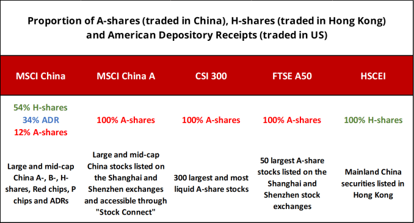

## Table of Contents

## What are H-Shares?

H-Shares are a type of stock that represents shares in companies from mainland China that are listed on the Hong Kong Stock Exchange. These companies are incorporated in mainland China but choose to list their shares in Hong Kong to attract international investors. The "H" in H-Shares stands for Hong Kong, indicating where the shares are traded.

Investors like H-Shares because they offer a way to invest in Chinese companies without the restrictions that might come with investing directly in mainland China's stock markets. This can be appealing for people who want to diversify their investment portfolio with exposure to China's growing economy. However, like any investment, H-Shares come with risks, such as fluctuations in the Chinese economy and changes in regulations between Hong Kong and mainland China.

## What are A-Shares?

A-Shares are stocks of companies that are based in mainland China and traded on the Shanghai and Shenzhen stock exchanges. These shares are mostly bought and sold by people living in China, and they are priced in Chinese yuan. A-Shares give investors a direct way to invest in the Chinese economy, but they are subject to China's rules and regulations.

For people outside of China, investing in A-Shares used to be hard because of restrictions. But now, there are programs like the Qualified Foreign Institutional Investor (QFII) and Stock Connect that make it easier for foreigners to buy A-Shares. Still, investing in A-Shares can be risky because the Chinese market can be unpredictable and influenced by government policies.

## Where are H-Shares primarily listed?

H-Shares are mainly listed on the Hong Kong Stock Exchange. This means that companies from mainland China can sell their stocks in Hong Kong, which is a different place from where they are based.

People like to buy H-Shares because it's a way to invest in Chinese companies without dealing with all the rules in mainland China. It's easier for people from other countries to buy these shares in Hong Kong.

## Where are A-Shares primarily listed?

A-Shares are stocks of companies based in mainland China, and they are mainly listed on two stock exchanges: the Shanghai Stock Exchange and the Shenzhen Stock Exchange. These shares are usually bought and sold in Chinese yuan, and most of the people buying them live in China.

It used to be hard for people outside of China to invest in A-Shares because of strict rules. But now, thanks to programs like the Qualified Foreign Institutional Investor (QFII) and Stock Connect, it's easier for foreigners to buy these shares. Even so, investing in A-Shares can be risky because the Chinese market can be unpredictable and is influenced a lot by the government's policies.

## Who can invest in H-Shares?

Anyone can invest in H-Shares. These are shares of companies from mainland China that are listed on the Hong Kong Stock Exchange. So, if you want to buy H-Shares, you just need to have access to the Hong Kong market. This means you can be from anywhere in the world, not just China.

Investing in H-Shares is a good way for people outside of China to get involved in the Chinese economy without dealing with all the rules in mainland China. It's easier for foreigners to buy these shares because Hong Kong has fewer restrictions. But remember, like any investment, H-Shares can go up and down in value, so there's always some risk involved.

## Who can invest in A-Shares?

A-Shares are stocks of companies from mainland China, and they are mainly traded on the Shanghai and Shenzhen stock exchanges. For a long time, only people living in China could buy these shares because of strict rules. The shares are priced in Chinese yuan, and most buyers are from China.

Now, it's easier for people from other countries to invest in A-Shares too. Programs like the Qualified Foreign Institutional Investor (QFII) and Stock Connect help foreigners buy these shares. But, there are still some rules to follow, and it can be a bit complicated.

Investing in A-Shares can be risky. The Chinese market can change a lot, and the government can make new rules that affect the prices of these shares. So, it's important to be careful and understand the risks before you start investing in A-Shares.

## What are the key differences between H-Shares and A-Shares in terms of currency?

H-Shares and A-Shares are different kinds of stocks from companies in China, and one big difference is the currency they use. H-Shares are listed on the Hong Kong Stock Exchange, and they are usually traded in Hong Kong dollars. This makes it easier for people from other countries to buy them because the Hong Kong dollar is more accessible to international investors.

A-Shares, on the other hand, are listed on the Shanghai and Shenzhen stock exchanges in mainland China. These shares are traded in Chinese yuan, which is the currency used in China. This means that most people who buy A-Shares are from China because it can be harder for people from other countries to use Chinese yuan. Programs like QFII and Stock Connect have made it easier for foreigners to invest in A-Shares, but it's still a bit more complicated than buying H-Shares.

## How do the regulatory environments for H-Shares and A-Shares differ?

The regulatory environments for H-Shares and A-Shares are quite different because H-Shares are listed in Hong Kong and A-Shares are listed in mainland China. For H-Shares, the rules come from the Hong Kong Stock Exchange and the Securities and Futures Commission (SFC) in Hong Kong. These rules are more open to international investors, making it easier for people from other countries to buy H-Shares. Hong Kong has its own set of laws that are different from China's, which means H-Shares are less affected by the strict regulations in mainland China.

For A-Shares, the rules come from the China Securities Regulatory Commission (CSRC) and the Shanghai and Shenzhen stock exchanges. These rules are stricter and mostly aimed at people living in China. The Chinese government has a lot of control over the market, and it can change rules quickly, which can make investing in A-Shares riskier. Even though programs like QFII and Stock Connect have made it easier for foreigners to buy A-Shares, the regulatory environment is still more challenging and complex compared to H-Shares.

## What are the typical valuation differences between H-Shares and A-Shares?

H-Shares and A-Shares often have different valuations because they are listed in different places and follow different rules. H-Shares are listed in Hong Kong and are usually cheaper than A-Shares. This is because Hong Kong has more investors from around the world, and they might see these shares as riskier because they are from Chinese companies but not traded in mainland China. So, to attract more buyers, H-Shares are often priced lower.

A-Shares, on the other hand, are listed in mainland China and are usually more expensive. This is because most of the people buying A-Shares are from China, and they might be willing to pay more for these shares because they are more familiar with the companies and the market. Also, the Chinese government can influence the market, which can make A-Shares seem less risky to local investors. So, A-Shares tend to have higher valuations than H-Shares.

## How does the liquidity of H-Shares compare to A-Shares?

H-Shares usually have better [liquidity](/wiki/liquidity-risk-premium) than A-Shares. This means it's easier to buy and sell H-Shares because they are listed on the Hong Kong Stock Exchange, which is open to investors from all over the world. More people can trade H-Shares, so there are usually more buyers and sellers, making it easier to find someone to trade with quickly.

A-Shares, on the other hand, are listed on the Shanghai and Shenzhen stock exchanges in mainland China. These shares are mostly bought and sold by people living in China, so there are fewer international investors. This can make A-Shares less liquid because there might not be as many people looking to buy or sell at any given time. Programs like Stock Connect have helped a bit, but A-Shares still tend to be less liquid than H-Shares.

## What are the implications of theQFII and RQFII programs on investing in A-Shares?

The QFII (Qualified Foreign Institutional Investor) and RQFII (RMB Qualified Foreign Institutional Investor) programs have made it easier for people from other countries to invest in A-Shares. Before these programs, it was really hard for foreigners to buy shares in companies listed on the Shanghai and Shenzhen stock exchanges because of strict rules. Now, with QFII and RQFII, foreign investors can get a special license that lets them invest directly in A-Shares. This has opened up the Chinese market to more people around the world and helped bring in more money from outside China.

Even though these programs have made things easier, there are still some challenges. You have to follow certain rules and limits on how much you can invest. Also, the Chinese government can change these rules anytime, which can make investing in A-Shares a bit risky. But overall, QFII and RQFII have been a big step forward in letting more people from different countries take part in China's growing economy.

## How do macroeconomic factors influence the performance gap between H-Shares and A-Shares?

Macroeconomic factors play a big role in the performance gap between H-Shares and A-Shares. These factors include things like interest rates, inflation, and the overall health of the Chinese economy. For example, if the Chinese economy is doing well, A-Shares might do better because they are more directly tied to the economy in mainland China. On the other hand, if there are worries about China's economy, investors might prefer H-Shares because they are listed in Hong Kong and might be seen as less risky.

Another important [factor](/wiki/factor-investing) is the exchange rate between the Chinese yuan and the Hong Kong dollar. If the yuan gets stronger, A-Shares might become more attractive to investors because their value goes up. But if the yuan weakens, H-Shares might be a better choice because they are traded in Hong Kong dollars, which might be more stable. Also, government policies in China can affect A-Shares more directly, while H-Shares might be less influenced by these policies because they are listed in a different market.

## References & Further Reading

[1]: Huang, Y., & Reddy, K. N. (2020). ["A-share and H-share: A comparative analysis in the context of Chinese equity market integration."](https://www.sciencedirect.com/science/article/pii/S036031992405136X) Global Finance Journal, 43, 100431.

[2]: Lu, C., & Zhang, H. (2017). ["Foreign Institutional Investors and Initial Public Offering Performance in China: A Comparative Study of A-Shares and H-Shares."](https://www.researchgate.net/publication/385355294_Single-Atom_Pt_Loaded_on_MOF-Derived_Porous_TiO2_with_Maxim-ized_Pt_Atom_Utilization_for_Selective_Hydrogenation_of_Halonitro-benzene) Journal of Banking & Finance, 77, 352-373.

[3]: Chan, K., & Kwok, J. (2002). ["Market Segmentation and Stock Prices: Evidence from China’s A-Share and H-Share Markets."](https://www.jstor.org/stable/25094437) Pacific-Basin Finance Journal, 10(4), 623-644.

[4]: Harris, J. H. (2003). ["Trading and Exchanges: Market Microstructure for Practitioners"](https://academic.oup.com/book/52292). Oxford University Press.

[5]: Lopez de Prado, M. (2018). ["Advances in Financial Machine Learning."](https://www.amazon.com/Advances-Financial-Machine-Learning-Marcos/dp/1119482089) Wiley.

[6]: Tsoukalas, D., & Sil, T. (2019). ["Algorithmic Trading: A New Business Dimension for Stock Exchanges and its Impact on the Overall Economic Environment."](https://pmc.ncbi.nlm.nih.gov/articles/PMC9953719/) Operational Research, 20(4), 2197-2212.

[7]: Su, D., & Fleisher, B. M. (1999). ["Why Does Return Volatility Differ in Chinese Stock Markets?"](https://papers.ssrn.com/sol3/papers.cfm?abstract_id=164473) Pacific-Basin Finance Journal, 7(1), 33-53.