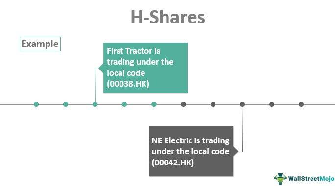

Global stock markets are integral to the economic framework, facilitating capital flow and investment opportunities across various regions. Each regional market possesses distinctive characteristics influenced by economic policies, local investor behavior, and geopolitical factors. Understanding these differences is essential for investors, analysts, and policymakers to navigate potential opportunities and risks effectively.

Among the prominent segments of global stock markets are A-Shares and H-Shares, which pertain to Chinese companies. A-Shares represent shares of mainland China-based companies traded on the Shanghai and Shenzhen Stock Exchanges, primarily in China's currency, the Renminbi (RMB). These shares are traditionally accessible to domestic investors but have gradually opened to qualified foreign investors through initiatives like the Qualified Foreign Institutional Investor (QFII) program and the Stock Connect schemes. 

H-Shares, on the other hand, involve Chinese companies listed on the Hong Kong Stock Exchange. Trading in Hong Kong dollars (HKD), H-Shares have historically been more accessible to international investors. This dual-listing mechanism offers companies broader access to capital and provides investors the opportunity to engage with China's growing economy through different channels.

The significance of A-Shares and H-Shares extends beyond regional boundaries, affecting the global economic landscape and investment strategies. As China continues to assert its economic influence, these shares represent a substantial part of global portfolio diversification strategies. They provide insights into China's market policies, economic health, and potential growth areas, thereby playing a crucial role in international investment strategies.

Algorithmic trading is increasingly becoming central to global finance, employing complex algorithms to automate trading strategies for better efficiency and accuracy. Its relevance in markets like A-Shares and H-Shares is growing, driven by the need for speed, precision, and the ability to manage large volumes of transactions across different time zones and regulatory environments. 

The purpose of this article is to explore the differences between A-Shares and H-Shares with a particular focus on algorithmic trading. By examining these aspects, investors and financial professionals can better understand how to leverage algorithmic strategies in the Chinese market context. This comprehension is crucial for informed decision-making and optimizing investment outcomes in an ever-evolving global financial landscape.

## Table of Contents

## Understanding A-Shares and H-Shares

A-Shares refer to the stocks of Chinese companies that are traded on the Shanghai and Shenzhen stock exchanges. These shares are denominated in Chinese Renminbi (RMB) and were traditionally available only to domestic investors in China. However, with the introduction of the Qualified Foreign Institutional Investor (QFII) program and Stock Connect schemes, access for foreign investors has significantly improved.

H-Shares, on the other hand, are shares of Chinese companies that are listed on the Hong Kong Stock Exchange (HKEX). These shares are denominated in Hong Kong dollars (HKD) and are accessible to international investors without the restrictions typically associated with A-Shares, providing a platform for Chinese companies to raise capital overseas.

The regulatory environments governing A-Shares and H-Shares demonstrate notable differences. A-Shares are regulated by the China Securities Regulatory Commission (CSRC), which imposes more stringent requirements and practices in line with mainland China's financial policies. By contrast, H-Shares fall under the regulation of the Hong Kong Securities and Futures Commission (SFC), known for its more transparent and investor-friendly regulatory framework. This divergence can influence investor perceptions and decisions when choosing between A-Shares and H-Shares.

In terms of access to foreign investors, Stock Connect programs have been pivotal. The Shanghai-Hong Kong Stock Connect, launched in 2014, and the Shenzhen-Hong Kong Stock Connect, introduced in 2016, have enabled mutual market access between mainland China and Hong Kong, allowing international and domestic investors to trade eligible shares in each other’s markets through their local exchanges. This has significantly increased the [liquidity](/wiki/liquidity-risk-premium) and investment options for foreign investors interested in Chinese equities.

Historical performance differences are observable between A-Shares and H-Shares. A-Shares often exhibit greater [volatility](/wiki/volatility-trading-strategies) due to their sensitivity to domestic economic policies and investor sentiment in mainland China. In contrast, H-Shares tend to experience less volatility, benefiting from the stability and international orientation of Hong Kong’s financial markets. The market capitalization of A-Shares and H-Shares also varies, reflecting differences in investor bases and the broader economic and regulatory context. Understanding these distinctions can be crucial for investors in tailoring their strategies to profit from potential market movements and opportunities presented by Chinese stocks.

## Market Characteristics Differences

A-Shares and H-Shares, though both representing Chinese companies, exhibit distinct market characteristics, impacting trading strategies and investment decisions. 

**Liquidity Differences**

A-Shares, traded on the Shanghai and Shenzhen stock exchanges, typically exhibit lower liquidity compared to H-Shares, which are listed on the Hong Kong Stock Exchange. This difference can be attributed to the relatively closed nature of the Chinese capital markets, with A-Shares primarily accessible to domestic investors and a limited group of qualified foreign investors. In contrast, H-Shares benefit from broader accessibility to international investors, resulting in higher liquidity. This liquidity discrepancy affects trading strategies significantly. Traders might employ different algorithms for each market, with A-Share strategies potentially focused on minimizing the impact of large orders in a less liquid environment.

**Volatility Trends**

Volatility is another notable characteristic distinguishing A-Shares from H-Shares. The A-Share market is often more volatile, influenced by speculative trading and retail investor dominance. In contrast, the H-Share market demonstrates relatively lower volatility, as it is more institutionally driven, with a substantial presence of global investors. These volatility trends necessitate different risk management approaches and can impact the design of trading algorithms tailored to exploit price movements.

**Exchange Rate Influences**

The Renminbi plays a crucial role in the valuation of A-Shares. Since A-Shares are denominated in the Chinese currency, shifts in exchange rates can directly affect these stocks' valuations and, subsequently, investment yields. Conversely, H-Shares are typically denominated in Hong Kong dollars, reducing direct exposure to Renminbi fluctuations. This divergence requires a keen understanding of currency risk in [algorithmic trading](/wiki/algorithmic-trading) strategies, with potential hedging mechanisms integrated to mitigate unpredictability in exchange rates.

**Investor Base Differences**

Differences in the investor base further differentiate these markets. A-Shares are characterized by a predominance of local retail investors, resulting in markets driven by sentiment and [momentum](/wiki/momentum). This distinct investor behavior necessitates algorithms that can rapidly respond to sudden price movements and capture short-term trends. Meanwhile, the H-Share market, with a substantial portion of international institutional investors, usually witnesses longer investment horizons and greater research-based decision-making, suggesting different algorithmic approaches.

**Impact of Government Policies**

Government policies significantly influence both A-Shares and H-Shares, albeit in varying degrees. A-Shares are more susceptible to domestic policy interventions, reflecting efforts by the Chinese government to stabilize markets and control financial risks. Such interventions can lead to sudden market reactions, necessary to consider when designing algorithms. On the other hand, while H-Shares are also affected by Chinese policies, they are additionally subject to Hong Kong's regulatory framework, providing a more balanced policy landscape.

In sum, the differences in liquidity, volatility, exchange rates, investor base, and government policies between A-Shares and H-Shares delineate tailored trading strategies. Understanding these distinctions is paramount for devising effective algorithmic systems capable of navigating the unique challenges and opportunities found in each market segment.

## Algorithmic Trading: A Brief Overview

Algorithmic trading refers to the use of computer algorithms to automate the process of buying and selling stocks in financial markets. These algorithms make decisions based on predetermined rules and strategies, allowing traders to execute large volumes of orders at speeds far exceeding human capabilities. The key mechanisms of algorithmic trading include data analysis, pattern recognition, and execution protocols that optimize trade performance.

**Advantages of Algorithmic Trading**

Algorithmic trading offers several benefits, particularly in terms of speed and efficiency. Algorithms can process vast amounts of market data in real time, quickly identifying trading opportunities and executing orders with minimal latency. This leads to better price execution and reduced transaction costs. Additionally, algorithmic trading reduces the emotional and psychological biases that can affect human traders, enabling more consistent and disciplined trading strategies.

**Current Trends in Algorithmic Trading Adoption**

Globally, the adoption of algorithmic trading has been increasing, driven by advancements in technology and increasing data availability. In mature markets like the United States and Europe, algorithmic trading contributes to a significant portion of total trading [volume](/wiki/volume-trading-strategy)—estimated at over 70% as of recent years. Emerging markets, including those in Asia, are also witnessing a rise in algorithmic trading as infrastructure and regulatory frameworks evolve to support these advanced trading activities.

**Challenges in Algorithmic Trading**

Despite its advantages, algorithmic trading faces several challenges. Regulatory hurdles vary across jurisdictions, requiring traders to navigate complex legal environments to ensure compliance. Technologically, as markets become more competitive, the demand for low-latency systems and high-speed data processing increases, necessitating substantial investment in infrastructure. Additionally, the risk of erroneous trades or "flash crashes" necessitates sophisticated risk management systems.

**Potential Algorithmic Trading Strategies in China's Stock Markets**

In the context of China's stock markets, where A-Shares and H-Shares are prominent, algorithmic trading strategies need to be tailored to specific market characteristics. Strategies like statistical [arbitrage](/wiki/arbitrage), where algorithms exploit price differences between related financial instruments, and mean reversion, which assumes that assets will revert to their historical norms, can be effectively employed. Furthermore, momentum-based strategies that capitalize on existing market trends are also applicable, provided they are adjusted for the unique volatility and liquidity profiles of Chinese stock markets.

Overall, algorithmic trading is a transformative force in the financial industry, offering enhanced trading capabilities and operational efficiencies. However, it requires continuous adaptation to regulatory developments and market dynamics, especially in diverse and rapidly changing markets like those in China.

## Algorithmic Trading in A-Shares vs. H-Shares

Algorithmic trading in A-Shares and H-Shares presents unique challenges and opportunities, shaped by the distinct characteristics of these markets. Understanding the key differences is crucial for developing effective trading strategies.

**Market Liquidity and Volatility**

Algorithmic trading strategies are significantly influenced by the liquidity and volatility of the respective markets. A-Shares, traded on the Shanghai and Shenzhen stock exchanges, generally exhibit higher volatility than H-Shares. This is due in part to the larger presence of retail investors in A-Share markets, who often respond quickly to market news, leading to more pronounced price swings. On the contrary, H-Shares, listed on the Hong Kong Stock Exchange, benefit from a broader international investor base, which typically results in more stable trading patterns.

Higher volatility in A-Shares necessitates sophisticated algorithmic models that can quickly adapt to rapid price changes, employing methods such as [machine learning](/wiki/machine-learning) or [statistical arbitrage](/wiki/statistical-arbitrage) to identify profitable opportunities. Traders might leverage Python libraries like NumPy and pandas for data analysis and [backtesting](/wiki/backtesting) trading strategies under varying market conditions.

**Regulatory Considerations**

Regulatory differences between mainland China and Hong Kong also impact algorithmic trading. A-Shares are subject to mainland China’s regulatory framework, which has stricter controls on capital flows and more limitations on foreign investor participation compared to Hong Kong’s relatively liberal regulatory environment. These regulatory nuances necessitate different algorithmic approaches; for example, A-Share algorithms need to account for trading halts and capital control measures, which can introduce risks absent in H-Share trading.

Moreover, Hong Kong's integration with international markets through the Stock Connect program allows for more seamless capital movement, making algorithms in H-Shares potentially more complex with considerations for foreign exchange fluctuations.

**Case Studies of Successful Strategies**

Successful algorithmic trading strategies in A-Shares often involve momentum-based approaches, capitalizing on short-term volatility spikes. For instance, pairing a moving average crossover strategy with volatility filters could enhance returns by avoiding whipsaw trades during unpredictable market movements.

In contrast, arbitrage opportunities between A-Shares and H-Shares, known as AH arbitrage, have been successfully exploited using algorithms that simultaneously trade on both the Shanghai/Shenzhen and Hong Kong exchanges. These strategies are designed to identify mispricings between the two markets and execute trades that capitalize on price convergences.

**Technology and Infrastructure Requirements**

Effective algorithmic trading in China's stock markets requires robust technology and infrastructure. High-frequency trading ([HFT](/wiki/high-frequency-trading-strategies)) strategies rely on minimal latency, necessitating co-location of trading servers near exchange data centers to reduce order execution time. Additionally, state-of-the-art data analytics platforms capable of processing vast quantities of market data in real-time are essential.

In Python, tools like TensorFlow and PyTorch can be utilized to develop predictive models to forecast stock movements, while integration with trading systems can be achieved using APIs that support high-speed order management. Furthermore, understanding China's unique network and information security requirements is crucial for maintaining system integrity and compliance.

In conclusion, the contrast in market characteristics, regulatory environments, and investor bases between A-Shares and H-Shares requires distinct algorithmic trading strategies and technological infrastructures. By tailoring approaches to these specific conditions, traders can better navigate the complexities of China’s financial markets.

## Implications for Global Investors

Understanding the differences between A-Shares and H-Shares is essential for global investors looking to optimize their portfolios and leverage algorithmic trading strategies effectively. As China's economic influence grows, discerning these distinctions can significantly impact investment outcomes. A-Shares, traded predominantly on the Shanghai and Shenzhen stock exchanges, are generally subject to regulations and currency influences distinct from H-Shares, which are listed on the Hong Kong Stock Exchange. These differences influence how investors can access and trade these shares. 

### Risks and Benefits of Employing Algorithmic Trading

Algorithmic trading can offer substantial advantages in these markets, such as enhanced speed, reduced transaction costs, and improved accuracy in executing trades. However, the complexities involved in trading A-Shares versus H-Shares necessitate a keen understanding of local market idiosyncrasies. Risks include regulatory changes, which can impact algorithm parameters, and market volatility, which may adversely affect algorithm performance. For example, the Renminbi's fluctuations can significantly impact A-Shares valuations, posing a potential risk for algorithms not designed to account for currency volatility.

### Long-Term Market Outlooks

The long-term outlook for A-Shares and H-Shares presents a mixed landscape. China's consistent economic growth suggests a robust potential for these markets. However, geopolitical considerations and policy shifts can introduce uncertainties. Algorithmic trading strategies must be adaptable, designed to respond swiftly to such changes. Investors should develop algorithms that incorporate machine learning techniques to predict market movements based on historical data, potentially increasing predictive accuracy and profitability.

### Strategic Recommendations

Investors interested in A-Shares and H-Shares should prioritize diversification, considering both types of shares to spread risk. Developing multi-market algorithms capable of operating seamlessly across these different regulatory environments could yield better risk-adjusted returns. Moreover, collaborating with local brokers or analysts can provide valuable insights into regulatory updates and market sentiments, enhancing algorithmic strategies.

### Role of Emerging Technologies and Future Trends

Emerging technologies, such as [artificial intelligence](/wiki/ai-artificial-intelligence) (AI) and blockchain, are poised to transform trading strategies further. AI can enhance pattern recognition capabilities, optimizing decision-making in algorithmic trading processes. Additionally, blockchain may improve transaction transparency and settlement efficiency in these markets, potentially reducing counterparty risk. As these technologies evolve, they will likely offer new opportunities and challenges for algorithmic trading in A-Shares and H-Shares, underscoring the need for continual adaptation and learning among investors.

In conclusion, understanding the nuances between A-Shares and H-Shares is crucial for global investors employing algorithmic trading strategies. By acknowledging market-specific risks, leveraging emerging technologies, and adopting a strategic approach, investors can better navigate these dynamic markets.

## Conclusion

The A-Shares and H-Shares markets represent crucial components of the Chinese economy, each offering unique opportunities and challenges for investors, especially those engaged in algorithmic trading. Throughout the article, the distinctions between these two types of shares have been articulated, emphasizing their significance in shaping investment strategies. A-Shares are traded on the mainland's Shanghai and Shenzhen stock exchanges, which are influenced heavily by domestic policies and the Renminbi's valuation, leading to characteristic volatility and liquidity profiles. Conversely, H-Shares are listed on the Hong Kong Stock Exchange, subject to international standards and the influences of a diverse investor base, offering different liquidity and volatility dynamics.

Recognizing and understanding the disparities between A-Shares and H-Shares is vital for deploying effective algorithmic trading strategies. These differences impact factors such as market liquidity, volatility patterns, and regulatory environments, which are crucial variables in algorithmic models. Therefore, investors must tailor their algorithms to consider these elements, optimizing their strategies for each market's unique characteristics.

Investors are encouraged to maintain an informed perspective and consider diversification strategies to mitigate risks associated with these markets. The dynamic nature of global stock markets necessitates a flexible approach, allowing investors to adapt to fluctuations and policy changes. Diversifying across A-Shares, H-Shares, and other global assets can balance exposure and leverage the unique attributes of each market.

As the landscape of stock markets and algorithmic trading continues to evolve, it is imperative for investors to stay abreast of technological advancements and regulatory changes. Innovative technologies, such as machine learning and artificial intelligence, are increasingly influencing trading strategies, offering new pathways to capitalize on market inefficiencies. Investors should engage with educational resources and industry research to remain competitive and informed in this rapidly changing domain.

In conclusion, understanding the fundamental differences between A-Shares and H-Shares markets is critical for investors aiming to harness the potential of algorithmic trading strategies. As global markets evolve, staying informed and adaptable will be key to leveraging opportunities and managing risks effectively.

## References & Further Reading

[1]: Huang, Y., & Reddy, K. N. (2020). ["A-share and H-share: A comparative analysis in the context of Chinese equity market integration."](https://www.sciencedirect.com/science/article/pii/S036031992405136X) Global Finance Journal, 43, 100431.

[2]: Lu, C., & Zhang, H. (2017). ["Foreign Institutional Investors and Initial Public Offering Performance in China: A Comparative Study of A-Shares and H-Shares."](https://www.researchgate.net/publication/385355294_Single-Atom_Pt_Loaded_on_MOF-Derived_Porous_TiO2_with_Maxim-ized_Pt_Atom_Utilization_for_Selective_Hydrogenation_of_Halonitro-benzene) Journal of Banking & Finance, 77, 352-373.

[3]: Chan, K., & Kwok, J. (2002). ["Market Segmentation and Stock Prices: Evidence from China’s A-Share and H-Share Markets."](https://www.jstor.org/stable/25094437) Pacific-Basin Finance Journal, 10(4), 623-644.

[4]: Harris, J. H. (2003). ["Trading and Exchanges: Market Microstructure for Practitioners"](https://academic.oup.com/book/52292). Oxford University Press.

[5]: Lopez de Prado, M. (2018). ["Advances in Financial Machine Learning."](https://www.amazon.com/Advances-Financial-Machine-Learning-Marcos/dp/1119482089) Wiley.

[6]: Tsoukalas, D., & Sil, T. (2019). ["Algorithmic Trading: A New Business Dimension for Stock Exchanges and its Impact on the Overall Economic Environment."](https://pmc.ncbi.nlm.nih.gov/articles/PMC9953719/) Operational Research, 20(4), 2197-2212.

[7]: Su, D., & Fleisher, B. M. (1999). ["Why Does Return Volatility Differ in Chinese Stock Markets?"](https://papers.ssrn.com/sol3/papers.cfm?abstract_id=164473) Pacific-Basin Finance Journal, 7(1), 33-53.