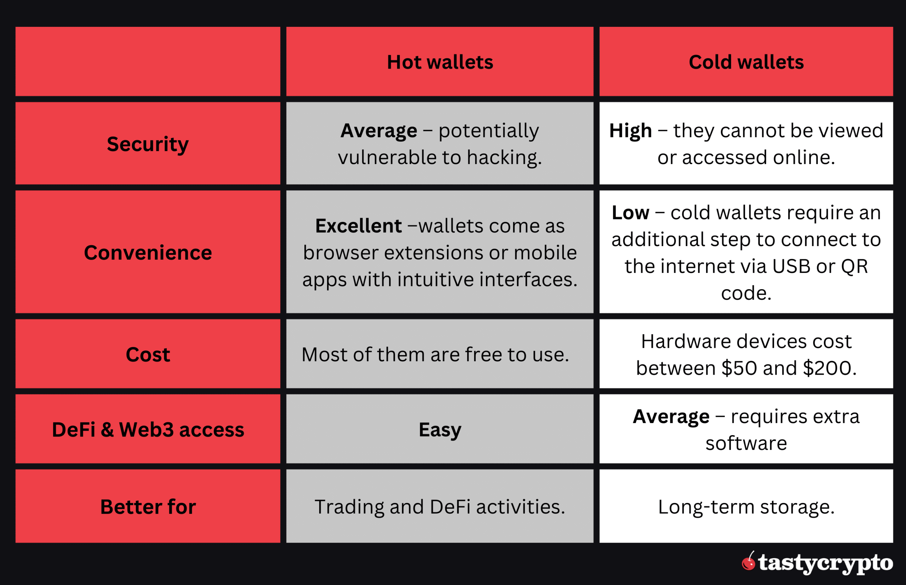

In the world of cryptocurrency, ensuring both security and convenience is a critical concern for users and institutions alike. As cryptocurrencies become more integral to the global financial landscape, the need for secure and efficient storage solutions becomes increasingly vital. This article investigates the intricacies of cold wallets and hot wallets, which are instrumental in safeguarding digital assets, as well as their implications for the broader digital currency environment.

Cryptocurrency wallets, in essence, are digital applications designed to store the private keys needed to access and manage digital currencies. They serve as the interface between users and blockchain networks, enabling transactions while maintaining the security of the assets involved. These wallets are broadly categorized into two main types: hot wallets and cold wallets. While hot wallets facilitate rapid transactions due to their constant internet connectivity, this convenience often comes with increased susceptibility to online threats. Conversely, cold wallets provide enhanced security by keeping private keys offline, reducing exposure to potential cyberattacks.



In addition to understanding the various types of cryptocurrency wallets, this article also touches on the role of algorithmic trading within the crypto market. Algorithmic trading employs sophisticated computer algorithms to execute trades based on predefined criteria, often in fractional seconds. This approach can interact with both hot and cold wallets, enhancing trading efficiency and potentially opening new avenues for investors.

By dissecting the functionalities and trade-offs associated with different wallet types, along with the advent of algorithmic trading strategies, we aim to offer a comprehensive perspective on managing digital assets safely and efficiently. Understanding these elements is crucial for making informed decisions in the rapidly evolving cryptocurrency space.

## Table of Contents

## Understanding Cryptocurrency Wallets

Cryptocurrency wallets are integral digital tools that facilitate the interaction with blockchain networks by securely storing private keys. These private keys are crucial for accessing, sending, and receiving digital currencies. Unlike a physical wallet that holds money, a cryptocurrency wallet doesn't store currency in a traditional sense. Instead, it maintains public and private keys that correspond to the user's blockchain address, allowing access to their virtual currency holdings.

The primary function of a cryptocurrency wallet is to enable transactions with digital currencies such as Bitcoin, Ethereum, and other altcoins. When a transaction is initiated, the wallet utilizes the private key to digitally sign it, verifying the user's authority to perform the transaction over the blockchain network. This ensures both the security and integrity of the conducted operation.

Cryptocurrency wallets are broadly categorized into two types: hot wallets and cold wallets. Hot wallets are connected to the internet, facilitating immediate transactions with easier access, making them suitable for users who engage in regular trading activities. On the other hand, cold wallets remain offline, offering enhanced security by safeguarding private keys from online threats, thereby making them ideal for long-term storage of cryptocurrencies.

With the increasing diversity of cryptocurrencies available, the importance of selecting the right type of wallet becomes essential, as it directly impacts the security and accessibility of the digital assets. Understanding the functionality and classification of wallets is paramount for users to efficiently manage their [cryptocurrency](/wiki/cryptocurrency) portfolio.

## Hot Wallets: Convenience at a Cost

Hot wallets are digital cryptocurrency wallets that remain connected to the internet, offering users ease of access and rapid transaction capabilities. These wallets are typically used for frequent trading and spending, as they allow users to promptly send and receive digital currencies. The primary advantage of hot wallets lies in their convenience, as they facilitate seamless interaction with the blockchain and other decentralized applications.

However, this connectivity to the internet introduces inherent security risks. Being online increases their vulnerability to hacking attempts and cyber breaches. Incidents of unauthorized access and theft from hot wallets underscore the importance of understanding their security limitations. Users must remain vigilant and implement additional security measures such as two-[factor](/wiki/factor-investing) authentication (2FA) and strong, unique passwords to mitigate these risks.

Despite these concerns, hot wallets maintain their popularity among cryptocurrency enthusiasts due to their functionality and the ability to integrate effortlessly with trading platforms and exchanges. They play a pivotal role in managing digital assets actively, making them indispensable for those engaged in day-to-day cryptocurrency transactions.

## Cold Wallets: Security-First Approach

Cold wallets, often referred to as cold storage, represent a pivotal strategy in the secure management of cryptocurrencies. These wallets are primarily characterized by their ability to keep private keys offline, significantly minimizing the risk of unauthorized access through hacking. By maintaining an air-gapped status—being disconnected from the internet—cold wallets offer a formidable defense against online threats.

The fundamental principle behind cold wallets is straightforward but powerfully effective: by isolating private keys from potential online vulnerabilities, these wallets mitigate the risk associated with cyber attacks. This makes them an optimal choice for individuals or entities who prefer safeguarding substantial quantities of digital assets over extended periods. Unlike hot wallets, where convenience sometimes comes at the cost of security, cold wallets uphold a strict security-first approach.

There are several types of cold wallets, each catering to different security needs. Hardware wallets, such as those produced by Ledger and Trezor, are physical devices resembling USB sticks that store private keys offline. These devices are equipped with encryption and require user authentication, enhancing security while still offering limited interactions with the blockchain upon connection to a computer.

Another form of cold storage is the paper wallet, which involves printing the private and public keys on physical paper. This method demands meticulous care in preventing physical damage or loss. Paper wallets are entirely devoid of digital interaction, cementing their status as a secure albeit low-tech option.

In scenarios demanding the utmost security, deep cold storage techniques are employed. This involves storing wallets and private keys in secure, physically isolated environments such as vaults or safe boxes, often with additional security layers like biometric access controls.

Cold wallets, therefore, serve as a bastion for those prioritizing security above all else, setting a high standard for safeguarding digital assets against the pervasive threats of the digital age.

## Types of Hot Wallets

Hot wallets are an essential category of cryptocurrency wallets that remain connected to the internet, providing users with convenient access to their digital assets. These wallets are designed to facilitate quick transactions and offer a range of features that make them suitable for everyday use and active trading. 

Hot wallets are available in several formats, including mobile applications, desktop applications, and web-based solutions. Mobile apps, such as Coinbase Wallet, allow users to manage their cryptocurrency on the go, offering a user-friendly interface and robust features like biometric authentication. Desktop applications, like Exodus, provide comprehensive tools for managing a variety of cryptocurrencies on a personal computer. Web-based solutions, such as Blockchain.com, enable users to access their wallets via a web browser without needing to download any software.

Coinbase Wallet, for instance, is renowned for its seamless integration with the Coinbase exchange, allowing users to move assets easily between the wallet and the trading platform. It also supports an array of decentralized applications (DApps), making it versatile for interacting with decentralized finance (DeFi) services.

MetaMask is another popular example, primarily used as a browser extension and mobile app. It offers robust support for the Ethereum blockchain, providing users with the ability to interact with DApps and decentralized exchanges (DEXs) directly. Its open-source nature and emphasis on privacy and security have contributed to its widespread adoption in the Ethereum community.

Trust Wallet, acquired by Binance, is widely recognized for its multi-currency support and straightforward interface. It accommodates numerous blockchain networks and facilitates easy token swapping, making it a preferred choice for users seeking flexibility.

These hot wallets are equipped with features that support seamless transactions and integration with decentralized environments, allowing users to participate actively in the crypto market. While they offer unparalleled convenience, it is essential for users to remain cautious due to the inherent security risks associated with their constant online connectivity.

## Types of Cold Wallets

Cold wallets are essential tools for securely storing cryptocurrencies offline. The two most common types of cold wallets are hardware wallets and paper wallets, each offering distinct features in terms of security and user convenience.

Hardware wallets are physical devices specifically designed to securely store a user’s private keys offline. Popular hardware wallets include Trezor and Ledger. These devices are robust against malware and online threats because they store private keys in a secure chip, and they require physical access to authorize transactions. When users need to interact with their cryptocurrency, they can connect the hardware wallet to a computer or mobile device via USB or Bluetooth, entering a PIN to confirm transactions. This method of storing private keys makes hardware wallets highly secure, especially for long-term storage, while maintaining a moderate level of convenience for transactions.

Paper wallets, on the other hand, involve printing the public and private keys on a piece of paper, which users must store in a safe location. The physical nature of paper wallets makes them immune to digital attacks and online hacking threats. However, they are susceptible to physical damage, loss, or theft if not stored securely. Generating a paper wallet typically involves using a dedicated website or software that operates offline to avoid exposure during key generation.

In addition to hardware and paper wallets, deep cold storage provides an added layer of security. This method involves storing the cold wallet in a highly secure physical location, such as a safety deposit box or a secured vault. Deep cold storage minimizes the risk of tampering or unauthorized access by leveraging both the security features of the wallet and physical safeguards.

Each type of cold wallet serves varying needs. Hardware wallets strike a balance between security and usability, while paper wallets offer heightened security at the cost of convenience. Deep cold storage magnifies security for those with substantial assets or requiring maximal protection for their holdings.

Understanding the strengths and limitations of these cold wallet types empowers users to choose the best option based on their specific security requirements and usage preferences.

## Algorithmic Trading in the Crypto Space

Algorithmic trading in the cryptocurrency space involves the use of advanced computer algorithms to automate the trading of digital assets. These algorithms are designed to execute a multitude of tasks at high speed, such as analyzing market data, identifying trading opportunities, and executing trades based on defined criteria. This method leverages technology to process vast amounts of information with minimal human intervention, aiming to capitalize on market inefficiencies and optimize profit margins.

The core of [algorithmic trading](/wiki/algorithmic-trading) lies in setting parameters for buying and selling assets. Traders can define specific rules, such as time-based orders, price-based signals, and technical indicators, that guide the trading actions of the algorithm. Popular strategies include trend-following, mean reversion, and [arbitrage](/wiki/arbitrage), each tailored to exploit different aspects of market dynamics. For instance, in a trend-following strategy, an algorithm might automatically buy a cryptocurrency when its price surpasses a moving average, indicating upward [momentum](/wiki/momentum).

```python
# Example of a simple moving average crossover strategy in Python
def moving_average(data, period):
    return sum(data[-period:]) / period

def execute_trade(prices, short_window, long_window):
    short_ma = moving_average(prices, short_window)
    long_ma = moving_average(prices, long_window)
    if short_ma > long_ma:
        return "Buy"
    elif short_ma < long_ma:
        return "Sell"
    return "Hold"
```

Algorithmic trading is capable of working seamlessly with both hot and cold wallets, depending on the trading requirements. Hot wallets, which are always connected to the internet, are often preferred for executing frequent trades due to their rapid transaction capabilities. They allow algorithms to quickly buy or sell cryptocurrencies in response to real-time market conditions. Cold wallets, on the other hand, may be integrated into algorithmic trading strategies for purposes such as transferring assets securely after a trade, or when part of a long-term investment strategy requiring infrequent transactions.

The benefits of algorithmic trading extend to increased speed and efficiency in executing trades, reducing the emotional biases commonly associated with manual trading. Additionally, it allows traders to operate across multiple markets and time zones concurrently, optimizing their reach and effectiveness. Nonetheless, the complexity of these algorithms demands rigorous testing and [backtesting](/wiki/backtesting) to ensure reliability and effectiveness in the volatile cryptocurrency market. Factors like slippage, latency, and market impact must also be considered to achieve desired results effectively.

Algorithmic trading continues to evolve with advancements in [artificial intelligence](/wiki/ai-artificial-intelligence) and [machine learning](/wiki/machine-learning), further enhancing its ability to predict and adapt to market trends. As the cryptocurrency landscape develops, algorithmic trading is expected to play an increasingly significant role in how digital assets are traded.

## Choosing the Right Wallet: Balancing Security and Accessibility

Selecting the appropriate cryptocurrency wallet involves evaluating trading frequency and security requirements. Hot wallets are generally favored by frequent traders due to their online connectivity, enabling swift transactions and easy access to digital assets. However, this convenience comes with increased vulnerability to cyber threats, making them less suitable for substantial, long-term holdings.

Conversely, cold wallets, which store private keys offline, present enhanced security, making them ideal for users with significant assets or those who prioritize safety over accessibility. These wallets are less prone to hacking, offering peace of mind for individuals who prefer long-term storage.

To determine the suitable wallet type, users must consider their trading behaviors and risk tolerance. A frequent trader might prioritize a hot wallet for rapid transactions, whereas someone with a substantial cryptocurrency investment might lean towards a cold wallet for its robust security. Analyzing one's portfolio size, transaction frequency, and appetite for risk provides clarity in this decision.

Furthermore, using both wallet types could present a balanced strategy. For instance, employing a hot wallet for regular transactions while retaining a cold wallet for storing large amounts of cryptocurrency can optimize security and accessibility. This hybrid approach allows users to benefit from each wallet's strengths, potentially offering the best of both worlds and enhancing overall asset management efficiency. 

By carefully assessing individual needs and employing a strategic balance of hot and cold wallets, users can effectively manage and protect their digital assets in the complex landscape of cryptocurrency.

## Conclusion

Both hot and cold wallets are integral to the cryptocurrency ecosystem, each offering unique strengths that cater to different user requirements. Hot wallets provide accessibility and facilitate quick transactions, making them highly suitable for active traders who engage in frequent trading activities. However, this convenience comes at the cost of increased vulnerability to online threats, such as hacks and unauthorized access.

In contrast, cold wallets prioritize security by keeping digital assets offline. This significantly mitigates the risk of cyber-attacks, making cold wallets ideal for those who value security over immediate accessibility. They are particularly beneficial for long-term storage of substantial cryptocurrency holdings.

Understanding the differences between hot and cold wallets is essential for users to make informed decisions about managing their digital assets. The trade-off between security and convenience must be carefully weighed, considering factors such as trading frequency, asset value, and individual risk tolerance.

For many users, employing a strategic combination of both wallet types can offer the optimal balance. Utilizing hot wallets for regular transactions while securing larger funds in cold wallets can enhance both safety and efficiency. Moreover, by integrating algorithmic trading strategies, users can further optimize their trading experiences. Algorithmic trading allows for precision in trade execution, which can be effective when combined with the accessibility of hot wallets and the security of cold wallets.

Ultimately, the choice of wallet type should align with the user's financial goals and security needs. By leveraging the strengths of both hot and cold wallets, along with sophisticated trading strategies, individuals can better navigate the cryptocurrency landscape and safeguard their digital assets.

## References & Further Reading

[1]: Kühr, E., & Hünermund, P. (2019). ["Security Aspects of Cryptographic Keys in Online and Offline Wallets."](https://jast-journal.springeropen.com/articles/10.1186/s40543-024-00416-6) In Digital Business Security Development: Advances in Information Security, Privacy, and Ethics.

[2]: Antonopoulos, A.M. (2017). ["Mastering Bitcoin: Unlocking Digital Cryptocurrencies,"](https://books.google.com/books/about/Mastering_Bitcoin.html?id=IXmrBQAAQBAJ) 2nd Edition. O'Reilly Media.

[3]: Narayanan, A., Bonneau, J., Felten, E., Miller, A., & Goldfeder, S. (2016). ["Bitcoin and Cryptocurrency Technologies."](https://press.princeton.edu/books/hardcover/9780691171692/bitcoin-and-cryptocurrency-technologies) Princeton University Press.

[4]: Lewis, A. (2018). ["The Basics of Bitcoins and Blockchains."](https://www.amazon.com/Basics-Bitcoins-Blockchains-Introduction-Cryptocurrencies/dp/1633538001) Mango Media.

[5]: Prat, J., & Walter, B. (2020). ["An Overview of Crypto Wallet Security and Design."](https://www.elpasocountybar.org/Award-Recipients) IEEE Access, 8, 141406-141424.

[6]: Popper, N. (2015). ["Digital Gold: Bitcoin and the Inside Story of the Misfits and Millionaires Trying to Reinvent Money."](https://archive.org/details/digitalgoldbitco0000popp) Harper Business.

[7]: Sklaroff, S. (2018). ["Cryptocurrency Wallet Usability and Security: A User-Centered Approach to Overcoming Cognitive Challenges."](https://academia-lab.com/enciclopedia/sonia-sklaroff/) ACM SIGCHI Conference on Human Factors in Computing Systems.