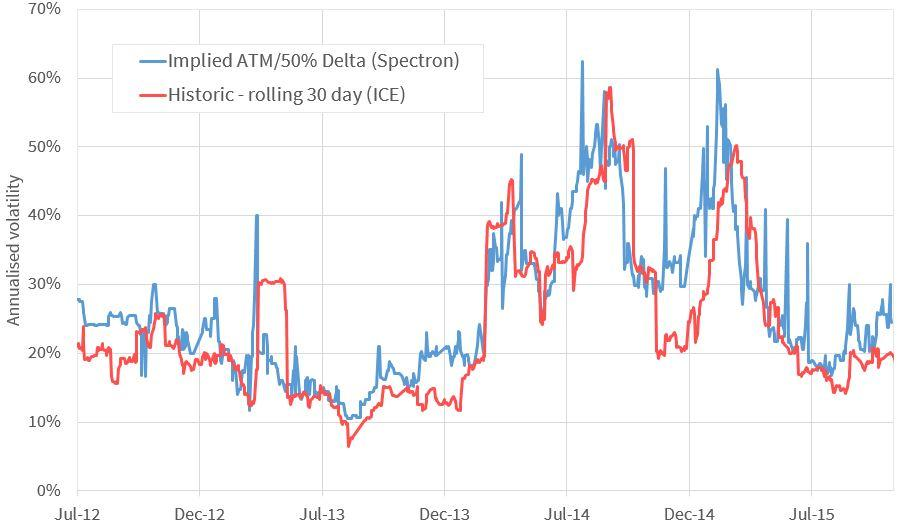

## Table of Contents

## What is volatility in the context of financial markets?

Volatility in financial markets refers to how much and how quickly the price of an asset, like a stock or a currency, changes over time. If an asset's price moves up and down a lot in a short period, we say it has high volatility. On the other hand, if the price stays pretty stable without big swings, it has low volatility. Think of it like the weather: a day with wild storms is highly volatile, while a calm, sunny day is not.

This concept is important because it helps investors understand the risk involved in buying certain assets. High volatility can mean higher potential rewards, but it also comes with a greater chance of losing money. For example, if you invest in a stock with high volatility, its price might jump up and make you a lot of money, but it could also drop suddenly and cause you to lose a lot. Investors often use tools like the Volatility Index (VIX) to measure and predict how much a market might swing in the future.

## How is implied volatility defined and calculated?

Implied volatility is a way to guess how much a stock or other financial asset might move in the future. It's not based on what has happened in the past, but on what people think will happen. When you buy or sell options, which are contracts that give you the right to buy or sell an asset at a certain price, the price of these options can tell us about the expected ups and downs of the asset's price. This expected movement is what we call implied volatility.

To calculate implied [volatility](/wiki/volatility-trading-strategies), you need to use a special math formula called the Black-Scholes model. This model takes the current price of the option, the price of the underlying asset, the time until the option expires, and the risk-free [interest rate](/wiki/interest-rate-trading-strategies). By plugging these numbers into the formula, you can work backwards to find the implied volatility. It's a bit like solving a puzzle: you know the answer (the option price), and you're trying to figure out one of the pieces (the expected volatility) that fits into the model to give you that answer.

## What is historical volatility and how is it measured?

Historical volatility is a way to see how much a stock or other financial asset's price has moved up and down in the past. It's like looking at a record of how bumpy the ride has been for an investment over a certain time, like the last month or year. By studying this, investors can get a sense of how wild or calm the price has been, which can help them guess how the asset might act in the future.

To measure historical volatility, you start by collecting the price data of the asset over the time period you're interested in. Then, you figure out the daily price changes, usually by calculating the percentage change from one day to the next. After that, you take the standard deviation of these daily changes. The standard deviation is a way to measure how spread out the numbers are, and in this case, it tells you how much the price has been jumping around. A higher standard deviation means the price has been more volatile, while a lower one means it's been more stable.

## Why is it important to compare implied and historical volatility?

Comparing implied and historical volatility helps investors understand how the market's expectations for future price movements stack up against what has actually happened in the past. If implied volatility is much higher than historical volatility, it means that people are expecting bigger price swings in the future than what they've seen before. This could be because of upcoming news or events that might shake things up. On the other hand, if implied volatility is lower than historical volatility, it suggests that the market thinks things will be calmer going forward than they have been.

This comparison is useful for making decisions about buying or selling options. For example, if you see that implied volatility is much higher than historical volatility, you might think that options are overpriced, because people are paying more for the expected big moves. This could be a good time to sell options. If implied volatility is lower, you might see options as a bargain, since they're cheaper than what past price movements would suggest. This could be a good time to buy options. By looking at both types of volatility, investors can make smarter choices and manage their risks better.

## What are the key differences between implied and historical volatility?

Implied volatility and historical volatility are two different ways to look at how much a stock or other financial asset's price might move. Implied volatility is all about what people think will happen in the future. It's like a guess based on the price of options, which are contracts that let you buy or sell an asset at a certain price. When people think the price will jump around a lot, the implied volatility goes up. On the other hand, historical volatility looks at what has already happened. It's like looking in the rearview mirror to see how bumpy the ride has been. You calculate it by figuring out how much the price has changed from day to day over a certain time, like the past month or year.

The main difference between the two is that implied volatility is forward-looking while historical volatility is backward-looking. Implied volatility tells you about the market's expectations for future price swings, which can be influenced by upcoming events or news. Historical volatility, however, gives you a record of how much the price has actually moved in the past. This can help you understand if the market's expectations are higher or lower than what has been normal. By comparing the two, investors can get a better sense of whether options are priced fairly and make more informed decisions about buying or selling them.

## How can implied volatility be used in option pricing?

Implied volatility is really important when it comes to figuring out the price of options. Options are like bets on whether a stock or another asset will go up or down in price. When you want to buy or sell an option, you need to know how much it should cost. That's where implied volatility comes in. It helps you guess how much the price of the asset might move in the future. If people think the price will move a lot, the implied volatility goes up, and the option becomes more expensive. If they think it will stay pretty steady, the implied volatility goes down, and the option costs less.

So, when you're pricing an option, you use a special math formula called the Black-Scholes model. This model needs a few pieces of information, like the current price of the option, the price of the asset, how long until the option expires, and the risk-free interest rate. One of the key pieces is the implied volatility. By putting all these numbers into the formula, you can figure out what the option should be worth. If the implied volatility is high, it means the market expects big price swings, so the option will be pricier. If it's low, the option will be cheaper. This helps traders decide if an option is a good deal or not.

## What tools or models are commonly used to assess historical volatility?

To assess historical volatility, people often use a tool called standard deviation. It's like a math trick that shows how much prices have been jumping around. You start by looking at the daily price changes of a stock or another asset over a certain time, like the past month or year. Then, you figure out the average of these changes and see how far each daily change is from that average. The standard deviation tells you how spread out these changes are. If it's high, it means the price has been moving a lot, which means high volatility. If it's low, the price has been more stable, showing low volatility.

Another common way to look at historical volatility is by using a chart or graph. People often use something called a volatility chart, which plots the price changes over time. This visual tool helps you see at a glance how much the price has been moving up and down. You can spot periods of high volatility when the lines on the chart are all over the place, and times of low volatility when the lines are more steady. These charts are easy to understand and can help investors make decisions based on how the asset has acted in the past.

## Can you explain the volatility smile and its implications for implied volatility?

The volatility smile is a funny name for a pattern you can see when you look at the implied volatility of options at different strike prices. Imagine you're looking at a graph where the x-axis shows the strike prices of options and the y-axis shows the implied volatility. Normally, you might think that the implied volatility would be the same for all options on the same stock, but that's not always true. Instead, you might see that the implied volatility makes a sort of smile shape on the graph. It's lower in the middle for options that are close to the current stock price and higher on both sides for options that are far away from the current stock price.

This smile shape tells us something important about what people think will happen with the stock's price. When you see a volatility smile, it means that people think there's a bigger chance of the stock price making a big move, either up or down, than what the basic option pricing models predict. This can happen because of things like big news events or economic changes that might shake things up. Traders and investors look at the volatility smile to help them decide if options are a good deal or not. If the smile is really wide, it might mean that options are overpriced because people are expecting a lot of big moves, and if it's not so wide, it might mean options are a bargain.

## How do market conditions affect the relationship between implied and historical volatility?

Market conditions can really change how implied and historical volatility relate to each other. When the market is calm and stable, you might see that implied volatility is pretty close to historical volatility. This means that people expect the future to be about as bumpy as the past has been. But when things get wild in the market, like during a big financial crisis or when there's a lot of uncertainty, implied volatility can shoot way up above historical volatility. People start to think that big price swings are coming, even if the past hasn't been that wild.

During these times of high uncertainty, investors might look at the big difference between implied and historical volatility and decide that options are too expensive. They might think that the market is overreacting and that the expected big moves won't happen. On the flip side, when the market is super calm and implied volatility is lower than historical volatility, investors might see options as a good deal. They might think that the market is too relaxed and that some unexpected news could shake things up. So, by watching how market conditions change the gap between implied and historical volatility, investors can make smarter choices about buying or selling options.

## What are the limitations of using implied volatility as a predictor of future market movements?

Implied volatility is like a guess about how much a stock's price might move in the future, but it's not perfect. One big problem is that it's based on what people think will happen, not what will actually happen. If everyone is worried about something and expects big price swings, implied volatility will be high, even if those big moves never come. This means that sometimes options can seem too expensive because of high implied volatility, but then the market stays calm and the options lose value.

Another issue is that implied volatility doesn't tell you which way the price will move, just how much it might move. It's like saying a storm is coming but not knowing if it will be rain or snow. This can make it hard for investors to make the right choices about buying or selling options. Also, implied volatility can change quickly based on new news or events, so it's not always a steady guide for what will happen next in the market.

## How can traders use the discrepancy between implied and historical volatility to their advantage?

Traders can use the difference between implied and historical volatility to find good deals in the options market. If implied volatility is much higher than historical volatility, it means people are expecting big price swings in the future, more than what's happened in the past. This can make options seem expensive. So, traders might see this as a chance to sell options, thinking that the market is overreacting and the big moves won't happen. They could make money if the stock price stays calm and the options lose value because of the high implied volatility.

On the other hand, if implied volatility is lower than historical volatility, it suggests that people expect the future to be calmer than the past has been. This can make options look like a bargain. Traders might see this as a good time to buy options, thinking that the market is too relaxed and some unexpected news could shake things up. By buying options when they're cheap due to low implied volatility, traders could profit if the stock price does make a big move. By watching how these two types of volatility compare, traders can spot opportunities to make smart trades based on what the market thinks will happen versus what has actually happened.

## What advanced statistical methods can be applied to enhance the analysis of implied versus historical volatility?

To get a better look at implied and historical volatility, traders can use a method called GARCH (Generalized Autoregressive Conditional Heteroskedasticity) models. These models help predict how much a stock's price might move in the future by looking at how it has moved in the past. GARCH models are good at figuring out if the price changes are getting bigger or smaller over time. By using GARCH, traders can see if the market's guess about future volatility (implied volatility) matches up with what's been happening (historical volatility). This can help them decide if options are priced right or if there's a chance to make a smart trade.

Another way to dig deeper into volatility is by using something called Monte Carlo simulations. This method uses a computer to run a bunch of different scenarios to see how a stock's price might move. By doing this over and over, Monte Carlo simulations can show traders how likely different outcomes are, based on both implied and historical volatility. This can help traders understand the risks and rewards of their options trades better. By combining these advanced statistical methods, traders can get a clearer picture of how the market's expectations line up with what's actually been happening, helping them make smarter choices about buying or selling options.

## What is Historical Volatility?

Historical volatility, also referred to as statistical volatility, is an essential metric in financial analysis, providing a snapshot of past price fluctuations in a security. It is calculated using historical price data and often expressed as an annualized percentage. Historical volatility offers insights into how much a security's price has varied over a predetermined period, thereby aiding traders and analysts in assessing market risk and making informed trading decisions.

To calculate historical volatility, analysts generally use the standard deviation of price returns, typically on a daily basis. This approach helps quantify the [dispersion](/wiki/dispersion-trading) of prices from their average, giving a clearer picture of the asset's historical price behavior. The formula for calculating the daily historical volatility is as follows:

$$
\sigma = \sqrt{\frac{\sum (r_i - \bar{r})^2}{n-1}}
$$

where:
- $r_i$ represents the daily return for day $i$,
- $\bar{r}$ is the average daily return over the period,
- $n$ is the total number of observations.

The calculated daily volatility can be annualized by multiplying it by the square root of the number of trading days in a year, often approximated to 252 days. Thus, the annualized historical volatility $\sigma_a$ can be calculated as:

$$
\sigma_a = \sigma \times \sqrt{252}
$$

Historical volatility is instrumental in risk assessment as it reflects the extent and frequency of price changes over time. By evaluating the historical volatility of an asset, traders can gain insights into its past market behavior, which aids in developing trading strategies and managing risk effectively. For example, securities with higher historical volatility generally indicate larger price swings, which could result in higher risks and potential rewards for traders willing to engage with them.

Incorporating historical volatility into [algorithmic trading](/wiki/algorithmic-trading) systems, traders can automate decision-making processes by analyzing past price patterns and deriving actionable insights for risk management and trading strategy optimization. Through this analysis, traders seek to predict future volatility trends and adjust their positions accordingly, thereby achieving a balanced risk-reward ratio in line with their investment goals.

## What is the comparison between implied and implied and historical volatility?

While both implied and historical volatility are pivotal in the assessment of financial markets, each serves a distinct function. Implied volatility (IV) is derived from the prices of options and provides an estimate of the future volatility of an asset, reflecting the market's expectations. In contrast, historical volatility (HV) is calculated based on past price data and measures the asset's actual price fluctuations over a specific period.

Implied volatility is akin to a forecast. It is influenced by market sentiment, changes in supply and demand for options, and upcoming events that might impact prices significantly. This forward-looking nature of implied volatility makes it a critical tool for traders to anticipate future market moves and set strategies accordingly.

Conversely, historical volatility serves as a measure of the past instability in an asset’s price. It is computed using statistical methods, often the standard deviation of the asset's logarithmic returns over a given timeframe. Historical volatility provides insights into how an asset has behaved under past market conditions and is crucial for understanding the baseline risk associated with the asset.

Traders often leverage the difference between implied and historical volatility to identify potential trading opportunities, especially in options trading. If implied volatility is significantly higher than historical volatility, it may suggest that the market expects considerable future movement, rendering options potentially overvalued. Conversely, if implied volatility is lower than historical volatility, it might indicate undervalued options, suggesting that the market anticipates less movement than what has occurred historically.

For example, the relation between IV and HV can be quantitatively expressed as a z-score:

$$
z = \frac{{IV - HV}}{{\sigma}}
$$

where $\sigma$ is the standard deviation of historical volatility. A higher z-score may signal overvaluation (and vice versa), guiding traders in options pricing strategies.

In practice, traders and algorithmic systems utilize these volatility measures to inform buy and sell decisions. By analyzing discrepancies between the two metrics, programs may be designed to execute [arbitrage](/wiki/arbitrage) strategies, capitalizing on market inefficiencies based on the perceived mispricing of options. This strategic use of implied and historical volatility not only enhances the understanding of current market conditions but also bolsters the decision-making process in trading activities.

## How can volatility metrics be used for risk management?

In trading strategies, both implied and historical volatility are essential tools for managing risk through the effective setting of stop-loss and take-profit levels. These volatility metrics provide insights into the potential price fluctuations of an asset and enable traders to make informed decisions that align with their risk tolerance and trading goals.

Implied volatility, which reflects the market's expectations of future price movements, can be a key determinant in setting appropriate stops and limits. For instance, in periods of high implied volatility, traders might anticipate larger price swings and thus set wider stop-loss levels to prevent premature exits from potentially profitable trades. Conversely, periods of low implied volatility might justify tighter stop-loss levels due to the expectation of smaller price movements.

Historical volatility, on the other hand, offers insights into past price behavior, which can be crucial for understanding the typical range within which an asset's price moves. By analyzing historical volatility data, traders can assess the likelihood of certain price changes and adjust their position sizing accordingly. For example, if a security historically exhibits high volatility, a trader might choose a smaller position size to mitigate the risk of significant losses.

Mathematically, volatility can be incorporated into risk management strategies through calculations such as the standard deviation of historical returns. The standard deviation ($\sigma$) is a commonly used measure of historical volatility and is applied to determine the expected range of asset price movements:

$$
\sigma = \sqrt{\frac{1}{N-1}\sum_{i=1}^{N}(R_i - \bar{R})^2}
$$

where $N$ is the number of observations, $R_i$ are returns, and $\bar{R}$ is the average return. This formula enables traders to quantify the risk associated with an asset's price volatility. 

In algorithmic trading, these volatility metrics can be integrated into trading algorithms to dynamically adjust stop-loss and take-profit levels based on real-time analysis of market conditions. For instance, a Python script could be designed to adjust trading thresholds based on the calculated implied and historical volatility values:

```python
def adjust_levels(implied_volatility, historical_volatility):
    if implied_volatility > historical_volatility:
        stop_loss = base_level * (1 + implied_volatility)
        take_profit = base_level * (1 + 2 * implied_volatility)
    else:
        stop_loss = base_level * (1 + historical_volatility)
        take_profit = base_level * (1 + 2 * historical_volatility)
    return stop_loss, take_profit
```

This adaptability ensures that traders maintain a balanced risk exposure, which is critical for long-term success. By leveraging implied and historical volatility metrics, traders can effectively manage their positions, optimize their strategies, and align their trading activities with their risk management objectives.

## References & Further Reading

[1]: Hull, J. (2014). ["Options, Futures, and Other Derivatives"](https://edisciplinas.usp.br/pluginfile.php/5278790/mod_resource/content/1/Hull%20J.C.-Options%2C%20Futures%20and%20Other%20Derivatives_9th%20edition.pdf). Pearson Education.

[2]: Carr, P., & Wu, L. (2009). ["Variance Risk Premiums"](https://academic.oup.com/rfs/article-abstract/22/3/1311/1581057). The Review of Financial Studies.

[3]: Haug, E. G. (2008). ["The Complete Guide to Option Pricing Formulas"](https://archive.org/details/completeguidetoo0000haug). McGraw-Hill Education.

[4]: Gatheral, J. (2006). ["The Volatility Surface: A Practitioner's Guide"](https://onlinelibrary.wiley.com/doi/book/10.1002/9781119202073). Wiley Finance.

[5]: Leland, H. E. (1999). ["Beyond Mean-Variance: Performance Measurement in a Nonsymmetrical World"](https://www.researchgate.net/publication/240311501_Beyond_Mean-Variance_Performance_Measurement_in_a_Nonsymmetrical_World_corrected). Financial Analysts Journal.