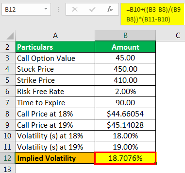

In the complex landscape of trading and finance, accurately understanding and predicting market movements is paramount. Volatility serves as a fundamental metric in this domain, providing a measure of the potential risk associated with an asset's price fluctuations. Recognizing volatility allows traders and financial analysts to gauge the magnitude of price changes over time, which is essential for effective decision-making.

This article addresses the two primary types of volatility that are critical in trading: implied volatility and historical volatility. Implied volatility (IV) is a forward-looking measure, derived from the current prices of options. It reflects the market's expectations regarding the future volatility of the underlying asset. In contrast, historical volatility assesses past price behavior, calculated using historical price data to understand how much an asset's price has varied over a specific period. Each type serves its distinct purpose and plays a central role in the decision-making process of traders, particularly when it comes to options pricing.



In algorithmic trading, these volatility metrics are indispensable. Algorithmic trading strategies leverage real-time data to execute trades automatically based on pre-determined criteria, improving trade execution speed and precision. Through the integration of implied and historical volatility data, traders can optimize their strategies, enhance risk management, and identify profitable trading opportunities.

The forthcoming sections will examine how implied and historical volatility inform trading strategies, contribute to options pricing, and aid risk management, equipping readers with a nuanced comprehension of how these measures are applied in algorithmic trading. This understanding is crucial for traders aiming to navigate the complexities of modern financial markets effectively.

## Table of Contents

## Understanding Volatility

Volatility refers to the magnitude of changes in the price of a security over time and is a crucial metric for assessing market risk. It quantifies the degree of variation in an asset’s price, and understanding it is essential for traders who aim to predict potential price movements and manage risk effectively.

A higher volatility typically indicates a higher risk, with the potential for larger price swings. This is often associated with the chance for greater returns, as volatile markets may present opportunities for significant profit from price changes. Conversely, lower volatility suggests smaller price fluctuations and less risk. In such environments, prices are more stable, potentially offering fewer opportunities for substantial gains but ensuring a lower risk level.

There are two primary measures of [volatility](/wiki/volatility-trading-strategies) that traders use to assess these fluctuations: implied volatility and historical volatility. Implied volatility (IV) is a forward-looking metric derived from option prices, reflecting market expectations of future volatility. It is influenced by factors such as market sentiment and forthcoming events. Historical volatility, on the other hand, measures past price fluctuations, providing insights into an asset’s behavior over a specified historical period. This retrospective metric helps traders in assessing the past risk and variability of an asset.

Both measures are essential in trading, but they serve different purposes. Implied volatility helps forecast future market conditions, while historical volatility offers a perspective based on past market performance. Understanding and analyzing both can equip traders with better insights into market dynamics and assist in making more informed decisions.

## Implied Volatility

Implied volatility (IV) is a crucial component in options pricing, serving as a predictive measure of an asset’s future volatility based on the market's existing conditions. Unlike historical volatility, which relies on past price movements, implied volatility is forward-looking. It extracts volatility estimates from the current prices of options in the market. This anticipatory nature allows traders to gauge potential price fluctuations of the underlying asset.

IV is derived from the Black-Scholes option pricing model, among others, as a component reflecting the market's view of future volatility. In the model, the volatility segment is typically the only unknown, leading traders to adjust it until the theoretical option price aligns with the market price. Consequently, implied volatility can be thought of as the market’s forecast of a stock’s prospective volatility over the life of the option.

Several factors influence implied volatility, primarily market sentiment, upcoming events, and the overall economic landscape. For instance, before significant events such as earnings reports or economic policy announcements, implied volatility tends to rise. This increase is due to heightened uncertainty around these events' potential impacts on an asset’s price.

Higher implied volatility usually results in higher options premiums. This is because options are fundamentally priced on potential future volatility; more uncertainty equates to a higher risk for option sellers, who accordingly demand greater compensation. Traders and investors frequently exploit this characteristic by pricing options contracts based on implied volatility assessments. When implied volatility is high relative to actual future movements, options may be considered overvalued, and when it is low, they may be undervalued.

In the world of trading, understanding and analyzing implied volatility can provide insights into market expectations and help develop strategies for both hedging and speculative purposes. As it encapsulates the market's consensus on price movement risks, it becomes an indispensable tool for traders aiming to make informed decisions and optimize their trading strategies.

## Historical Volatility

Historical volatility, also referred to as statistical volatility, is an essential metric in financial analysis, providing a snapshot of past price fluctuations in a security. It is calculated using historical price data and often expressed as an annualized percentage. Historical volatility offers insights into how much a security's price has varied over a predetermined period, thereby aiding traders and analysts in assessing market risk and making informed trading decisions.

To calculate historical volatility, analysts generally use the standard deviation of price returns, typically on a daily basis. This approach helps quantify the [dispersion](/wiki/dispersion-trading) of prices from their average, giving a clearer picture of the asset's historical price behavior. The formula for calculating the daily historical volatility is as follows:

$$
\sigma = \sqrt{\frac{\sum (r_i - \bar{r})^2}{n-1}}
$$

where:
- $r_i$ represents the daily return for day $i$,
- $\bar{r}$ is the average daily return over the period,
- $n$ is the total number of observations.

The calculated daily volatility can be annualized by multiplying it by the square root of the number of trading days in a year, often approximated to 252 days. Thus, the annualized historical volatility $\sigma_a$ can be calculated as:

$$
\sigma_a = \sigma \times \sqrt{252}
$$

Historical volatility is instrumental in risk assessment as it reflects the extent and frequency of price changes over time. By evaluating the historical volatility of an asset, traders can gain insights into its past market behavior, which aids in developing trading strategies and managing risk effectively. For example, securities with higher historical volatility generally indicate larger price swings, which could result in higher risks and potential rewards for traders willing to engage with them.

Incorporating historical volatility into [algorithmic trading](/wiki/algorithmic-trading) systems, traders can automate decision-making processes by analyzing past price patterns and deriving actionable insights for risk management and trading strategy optimization. Through this analysis, traders seek to predict future volatility trends and adjust their positions accordingly, thereby achieving a balanced risk-reward ratio in line with their investment goals.

## Comparison Between Implied and Historical Volatility

While both implied and historical volatility are pivotal in the assessment of financial markets, each serves a distinct function. Implied volatility (IV) is derived from the prices of options and provides an estimate of the future volatility of an asset, reflecting the market's expectations. In contrast, historical volatility (HV) is calculated based on past price data and measures the asset's actual price fluctuations over a specific period.

Implied volatility is akin to a forecast. It is influenced by market sentiment, changes in supply and demand for options, and upcoming events that might impact prices significantly. This forward-looking nature of implied volatility makes it a critical tool for traders to anticipate future market moves and set strategies accordingly.

Conversely, historical volatility serves as a measure of the past instability in an asset’s price. It is computed using statistical methods, often the standard deviation of the asset's logarithmic returns over a given timeframe. Historical volatility provides insights into how an asset has behaved under past market conditions and is crucial for understanding the baseline risk associated with the asset.

Traders often leverage the difference between implied and historical volatility to identify potential trading opportunities, especially in options trading. If implied volatility is significantly higher than historical volatility, it may suggest that the market expects considerable future movement, rendering options potentially overvalued. Conversely, if implied volatility is lower than historical volatility, it might indicate undervalued options, suggesting that the market anticipates less movement than what has occurred historically.

For example, the relation between IV and HV can be quantitatively expressed as a z-score:

$$
z = \frac{{IV - HV}}{{\sigma}}
$$

where $\sigma$ is the standard deviation of historical volatility. A higher z-score may signal overvaluation (and vice versa), guiding traders in options pricing strategies.

In practice, traders and algorithmic systems utilize these volatility measures to inform buy and sell decisions. By analyzing discrepancies between the two metrics, programs may be designed to execute [arbitrage](/wiki/arbitrage) strategies, capitalizing on market inefficiencies based on the perceived mispricing of options. This strategic use of implied and historical volatility not only enhances the understanding of current market conditions but also bolsters the decision-making process in trading activities.

## Volatility in Algorithmic Trading

Algorithmic trading increasingly relies on volatility metrics to automate trading strategies, leveraging the capabilities of computer programs to analyze market data and execute trades with precision. Volatility is a key component in these strategies because it represents potential market movements, which are essential for making informed decisions.

Programs developed for algorithmic trading use historical and implied volatility to identify patterns and predict future price movements. By assessing these volatility measures, algorithmic systems can execute trades based on predefined criteria, enhancing efficiency and potentially increasing returns. For example, a trading algorithm might be programmed to buy an asset when its implied volatility is significantly higher than its historical volatility, suggesting that the market expects future price changes. Conversely, if historical volatility is higher, it may indicate the asset has experienced erratic price movements in the past, influencing trading decisions differently.

Implied and historical volatility can trigger buy or sell signals in strategies such as volatility arbitrage and options strategies. In volatility arbitrage, traders capitalize on the difference between implied and actual volatility. For example, if an algorithm detects that implied volatility for an option is higher than the historical volatility of the underlying asset, it might initiate a short position on the option, expecting the market's volatility expectations to decrease. In options trading, understanding these volatility metrics is vital for pricing and hedging positions. Implied volatility, derived from option prices, helps traders estimate the market's forecast of future volatility, while historical volatility provides a benchmark to evaluate these expectations.

The efficiency of algorithmic trading in utilizing volatility metrics lies in its capacity to process vast amounts of data and execute trades at speeds unattainable by human traders. These programs can continuously monitor and adjust trading strategies in response to evolving market conditions, thereby optimizing performance and risk management. This automated approach not only increases the potential for returns by capitalizing on volatility discrepancies but also enhances risk mitigation by systematically managing exposure across different assets.

In summary, the integration of volatility metrics in algorithmic trading allows for the development of sophisticated strategies that can both identify market opportunities and manage risks effectively. By leveraging the predictive power of implied and historical volatility, algorithmic trading programs can navigate financial markets with increased agility and precision, ultimately contributing to the overall efficiency of the trading process.

## Using Volatility Metrics for Risk Management

In trading strategies, both implied and historical volatility are essential tools for managing risk through the effective setting of stop-loss and take-profit levels. These volatility metrics provide insights into the potential price fluctuations of an asset and enable traders to make informed decisions that align with their risk tolerance and trading goals.

Implied volatility, which reflects the market's expectations of future price movements, can be a key determinant in setting appropriate stops and limits. For instance, in periods of high implied volatility, traders might anticipate larger price swings and thus set wider stop-loss levels to prevent premature exits from potentially profitable trades. Conversely, periods of low implied volatility might justify tighter stop-loss levels due to the expectation of smaller price movements.

Historical volatility, on the other hand, offers insights into past price behavior, which can be crucial for understanding the typical range within which an asset's price moves. By analyzing historical volatility data, traders can assess the likelihood of certain price changes and adjust their position sizing accordingly. For example, if a security historically exhibits high volatility, a trader might choose a smaller position size to mitigate the risk of significant losses.

Mathematically, volatility can be incorporated into risk management strategies through calculations such as the standard deviation of historical returns. The standard deviation ($\sigma$) is a commonly used measure of historical volatility and is applied to determine the expected range of asset price movements:

$$
\sigma = \sqrt{\frac{1}{N-1}\sum_{i=1}^{N}(R_i - \bar{R})^2}
$$

where $N$ is the number of observations, $R_i$ are returns, and $\bar{R}$ is the average return. This formula enables traders to quantify the risk associated with an asset's price volatility. 

In algorithmic trading, these volatility metrics can be integrated into trading algorithms to dynamically adjust stop-loss and take-profit levels based on real-time analysis of market conditions. For instance, a Python script could be designed to adjust trading thresholds based on the calculated implied and historical volatility values:

```python
def adjust_levels(implied_volatility, historical_volatility):
    if implied_volatility > historical_volatility:
        stop_loss = base_level * (1 + implied_volatility)
        take_profit = base_level * (1 + 2 * implied_volatility)
    else:
        stop_loss = base_level * (1 + historical_volatility)
        take_profit = base_level * (1 + 2 * historical_volatility)
    return stop_loss, take_profit
```

This adaptability ensures that traders maintain a balanced risk exposure, which is critical for long-term success. By leveraging implied and historical volatility metrics, traders can effectively manage their positions, optimize their strategies, and align their trading activities with their risk management objectives.

## Conclusion

Understanding implied and historical volatility is essential for traders, especially those employing algorithmic strategies. These metrics not only facilitate option pricing by reflecting market expectations and past price movements but also serve as crucial components in risk management and strategy development.

In the context of options pricing, implied volatility acts as a forward-looking indicator, integrating anticipated market conditions and events that could affect asset prices. A precise estimate of implied volatility can enhance the pricing accuracy of options, allowing traders to identify potential discrepancies between an option's market price and its theoretical value.

Beyond pricing, volatility measurements are indispensable in risk management. By understanding an asset's historical volatility, traders can gauge past volatility trends and incorporate this data into predictive models aimed at forecasting future risks. This historical insight is vital for setting strategic parameters such as stop-loss and take-profit levels, ensuring that exposure remains within manageable bounds.

Algorithmic trading systems leverage volatility measures to generate buy or sell signals through pre-defined criteria such as volatility breakouts or compressions. The integration of volatility metrics into these automated systems is designed to increase trading efficiency and responsiveness to market dynamics. For instance, in volatility arbitrage strategies, traders compare implied volatility against historical volatility to exploit mispricings, striving to achieve returns irrespective of market direction.

Furthermore, effective utilization of implied and historical volatility allows for optimal position sizing. Traders can adjust the size of their trades based on volatility expectations, enhancing their ability to withstand market shocks without undue exposure.

Overall, by employing a comprehensive understanding of volatility metrics, traders can navigate the complexities of financial markets with greater confidence, optimizing both their risk management frameworks and strategic decision-making processes. This understanding is particularly advantageous in the fast-paced environment of algorithmic trading, where timely and informed decisions are paramount.

## References & Further Reading

[1]: Hull, J. (2014). ["Options, Futures, and Other Derivatives"](https://edisciplinas.usp.br/pluginfile.php/5278790/mod_resource/content/1/Hull%20J.C.-Options%2C%20Futures%20and%20Other%20Derivatives_9th%20edition.pdf). Pearson Education.

[2]: Carr, P., & Wu, L. (2009). ["Variance Risk Premiums"](https://academic.oup.com/rfs/article-abstract/22/3/1311/1581057). The Review of Financial Studies.

[3]: Haug, E. G. (2008). ["The Complete Guide to Option Pricing Formulas"](https://archive.org/details/completeguidetoo0000haug). McGraw-Hill Education.

[4]: Gatheral, J. (2006). ["The Volatility Surface: A Practitioner's Guide"](https://onlinelibrary.wiley.com/doi/book/10.1002/9781119202073). Wiley Finance.

[5]: Leland, H. E. (1999). ["Beyond Mean-Variance: Performance Measurement in a Nonsymmetrical World"](https://www.researchgate.net/publication/240311501_Beyond_Mean-Variance_Performance_Measurement_in_a_Nonsymmetrical_World_corrected). Financial Analysts Journal.