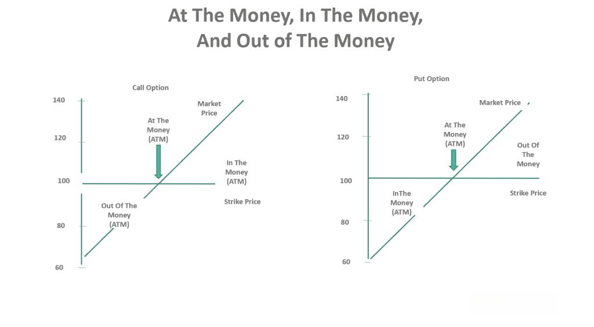

Options trading plays a critical role in financial markets by offering investors and traders the ability to hedge portfolios, manage risk, and potentially capitalize on market movements without needing to own the underlying asset. At a fundamental level, an option is a financial derivative that provides the buyer with the right, but not the obligation, to buy or sell an underlying asset at a predetermined price, known as the strike price, on or before a specified expiration date.

Two key terminologies essential for understanding options trading are 'in the money' (ITM) and 'out of the money' (OTM). An option is considered 'in the money' when exercising it would result in a positive cash flow. For call options, this means the current market price of the underlying asset is above the strike price. Conversely, for put options, the underlying asset's market price must be below the strike price. An OTM option, on the other hand, would not yield a positive cash flow if exercised; thus, for calls, this occurs when the market price is below the strike price, and for puts, when it is above.



Algorithmic trading, the use of computer algorithms to automate trading decisions, has revolutionized the financial markets by enhancing efficiency and precision. Within options trading, algorithmic strategies allow traders to swiftly exploit market conditions, optimize execution prices, and manage complex hedge portfolios effectively. The integration of algorithms into options trading amplifies these benefits by swiftly analyzing voluminous data, executing trades, and adjusting positions based on pre-set criteria without manual intervention.

For traders looking to optimize their strategies, understanding the implications of options being ITM or OTM is paramount. These concepts significantly impact option pricing, strategy selection, and risk management. By integrating algorithmic trading with a deep understanding of ITM and OTM options, traders can develop sophisticated strategies that exploit price inefficiencies and market dynamics while managing risk effectively. This article aims to explore these concepts and their practical applications, equipping traders with the knowledge necessary to enhance their trading strategies through algorithmic approaches and deepen their understanding of options trading dynamics.

## Table of Contents

## Understanding Options Trading

Options trading is a financial practice that involves contracts giving the buyer the right, but not the obligation, to buy or sell an underlying asset at a predetermined price on or before a specific date. These contracts are known as options and are primarily used for hedging risks or speculating on the price movement of the underlying assets such as stocks, indices, or commodities. 

Options are broadly classified into two types: calls and puts. A call option provides the holder with the right to purchase the underlying asset at the agreed-upon strike price within a set time frame. Conversely, a put option grants the holder the right to sell the underlying asset at the strike price within the same period. This flexibility allows investors to tailor strategies according to market conditions and personal risk tolerance.

Options trading plays a crucial role in portfolio diversification and risk management. By incorporating options into a diversified portfolio, traders can limit downside risk while maintaining the potential for gains. For instance, a strategy known as a protective put allows investors to hold onto a long stock position while purchasing put options to guard against losses beyond a certain point, thereby offering downside protection.

Risk management is further achieved through the versatility of options trading strategies. Strategies such as covered calls, straddles, and iron condors allow traders to manage [volatility](/wiki/volatility-trading-strategies) and leverage their positions effectively. A covered call involves holding a long position in an asset while simultaneously writing (selling) call options on the same asset to generate additional income. A straddle involves purchasing a call and a put option with the same strike price and expiration date, benefiting from significant price movements in either direction. An iron condor, a more advanced strategy, involves selling an out-of-the-money put and call and buying a further out-of-the-money put and call, offering limited risk and limited profit potential in a stable market.

By understanding the various types and applications of options, traders can harness these instruments to achieve a balance between risk and reward, align their positions with market forecasts, and enhance the overall performance of their portfolios.

## In the Money vs Out of the Money

Options trading is a financial strategy where investors trade contracts allowing them to buy or sell an underlying asset at a predetermined price before or at a certain date. Two critical terms within this realm are "in the money" (ITM) and "out of the money" (OTM), which denote the intrinsic value of options. Understanding these concepts helps traders make informed decisions, optimizing their strategies in the process.

### Definition of 'In the Money' (ITM) Options and Their Characteristics

An option is considered "in the money" when exercising it immediately would result in a profit. For call options, which provide the right to buy an asset, being ITM means the option’s strike price is below the current market price of the underlying asset. Conversely, for put options, which allow the holder to sell the asset, ITM implies the strike price is above the current market price.

**Characteristics of ITM Options:**

1. **Intrinsic Value**: ITM options have intrinsic value, determined by the positive difference between the underlying asset's market and strike price.
$$
   \text{Intrinsic Value (Call)} = \max(0, \text{Market Price} - \text{Strike Price})

$$
$$
   \text{Intrinsic Value (Put)} = \max(0, \text{Strike Price} - \text{Market Price})

$$

2. **Higher Premiums**: Because they are likely to be exercised profitably, ITM options often have higher premiums.
3. **Lower Time Value**: Time value, or the difference between the option’s price and intrinsic value, tends to be lower as expiration approaches.

### Definition of 'Out of the Money' (OTM) Options and Their Characteristics

"Out of the money" options are those that would lead to a net loss if exercised immediately. For call options, OTM indicates the strike price exceeds the underlying asset’s market price. For put options, it means the strike price is below the current market price.

**Characteristics of OTM Options:**

1. **No Intrinsic Value**: OTM options carry no intrinsic value since exercising them does not yield immediate profit.

2. **Lower Premiums**: Because they are less likely to be exercised profitably, OTM options typically have lower premiums compared to ITM options.
3. **Higher Time Value**: OTM options rely heavily on time value, as the possibility exists for market fluctuations that could make them profitable before expiration.

### Comparative Analysis of ITM and OTM Options

The distinction between ITM and OTM options heavily influences trading strategies and risk profiles. ITM options, by possessing immediate intrinsic value, are generally more stable but more expensive due to their higher premiums. They act as less risky investments for traders seeking immediate profit potential while sacrificing the upside potential that comes with lower costs.

OTM options, however, are more speculative. They offer the potential for large gains if market movements are favorable, attributed to their lower initial cost. This makes them attractive for traders willing to accept higher risk in hopes of capturing significant market changes.

### Implications of Options Being ITM or OTM for Traders

The ITM or OTM status shapes a trader's approach to options. ITM options are often used for hedging strategies due to their stability and inherent value, providing immediate financial protection against market movements. This is particularly beneficial in risk management, where retaining asset value in volatile markets is crucial.

OTM options are more about speculation and leverage. Traders aiming to capitalize on expected market movements may prefer OTM options due to their low cost and potential for high reward, while accepting the inherent risk. Often leveraged with [algorithmic trading](/wiki/algorithmic-trading), these options suit traders with a high-risk tolerance, betting on significant future price shifts.

In conclusion, understanding ITM and OTM options is pivotal for crafting efficient trading strategies. ITM options provide security and stable returns, while OTM options offer the allure of high returns with higher associated risks, necessitating careful consideration of market conditions and individual risk tolerance.

## Algorithmic Trading in Options

Algorithmic trading has revolutionized the financial markets by automating and optimizing trading decisions and execution. In options trading, algorithmic trading involves deploying computer programs to systematically trade options based on predefined criteria and quantitative analysis.

Algorithmic trading works in the context of options by leveraging mathematical models and large datasets to identify trading opportunities and efficiently execute trades. This process involves three main steps: signal generation, risk management, and execution. Signal generation uses algorithms to identify potential trades by analyzing factors such as historical price data, volatility, and market depth. Risk management involves evaluating the potential risks associated with a trade, such as the option's delta, gamma, and theta, to ensure the strategy aligns with the trader's risk tolerance. Lastly, execution algorithms decide how the orders should be sent to the market, optimizing for factors like speed, cost, and market impact.

The benefits of using algorithms for options trading are multifaceted. Algorithms enhance the speed and accuracy of trade execution, allowing traders to capitalize on fleeting market opportunities more effectively. They enable the execution of complex strategies that would be challenging to implement manually, such as delta-neutral strategies or volatility spreads. Another significant advantage is the reduction of emotional trading, as decisions are based on quantitative models rather than human intuition.

The key components of successful algorithmic options trading strategies include robust data analysis, [backtesting](/wiki/backtesting), and real-time market monitoring. Reliable data analysis ensures that the algorithms are built on a sound understanding of market dynamics. Backtesting involves simulating the algorithm on historical data to evaluate its performance and make necessary adjustments. Real-time market monitoring is crucial for adapting to market changes and ensuring that trades are executed according to the intended strategy.

In summary, algorithmic trading in options transforms traditional trading practices by leveraging technology for enhanced decision-making and execution. Its integration into options trading allows traders to implement sophisticated strategies with improved efficiency and precision.

## Strategies for ITM and OTM Options Using Algorithms

Developing algorithms for trading in-the-money (ITM) options involves a systematic approach that takes into account the intrinsic value of these options. ITM options have a strike price favorable compared to the current market price of the underlying asset. Algorithms designed for trading ITM options typically focus on capturing the already-existing intrinsic value and managing potential adverse movements in the underlying asset's price. These algorithms often incorporate delta hedging strategies to adjust the position as the underlying price changes. For a call option, this can involve shorting the underlying asset to balance the delta, minimizing risk associated with adverse price movements.

Conversely, developing algorithms for out-of-the-money (OTM) options requires a focus on potential future value rather than present intrinsic value, as these options have a strike price unfavorable in relation to the current market price. Algorithms targeting OTM options often utilize volatility measures, searching for opportunities where market conditions may lead to significant price changes that can bring the option into profitability. The algorithms may also integrate complex valuation models like Black-Scholes or binomial models to assess the fair pricing of OTM options. For example, a Python script could utilize libraries such as `numpy` and `scipy` to model these valuations.

```python
import numpy as np
import scipy.stats as stats

def calculate_option_price(S, K, T, r, sigma, option_type='call'):
    d1 = (np.log(S / K) + (r + 0.5 * sigma**2) * T) / (sigma * np.sqrt(T))
    d2 = d1 - sigma * np.sqrt(T)

    if option_type == 'call':
        option_price = S * stats.norm.cdf(d1) - K * np.exp(-r * T) * stats.norm.cdf(d2)
    else:
        option_price = K * np.exp(-r * T) * stats.norm.cdf(-d2) - S * stats.norm.cdf(-d1)

    return option_price
```

Balancing risk and reward demands sophisticated algorithms that can dynamically adapt to market conditions. These algorithms often incorporate stop-loss and take-profit triggers that are automatically adjusted as volatility in the market changes. Additionally, portfolio optimization techniques that evaluate potential returns against the accepted risk level can be integrated into these algorithms, using metrics like the Sharpe Ratio to assess strategy effectiveness.

Examples of successful algorithmic trading strategies involve real-time data processing and adjustment capabilities. For example, a [hedge fund](/wiki/hedge-fund-trading-strategies) might use a high-frequency trading algorithm capable of executing trades in milliseconds, continuously balancing ITM and OTM option portfolios based on micro-market movements and probabilistic forecasts. Employing [machine learning](/wiki/machine-learning) models, such as [reinforcement learning](/wiki/reinforcement-learning), can further enhance these strategies by simulating various market scenarios and continuously learning from the outcomes to optimize decision-making processes.

## Challenges and Considerations

Algorithmic options trading presents several technical and financial challenges that traders must navigate to deploy successful strategies. The inherent complexity of options, combined with the dynamic nature of financial markets, requires a robust approach to both development and risk management.

### Technical and Financial Challenges

The primary technical challenge involves developing algorithms that can accurately predict market movements and execute trades with minimal latency. High-frequency trading environments demand exceptional speed and precision. Thus, traders need advanced computational resources and infrastructure. Ensuring data integrity and having access to real-time market data are crucial for algorithm efficacy. Financially, these technical capabilities can represent significant costs, often requiring substantial investment in technology and skilled personnel.

Mathematically, algorithms often rely on stochastic processes and statistical models to forecast option price movements. A common approach includes the use of the Black-Scholes model to estimate theoretical values of options. Yet, models must be continuously adapted to incorporate real-world market changes and volatility.

### Regulatory Considerations

Regulatory frameworks governing algorithmic trading are designed to maintain market stability and prevent manipulative practices. Traders must comply with specific regulations, such as those imposed by the Securities and Exchange Commission (SEC) in the United States or the Markets in Financial Instruments Directive II (MiFID II) in Europe. These may include maintaining detailed records of trades, implementing pre-trade risk controls, and ensuring transparency in algorithmic operations. Compliance necessitates robust legal and operational frameworks within firms.

### Managing Risks Associated with ITM and OTM Options

In-the-money (ITM) and out-of-the-money (OTM) options each [carry](/wiki/carry-trading) unique risk profiles that algorithms must account for. ITM options have intrinsic value and are more likely to be exercised, while OTM options are cheaper but riskier as they rely on significant market movements to become profitable.

To manage these risks, traders can deploy strategies like delta hedging, which seeks to offset the sensitivity to price movements of the underlying asset. Delta ($\Delta$) represents the rate of change of the option's value with respect to changes in the underlying asset's price. Traders can adjust their delta exposure to mitigate potential losses.

```python
# Example of calculating delta for a call option using the Black-Scholes formula
from scipy.stats import norm
from math import log, sqrt, exp

def black_scholes_delta(S, K, T, r, sigma):
    """ Calculate the delta of a European call option """
    d1 = (log(S / K) + (r + 0.5 * sigma**2) * T) / (sigma * sqrt(T))
    delta = norm.cdf(d1)
    return delta

# Parameters: S = Stock price, K = Strike price, T = Time to expiration,
# r = Risk-free rate, sigma = Volatility
delta_value = black_scholes_delta(S=100, K=95, T=1, r=0.05, sigma=0.2)
print("Delta:", delta_value)
```

### Best Practices for Algorithmic Options Trading

Successful algorithmic trading requires following best practices that include rigorous backtesting and optimization of strategies. Backtesting involves using historical data to simulate a strategy's performance, while optimization ensures that the algorithm is fine-tuned to achieve desired outcomes without overfitting to historical noise.

Additionally, continuous monitoring and real-time analytics are essential to adapt strategies quickly to changing market conditions. Since market dynamics inherently change, algorithms should be flexible and capable of updating rules based on new data insights.

In summary, while algorithmic options trading presents various challenges, careful management of technical and financial resources, adherence to regulatory requirements, effective risk management, and implementation of best practices can significantly optimize trading strategies.

## Conclusion

Understanding the concepts of 'in the money' (ITM) and 'out of the money' (OTM) options is crucial for traders aiming to optimize their trading strategies. ITM options, which have intrinsic value, tend to offer higher profitability but incur greater costs, while OTM options, lacking intrinsic value, are cheaper and often used for speculative purposes with higher risk. Mastery over these concepts allows traders to align their risk tolerance with their investment goals effectively.

Algorithmic trading markedly enhances options trading strategies by leveraging computational power to execute trades with precision and speed. Algorithms are designed to process vast datasets and perform complex calculations, providing traders with data-driven insights that are pivotal in making informed decisions. Automated systems remove human emotion from trading, reducing errors and consistently applying strategies across multiple symbols and markets.

The modern financial markets encourage the use of technology as it enables innovative trading practices. By integrating sophisticated algorithms into trading operations, traders can capitalize on market opportunities that may otherwise be imperceptible. The strategic use of algorithms in options trading not only optimizes execution but also manages risks more efficiently.

Looking to the future, algorithmic trading will continue to evolve, driven by advancements in [artificial intelligence](/wiki/ai-artificial-intelligence) and machine learning. These technologies promise to refine trading algorithms further, making them adaptive and capable of learning from market behaviors. As the options market continues to grow in complexity, traders who embrace technology and harness the power of algorithmic trading will be well-positioned to navigate and succeed in this dynamic landscape.

## References & Further Reading

[1]: Bergstra, J., Bardenet, R., Bengio, Y., & Kégl, B. (2011). ["Algorithms for Hyper-Parameter Optimization."](https://dl.acm.org/doi/10.5555/2986459.2986743) Advances in Neural Information Processing Systems 24.

[2]: ["Advances in Financial Machine Learning"](https://www.amazon.com/Advances-Financial-Machine-Learning-Marcos/dp/1119482089) by Marcos Lopez de Prado

[3]: ["Evidence-Based Technical Analysis: Applying the Scientific Method and Statistical Inference to Trading Signals"](https://www.amazon.com/Evidence-Based-Technical-Analysis-Scientific-Statistical/dp/0470008741) by David Aronson

[4]: ["Machine Learning for Algorithmic Trading"](https://github.com/stefan-jansen/machine-learning-for-trading) by Stefan Jansen

[5]: ["Quantitative Trading: How to Build Your Own Algorithmic Trading Business"](https://www.amazon.com/Quantitative-Trading-Build-Algorithmic-Business/dp/1119800064) by Ernest P. Chan