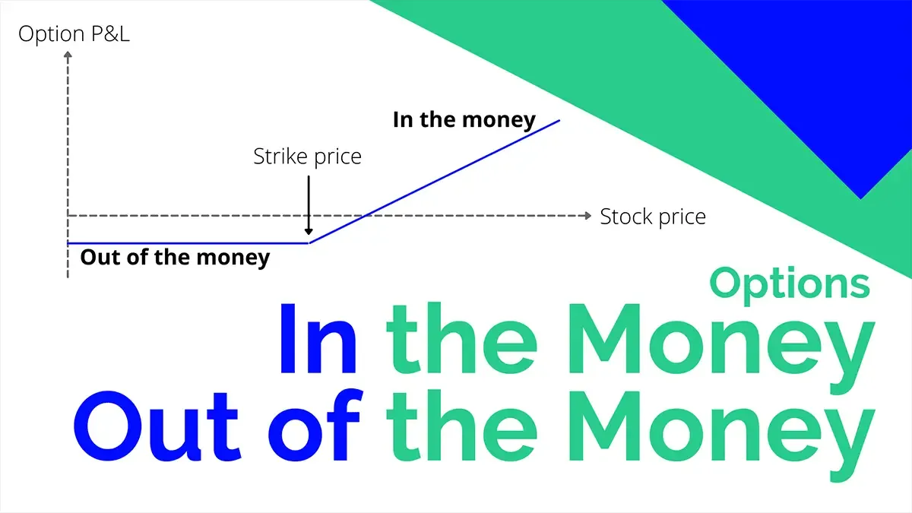

## Table of Contents

## What does 'In the Money' (ITM) mean in options trading?

In options trading, 'In the Money' (ITM) means that an option has intrinsic value. For a call option, this happens when the current market price of the stock is higher than the strike price of the option. For a put option, it's when the stock's market price is lower than the strike price. If you can exercise the option and make a profit right away, then it's in the money.

This term is important because it helps traders understand the potential profitability of an option at any given time. ITM options are more expensive than out-of-the-money options because they already have value. Traders might choose ITM options if they want a higher chance of making a profit, even though they cost more to buy.

## What does 'Out of the Money' (OTM) mean in options trading?

In options trading, 'Out of the Money' (OTM) means that an option has no intrinsic value. For a call option, this happens when the current market price of the stock is lower than the strike price of the option. For a put option, it's when the stock's market price is higher than the strike price. If you can't make a profit by exercising the option right away, then it's out of the money.

OTM options are cheaper than in-the-money options because they don't have any immediate value. Traders might choose OTM options if they think the stock price will move a lot in their favor before the option expires. This way, they can buy the option for less money and still have a chance to make a profit if their prediction about the stock's movement is correct.

## How can you identify if an option is ITM or OTM?

To find out if an option is In the Money (ITM), you need to look at the stock's current price and compare it to the option's strike price. For a call option, if the stock price is higher than the strike price, the option is ITM. This means you could buy the stock at the lower strike price and sell it at the higher market price to make a profit right away. For a put option, it's the opposite: if the stock price is lower than the strike price, the put option is ITM. You could sell the stock at the higher strike price and buy it back at the lower market price to make a profit.

To see if an option is Out of the Money (OTM), you do the same comparison. For a call option, if the stock price is lower than the strike price, the option is OTM. This means you wouldn't make any money if you exercised the option right now because you'd be buying the stock at a higher price than it's worth on the market. For a put option, if the stock price is higher than the strike price, it's OTM. You wouldn't profit because you'd be selling the stock at a lower price than what you could get on the market.

## What are the basic differences between ITM and OTM options?

In the Money (ITM) options have a value right now because they can be used to make a profit immediately. For a call option, this happens when the stock's price is higher than the option's strike price. You could buy the stock at the lower strike price and sell it at the higher market price to make money. For a put option, it's the opposite: if the stock's price is lower than the strike price, you could sell the stock at the higher strike price and buy it back at the lower market price. ITM options cost more because they already have value, but they are more likely to make you money if you use them right away.

Out of the Money (OTM) options don't have any value right now because they can't be used to make a profit immediately. For a call option, if the stock's price is lower than the option's strike price, you wouldn't make money by buying the stock at the higher strike price and selling it at the lower market price. For a put option, if the stock's price is higher than the strike price, selling the stock at the lower strike price and buying it back at the higher market price wouldn't be profitable. OTM options are cheaper because they don't have any immediate value, but they could still make you money if the stock's price moves in the right direction before the option expires.

## How do ITM and OTM options affect the potential profitability of a trade?

ITM options can make a trade more profitable right away because they have value now. If you buy an ITM call option and the stock price is higher than the strike price, you can buy the stock at the lower strike price and sell it at the higher market price to make money. If you buy an ITM put option and the stock price is lower than the strike price, you can sell the stock at the higher strike price and buy it back at the lower market price. Because ITM options already have value, they cost more to buy, but they give you a better chance to make money if you use them right away.

OTM options don't have value right now, so they can't make you money immediately. If you buy an OTM call option and the stock price is lower than the strike price, you wouldn't make money by buying the stock at the higher strike price and selling it at the lower market price. If you buy an OTM put option and the stock price is higher than the strike price, selling the stock at the lower strike price and buying it back at the higher market price wouldn't be profitable. OTM options are cheaper because they don't have any immediate value, but they could still make you money if the stock's price moves in the right direction before the option expires. This means you might make a bigger profit if your prediction about the stock's movement is correct, but it's riskier because there's no guarantee the stock will move the way you expect.

## What are the risks associated with trading ITM versus OTM options?

Trading ITM options comes with its own set of risks. The biggest risk is that they cost more because they already have value. If you buy an ITM option and the stock price doesn't move in your favor, you could lose the money you spent on the option. Also, because ITM options are more expensive, you might need to put down a bigger amount of money to buy them. This means you could lose more money if things don't go as planned. But, if the stock price does move the way you expect, you could make a profit right away.

Trading OTM options also has risks, but they are different. The main risk is that OTM options don't have any value right now, so if the stock price doesn't move in the right direction before the option expires, you could lose all the money you spent on the option. OTM options are cheaper, which means you might not lose as much money if things go wrong, but it also means you're taking a bigger risk because there's no guarantee the stock will move the way you expect. If the stock price does move in your favor, you could make a bigger profit compared to what you paid for the option, but it's a riskier bet.

## How do the premiums of ITM and OTM options compare, and why?

The premiums for ITM options are higher than for OTM options. This is because ITM options have value right now. If you have an ITM call option, you can buy the stock at a lower price than what it's worth on the market and make money right away. The same goes for an ITM put option, where you can sell the stock at a higher price than it's worth. Because they have this immediate value, people are willing to pay more for ITM options, which makes their premiums higher.

OTM options, on the other hand, don't have any value right now. If you have an OTM call option, the stock price is lower than the price you can buy it at with the option, so you wouldn't make money right away. The same is true for an OTM put option, where the stock price is higher than the price you can sell it at with the option. Because OTM options don't have any immediate value, they cost less to buy, which means their premiums are lower. People might buy them hoping the stock price will move in the right direction before the option expires, but it's a riskier bet.

## What is the impact of time decay on ITM and OTM options?

Time decay affects both ITM and OTM options, but it hits OTM options harder. Time decay means that as an option gets closer to its expiration date, it loses value over time. This happens because the less time there is left for the stock price to move in the right direction, the less chance there is for the option to become profitable. For OTM options, which don't have any value right now, this time decay can make them lose all their value if the stock price doesn't move in the right direction before the option expires. So, OTM options can become worthless very quickly as time passes.

ITM options also lose value because of time decay, but not as quickly as OTM options. ITM options have some value right now because you can make money by exercising them. Even though they lose value over time, they still have some worth because of their intrinsic value. This means that ITM options are less affected by time decay than OTM options. Still, if you're holding an ITM option and the stock price doesn't move in your favor, the option's value will go down as it gets closer to expiring.

## How does implied volatility influence the choice between ITM and OTM options?

Implied [volatility](/wiki/volatility-trading-strategies) can help you decide whether to buy ITM or OTM options. Implied volatility is a guess about how much a stock's price might move in the future. If the implied volatility is high, it means people think the stock price might change a lot. In this case, OTM options might be a good choice because they are cheaper and could make you a bigger profit if the stock price moves a lot in the right direction. But, they are also riskier because there's no guarantee the stock will move the way you expect.

If the implied volatility is low, it means people think the stock price won't change much. In this case, ITM options might be a better choice because they already have value and are more likely to make you money even if the stock price doesn't move much. ITM options cost more, but they are less risky because they have some value right now. So, when you're thinking about buying options, looking at the implied volatility can help you decide if you want to take a bigger risk with OTM options or play it safer with ITM options.

## What are the strategic uses of ITM and OTM options in different market conditions?

In a bullish market, where people think stock prices will go up, traders might use ITM call options if they want a safer bet. ITM call options are more expensive, but they already have value because the stock price is higher than the strike price. This means you can make money right away if you buy the stock at the lower strike price and sell it at the higher market price. If you think the stock price will go up a lot, you might choose OTM call options instead. They are cheaper and could make you a bigger profit if the stock price moves a lot in the right direction, but they are riskier because they don't have value right now.

In a bearish market, where people think stock prices will go down, traders might use ITM put options for a safer bet. ITM put options cost more, but they have value because the stock price is lower than the strike price. This means you can make money right away if you sell the stock at the higher strike price and buy it back at the lower market price. If you think the stock price will go down a lot, you might choose OTM put options. They are cheaper and could make you a bigger profit if the stock price moves a lot in the right direction, but they are riskier because they don't have value right now.

In a sideways market, where people think stock prices will stay about the same, traders might use ITM options because they already have value and are more likely to make money even if the stock price doesn't move much. ITM options cost more, but they are less risky because they have some value right now. OTM options might not be the best choice in a sideways market because they need the stock price to move a lot to become profitable, which is less likely to happen.

## How do delta values differ for ITM and OTM options, and what does this mean for traders?

Delta is a number that tells you how much an option's price will change when the stock's price changes. For ITM options, delta is higher. This means that if the stock's price goes up or down, the price of an ITM option will change a lot too. If you have an ITM call option, a big delta means the option's price will go up a lot if the stock's price goes up. If you have an ITM put option, a big delta means the option's price will go down a lot if the stock's price goes up. This is good for traders who want their options to move a lot with the stock's price.

For OTM options, delta is lower. This means that if the stock's price goes up or down, the price of an OTM option won't change as much. If you have an OTM call option, a small delta means the option's price won't go up much if the stock's price goes up. If you have an OTM put option, a small delta means the option's price won't go down much if the stock's price goes up. This can be good for traders who want to take a bigger risk, hoping for a big move in the stock's price to make their OTM option profitable.

## What advanced trading strategies can be employed using combinations of ITM and OTM options?

One advanced trading strategy that uses both ITM and OTM options is the "straddle." In this strategy, a trader buys both an ITM call option and an ITM put option with the same strike price and expiration date. The idea is to make money no matter which way the stock's price moves, as long as it moves a lot. The ITM options are chosen because they already have value, which means the trader has to pay more but also has a better chance of making money if the stock price moves. This strategy can be good in a market where big changes are expected, but it's also risky because if the stock price doesn't move much, the trader could lose the money spent on the options.

Another strategy is the "strangle," which is similar to the straddle but uses OTM options instead. A trader buys an OTM call option and an OTM put option with different strike prices but the same expiration date. The OTM options are cheaper, which means the trader doesn't have to spend as much money upfront. The goal is to make money if the stock price moves a lot in either direction, but the move has to be bigger than with a straddle because the options are OTM. This strategy is riskier because the options don't have value right now, but it can lead to bigger profits if the stock price moves a lot.

## What is the difference between In the Money and Out of the Money?

Options trading is a financial strategy where investors trade contracts allowing them to buy or sell an underlying asset at a predetermined price before or at a certain date. Two critical terms within this realm are "in the money" (ITM) and "out of the money" (OTM), which denote the intrinsic value of options. Understanding these concepts helps traders make informed decisions, optimizing their strategies in the process.

### Definition of 'In the Money' (ITM) Options and Their Characteristics

An option is considered "in the money" when exercising it immediately would result in a profit. For call options, which provide the right to buy an asset, being ITM means the option’s strike price is below the current market price of the underlying asset. Conversely, for put options, which allow the holder to sell the asset, ITM implies the strike price is above the current market price.

**Characteristics of ITM Options:**

1. **Intrinsic Value**: ITM options have intrinsic value, determined by the positive difference between the underlying asset's market and strike price.
$$
   \text{Intrinsic Value (Call)} = \max(0, \text{Market Price} - \text{Strike Price})

$$
$$
   \text{Intrinsic Value (Put)} = \max(0, \text{Strike Price} - \text{Market Price})

$$

2. **Higher Premiums**: Because they are likely to be exercised profitably, ITM options often have higher premiums.
3. **Lower Time Value**: Time value, or the difference between the option’s price and intrinsic value, tends to be lower as expiration approaches.

### Definition of 'Out of the Money' (OTM) Options and Their Characteristics

"Out of the money" options are those that would lead to a net loss if exercised immediately. For call options, OTM indicates the strike price exceeds the underlying asset’s market price. For put options, it means the strike price is below the current market price.

**Characteristics of OTM Options:**

1. **No Intrinsic Value**: OTM options carry no intrinsic value since exercising them does not yield immediate profit.

2. **Lower Premiums**: Because they are less likely to be exercised profitably, OTM options typically have lower premiums compared to ITM options.
3. **Higher Time Value**: OTM options rely heavily on time value, as the possibility exists for market fluctuations that could make them profitable before expiration.

### Comparative Analysis of ITM and OTM Options

The distinction between ITM and OTM options heavily influences trading strategies and risk profiles. ITM options, by possessing immediate intrinsic value, are generally more stable but more expensive due to their higher premiums. They act as less risky investments for traders seeking immediate profit potential while sacrificing the upside potential that comes with lower costs.

OTM options, however, are more speculative. They offer the potential for large gains if market movements are favorable, attributed to their lower initial cost. This makes them attractive for traders willing to accept higher risk in hopes of capturing significant market changes.

### Implications of Options Being ITM or OTM for Traders

The ITM or OTM status shapes a trader's approach to options. ITM options are often used for hedging strategies due to their stability and inherent value, providing immediate financial protection against market movements. This is particularly beneficial in risk management, where retaining asset value in volatile markets is crucial.

OTM options are more about speculation and leverage. Traders aiming to capitalize on expected market movements may prefer OTM options due to their low cost and potential for high reward, while accepting the inherent risk. Often leveraged with [algorithmic trading](/wiki/algorithmic-trading), these options suit traders with a high-risk tolerance, betting on significant future price shifts.

In conclusion, understanding ITM and OTM options is pivotal for crafting efficient trading strategies. ITM options provide security and stable returns, while OTM options offer the allure of high returns with higher associated risks, necessitating careful consideration of market conditions and individual risk tolerance.

## References & Further Reading

[1]: Bergstra, J., Bardenet, R., Bengio, Y., & Kégl, B. (2011). ["Algorithms for Hyper-Parameter Optimization."](https://dl.acm.org/doi/10.5555/2986459.2986743) Advances in Neural Information Processing Systems 24.

[2]: ["Advances in Financial Machine Learning"](https://www.amazon.com/Advances-Financial-Machine-Learning-Marcos/dp/1119482089) by Marcos Lopez de Prado

[3]: ["Evidence-Based Technical Analysis: Applying the Scientific Method and Statistical Inference to Trading Signals"](https://www.amazon.com/Evidence-Based-Technical-Analysis-Scientific-Statistical/dp/0470008741) by David Aronson

[4]: ["Machine Learning for Algorithmic Trading"](https://github.com/stefan-jansen/machine-learning-for-trading) by Stefan Jansen

[5]: ["Quantitative Trading: How to Build Your Own Algorithmic Trading Business"](https://www.amazon.com/Quantitative-Trading-Build-Algorithmic-Business/dp/1119800064) by Ernest P. Chan