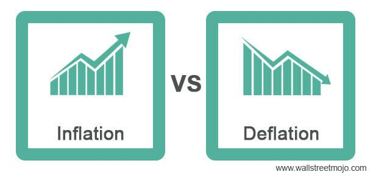

In the intricate world of economics, inflation and deflation represent two major forces that significantly influence market dynamics. These phenomena, characterized by rising and falling price levels, respectively, have far-reaching implications for both financial markets and broader economic activities. This is especially true in algorithmic trading, where fast-paced decision-making and the ability to swiftly adapt to changing market conditions are crucial for success.

Algorithmic trading, which utilizes complex algorithms and vast amounts of data to make trading decisions, must account for these economic forces. The capacity to effectively respond to inflationary pressures or deflationary trends can determine the difference between profit and loss. Consequently, understanding the mechanisms of inflation and deflation is vital for investors, policymakers, and economists who are tasked with crafting strategies that promote economic stability and growth.

Inflation is typically driven by factors such as increased money supply, higher demand for goods and services, or rising production costs, while deflation can result from reduced consumer demand, technological advancements that improve efficiency, or supply surpassing demand. Each condition presents unique challenges and opportunities; inflation can lead to higher consumer prices and influence monetary policy, whereas deflation can increase purchasing power but may also cause economic stagnation and unemployment if sustained over time.

In exploring these concepts, the article aims to provide insights into their underlying causes and effects and elucidate how advanced algorithmic trading strategies are employed to manage these economic conditions. This understanding is crucial as it shapes financial strategies and informs decision-making processes that seek to navigate the complexities of economic environments, helping entities remain competitive and resilient amidst constantly shifting market landscapes.

## Table of Contents

## Understanding Inflation

Inflation is a fundamental economic concept that describes the rate at which the general price level of goods and services in an economy increases over time, leading to a decline in the purchasing power of currency. It is primarily driven by several key factors, including an increase in money supply, surges in demand, and rising production costs.

An increase in money supply, without a corresponding increase in economic output, tends to result in inflation. This situation occurs because more money chases the same amount of goods and services, leading to higher prices. Central banks, such as the Federal Reserve in the United States, often aim to control the money supply to manage inflationary pressures.

Demand-pull inflation arises when demand for goods and services exceeds their supply. This excessive demand can be fueled by factors such as consumer spending, government expenditures, or investment surges, prompting suppliers to raise prices.

Cost-push inflation, on the other hand, occurs when the costs of production escalate, causing producers to pass these costs onto consumers in the form of higher prices. These cost increases can arise from factors like wage hikes or rising prices of raw materials.

Inflation significantly influences economic behavior and informs monetary policy decisions. It can lead to higher consumer prices, which affects purchasing decisions and savings. Central banks often target a specific inflation rate as part of their monetary policy to ensure economic stability. For instance, the U.S. Federal Reserve has set a long-term inflation target of approximately 2% to foster economic conditions that allow for sustainable growth and employment.

The Consumer Price Index (CPI) and Producer Price Index (PPI) are two critical measures used to assess inflation. The CPI tracks changes in the prices paid by consumers for a basket of goods and services, while the PPI measures the average change in selling prices received by domestic producers for their output. These indices are instrumental in evaluating the economic health and guiding policy interventions.

When managed properly, moderate inflation can stimulate economic activity by encouraging spending and investment. This is because moderate inflation often incentivizes consumers and businesses to make purchases now rather than later when prices might be higher. However, hyperinflation, an extreme and out-of-control inflationary scenario, poses significant risks. It can lead to severe economic disruption, eroding savings and destabilizing economies, as seen in historical instances like Zimbabwe in the late 2000s.

In summary, understanding and managing inflation are critical for maintaining economic equilibrium, influencing everything from consumer behavior to forming effective monetary policies.

## Exploring Deflation

Deflation occurs when there is an overall decline in the general price levels of goods and services within an economy, effectively increasing the purchasing power of money over time. This economic phenomenon often arises from several factors, including reduced consumer demand, an oversupply of goods and services, or advancements in technology that lower production costs.

While deflation can initially seem beneficial to consumers—who can purchase more with their money—it poses significant long-term risks to economic stability. Prolonged deflation can lead to economic stagnation, characterized by reduced business revenues, unemployment, and diminished investments. This is because the expectation of declining prices can cause consumers and businesses to delay spending, which in turn suppresses economic activity and growth.

Central banks, such as the Federal Reserve in the United States or the European Central Bank, actively work to prevent such deflationary spirals. They typically employ monetary policies aimed at stimulating demand and encouraging economic expansion. These policies include lowering interest rates, which reduce the cost of borrowing and incentivize spending and investment, and quantitative easing, which increases the money supply to promote economic activity.

A historical case illustrating the detrimental effects of deflation is Japan's "Lost Decade" during the 1990s. Following an asset bubble collapse in 1991, Japan experienced persistent deflation and economic stagnation for a prolonged period. The challenges faced during this time highlighted the difficulty of reversing entrenched deflationary expectations and the importance of timely and effective intervention by monetary authorities.

Japan's experience underscores the critical need for well-calibrated economic policies to mitigate deflation's adverse impacts and restore economic dynamism.

## Deflation vs. Inflation: Economic Impacts

Inflation and deflation exert significant influences on economic dynamics, each with its distinct repercussions on consumer behavior and business investments. Inflation, typically characterized by the sustained increase in the price level of goods and services, can adversely affect the economy by eroding the purchasing power of money. As the real value of currency diminishes, the cost of living rises, which can lead to uncertainties in economic planning. Consumers may find their savings devalued over time, prompting them to spend more rapidly to avoid future price increases. This behavior, while potentially stimulating short-term growth, risks destabilizing long-term economic stability if inflation spirals into hyperinflation.

Conversely, deflation, marked by a decrease in the general price level, increases the real value of money, potentially enhancing consumers' purchasing power. However, prolonged deflation may lead to adverse economic scenarios, including increased unemployment and a reduction in consumer spending and business investment. As prices fall, consumers may delay purchases in anticipation of even lower prices in the future, leading to decreased revenue for businesses. This reduced spending and investment can trigger an economic slowdown, potentially escalating into a deflationary spiral with severe impacts on growth and employment levels.

Balancing inflation and deflation is essential for economic equilibrium. Monetary and fiscal policies play critical roles in maintaining this balance. For instance, to combat inflation, central banks might increase interest rates, making borrowing more expensive and reducing consumer spending. Conversely, in deflationary times, they might lower interest rates or implement quantitative easing to encourage spending and investment.

Assessing the impacts of inflation and deflation is instrumental in shaping robust fiscal and monetary policies. By gauging these economic conditions, policymakers can devise strategies to mitigate adverse effects, stabilize the economy, and promote sustainable growth.

## Algorithmic Trading in Inflationary and Deflationary Environments

Algorithmic trading utilizes sophisticated computer algorithms to execute trades, relying heavily on market data and economic indicators, including inflation and deflation. These economic factors significantly influence the modeling and execution of trades. 

Inflation, characterized by rising prices, can affect various financial elements, such as asset prices, interest rates, and currency values. Algorithmic models must integrate these variables, adjusting trading strategies to mitigate risks associated with inflation. For example, an increase in inflation might lead to higher interest rates, which typically results in declining bond prices. An algorithm trading bonds would need to account for these shifts to optimize its trading strategy effectively.

During deflation, marked by falling prices and increased purchasing power, different considerations come into play. Algorithms might focus on sectors where price stagnation or decline is anticipated, such as real estate or certain commodities. The algorithm must recognize trends indicating deflationary pressures and adjust accordingly, potentially short-selling assets expected to decrease in value or investing in bonds whose real yields increase as prices fall.

The adaptability of these algorithms is a critical feature, necessitating continuous updates to incorporate real-time economic data. This adaptability ensures that trading strategies remain effective regardless of the prevailing economic conditions. Incorporating [machine learning](/wiki/machine-learning) techniques can allow algorithms to learn from past data and predict future market movements more accurately, offering a competitive edge.

Leading firms such as Renaissance Technologies and Bridgewater Associates exemplify the successful application of [algorithmic trading](/wiki/algorithmic-trading) in fluctuating economic environments. Renaissance Technologies, for instance, employs quantitative models that adapt to economic changes by analyzing vast amounts of data. These models are designed to capitalize on price discrepancies caused by macroeconomic shifts. Bridgewater Associates' diversified approach incorporates insights into inflationary and deflationary periods, aiming for stability across varying economic conditions. Their methodologies underscore the importance of robust data analytics and the continuous recalibration of trading models to navigate complex economic landscapes effectively.

The ability of algorithmic trading to adapt swiftly to inflationary and deflationary pressures highlights its powerful role in modern finance. As algorithms evolve, integrating more sophisticated models and real-time analytics will be crucial in maintaining their efficacy and resilience in ever-changing market conditions.

## Case Studies: Algorithmic Trading Success

Renaissance Technologies is renowned for utilizing advanced data models to adjust its trading strategies in response to inflationary and deflationary trends. The firm employs statistical [arbitrage](/wiki/arbitrage) to identify and exploit pricing discrepancies that emerge due to macroeconomic changes. This approach leverages quantitative models to predict short-term price movements by analyzing historical data on market conditions affected by inflation or deflation. Such strategies involve substantial computational power to process vast datasets and refine algorithms continuously, ensuring optimal market positioning regardless of economic fluctuations.

Bridgewater Associates, another leader in algorithmic trading, implements a diversified 'All Weather' strategy designed to manage risks across varying economic scenarios, including inflationary and deflationary periods. This strategy employs insights into macroeconomic conditions and is structured to perform well regardless of economic climate changes. It emphasizes the continuous integration of inflation and deflation insights into its trading models, allowing for dynamic asset allocation that minimizes risk and maximizes returns. The firm's approach underscores the necessity of maintaining a robust data analytic framework that supports ongoing model recalibration.

Both firms' strategies underscore the critical role of data analytics and the need for continuous adaptation of trading models in response to evolving economic conditions. The success of Renaissance Technologies and Bridgewater Associates illustrates the importance of integrating sophisticated quantitative techniques into trading practices. Their methodologies offer significant insights into constructing resilient trading strategies capable of withstanding inflationary and deflationary pressures. This adaptability is crucial for maintaining competitiveness in unpredictable market environments, highlighting the value of leveraging cutting-edge technology and comprehensive data analysis.

## Conclusion and Future Outlook

Inflation and deflation are not only theoretical concepts but real economic forces that shape market behaviors, requiring vigilant management and strategic planning. These forces affect pricing, consumer behavior, and broader economic parameters, thereby influencing the trading landscape. 

Algorithmic trading emerges as a pivotal tool in navigating through inflationary and deflationary periods, providing the precision needed to make informed trading decisions. These algorithms, capable of processing vast datasets in real-time, allow traders to adapt to evolving market conditions effectively. The integration of machine learning and advanced data analytics has the potential to significantly enhance the functionality of these algorithms. Machine learning models can identify complex market patterns and predict potential market shifts, offering traders a competitive edge.

The ability to understand and anticipate economic trends is crucial. For investors, this understanding assists in aligning their portfolios accordingly to mitigate risks. Policymakers, on the other hand, can tailor economic policies to foster stability and growth. A keen grasp of inflationary and deflationary trends allows for better structuring of monetary policy and investment strategies that are resilient to sudden market changes.

Looking forward, future strategies should emphasize resilience and flexibility to maintain competitiveness. Emphasizing technological advancement in trading strategies, such as incorporating real-time data analytics and predictive modeling, will be crucial. This ensures decision-making processes that are not only timely but also precise, adapting swiftly to the ever-changing economic environment. Therefore, a strategic combination of technology and financial understanding offers a path to managing and thriving within the challenges and opportunities presented by inflation and deflation.

## References & Further Reading

[1]: Khan, M. R., Shah, M. H., & Mahesar, H. A. (2021). ["Impact of Inflation and Deflation on Financial Markets: A Review."](https://www.nature.com/articles/s41598-024-67991-x) SSRN.

[2]: Taylor, J. B. (2017). ["Handbook of Macroeconomics, Volume 2"](https://www.sciencedirect.com/handbook/handbook-of-macroeconomics/vol/2/suppl/C) (Chapter on monetary policy and inflation). North Holland.

[3]: Blanchard, O. J. (2016). ["Inflation Targeting: Holding the Line."](https://www.imf.org/external/pubs/ft/fandd/basics/target.htm) International Monetary Fund Working Paper.

[4]: Bernanke, B. S. (2000). ["Japanese Monetary Policy: A Case of Self-Induced Paralysis?"](https://www.princeton.edu/~pkrugman/bernanke_paralysis.pdf) NBER Working Paper.

[5]: ["Adaptive Markets: Financial Evolution at the Speed of Thought"](https://www.amazon.com/Adaptive-Markets-Financial-Evolution-Thought/dp/0691135142) by Andrew W. Lo.

[6]: Lopez de Prado, M. (2018). ["Advances in Financial Machine Learning."](https://www.amazon.com/Advances-Financial-Machine-Learning-Marcos/dp/1119482089) Wiley.