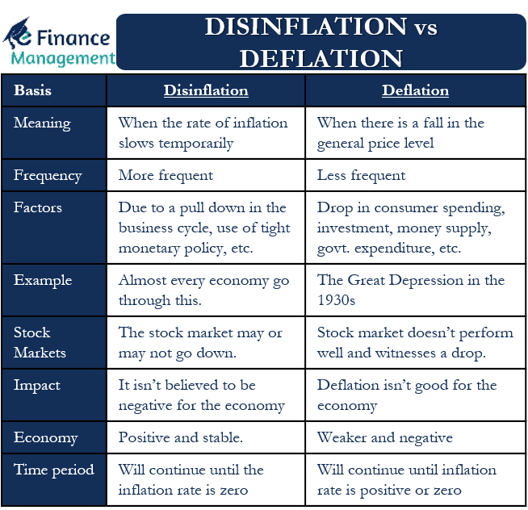

## Table of Contents

## What is inflation?

Inflation is when the prices of things we buy, like food and toys, go up over time. It means that the money we have can buy less stuff than before. For example, if a toy cost $10 last year and now it costs $11, that's inflation. It happens because the amount of money in the economy grows faster than the number of goods and services available.

Inflation can be caused by many things. Sometimes, it happens when people want to buy more things than what is available, so sellers raise their prices. Other times, it can be because the cost of making things, like the cost of materials or labor, goes up. Governments and central banks try to control inflation by adjusting interest rates or changing how much money is in circulation.

Inflation affects everyone. If it's too high, it can make life harder because everything becomes more expensive. But a little bit of inflation is usually okay and can even be good for the economy, as it encourages people to spend and invest rather than just saving their money.

## What is deflation?

Deflation is the opposite of inflation. It happens when the prices of things we buy, like toys and food, go down over time. When deflation happens, the money we have can buy more stuff than before. For example, if a toy cost $10 last year and now it costs $9, that's deflation. It can happen when there are too many goods and services available compared to the amount of money people have to spend.

Deflation can be tricky for the economy. When prices are falling, people might wait to buy things, hoping they will be even cheaper later. This can slow down the economy because businesses sell less and might have to cut jobs or lower wages. Governments and central banks try to avoid deflation by using tools like lowering interest rates to encourage people to spend and borrow money.

While a little bit of deflation might seem good because things are cheaper, too much deflation can cause big problems. It can lead to a cycle where people spend less, businesses earn less, and the economy shrinks. That's why managing deflation is important for keeping the economy healthy.

## How do inflation and deflation affect the economy?

Inflation and deflation can both have big effects on the economy. Inflation means prices are going up, which can make life harder for people because their money doesn't go as far. If inflation is too high, people might not be able to buy as much as they need, and it can make the economy unstable. But a little bit of inflation can be good because it encourages people to spend and invest their money instead of just saving it. This can help keep the economy growing.

Deflation, on the other hand, means prices are going down. This might sound good at first because things get cheaper, but it can actually be bad for the economy. When prices fall, people might wait to buy things, hoping they will be even cheaper later. This can slow down the economy because businesses sell less, which might lead them to cut jobs or lower wages. Too much deflation can create a cycle where people spend less, businesses earn less, and the economy shrinks, which is why managing deflation is important.

Both inflation and deflation need to be carefully managed to keep the economy healthy. Governments and central banks use tools like interest rates to control these forces. By keeping inflation and deflation in check, they try to create a stable environment where people can spend, businesses can grow, and the economy can thrive.

## What are the common causes of inflation?

Inflation happens for a few main reasons. One big reason is when there's too much money chasing too few goods. This can happen when the government prints more money or when people have more money to spend because of low interest rates or tax cuts. When everyone wants to buy more stuff than what's available, sellers raise their prices, which causes inflation. Another reason is when the cost of making things goes up. If the price of raw materials, like oil or metal, increases, or if workers want higher wages, then the cost of producing goods and services goes up, and businesses pass these costs onto customers by raising prices.

Sometimes, inflation can also be caused by what's called "demand-pull" inflation. This happens when the demand for goods and services grows faster than the economy's ability to produce them. For example, if a lot of people suddenly want to buy more cars than car factories can make, car prices will go up. On the other hand, "cost-push" inflation happens when the costs of production increase, like when the price of oil goes up and it costs more to make and transport goods. Both types of inflation can make the overall price level in the economy rise.

Governments and central banks watch inflation closely because it affects everyone. If inflation gets too high, it can make life harder for people and can make the economy unstable. That's why they use tools like interest rates to control it. By raising interest rates, they can slow down spending and help keep inflation in check. But if inflation is too low, they might lower interest rates to encourage spending and keep the economy growing.

## What are the common causes of deflation?

Deflation happens when there are too many goods and services compared to the money people have to spend. It can start when people stop buying as much as they used to. Maybe they're worried about the future or they think prices will go down even more, so they wait to buy things. When businesses see that people aren't buying, they might lower their prices to sell more. If this keeps happening, it can lead to deflation.

Another cause of deflation is when the cost of making things goes down. This can happen if new technology makes production cheaper or if the price of raw materials like oil drops. When it costs less to make things, businesses might lower their prices to attract more customers. If prices keep falling, it can lead to deflation. Both of these situations can make the economy slow down because people spend less and businesses earn less, which can be bad for everyone.

## How do central banks respond to inflation?

Central banks try to control inflation by using something called interest rates. When they see that prices are going up too fast, they might raise interest rates. This makes it more expensive for people to borrow money and more rewarding to save it. When borrowing is expensive, people and businesses might spend less, which can slow down the economy and help bring inflation down to a more normal level.

Sometimes, central banks also use other tools to fight inflation. They might sell government bonds to take money out of the economy. When there's less money around, people can't spend as much, and this can help lower prices. Central banks watch inflation closely because they want to keep it at a level that's good for the economy, usually around 2%. If they do their job well, they can help make sure that prices don't go up too fast and that people can still afford the things they need.

## How do central banks respond to deflation?

When central banks see that prices are going down too much, which is called deflation, they try to stop it by lowering interest rates. Lower interest rates make it cheaper for people to borrow money and less rewarding to save it. When borrowing is cheap, people might spend more money, and businesses might invest more. This can help increase demand for goods and services, which can push prices back up to a normal level.

Central banks might also use other ways to fight deflation. They could buy government bonds, which puts more money into the economy. When there's more money around, people can spend more, and this can help raise prices. Central banks want to keep the economy healthy, so they work hard to make sure deflation doesn't cause big problems. By using these tools, they try to keep prices stable and help the economy grow.

## What are the short-term effects of inflation on consumers?

When inflation happens, it means the prices of things like food, clothes, and toys go up. This can make life harder for people because their money doesn't go as far as it used to. For example, if you usually buy a sandwich for lunch and the price goes up, you might have to spend more money or find a cheaper sandwich. This can be tough, especially if your salary doesn't go up at the same time as prices.

In the short term, inflation can also make people feel less confident about the future. If prices keep going up, people might start to worry that things will get even more expensive. This can make them spend less money now, hoping to save for when prices might be higher later. When people spend less, it can slow down the economy a bit because businesses might sell fewer things.

## What are the short-term effects of deflation on consumers?

When deflation happens, it means prices are going down. This might sound good because things get cheaper, but it can be tricky for people. In the short term, people might wait to buy things because they think prices will drop even more. For example, if you want a new bike and you see the price is going down, you might wait a bit longer to buy it, hoping it will be even cheaper. This waiting can make life a bit harder because you might not get the things you need right away.

Deflation can also make people feel less sure about the future. If prices keep falling, people might worry that the economy is not doing well. This worry can make them spend even less money, which can slow down the economy. When people spend less, businesses might sell fewer things and might have to cut jobs or lower wages. So, even though things are cheaper, deflation can make life more difficult in the short term.

## How do inflation and deflation impact long-term economic growth?

Inflation can help long-term economic growth if it's kept at a low and steady level, like around 2%. When prices go up a little bit each year, it can encourage people to spend and invest their money instead of just saving it. This spending and investing can help businesses grow and create more jobs, which is good for the economy. But if inflation gets too high, it can hurt long-term growth. High inflation makes everything more expensive, which can make people spend less and businesses struggle. If inflation is too high for a long time, it can make the economy unstable and slow down growth.

Deflation can be bad for long-term economic growth. When prices keep going down, people might wait to buy things, hoping they will be even cheaper later. This waiting can slow down the economy because businesses sell less and might have to cut jobs or lower wages. If deflation lasts a long time, it can lead to a cycle where people spend less, businesses earn less, and the economy shrinks. This can make it hard for the economy to grow over the long term. That's why central banks work hard to avoid deflation and keep the economy healthy.

## What historical examples illustrate the effects of inflation?

One big example of inflation is what happened in Germany after World War I, called the Weimar Republic hyperinflation. In the early 1920s, Germany printed a lot of money to pay for war debts and to help the economy. But this made prices go up really fast. People needed wheelbarrows full of money just to buy a loaf of bread. This made life very hard for people because their money was worth less and less every day. It also made the economy very unstable and helped lead to big problems later on.

Another example is the inflation in the United States during the 1970s. Prices were going up a lot because of things like oil prices going up and the government spending a lot of money. This made life harder for people because everything was more expensive. It also made the economy slower because people had less money to spend on other things. The government and the central bank had to work hard to bring inflation down and make the economy stable again.

## What historical examples illustrate the effects of deflation?

One big example of deflation happened in the United States during the Great Depression in the 1930s. Prices were going down because people were not buying as much stuff. Many people lost their jobs and didn't have money to spend. When businesses saw that people were not buying, they had to lower their prices even more. This made the economy worse because people waited to buy things, hoping they would get even cheaper. It was a hard time for everyone, and it took many years for the economy to get better.

Another example of deflation was in Japan in the 1990s and 2000s. After a big economic bubble burst, prices started to go down. People were not spending as much money because they thought prices would keep falling. This made businesses sell less, and it was hard for the economy to grow. Japan's government and central bank tried many things to stop deflation, but it took a long time to get prices stable again. This period is sometimes called the "Lost Decade" because the economy did not grow much for a long time.

## References & Further Reading

[1]: Khan, M. R., Shah, M. H., & Mahesar, H. A. (2021). ["Impact of Inflation and Deflation on Financial Markets: A Review."](https://www.nature.com/articles/s41598-024-67991-x) SSRN.

[2]: Taylor, J. B. (2017). ["Handbook of Macroeconomics, Volume 2"](https://www.sciencedirect.com/handbook/handbook-of-macroeconomics/vol/2/suppl/C) (Chapter on monetary policy and inflation). North Holland.

[3]: Blanchard, O. J. (2016). ["Inflation Targeting: Holding the Line."](https://www.imf.org/external/pubs/ft/fandd/basics/target.htm) International Monetary Fund Working Paper.

[4]: Bernanke, B. S. (2000). ["Japanese Monetary Policy: A Case of Self-Induced Paralysis?"](https://www.princeton.edu/~pkrugman/bernanke_paralysis.pdf) NBER Working Paper.

[5]: ["Adaptive Markets: Financial Evolution at the Speed of Thought"](https://www.amazon.com/Adaptive-Markets-Financial-Evolution-Thought/dp/0691135142) by Andrew W. Lo.

[6]: Lopez de Prado, M. (2018). ["Advances in Financial Machine Learning."](https://www.amazon.com/Advances-Financial-Machine-Learning-Marcos/dp/1119482089) Wiley.