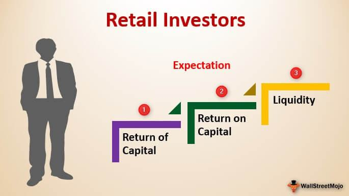

The dynamic financial market comprises a diverse array of participants, each wielding influence over market fluctuations through distinct mechanisms. This article focuses on two primary investor categories: institutional investors and retail investors, with a particular emphasis on algorithmic trading. Recognizing the differences between these groups is essential for understanding market dynamics and the specific roles these entities play in shaping economic trends.

Institutional investors, such as hedge funds, mutual funds, and pension funds, hold substantial financial clout, enabling them to impact market activities through their sizable trades. In contrast, retail investors are individual traders who manage their own capital, often posing a stark contrast in trading volume and market influence.

Algorithmic trading has emerged as a cornerstone of contemporary investment strategies, significantly altering how trades are executed and strategies are optimized. This development necessitates a deeper comparison between institutional and retail investors, as algorithmic trading tools and techniques provide varying advantages and challenges to each group.

As the financial landscape continues to transform, both institutional and retail investors are increasingly adopting advanced technologies to enhance their trading outcomes. Understanding the interplay between these investors and the algorithmic systems they employ offers valuable insights into future market evolutions and the potential for more equitable investment opportunities.

## Table of Contents

## Understanding Institutional Investors

Institutional investors represent large entities, such as hedge funds, mutual funds, and pension funds, which accumulate and manage substantial amounts of capital. These entities wield significant influence over financial markets due to their ability to execute high-volume trades. The sheer volume of their trades can lead to substantial market impact, potentially influencing stock prices and liquidity.

A primary characteristic of institutional investors is their utilization of sophisticated investment strategies, notably quantitative and algorithmic trading. These strategies allow them to optimize their trading processes, increase efficiency, and manage risk across substantial capital allocations. By employing mathematical models and advanced algorithms, institutional investors can automate trades, identify market patterns, and react swiftly to market changes.

Moreover, the resources at the disposal of institutional investors afford them access to comprehensive market research and in-depth data insights. This access enhances their ability to make informed investment decisions and maintain a competitive edge over smaller market participants. For instance, institutional investors can leverage proprietary data sets and employ advanced analytics to forecast market movements and adjust their portfolios accordingly, capabilities often unavailable to retail investors.

Institutional investors benefit from preferential fees and trading conditions, largely due to the [volume](/wiki/volume-trading-strategy) of their trades and their established relationships with financial service providers. Their significant trading volumes allow them to negotiate lower transaction costs, providing an additional competitive advantage. These favorable terms can alleviate the impact of trading costs on their returns, further enhancing their market standing.

In summary, institutional investors are formidable players in financial markets, characterized by their vast capital, strategic sophistication, and privileged market access. Their ability to influence market dynamics is supported by strategic use of technology, comprehensive data insights, and advantageous trading conditions, differentiating them from retail investors in significant ways.

## Exploring Retail Investors

Retail investors are individual participants who manage their personal investments without the support of institutional entities. These investors are typically characterized by smaller capital bases compared to institutional investors, which influences their investment strategies and the types of financial products they can access. Historically, retail investors faced several limitations regarding the tools and platforms available to them, largely due to the expensive nature of advanced trading technologies and the exclusive access they offered to institutional players.

In recent years, however, technological advancements have substantially leveled the playing field. Innovations in trading platforms and fintech solutions have democratized access to powerful tools once reserved for institutional investors. Online brokerage services, robo-advisors, and mobile trading applications have enabled retail investors to execute trades, access market data, and manage portfolios with increased efficiency and lower costs. Such technologies include [algorithmic trading](/wiki/algorithmic-trading) platforms, which use pre-set rules to execute trades at optimal prices, and sophisticated analytical tools that provide deep insights into market trends.

The agility of retail investors is one of their notable advantages in the financial markets. With the ability to quickly change positions, they can capitalize on short-term price movements without causing significant shifts in market prices. Unlike institutional investors, who must often deal with market impact due to their large trade sizes, retail investors can operate with a degree of anonymity, allowing them to exploit niche opportunities that require agility and an eye for emerging trends.

Despite technological strides, retail investors continue to face higher transaction costs compared to their institutional counterparts. The lack of economies of scale means that individual traders might incur more substantial fees on a per-trade basis. Furthermore, they have limited access to certain investment vehicles, such as private equity and hedge funds, which often require substantial minimum investments and cater primarily to institutions or accredited investors.

Nevertheless, the flexibility and innovative edge offered by modern technology empower retail investors to navigate the financial markets successfully. By operating in niche segments that may go unnoticed by larger investors, retail traders can carve out profitable opportunities, particularly in emerging sectors and less liquid asset classes. This ability allows them to pursue unique investment strategies that can yield favorable returns outside the scope of traditional institutional investment models.

## Key Differences: Institutional vs. Retail Investors in Algo Trading

The key differences between institutional and retail investors in algorithmic trading are significant, reflecting the varied resources and strategies employed by each. Institutional investors typically utilize algorithmic trading to handle large orders efficiently, mitigating the risk of moving the market significantly. This efficiency is crucial to maintain anonymity and minimize market impact, allowing them to capitalize on opportunities without causing dramatic price fluctuations.

Retail investors, while not trading in volumes comparable to institutions, benefit from algorithmic trading by accessing automated systems which support smarter and faster decision-making. These systems empower retail investors with tools that were once exclusive to professional traders, enabling them to employ strategies based on predefined algorithms. This technology grants them a certain agility, allowing quick entry and [exit](/wiki/exit-strategy) from market positions.

Institutional investors prioritize scalability and risk management in their algorithmic trading strategies. They often engage in high-frequency trading ([HFT](/wiki/high-frequency-trading-strategies)), a practice that exploits small price discrepancies through rapid trade execution. This allows institutions to gain a competitive edge by leveraging speed and volume, maximizing profitability from minor price movements across large transaction volumes. The capacity for HFT is typically beyond the reach of most retail investors due to the substantial infrastructure required.

Conversely, retail traders often seek flexibility and cost-efficiency in their trading approaches. Their algorithms may not need to handle the complexity or speed of HFT but instead focus on specific strategies that align with their individual investment goals. This flexibility allows retail traders to adapt quickly to market changes without the bureaucratic inertia that might affect larger institutional investors.

The divergence in trading volumes between institutional and retail investors significantly impacts their market influence and access to information. Institutional investors, trading in large volumes, can often access deeper market insights and more sophisticated data analysis tools. This access enables a level of forecasting and strategic planning that is typically unattainable for retail investors. Nonetheless, the democratization of financial technology has begun to narrow this gap, providing retail traders with unprecedented access to data and tools that enhance their trading capabilities.

Overall, while institutional investors leverage algorithmic trading to execute large, efficient, and rapid trades, retail investors benefit from the technological advancements in algorithmic systems to make informed and agile trading decisions. The balance between scaling efficiency and maintaining flexibility characterizes the distinct approaches each investor type employs in algorithmic trading.

## The Role of AI in Algorithmic Trading

Artificial Intelligence (AI) has revolutionized algorithmic trading by significantly enhancing the analytical and decision-making capabilities of both institutional and retail investors. By deploying AI in trading strategies, market participants can process vast amounts of data with unprecedented speed and accuracy, thereby gaining insights that were previously unattainable.

Institutional investors harness AI to manage extensive datasets, optimizing trading models to anticipate and respond to market trends efficiently. The use of [machine learning](/wiki/machine-learning) algorithms enables these investors to identify patterns in market behavior, adjust their strategies in real-time, and execute large-scale transactions while minimizing market impact. For example, regression models and neural networks are commonly used to forecast price movements and [volatility](/wiki/volatility-trading-strategies), allowing for precise adjustment of portfolios to mitigate risk.

On the retail side, AI offers tools for pattern recognition and automation of predefined trading strategies. Retail traders can leverage algorithmic solutions to monitor for specific market conditions and automatically execute trades based on these criteria. This automation reduces human error and emotional bias, enabling retail investors to operate with greater discipline and consistency.

The emotional aspect of trading is a critical challenge for many investors, often leading to suboptimal decision-making. AI-driven algorithms help mitigate this by basing decisions on quantifiable data rather than human emotions. This leads to more rational investments and can improve the success rate of trades, benefiting both institutional and retail investors equally.

As AI technology continues to evolve, the lines between institutional and retail trading advantages become increasingly blurred. Innovations in natural language processing and advanced [deep learning](/wiki/deep-learning) techniques are opening new possibilities for developing trading systems that can interpret and react to news and social media sentiment in near real-time. This progress democratizes trading, offering both large and small investors access to sophisticated tools that enhance their trading prowess.

In summary, AI plays a pivotal role in modern algorithmic trading by providing powerful tools that improve decision-making precision for all investor types. As these technologies advance, the potential for more equitable market participation expands, irrespective of the size and resources of the investors involved.

## Conclusion: Who Benefits More?

While both institutional and retail investors gain from technological advancements in AI and algorithmic trading, the benefits manifest in distinct ways. Institutional investors, by virtue of their scale, gain access to more sophisticated tools and strategies. Their vast resources allow them to invest in cutting-edge technologies and employ complex algorithms tailored for managing large volumes of trades with precision and minimal market impact. These advanced capabilities often result in reduced transaction costs and improved execution precision.

Conversely, retail investors benefit from increased accessibility and flexibility provided by modern trading platforms. The democratization of trading technology has enabled individual traders to utilize tools that were once exclusive to larger entities. This increased access allows retail investors to implement automated trading strategies, enhancing their ability to react swiftly to market changes.

Ultimately, the effectiveness of AI and algorithmic trading depends on how each investor group integrates these technologies into their broader strategies. For institutional investors, this might mean leveraging AI to enhance risk management and scalability. For retail investors, the focus may be on harnessing advanced platforms for agility and cost reduction.

As AI and algorithmic trading continue to evolve, the potential for more equitable market participation increases for investors of all sizes. The ongoing development of these technologies promises to further narrow the disparity between institutional and retail trading capabilities, potentially leading to a more balanced and democratized financial market landscape.

## References & Further Reading

[1]: Bergstra, J., Bardenet, R., Bengio, Y., & Kégl, B. (2011). ["Algorithms for Hyper-Parameter Optimization."](https://papers.nips.cc/paper/4443-algorithms-for-hyper-parameter-optimization) Advances in Neural Information Processing Systems 24.

[2]: ["Advances in Financial Machine Learning"](https://www.amazon.com/Advances-Financial-Machine-Learning-Marcos/dp/1119482089) by Marcos Lopez de Prado

[3]: ["Evidence-Based Technical Analysis: Applying the Scientific Method and Statistical Inference to Trading Signals"](https://www.amazon.com/Evidence-Based-Technical-Analysis-Scientific-Statistical/dp/0470008741) by David Aronson

[4]: ["Machine Learning for Algorithmic Trading"](https://github.com/stefan-jansen/machine-learning-for-trading) by Stefan Jansen

[5]: ["Quantitative Trading: How to Build Your Own Algorithmic Trading Business"](https://www.amazon.com/Quantitative-Trading-Build-Algorithmic-Business-ebook/dp/B097QGPVND) by Ernest P. Chan