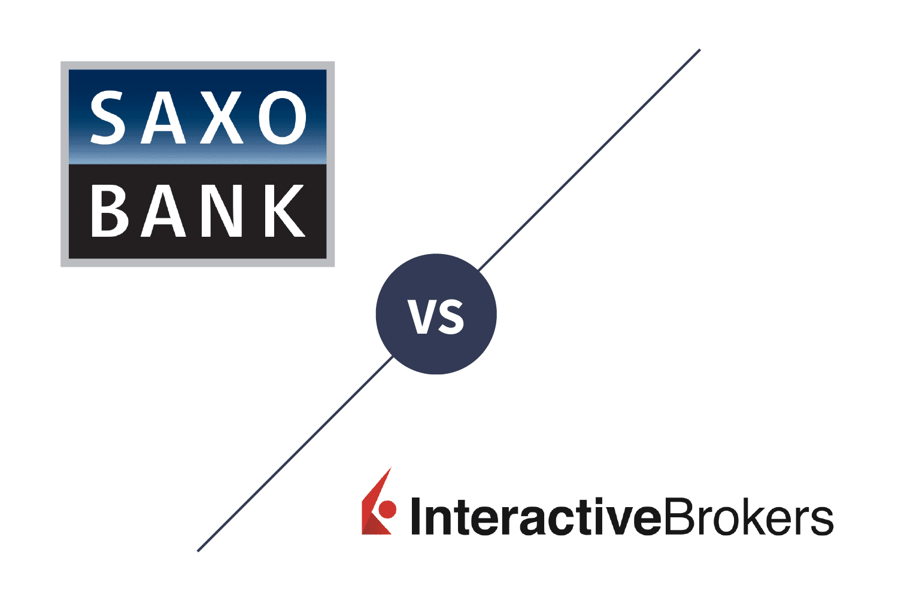

## Table of Contents

## What is the difference between an institutional trader and a retail trader?

An institutional trader works for a large organization, like a bank, a hedge fund, or an investment company. They manage big amounts of money, often millions or billions of dollars. Because they handle so much money, they can influence the market and have access to advanced tools and research that help them make decisions. Institutional traders usually have a team to help them and follow strict rules set by their organization and government regulators.

A retail trader, on the other hand, is an individual who trades with their own money. They usually have less money to invest compared to institutional traders, often using their personal savings. Retail traders don't have the same level of access to advanced tools and research, so they rely more on publicly available information and sometimes on trading platforms that offer basic analysis tools. They have more freedom in their trading decisions but also face more risks because they don't have the same level of support and resources.

## How do the trading volumes of institutional traders compare to those of retail traders?

Institutional traders deal with much larger trading volumes than retail traders. They manage huge sums of money, often in the millions or billions of dollars. This means they can buy and sell large amounts of stocks, bonds, or other financial products at once. Because they trade in such big volumes, their actions can move the market prices. For example, if an institutional trader decides to sell a lot of a certain stock, the price of that stock might go down because of the big sell order.

Retail traders, on the other hand, trade with much smaller amounts of money. They might use their personal savings to buy or sell stocks, and their trades are usually in the hundreds or thousands of dollars, not millions. Because their trading volumes are smaller, their individual trades don't usually affect the market prices as much as those of institutional traders. However, when many retail traders act together, like in a trending stock, they can still have a noticeable impact on the market.

## What types of financial instruments do institutional traders typically invest in compared to retail traders?

Institutional traders usually invest in a wide range of financial instruments. They often deal with stocks, bonds, commodities, currencies, and derivatives like options and futures. Because they have large amounts of money to invest, they can also participate in more complex and less liquid markets, such as private equity, real estate, and hedge funds. Their diverse portfolios allow them to spread risk and seek higher returns across different asset classes.

Retail traders, on the other hand, tend to focus on more common and accessible financial instruments. They mostly invest in stocks and sometimes in bonds and mutual funds. Retail traders might also use exchange-traded funds (ETFs) to get exposure to different markets without needing a lot of money. Because they have less money to invest, retail traders usually stick to markets that are easier to enter and [exit](/wiki/exit-strategy), avoiding the more complex and less liquid investments that institutional traders can handle.

## How does the access to information differ between institutional and retail traders?

Institutional traders have a lot more information at their fingertips than retail traders. They work for big organizations that can afford to pay for detailed research reports, data analysis tools, and even have teams of analysts who study the markets. This means they can get information that's not available to the public, like in-depth company reports or predictions about market trends. This extra information helps them make smarter trading decisions.

Retail traders don't have the same level of access to information. They mostly use what's available to everyone, like news websites, company earnings reports, and free analysis tools from trading platforms. While they can still find a lot of useful information, it's not as detailed or timely as what institutional traders get. Retail traders might use social media and online forums to share and gather tips, but they have to be careful because not all the information they find is reliable.

## What are the typical investment strategies used by institutional traders versus retail traders?

Institutional traders often use complex investment strategies because they have a lot of money and resources. They might use strategies like quantitative analysis, where they use math and computer models to make trading decisions. They also use hedging to protect their investments from big losses, and they might do [arbitrage](/wiki/arbitrage), which means buying and selling the same thing in different places to make a profit from the price difference. Institutional traders can also invest in long-term projects like private equity and real estate, spreading their money across different types of investments to lower their risk.

Retail traders usually have simpler strategies because they don't have as much money or access to fancy tools. They often use strategies like buying stocks they think will go up in value and selling them later for a profit. Some retail traders might try [day trading](/wiki/day-trading-spy), where they buy and sell stocks quickly in one day, hoping to make small profits from short-term price changes. Others might use a "buy and hold" strategy, where they keep their investments for a long time, hoping the value will grow over years. Retail traders often focus on just a few types of investments, like stocks and ETFs, because these are easier to buy and sell.

## How do the risk management practices of institutional traders differ from those of retail traders?

Institutional traders have strict risk management practices because they manage a lot of money. They use things like stop-loss orders to automatically sell an investment if its price drops too much, which helps limit losses. They also spread their money across different types of investments, like stocks, bonds, and real estate, so if one investment loses money, the others might make up for it. Institutional traders often have teams of people who watch the markets and make sure the risks are under control. They follow rules set by their company and by the government to make sure they're not taking too many risks.

Retail traders usually don't have the same level of risk management tools and support. They might use stop-loss orders too, but they don't have teams to help them watch the markets. Retail traders often put their money into just a few investments, which can be riskier because if one investment goes bad, they might lose a lot. They have to be careful and learn how to manage risks on their own, using what they can find online or from trading platforms. Retail traders might not follow as many strict rules, but they need to be smart about how much risk they take with their own money.

## What role do institutional traders play in market liquidity compared to retail traders?

Institutional traders play a big role in making the market liquid. Liquidity means how easy it is to buy or sell something without changing its price too much. Because institutional traders deal with huge amounts of money, they can buy and sell a lot of stocks, bonds, or other things all at once. This makes it easier for everyone to trade because there's always someone ready to buy or sell. When institutional traders trade a lot, it keeps the market moving and helps keep prices stable.

Retail traders also help with market [liquidity](/wiki/liquidity-risk-premium), but their impact is smaller. They usually trade with less money, so their buying and selling doesn't affect the market as much as institutional traders. But when a lot of retail traders trade the same thing at the same time, like a popular stock, they can still add to the market's liquidity. Together, both institutional and retail traders help make the market more liquid, but institutional traders have a bigger effect because of the large volumes they trade.

## How does the impact of institutional trading on market prices compare to that of retail trading?

Institutional trading has a big impact on market prices because they trade with a lot of money. When an institutional trader buys or sells a lot of a certain stock or bond, it can move the price up or down. For example, if a big [hedge fund](/wiki/hedge-fund-trading-strategies) decides to sell a lot of a stock, the price of that stock might go down because there are suddenly more people trying to sell it than buy it. This can make the market move a lot, and other traders might see these big trades and make their own decisions based on them.

Retail trading, on the other hand, doesn't usually affect market prices as much. Retail traders trade with smaller amounts of money, so their individual trades don't change prices as much as institutional traders. But when a lot of retail traders start trading the same thing at the same time, like during a popular stock trend, they can still have a big impact. For example, if many retail traders start buying a stock because it's popular on social media, the price might go up because of all the buying. But usually, the impact of retail trading on market prices is smaller than that of institutional trading.

## What are the regulatory differences affecting institutional and retail traders?

Institutional traders have to follow a lot of rules because they handle big amounts of money. They are watched closely by government groups like the Securities and Exchange Commission (SEC) in the U.S. These rules are there to make sure they don't do anything risky or unfair that could hurt the market. Institutional traders need special licenses and have to report their trades and investments all the time. They also have to follow rules set by their own companies, which can be very strict to keep everything safe and fair.

Retail traders have fewer rules to follow compared to institutional traders. They don't need special licenses to trade, but they still have to follow some basic rules set by the government. For example, they can't do things like insider trading, which is using secret information to make money. Retail traders might also have to follow rules set by the trading platforms they use, like how much money they need to start trading. But overall, the rules for retail traders are simpler and less strict than those for institutional traders.

## How do the costs of trading, such as commissions and fees, compare between institutional and retail traders?

Institutional traders usually pay less in trading costs like commissions and fees than retail traders. They trade a lot of money at once, so they can get special deals from brokers. This means they pay a smaller percentage of their trade as a fee. Also, because they work for big companies, they can sometimes negotiate even lower fees or use their own trading systems to save money.

Retail traders often pay more in trading costs. They trade smaller amounts of money, so they don't get the same special deals as institutional traders. The fees they pay can be a bigger part of their trade, which can eat into their profits. Retail traders might also have to pay extra fees for using trading platforms or apps, which can add up over time.

## What technological advantages do institutional traders have over retail traders?

Institutional traders have a lot of fancy technology that helps them trade better. They use powerful computers and special software to look at the market and make quick decisions. These tools can do things like predict what the market will do next or find the best times to buy and sell. Institutional traders also have access to fast internet connections and direct lines to the stock exchange, which means they can trade very quickly. This can be a big advantage because sometimes, being just a little faster can make a big difference in making money.

Retail traders don't have the same high-tech tools. They usually use trading apps or websites that are easier to understand but not as powerful. These platforms might offer some basic tools to help them decide what to buy or sell, but they can't do the same detailed analysis that institutional traders can. Retail traders also don't have the fast internet connections that institutional traders use, so they might be a bit slower when they trade. This means they have to be extra careful and smart about when and what they trade.

## How do institutional and retail traders differ in their approach to market analysis and forecasting?

Institutional traders use a lot of detailed information and special tools to understand and predict what the market will do. They have teams of people who look at lots of data, like company reports and economic news, to figure out where the market might be headed. They use computers and special software to do complex math and make predictions. This helps them see trends and patterns that others might miss. Institutional traders also talk to other experts and use their own research to make better guesses about the future.

Retail traders usually don't have the same fancy tools or teams of experts. They rely on information that everyone can see, like news articles and company announcements. They might use simple tools on trading apps to help them decide what to buy or sell. Retail traders often look at what other people are saying on social media or online forums to get ideas. While they can still make good guesses about the market, they don't have as much detailed information or powerful tools to help them forecast as well as institutional traders.

## References & Further Reading

[1]: Marcos Lopez de Prado. ["Advances in Financial Machine Learning."](https://www.amazon.com/Advances-Financial-Machine-Learning-Marcos/dp/1119482089) Wiley, 2018.

[2]: David Aronson. ["Evidence-Based Technical Analysis: Applying the Scientific Method and Statistical Inference to Trading Signals."](https://www.amazon.com/Evidence-Based-Technical-Analysis-Scientific-Statistical/dp/0470008741) Wiley, 2007.

[3]: Stefan Jansen. ["Machine Learning for Algorithmic Trading."](https://github.com/stefan-jansen/machine-learning-for-trading) Packt Publishing, 2020.

[4]: Ernest P. Chan. ["Quantitative Trading: How to Build Your Own Algorithmic Trading Business."](https://www.amazon.com/Quantitative-Trading-Build-Algorithmic-Business/dp/0470284889) Wiley, 2008.

[5]: Joseph Bergstra, Remi Bardenet, Yoshua Bengio, and Balazs Kégl. "Algorithms for Hyper-Parameter Optimization." Advances in Neural Information Processing Systems 24, 2011.

[6]: Lasse Heje Pedersen. ["Efficiently Inefficient: How Smart Money Invests and Market Prices are Determined."](https://www.amazon.com/Efficiently-Inefficient-Invests-Market-Determined/dp/0691166196) Princeton University Press, 2015.