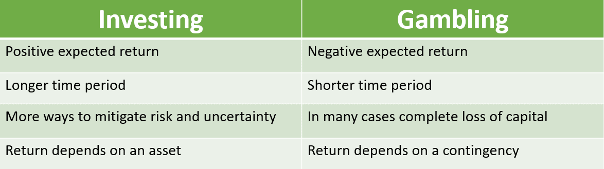

## Table of Contents

## What is the basic difference between investment and gambling?

Investment and gambling are two different ways to use money to try to make more money, but they work in very different ways. Investment involves putting money into things like stocks, bonds, or real estate with the hope that these will grow in value over time. The idea is to make money slowly and steadily by understanding the market and making smart choices. There is always some risk, but investors try to manage this risk by researching and planning carefully.

Gambling, on the other hand, is more about taking big risks for the chance of winning big, quickly. When you gamble, you might bet on a game or event where the outcome is not certain, and the results are often based on luck. Unlike investing, gambling usually doesn't involve a long-term plan or strategy. The chances of losing money can be high, and the outcomes are often unpredictable and short-term.

In summary, while both investment and gambling involve risk and the potential for financial gain, they differ in their approach and time frame. Investment focuses on long-term growth and careful planning, while gambling is more about short-term excitement and the thrill of chance.

## How do risk levels differ between investing and gambling?

Investing and gambling both have risks, but the risks are different. When you invest, you put your money into things like stocks or real estate hoping they will grow in value over time. The risk here is that the value might go down instead of up. But investors try to lower this risk by doing research and making smart choices. They look at the market, the company, or the property before deciding where to put their money. This way, they hope to make more money slowly and steadily.

Gambling, on the other hand, has a much higher level of risk. When you gamble, you bet money on games or events where the outcome is not certain. The risk is that you could lose all your money very quickly because the results are often based on luck. Unlike investing, there's usually no way to predict or control the outcome in gambling. This means the chances of losing are often higher, and the amount you can lose can be your entire bet, making it a much riskier activity.

In short, investing involves calculated risks where you try to manage and reduce the chance of loss through careful planning and research. Gambling involves taking big risks where the outcome is mostly out of your control, relying heavily on luck.

## What are the potential returns from investing compared to gambling?

When you invest, you hope to make money over time. The potential returns can be steady and grow as your investments do. For example, if you buy a stock and the company does well, the value of your stock can go up. You might also get dividends, which are like little payments from the company. Over many years, these returns can add up to a lot of money. But, it's not guaranteed. The value of your investments can go down, too. That's why investors try to pick good companies and spread their money around to different types of investments to lower the risk.

Gambling, on the other hand, can offer big wins, but they are not as likely. When you gamble, you might win a lot of money quickly, like hitting the jackpot in a casino. But the chances of this happening are small. Most of the time, you might win a little or lose everything you bet. The potential returns from gambling are high, but so is the risk. Unlike investing, where you might see your money grow over time, gambling is more about taking a big risk for a big, but uncertain, reward right away.

## Can you explain the concept of time horizon in investments versus gambling?

When you invest, you think about the future. You want your money to grow over time, so you plan for the long term. This is called your time horizon. It might be years or even decades before you see big returns. For example, if you're saving for retirement, you might invest in stocks or real estate and wait many years for them to increase in value. The idea is to be patient and let your investments grow slowly and steadily.

Gambling is different because it's all about right now. When you gamble, you're looking for a quick win. You bet money and hope to get it back, plus more, in a short time. The time horizon for gambling is very short, sometimes just a few minutes or hours. You're not thinking about the future; you're focused on the immediate thrill of winning or losing. This short time horizon makes gambling more exciting but also riskier because there's less time to recover from losses.

## How does the role of skill and knowledge impact outcomes in investing and gambling?

When you invest, knowing a lot and having skill can make a big difference. If you understand how the stock market works, or you know about real estate, you can make smarter choices about where to put your money. This can help you pick good investments that are likely to grow in value over time. Investors who do their homework and learn about different companies or properties can lower their risks and increase their chances of making money. It's like studying for a test to get a better grade.

In gambling, skill and knowledge can matter, but luck plays a bigger role. Some games, like poker, need a lot of skill. If you're good at reading people and understanding the game, you might win more often. But even in these games, luck can still change everything. In most gambling, like betting on sports or playing slot machines, knowing a lot doesn't help as much. You can't control the outcome, so even if you're smart about it, you might still lose because of bad luck. It's like trying to guess the weather; even experts can get it wrong.

## What are the psychological effects associated with investing versus gambling?

When you invest, it can make you feel good about the future. You think about your money growing over time, and this can give you a sense of control and hope. But it can also be stressful. If the market goes down, you might worry about losing money. This can make you feel anxious, especially if you're close to needing that money, like for retirement. So, investing can bring both positive feelings of planning for the future and negative feelings of worry and stress.

Gambling can be very exciting. When you win, it feels great and can make you want to keep playing. This excitement can make you feel happy and full of energy. But gambling can also be bad for your mind. Losing money can make you feel sad, angry, or even hopeless. Some people can get addicted to gambling because they want to feel that excitement again, and this can lead to big problems. So, gambling can bring strong feelings of joy and thrill, but also strong feelings of sadness and stress.

## How do legal and regulatory frameworks differ for investments and gambling?

Investing is controlled by many rules to keep it fair and safe. Governments have agencies like the Securities and Exchange Commission (SEC) in the U.S. that make sure companies tell the truth about their businesses. These rules help investors make smart choices and protect them from fraud. If someone breaks these rules, they can get in big trouble. Also, there are laws about how you can invest your money, like needing to be a certain age or having enough money to take the risk.

Gambling has its own set of rules, which can be very different from one place to another. Some places let you gamble in casinos or online, but others do not. There are often strict laws about who can gamble, how old you have to be, and how gambling businesses must work. Governments might also take a part of the money from gambling to help pay for things like schools or roads. If gambling rules are broken, people can face fines or even jail time.

## What are the tax implications of profits from investments versus gambling?

When you make money from investments, like selling stocks or getting dividends, you have to pay taxes on those profits. In many places, the tax you pay depends on how long you held the investment. If you held it for a long time, you might pay a lower tax rate. This is called a capital gains tax. The idea is to encourage people to invest for the long term. You need to report these profits on your tax return, and if you don't, you could get in trouble with the tax office.

When you win money from gambling, you also have to pay taxes on those winnings. But the rules can be different from investments. In some places, casinos or betting companies take out taxes before they give you your winnings. You still need to report all your gambling wins on your tax return, even if taxes were already taken out. If you lose money gambling, you might be able to use those losses to lower your taxes, but there are usually limits on how much you can claim.

## How can diversification be applied in investing, and is there a similar concept in gambling?

In investing, diversification means spreading your money across different types of investments. Instead of putting all your money into one stock or one type of asset, you invest in many things like stocks, bonds, and real estate. This way, if one investment loses value, the others might still do well, which helps lower your risk. It's like not putting all your eggs in one basket. By diversifying, you can protect yourself from big losses and have a better chance of making steady profits over time.

In gambling, there isn't a direct concept like diversification in investing, but you can try to spread your bets across different games or events. For example, instead of betting all your money on one horse race, you could bet on several races or try different games at a casino. This might not lower your risk as much as diversification in investing because gambling outcomes are more about luck. But spreading your bets can help you manage your money better and maybe have a little more fun while you're at it.

## What are advanced strategies used in investing, and how do they compare to strategies in gambling?

In investing, advanced strategies can help you make more money and manage risk better. One common strategy is called "dollar-cost averaging," where you invest a fixed amount of money at regular times, no matter what the market is doing. This helps you buy more shares when prices are low and fewer when prices are high, which can lead to better long-term results. Another strategy is "value investing," where you look for companies that you think are underpriced and buy their stocks, hoping they will go up in value over time. There's also "hedging," where you use other investments to protect against losses in your main investments. These strategies need a lot of research and understanding of the market, but they can help you do better than just [picking](/wiki/asset-class-picking) stocks randomly.

In gambling, advanced strategies can also help, but they are different because gambling depends more on luck. In games like poker, a strategy called "bluffing" can be useful. This is when you pretend to have a better hand than you really do to trick other players. Another strategy is "card counting" in blackjack, where you keep track of the cards that have been played to guess what cards might come next. But this is often not allowed in casinos. In sports betting, you might use "[arbitrage](/wiki/arbitrage) betting," where you bet on all possible outcomes of a game at different bookmakers to make sure you win something no matter what happens. These strategies can help, but they don't change the fact that gambling is still mostly about luck and can be risky.

## How do market analysis and research play a role in investing compared to gambling?

In investing, market analysis and research are really important. They help you make smart choices about where to put your money. You look at things like how a company is doing, what the economy is like, and what other people think the market will do. This can help you pick good investments that might grow over time. By doing a lot of research, you can understand the risks better and try to make more money while losing less. It's like studying before a test to do well.

In gambling, market analysis and research don't help as much. Gambling is more about luck than knowing things. You might look up some information, like a sports team's past performance, but that doesn't guarantee you'll win. In games like slots or roulette, there's no research that can help you because the outcomes are random. Even in games where skill matters, like poker, you can't control everything. So, while a little research might give you a small edge, it's not the same as in investing where it can make a big difference.

## What are the long-term wealth-building potentials of investing versus the short-term gains from gambling?

When you invest your money, you're looking to build wealth over a long time. You might buy stocks, bonds, or real estate, and wait for them to grow in value. Over many years, this can add up to a lot of money. Investing is like planting a seed and watching it grow into a big tree. You need to be patient and keep learning about the market. If you do it right, you can end up with a lot more money than you started with, helping you reach big goals like buying a house or retiring comfortably.

Gambling, on the other hand, is all about trying to win money fast. You might bet on a game or a race and hope to get lucky. If you win, you can get a lot of money right away, but it's not very likely. Gambling is like trying to catch a falling leaf; it's exciting, but you might not catch it. Even if you win sometimes, you can lose a lot more often. So, while gambling can give you quick money, it's not a good way to build wealth over time because it's too risky and depends too much on luck.

## How can one balance risk and reward in investment?

Investment is the allocation of resources, predominantly capital, into various financial vehicles with the anticipation of generating a profit. This process invariably involves risk, as the potential for returns is coupled with the possibility of losses. Investors are cognizant of this risk-return tradeoff and engage in strategic decision-making to optimize outcomes. The cornerstone of successful investing is the meticulous balance of risk against potential reward.

Investment strategies are multifaceted, encompassing a broad spectrum of asset classes such as stocks, bonds, and real estate. Each asset class carries its inherent level of risk and potential return, with equities typically offering higher [volatility](/wiki/volatility-trading-strategies) and potential returns compared to the relatively stable fixed-income securities. Real estate, on the other hand, provides both income through rents and capital appreciation.

To navigate the complexities of investing, tools such as diversification and asset allocation are imperative. Diversification involves spreading investments across various assets to reduce exposure to any single risk, embodying the adage "don't put all your eggs in one basket." For example, a well-diversified portfolio might include a mix of domestic and international stocks, bonds, and real estate, thus ensuring that adverse performance in one area is offset by better performance in another.

Asset allocation, closely related to diversification, is the strategic distribution of investments across different asset categories, and is based on the investor's risk tolerance, financial goals, and investment horizon. A fundamental principle is that the selected asset allocation will heavily influence the portfolio's overall risk and return. This is often quantified through models that assess expected return ($E(R)$) and standard deviation ($\sigma$), representing risk:

$$
E(R) = \sum_{i=1}^{n} w_i \cdot E(R_i)
$$

$$
\sigma^2 = \sum_{i=1}^{n} w_i^2 \cdot \sigma_i^2 + \sum_{i=1}^{n} \sum_{j \neq i}^n w_i \cdot w_j \cdot \rho_{ij} \cdot \sigma_i \cdot \sigma_j
$$

where $w_i$ is the weight of asset $i$ in the portfolio, $E(R_i)$ and $\sigma_i$ are the expected return and standard deviation of asset $i$, and $\rho_{ij}$ is the correlation between asset $i$ and asset $j$.

Long-term investment strategies often aim to mitigate risk over time. Historical data suggests that a disciplined, long-term approach to investing, such as buy-and-hold, can smooth out volatility and result in substantial returns due to the compounding effect and market recovery after downturns. Strategies like dollar-cost averaging, where fixed investments are made regularly regardless of the price, also benefit long-term investors by minimizing the impact of market fluctuations.

Overall, successful investing is predicated on the ability to balance risk with expected returns, utilizing sophisticated strategies and adhering to a long-term perspective. It requires a comprehensive understanding of financial markets and a deliberate approach tailored to individual financial objectives and risk tolerance.

## References & Further Reading

[1]: Bergstra, J., Bardenet, R., Bengio, Y., & Kégl, B. (2011). ["Algorithms for Hyper-Parameter Optimization."](https://papers.nips.cc/paper/4443-algorithms-for-hyper-parameter-optimization) Advances in Neural Information Processing Systems 24.

[2]: ["Advances in Financial Machine Learning"](https://www.amazon.com/Advances-Financial-Machine-Learning-Marcos/dp/1119482089) by Marcos Lopez de Prado

[3]: ["Evidence-Based Technical Analysis: Applying the Scientific Method and Statistical Inference to Trading Signals"](https://www.amazon.com/Evidence-Based-Technical-Analysis-Scientific-Statistical/dp/0470008741) by David Aronson

[4]: ["Machine Learning for Algorithmic Trading"](https://github.com/stefan-jansen/machine-learning-for-trading) by Stefan Jansen

[5]: ["Quantitative Trading: How to Build Your Own Algorithmic Trading Business"](https://www.amazon.com/Quantitative-Trading-Build-Algorithmic-Business/dp/1119800064) by Ernest P. Chan