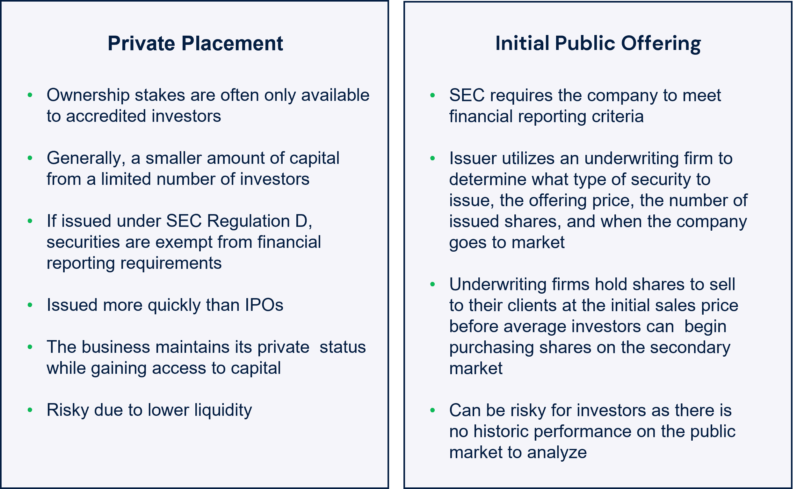

## Table of Contents

## What is an Initial Public Offering (IPO)?

An Initial Public Offering (IPO) is when a company first sells its shares to the public. Before an IPO, a company is usually owned by a small group of people, like the founders or investors. When they decide to go public, they offer shares to anyone who wants to buy them. This process helps the company raise money, which they can use to grow their business, pay off debts, or invest in new projects.

During an IPO, the company works with investment banks to decide on things like how many shares to sell and at what price. These banks help create a lot of interest in the company's shares. Once the shares start trading on a stock exchange, anyone can buy and sell them. This can make the company well-known and can also affect its value based on what people think about its future.

## What is a Private Placement?

A Private Placement is when a company sells its stocks or bonds to a small group of investors, not to the public. This is different from an IPO, where shares are sold to anyone who wants to buy them. In a Private Placement, the company picks who gets to invest. These investors are often big institutions like banks or insurance companies, or sometimes wealthy individuals.

Companies choose Private Placements because they can be quicker and less expensive than an IPO. They don't have to follow all the strict rules that come with selling shares to the public. This can be good for companies that are not ready for the spotlight or want to keep things simple. The investors in a Private Placement usually get a good deal because they are taking a bigger risk by investing in a company that isn't as well-known or established.

## How does the process of an IPO differ from a Private Placement?

An IPO, or Initial Public Offering, is when a company decides to sell its shares to the public for the first time. This process involves a lot of steps and rules. The company works with investment banks to set the price of the shares and create excitement among potential buyers. Once the IPO is done, the company's shares start trading on a stock exchange, which means anyone can buy or sell them. This helps the company raise a lot of money, but it also means the company has to share a lot of information with the public and follow strict regulations.

On the other hand, a Private Placement is when a company sells its stocks or bonds to a small, select group of investors, not to the public. This is much simpler and quicker than an IPO. The company picks who gets to invest, usually big institutions or wealthy individuals. They don't have to follow the same strict rules as an IPO, which makes it easier and less expensive. The investors in a Private Placement get a good deal, but they also take on more risk because the company isn't as well-known or established.

In summary, the main difference between an IPO and a Private Placement is who can buy the shares and how much regulation is involved. An IPO is open to everyone and comes with a lot of rules and publicity, while a Private Placement is private, quicker, and involves fewer regulations. Both methods help companies raise money, but they do it in very different ways.

## Who can invest in an IPO versus a Private Placement?

Anyone can invest in an IPO. When a company does an IPO, they sell their shares to the public. This means you, your friends, or anyone else can buy them if they want. The shares start trading on a stock exchange, like the New York Stock Exchange, so anyone with a brokerage account can buy or sell them. It's open to everyone, but you need to act fast because the shares might sell out quickly.

In a Private Placement, only a small group of people can invest. The company picks who gets to buy their stocks or bonds. Usually, these are big investors like banks, insurance companies, or very rich people. It's not open to everyone, and you can't just go and buy the shares like you can with an IPO. The company keeps it private and only lets in the investors they choose.

## What are the typical costs associated with an IPO and a Private Placement?

An IPO can be expensive for a company. They have to pay for things like investment banks, lawyers, and accountants. Investment banks help with setting the share price and selling the shares, and they charge fees for this. Lawyers make sure everything is legal, and accountants help with all the financial details. There are also costs for marketing the IPO to get people interested in buying the shares. All these costs can add up to a lot of money, often around 5-7% of the total money raised from the IPO.

A Private Placement is usually cheaper. The company doesn't need to spend as much on investment banks because they are selling to a small group of investors they already know. They still need lawyers and accountants, but the costs are lower because there are fewer rules to follow. The total cost for a Private Placement is usually around 2-3% of the money raised. This makes it a more affordable option for companies that want to raise money without spending too much on the process.

## How does the regulatory environment affect IPOs and Private Placements?

The regulatory environment for IPOs is very strict. When a company decides to go public with an IPO, they have to follow a lot of rules set by the government, like the Securities and Exchange Commission (SEC) in the United States. They need to share a lot of information about their business, how they make money, and their financial health. This is to make sure that people who want to buy the shares know what they are getting into. The company also has to keep sharing information after the IPO, which can be a lot of work. All these rules are there to protect investors, but they also make IPOs more expensive and time-consuming.

For Private Placements, the regulatory environment is much lighter. Because the company is only selling to a small group of investors, they don't have to follow all the same strict rules as an IPO. They still need to follow some regulations, but they don't have to share as much information with the public. This makes Private Placements quicker and cheaper. The idea is that the investors in a Private Placement are usually big and smart enough to do their own research and know the risks. So, the government doesn't need to protect them as much as it does with the public in an IPO.

## What are the advantages of choosing an IPO over a Private Placement?

Choosing an IPO over a Private Placement can help a company in many ways. When a company goes public with an IPO, it can raise a lot more money. This is because anyone can buy the shares, not just a few chosen investors. This means the company can use the money to grow bigger, pay off debts, or start new projects. Also, an IPO can make the company more well-known. When people see the company's shares trading on a big stock exchange, it can make them think the company is important and successful. This can help the company attract new customers, partners, and even employees.

Another advantage of an IPO is that it can make it easier for the company to raise money later. Once the company is public, it can sell more shares whenever it needs to. This can be a big help if the company needs money quickly. Also, the company's shares can be used to pay for things like buying other companies or giving bonuses to employees. This can make the company more flexible and able to grow faster. Even though an IPO is more expensive and takes more time because of all the rules, the benefits can be worth it for many companies.

## What are the advantages of choosing a Private Placement over an IPO?

Choosing a Private Placement over an IPO can be easier and cheaper for a company. With a Private Placement, the company doesn't have to spend as much money on investment banks, lawyers, and accountants. They also don't have to follow all the strict rules that come with an IPO. This means the company can raise money faster and with less hassle. It's a good choice for companies that want to keep things simple and don't want to spend a lot of time and money on the process.

Another advantage of a Private Placement is that the company can keep things private. When a company does an IPO, it has to share a lot of information about its business with the public. But with a Private Placement, the company only shares information with a small group of chosen investors. This can be good for companies that want to keep their business plans secret or don't want the pressure of being in the public eye. It also means the company can focus more on running the business instead of dealing with public shareholders.

## How do the liquidity and marketability of shares differ between IPOs and Private Placements?

When a company does an IPO, its shares become very liquid and easy to buy or sell. This is because the shares start trading on a big stock exchange, like the New York Stock Exchange. Anyone can buy or sell these shares whenever they want, as long as the market is open. This makes it easy for investors to get their money out of the company if they need to. It also makes the shares more marketable because more people know about them and can buy them.

On the other hand, shares from a Private Placement are not as liquid or easy to buy and sell. This is because the company only sells the shares to a small group of chosen investors, and these shares don't trade on a public stock exchange. If an investor wants to sell their shares, they have to find another investor who wants to buy them directly. This can be harder and take longer. It also makes the shares less marketable because fewer people know about them and can buy them.

## What impact do IPOs and Private Placements have on company valuation?

An IPO can make a company's value go up a lot. When a company goes public, it sells shares to a lot of people. This means more people know about the company, and it can make the company look more important. The price of the shares is set by how much people want to buy them. If a lot of people want to buy the shares, the price goes up, and the company's value goes up too. But if people don't think the company will do well in the future, the share price might not go up as much, or it might even go down.

A Private Placement can also affect a company's value, but in a different way. When a company does a Private Placement, it sells shares to just a few big investors. These investors usually know a lot about the company and think it will do well. So, they might be willing to pay a good price for the shares, which can make the company's value go up. But because fewer people know about the company, the effect on the company's value might not be as big as with an IPO. Also, the company doesn't have to share as much information with the public, so it's harder to know exactly how much the company is worth.

## How do IPOs and Private Placements affect a company's control and ownership structure?

When a company does an IPO, it sells shares to the public, which means a lot of new people can own part of the company. This can change who has control over the company. Before the IPO, the company might have been owned by just a few people, like the founders or some investors. But after the IPO, these original owners might not have as much control because they now share it with many new shareholders. The original owners might still have a big say in how the company is run, but they have to think about what the new shareholders want too.

A Private Placement is different because the company only sells shares to a small group of chosen investors. This means the company can keep more control over who owns it. The original owners can pick who they want to sell shares to, and they can make sure these new investors agree with how the company is run. So, the company's control and ownership structure doesn't change as much as it does with an IPO. The company can still grow and raise money, but it can do it in a way that keeps things more private and controlled.

## What are the long-term strategic implications of choosing an IPO versus a Private Placement for a company?

When a company chooses to do an IPO, it's making a big change that can affect its future in many ways. Going public means the company can raise a lot of money from a lot of people, which can help it grow faster and do new things. But it also means the company has to follow a lot of rules and share a lot of information with everyone. This can make it harder for the company to make quick decisions or keep its plans secret. Over time, the company might have to focus more on what its shareholders want, which could be different from what the original owners wanted. So, an IPO can help a company grow big and well-known, but it also means giving up some control and privacy.

Choosing a Private Placement, on the other hand, can help a company keep more control over its future. By selling shares to just a few chosen investors, the company can raise money without having to share everything with the public. This can make it easier for the company to stay focused on its original goals and make decisions quickly. But a Private Placement might not raise as much money as an IPO, and it won't make the company as well-known. So, while a Private Placement can help a company grow in a more private and controlled way, it might not give the company as many resources or as much public attention as an IPO would.

## References & Further Reading

[1]: ["Advances in Financial Machine Learning"](https://www.amazon.com/Advances-Financial-Machine-Learning-Marcos/dp/1119482089) by Marcos Lopez de Prado

[2]: Bergstra, J., Bardenet, R., Bengio, Y., & Kégl, B. (2011). ["Algorithms for Hyper-Parameter Optimization."](https://dl.acm.org/doi/10.5555/2986459.2986743) Advances in Neural Information Processing Systems 24.

[3]: ["Quantitative Trading: How to Build Your Own Algorithmic Trading Business"](https://www.amazon.com/Quantitative-Trading-Build-Algorithmic-Business/dp/1119800064) by Ernest P. Chan

[4]: ["Evidence-Based Technical Analysis: Applying the Scientific Method and Statistical Inference to Trading Signals"](https://www.amazon.com/Evidence-Based-Technical-Analysis-Scientific-Statistical/dp/0470008741) by David Aronson

[5]: ["Machine Learning for Algorithmic Trading"](https://github.com/stefan-jansen/machine-learning-for-trading) by Stefan Jansen