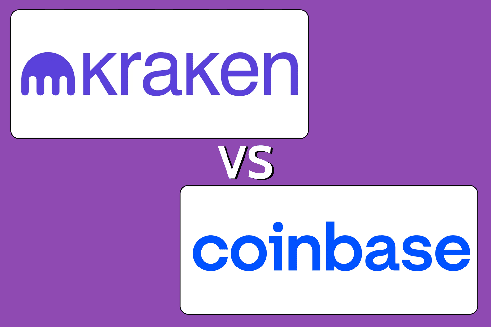

## Table of Contents

## What are Kraken and Coinbase?

Kraken is a website where you can buy and sell different kinds of digital money, like Bitcoin and Ethereum. It's like a marketplace where people from all over the world can trade these digital currencies. Kraken makes sure that the trades are safe and secure, and they also give you information to help you make good choices about buying and selling.

Coinbase is another website where you can trade digital money. It's very popular and easy to use, even if you're new to digital currencies. Coinbase lets you buy, sell, and keep your digital money safe. They also have a special feature called Coinbase Pro, which is for people who want to do more advanced trading. Like Kraken, Coinbase works hard to keep your trades safe and secure.

## How do Kraken and Coinbase differ in terms of user interface?

Kraken has a user interface that can be a bit more complex and might take some time to get used to, especially for beginners. When you first log in, you see a lot of information and options right away. This can be good for people who already know a lot about trading and want to see everything at once. But for new users, it might feel a bit overwhelming because there are so many buttons and charts to look at.

Coinbase, on the other hand, has a user interface that is much simpler and easier to understand. When you log in, you see a clean and straightforward layout. It's designed to be user-friendly, so even if you're new to trading digital money, you can figure out how to buy and sell without much trouble. Coinbase makes it easy to see your balance, make trades, and check the prices of different digital currencies, all with just a few clicks.

## What are the fee structures for Kraken and Coinbase?

Kraken's fees can change depending on what you're doing on the site. If you're trading digital money, the fees are different depending on how much you're trading and what kind of digital money it is. For example, if you're trading a small amount, you might pay around 0.16% to 0.26% of what you're trading. But if you're trading a lot, the fee can go down to as low as 0%. If you want to take your digital money out of Kraken, you'll also have to pay a fee, and this fee can be different depending on which digital money you're taking out. It's a good idea to check Kraken's website for the latest fee information because it can change.

Coinbase also has fees that can change based on what you're doing. When you buy or sell digital money on Coinbase, you'll pay a fee that's usually around 0.5% to 4.5% of the amount you're trading. This fee can be higher if you're using a credit card or if you're trading a smaller amount. If you want to move your digital money out of Coinbase, there's also a fee for that, and it can be different depending on which digital money you're moving. Just like with Kraken, it's a good idea to look at Coinbase's website to see the most up-to-date fee information.

## Which cryptocurrencies are supported on Kraken and Coinbase?

Kraken supports a lot of different cryptocurrencies. Some of the popular ones you can trade on Kraken are Bitcoin, Ethereum, Litecoin, and Ripple. They also have other cryptocurrencies like Cardano, Dogecoin, and many more. If you're looking for a place that has a big variety of digital money, Kraken could be a good choice because they keep adding new ones.

Coinbase also supports many cryptocurrencies, but they might not have as many as Kraken. You can trade popular ones like Bitcoin, Ethereum, and Litecoin on Coinbase. They also have other cryptocurrencies like Bitcoin Cash, Ethereum Classic, and some newer ones like Solana and Polygon. Coinbase is always adding new cryptocurrencies, so it's a good idea to check their website to see the latest list.

## How do Kraken and Coinbase handle security and insurance?

Kraken takes security very seriously. They use strong security measures like two-[factor](/wiki/factor-investing) authentication to keep your account safe. This means you need more than just a password to log in. Kraken also keeps most of the digital money in special secure storage that's not connected to the internet, which makes it harder for hackers to get to it. They also have insurance to protect your digital money if something goes wrong. This way, if there's a problem, your money is still safe.

Coinbase also focuses a lot on security. They use two-factor authentication too, so you need a password and another way to prove it's really you. Coinbase keeps most of your digital money in offline storage, just like Kraken, to make sure it's safe from hackers. They also have insurance to cover your digital money in case something bad happens. This means your money is protected even if there's a security issue.

## What are the geographical availability differences between Kraken and Coinbase?

Kraken is available in many countries around the world. You can use Kraken in places like the United States, Canada, the European Union, and even in some countries in Asia and Australia. But, there are some countries where Kraken is not available because of local laws or rules. So, if you want to use Kraken, it's a good idea to check if it's available in your country first.

Coinbase is also available in many countries, but it might not be in as many places as Kraken. You can use Coinbase in the United States, most of Europe, and some countries in Asia and Latin America. Like Kraken, Coinbase might not be available in some countries because of local rules. It's always a good idea to check Coinbase's website to see if it's available where you live.

## How do Kraken and Coinbase compare in terms of customer support?

Kraken offers customer support through different ways like email and a help center where you can find answers to common questions. They also have a live chat sometimes, but it might not be available all the time. Some people say that Kraken's customer support can take a while to respond, especially if you have a complicated problem. But if you have a simple question, you might find the answer quickly in their help center.

Coinbase also has customer support, and you can reach them through email or their help center. They have a phone number you can call too, which can be helpful if you need to talk to someone right away. Many people say that Coinbase's customer support is quicker to respond than Kraken's, especially for common issues. But like Kraken, if you have a more complicated problem, it might take longer to get an answer.

## What are the differences in deposit and withdrawal options between Kraken and Coinbase?

Kraken lets you deposit money in different ways. You can use a bank transfer, which is usually free but can take a few days. If you want your money to get there faster, you can use a wire transfer, but that might cost you a small fee. For digital money, you can send it directly to Kraken from your digital wallet. When you want to take money out, you can do a bank transfer or a wire transfer, and there might be a fee depending on which digital money you're taking out. Kraken also lets you take out digital money to your own wallet, but there could be a fee for that too.

Coinbase also gives you different ways to deposit money. You can use a bank transfer, which is usually free but might take a few days. If you need your money to get there faster, you can use a debit card or a credit card, but that will cost you a fee. You can also send digital money directly to Coinbase. When it comes to taking money out, you can do a bank transfer, which might have a small fee. If you want to take out digital money, you can send it to your own wallet, but there will be a fee for that as well.

## How do Kraken and Coinbase approach regulatory compliance?

Kraken works hard to follow the rules in the countries where it operates. They make sure to get the right licenses and follow local laws about digital money. For example, in the United States, Kraken has to follow rules set by the Financial Crimes Enforcement Network (FinCEN) and get money transmitter licenses in different states. They also work with regulators in Europe and other places to make sure they're doing everything right. This helps Kraken stay a trusted place for people to trade digital money.

Coinbase also takes regulatory compliance very seriously. They have a team that works to make sure Coinbase follows all the rules in the countries where it's available. In the United States, Coinbase is registered with FinCEN and has money transmitter licenses in many states. They also follow rules in Europe and other countries where they operate. By staying compliant, Coinbase wants to make sure that users feel safe and that their digital money is protected.

## What advanced trading features does Kraken offer that Coinbase does not?

Kraken has some special tools for people who really like to trade a lot. They have something called margin trading, which means you can borrow money to trade more than you have. This can help you make more money if you're right about your trades, but it can also be risky. Kraken also has a feature called futures trading, where you can bet on what the price of digital money will be in the future. This is not something you can do on Coinbase, so it's good for people who want to try different kinds of trading.

Another cool thing Kraken offers is more detailed charts and tools for looking at the market. They have something called advanced order types, which let you set up trades in very specific ways. For example, you can set a trade to happen only if the price of a digital money goes up or down to a certain point. Coinbase has some trading tools too, but they are simpler and might not be enough for people who want to do a lot of fancy trading. So, if you're someone who likes to use a lot of different strategies and tools, Kraken might be a better choice for you.

## How do Kraken and Coinbase compare in terms of liquidity and trading volume?

Kraken usually has a lot of people trading on it, which means it has good [liquidity](/wiki/liquidity-risk-premium). Liquidity means how easy it is to buy or sell something without the price changing a lot. Because Kraken has a lot of different digital money you can trade, and a lot of people using it, you can usually buy or sell quickly without waiting too long. This is good if you want to make trades fast. Kraken's trading [volume](/wiki/volume-trading-strategy), which is how much digital money is being traded, is also pretty high, especially for popular digital money like Bitcoin and Ethereum.

Coinbase also has good liquidity, but it might not be as high as Kraken's for some digital money. Coinbase is very popular and a lot of people use it, so you can usually buy and sell digital money without much trouble. But because Coinbase has fewer kinds of digital money than Kraken, the liquidity might not be as good for some of the less popular ones. Coinbase's trading volume is high too, especially for big digital money like Bitcoin and Ethereum, but it might be a bit lower than Kraken's for some other digital money.

## What are the historical performance and reliability differences between Kraken and Coinbase?

Kraken has been around since 2011 and has built a strong reputation for being reliable. They've had a few problems in the past, like some short times when their website was down, but they usually fix these problems quickly. Kraken is known for having good security and not losing people's digital money to hackers. They also have a lot of different digital money you can trade, which makes them popular with people who like to trade a lot. Overall, Kraken has a good track record of being a safe and reliable place to trade digital money.

Coinbase started in 2012 and has become very popular, especially with people new to trading digital money. They've had some issues too, like times when their website was slow or not working, but they work hard to fix these problems fast. Coinbase has had a few problems with security in the past, but they've gotten better at keeping people's digital money safe. They are known for being easy to use and having good customer support. Overall, Coinbase is seen as a reliable place to trade digital money, especially for people who are just starting out.

## References & Further Reading

[1]: ["Kraken API Documentation"](https://docs.kraken.com/rest/), Kraken

[2]: ["How Does Coinbase Work: Exchange Review"](https://www.nerdwallet.com/reviews/investing/brokers/coinbase) by Richard Loth, Investopedia

[3]: ["Algorithmic Trading and DMA: An introduction to direct access trading strategies"](https://www.amazon.com/Algorithmic-Trading-DMA-introduction-strategies/dp/0956399207) by Barry Johnson

[4]: ["An Introduction to High-Frequency Finance"](https://www.amazon.com/Introduction-High-Frequency-Finance-Ramazan-Gen%C3%A7ay/dp/0122796713) by Michel M. Dacorogna et al.

[5]: ["Cryptocurrency Exchanges: Legal Framework and Emerging Issues"](https://www.weforum.org/agenda/2024/05/global-cryptocurrency-regulations-changing/) by Jan Lansky

[6]: ["Kraken vs Coinbase: In-Depth Exchange Comparison"](https://finbold.com/guide/coinbase-vs-kraken/) by CryptoVantage Staff