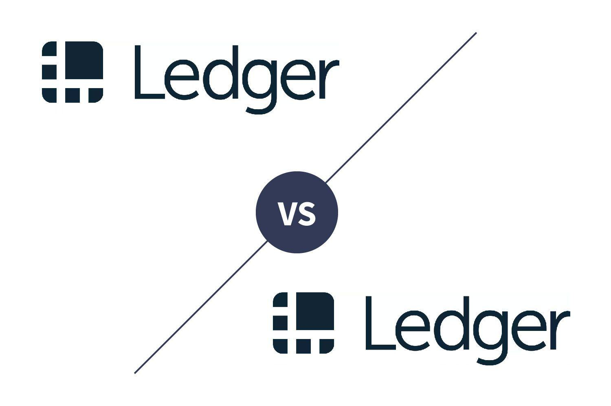

The increasing popularity of cryptocurrencies has revolutionized the financial landscape, prompting a significant demand for secure and efficient storage solutions. As digital assets continue to gain traction, ensuring their safety becomes paramount for investors and traders alike. Ledger, a prominent name in the crypto hardware wallet industry, has addressed this need by providing robust, secure solutions for cryptocurrency storage. Two of their flagship models, the Ledger Nano S Plus and Ledger Nano X, have stood out for their advanced security features and user-friendly designs.

This article will present a detailed comparison of the Ledger Nano S Plus and Ledger Nano X, examining their features, usability, and price points. By evaluating the strengths and limitations of each, we aim to identify which device caters best to varying user requirements, whether they are novice investors or seasoned traders. Furthermore, we will explore how these wallets integrate with algorithmic trading, a growing trend that utilizes automated strategies to execute trades based on predetermined criteria.

Understanding the role of algorithmic trading within the cryptocurrency domain can provide valuable insights for potential investors, enabling them to optimize their trading strategies and secure their digital assets effectively. As part of this analysis, we will consider how leveraging Ledger's hardware wallets can bolster a trader's cybersecurity stance, providing critical protection against online threats. By examining these components, readers will gain a comprehensive understanding of how to navigate the growing cryptocurrency and algorithmic trading landscape with confidence and security.

## Table of Contents

## Overview of Ledger Nano S Plus and Ledger Nano X

Ledger Nano S Plus and Ledger Nano X are prominent hardware wallets engineered to provide a secure offline storage solution for cryptocurrencies. Both devices incorporate Secure Element chips, which offer a robust defense against physical tampering, and the Blockchain Open Ledger Operating System (BOLOS), enhancing security through isolation of cryptocurrency applications and activities.

The Ledger Nano S Plus is positioned as a cost-effective choice, retailing at $79. It supports over 5,500 currencies and tokens, catering to a wide array of digital asset enthusiasts. This model is particularly appealing to individuals who prioritize budget-friendly options without compromising on security. It offers a user-friendly experience, suitable for those looking to securely store cryptocurrencies without frequent transactions requiring mobile access.

Conversely, the Ledger Nano X is available at $149 and offers advanced features, including Bluetooth connectivity. This enables wireless transactions and seamless integration with iOS devices, making it an attractive option for users who manage their portfolios on-the-go. The Bluetooth functionality permits users to execute transactions without needing to connect the device physically to a computer, thereby enhancing mobility and convenience.

Both devices are supported by the Ledger Live app, which facilitates the management of multiple cryptocurrencies and tokens. This application is compatible with a broad range of digital currencies, including major ones like Bitcoin and Ethereum, as well as various altcoins, providing users with a comprehensive and unified interface to oversee their [cryptocurrency](/wiki/cryptocurrency) portfolio across different devices.

## Key Features and Differences

Ledger Nano S Plus and Ledger Nano X are prominent hardware wallets from Ledger, each catering to different user needs through distinct features. While both devices are built with strong security measures, key differences set them apart.

The Ledger Nano X distinguishes itself with Bluetooth connectivity, a feature absent in the Nano S Plus. This wireless capability enables users to manage their crypto portfolios on the go, using iOS or Android devices, thus promoting seamless accessibility. Additionally, the larger screen of the Nano X aids in improved navigation and transaction verification, enhancing user experience.

A significant advantage of the Nano X is its capacity to handle up to 100 applications simultaneously, making it an attractive choice for active traders and investors with diverse cryptocurrency holdings. The device's increased internal storage facilitates the management of multiple crypto apps, which is vital for users engaged in frequent trading and those managing a broad portfolio encompassing various digital assets.

In contrast, the Ledger Nano S Plus is tailored for users who prioritize fundamental, secure cryptocurrency storage over advanced mobile integration. Its cost-effective nature and straightforward interface make it suitable for beginners or long-term investors who do not require constant access to mobile crypto applications. Despite its limited app storage compared to the Nano X, the Nano S Plus still provides support for over 5,500 digital assets, including popular cryptocurrencies like Bitcoin, Ethereum, and a multitude of altcoins, ensuring wide-ranging currency compatibility.

Both devices leverage the same underlying security technologies, incorporating Secure Element chips and the Blockchain Open Ledger Operating System (BOLOS) to safeguard users' assets. In sum, the Ledger Nano S Plus and Nano X cater to different usage preferences, with the former offering a budget-friendly option for straightforward crypto storage, while the latter delivers enhanced connectivity and functionality for active mobile users.

## Algo Trading with Ledger Wallets

Algorithmic trading, commonly referred to as algo trading, leverages computer programs to automate and execute trades using pre-set rules and strategies. This modern approach to financial trading is predominantly implemented to capitalize on the speed and precision that computers offer over manual trading. Essential considerations in algo trading include latency, transaction costs, and risk management, with an overarching emphasis on security to protect digital assets.

Although Ledger hardware wallets do not directly enable algo trading, they play a crucial role in the post-trade process by securely storing cryptocurrencies acquired or managed through algorithmic methods. Hardware wallets from Ledger, such as the Nano S Plus and Nano X, are particularly valued for their ability to keep private keys offline, thus mitigating exposure to online threats. This is particularly relevant for traders seeking a secure means to protect their digital currency gains, as the offline storage provided by Ledger wallets effectively guards against hacking and phishing attempts.

For traders utilizing algorithmic strategies, integrating Ledger wallets with trading platforms can enhance security and streamline management. Many trading platforms offer API (Application Programming Interface) support, allowing seamless connections to hardware wallets for rapid account overviews and asset management. By utilizing API connections, traders can ensure secure and efficient transfer of funds between exchanges and wallets, effectively increasing their operational security without sacrificing convenience.

Despite the inability of Ledger wallets to produce or facilitate trades directly, their role as secure storage solutions makes them indispensable for algo traders looking to safeguard their investments. By prioritizing security through hardware wallets, traders can maintain the integrity and confidentiality of their trading activities, assuring that their assets are well-protected against potential cyber threats. This combination of algorithmic strategies and robust storage solutions highlights the significance of incorporating secure practices in the evolving landscape of cryptocurrency trading.

## Security Features in Depth

Ledger hardware wallets are designed to offer a secure environment for storing cryptocurrencies by ensuring that private keys remain offline. One of the core security elements of these wallets is the Secure Element chip, which is engineered to resist various forms of tampering. This chip is a key component in maintaining the integrity of private keys, ensuring they remain protected even if the physical device is compromised.

In addition to the Secure Element chip, Ledger wallets utilize the Blockchain Open Ledger Operating System (BOLOS). This proprietary operating system acts as an additional layer of security by isolating various crypto applications. By compartmentalizing apps, BOLOS minimizes the risk of cyber threats, preventing potential breaches from affecting the wallet's overall security. The isolation ensures that even if one app is compromised, the rest of the wallet's security infrastructure remains intact.

Users of Ledger wallets can also enhance their security posture through additional safeguards such as setting a personal identification number (PIN) code. This requirement for device access provides an extra layer of protection against unauthorized use. Furthermore, Ledger wallets offer a recovery passphrase—a critical feature that allows users to recover their assets in case the physical device is lost or damaged. This passphrase, often a sequence of 24 words, is generated during the initial setup and is crucial for the restoration of the wallet's content on a new device.

Overall, Ledger's commitment to security is evidenced by its stringent combination of hardware and software protections, ensuring that user assets remain safe from both physical tampering and cyber threats.

## Conclusion: Choosing the Right Ledger Wallet

Choosing the right Ledger wallet, whether it be the Nano S Plus or the Nano X, hinges on individual preferences and specific requirements related to trading activity and budget considerations. Each device offers distinct advantages that cater to different types of users. 

The Ledger Nano S Plus stands out as a cost-effective solution, priced at $79, for users who prioritize secure offline storage. This model is ideal for those who are either beginners in the cryptocurrency space or long-term investors not requiring frequent mobile access to their digital assets. With support for over 5,500 currencies, it provides robust security without the additional features that come with a premium price tag.

Conversely, the Ledger Nano X, priced at $149, appeals to more active users who demand greater mobility and convenience in managing their portfolios. Its Bluetooth connectivity allows seamless wireless interaction with both iOS and Android devices, enabling users to conduct transactions and monitor their crypto holdings on the go. The capacity to support up to 100 apps simultaneously makes it particularly attractive for traders with diverse and expansive portfolios.

Both options benefit from Ledger's strong reputation for security and reliability in the ever-evolving cryptocurrency market. The hardware architecture incorporating secure element chips and the Blockchain Open Ledger Operating System (BOLOS) ensures that users' digital assets remain protected against online threats. Additionally, integration capabilities with the Ledger Live app enable comprehensive management of multiple cryptocurrencies and tokens, providing users with efficient control over their assets regardless of their choice between the Nano S Plus and Nano X.

## Final Thoughts on Algo Trading and Security

As cryptocurrency continues to develop, the integration of secure storage solutions like Ledger wallets with innovative trading strategies such as [algorithmic trading](/wiki/algorithmic-trading) becomes increasingly vital. These hardware wallets are crucial for safeguarding digital assets from the ever-present threat of online vulnerabilities. By storing private keys offline, Ledger provides a fortified layer of security, protecting cryptocurrencies from hacks and cyber-attacks.

Understanding both the functions of hardware wallets and the intricacies of algorithmic trading can significantly enhance an investor's security practices. Hardware wallets like the Ledger Nano S Plus and Ledger Nano X serve to mitigate risks by securely storing assets, while algorithmic trading leverages computational power to execute trades based on precise strategies and criteria.

For investors, the decision between the Nano S Plus and the Nano X should be informed by comprehensive research and an assessment of personal needs. Factors such as the frequency of trades, the necessity for mobility, and budget constraints are all crucial in making an informed choice. The Nano S Plus is an economical choice for those who emphasize security over connectivity, while the Nano X caters to more active traders who benefit from the added functionality of Bluetooth and broader app support.

In conclusion, the synergy between secure storage and algorithmic trading represents a forward-thinking approach to managing cryptocurrency investments. Investors who prioritize security and strategic trading are better positioned to protect their assets and capitalize on market opportunities. Therefore, a thorough understanding of these technologies and their application is essential for making informed decisions in today's dynamic crypto landscape.

## References & Further Reading

[1]: Bergstra, J., Bardenet, R., Bengio, Y., & Kégl, B. (2011). ["Algorithms for Hyper-Parameter Optimization."](https://papers.nips.cc/paper/4443-algorithms-for-hyper-parameter-optimization) Advances in Neural Information Processing Systems 24.

[2]: ["Advances in Financial Machine Learning"](https://www.amazon.com/Advances-Financial-Machine-Learning-Marcos/dp/1119482089) by Marcos Lopez de Prado

[3]: ["Evidence-Based Technical Analysis: Applying the Scientific Method and Statistical Inference to Trading Signals"](https://www.amazon.com/Evidence-Based-Technical-Analysis-Scientific-Statistical/dp/0470008741) by David Aronson

[4]: ["Machine Learning for Algorithmic Trading"](https://github.com/stefan-jansen/machine-learning-for-trading) by Stefan Jansen

[5]: ["Quantitative Trading: How to Build Your Own Algorithmic Trading Business"](https://www.amazon.com/Quantitative-Trading-Build-Algorithmic-Business/dp/1119800064) by Ernest P. Chan