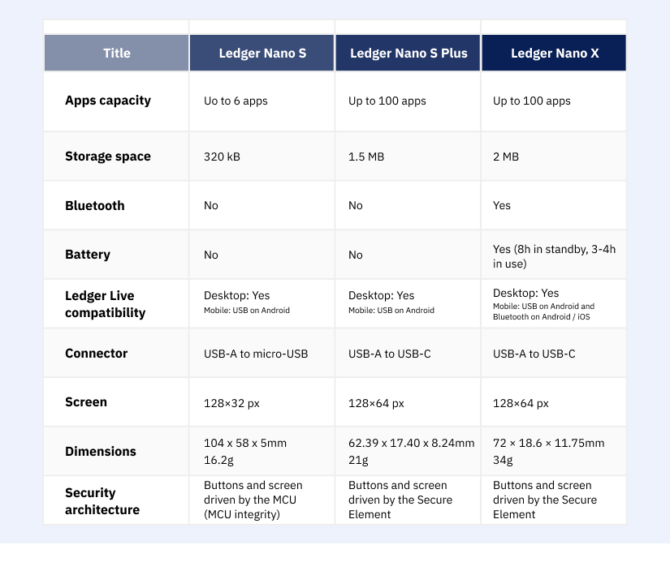

## Table of Contents

## What are the basic differences between Ledger Nano S Plus and Ledger Nano X?

The Ledger Nano S Plus and Ledger Nano X are both hardware wallets made by Ledger, but they have some key differences. The Ledger Nano X is a more advanced version compared to the Ledger Nano S Plus. One of the main differences is that the Ledger Nano X has Bluetooth connectivity, which allows you to use it with your smartphone without needing a cable. The Ledger Nano S Plus does not have Bluetooth, so you need to connect it to your computer using a USB cable.

Another difference is the number of apps you can have installed at the same time. The Ledger Nano X can hold more apps simultaneously, which is useful if you have a lot of different cryptocurrencies. The Ledger Nano S Plus can hold fewer apps, so you might need to uninstall and reinstall apps if you want to manage different cryptocurrencies. Both devices are secure and good for keeping your crypto safe, but the Nano X offers more convenience and flexibility.

In terms of price, the Ledger Nano X is more expensive than the Ledger Nano S Plus. If you want a more budget-friendly option and don't need Bluetooth or to manage many apps at once, the Ledger Nano S Plus might be the better choice for you. If you want the latest features and more flexibility, the Ledger Nano X could be worth the extra cost.

## How do the physical designs of Ledger Nano S Plus and Ledger Nano X compare?

The Ledger Nano S Plus and Ledger Nano X have different physical designs, but they are both small and easy to [carry](/wiki/carry-trading). The Ledger Nano S Plus is a bit smaller and thinner than the Ledger Nano X. It has a small screen and two buttons on the front, which you use to navigate and confirm actions. The design is simple and looks a lot like the original Ledger Nano S, but it's a bit longer and has a bigger screen.

The Ledger Nano X, on the other hand, is a bit bigger and thicker. It also has a small screen and two buttons on the front, but the screen is slightly larger than the one on the Ledger Nano S Plus. The Ledger Nano X has a more modern look with a rounded shape and a different button layout. Both devices are made to be durable and secure, but the Ledger Nano X feels a bit more premium because of its larger size and design.

## What are the price differences between Ledger Nano S Plus and Ledger Nano X?

The Ledger Nano S Plus and Ledger Nano X have different prices. The Ledger Nano S Plus is cheaper than the Ledger Nano X. It usually costs around $79, which makes it a good choice if you want to save money.

The Ledger Nano X, on the other hand, is more expensive. It usually costs around $149. The higher price is because it has more features like Bluetooth and can hold more apps at the same time. If you need those extra features, the Ledger Nano X might be worth the extra cost.

## Can you explain the security features of Ledger Nano S Plus versus Ledger Nano X?

Both the Ledger Nano S Plus and Ledger Nano X have strong security features to keep your crypto safe. They both use a secure chip to store your private keys, which means your keys are never exposed to the internet. This is called cold storage, and it's one of the best ways to protect your cryptocurrencies. Both devices also have a PIN code that you set up when you first use them. If someone tries to use your device without the PIN, they won't be able to access your funds. There's also a recovery phrase that you write down and keep in a safe place. If you lose your device, you can use this phrase to get your crypto back on a new device.

The main difference in security between the Ledger Nano S Plus and Ledger Nano X is how you connect them to your phone or computer. The Ledger Nano X has Bluetooth, which lets you connect it to your phone without a cable. Some people might worry that Bluetooth could be less secure, but Ledger has made sure it's safe to use. The Ledger Nano S Plus doesn't have Bluetooth, so you always need to connect it with a USB cable. This can be seen as more secure because there's no wireless connection that could be hacked. But both devices are very secure and good at protecting your crypto.

## How does the battery life of Ledger Nano X compare to the Ledger Nano S Plus?

The Ledger Nano X has a built-in battery, which means you can use it without plugging it into your computer or phone. The battery life of the Ledger Nano X is pretty good; it can last for about a week on a single charge if you use it a lot, and even longer if you use it less often. This makes it really handy if you want to manage your crypto on the go without having to find a charger.

The Ledger Nano S Plus doesn't have a battery at all. It needs to be plugged into your computer using a USB cable to work. This means you don't have to worry about charging it, but it also means you can't use it without a cable. If you don't mind being tethered to your computer, the Ledger Nano S Plus is still a great choice for keeping your crypto safe.

## What is the difference in the number of supported cryptocurrencies between Ledger Nano S Plus and Ledger Nano X?

Both the Ledger Nano S Plus and Ledger Nano X support a wide range of cryptocurrencies. They can handle over 5,500 different coins and tokens, including popular ones like Bitcoin, Ethereum, and many others. This means that no matter which device you choose, you'll be able to manage a lot of different cryptocurrencies.

The main difference between the two devices isn't in the total number of supported cryptocurrencies, but in how many apps you can have installed at the same time. The Ledger Nano X can hold more apps simultaneously, which is useful if you want to manage many different cryptocurrencies without having to uninstall and reinstall apps. The Ledger Nano S Plus can hold fewer apps at once, so you might need to switch them out if you want to manage a lot of different coins.

## How do the user interfaces of Ledger Nano S Plus and Ledger Nano X differ?

The user interfaces of the Ledger Nano S Plus and Ledger Nano X are similar because they both have a small screen and two buttons to navigate and confirm actions. On both devices, you use the buttons to scroll through menus and make choices. The screens show you what you're doing, like sending or receiving crypto, and you use the buttons to approve or deny actions. This makes both devices easy to use, even if you're not very tech-savvy.

The main difference in the user interfaces is the size of the screens. The Ledger Nano X has a slightly larger screen than the Ledger Nano S Plus. This can make it a bit easier to read what's on the screen, especially if you have trouble seeing small text. Both devices are designed to be user-friendly, but the larger screen on the Ledger Nano X might make it a bit more comfortable to use for some people.

## Can you describe the connectivity options available on Ledger Nano S Plus and Ledger Nano X?

The Ledger Nano S Plus and Ledger Nano X have different ways to connect to your devices. The Ledger Nano S Plus only uses a USB cable to connect to your computer. You plug it in and use it to manage your crypto. It doesn't have any wireless options, so you always need to have it plugged in when you're using it. This can be good if you want to keep things simple and don't need to use it on the go.

The Ledger Nano X, on the other hand, gives you more options for connecting. It has a built-in Bluetooth feature, which lets you connect it to your smartphone without any cables. This makes it really easy to use the Ledger Nano X with the Ledger Live app on your phone, so you can manage your crypto wherever you are. But if you prefer, you can also use a USB cable to connect the Ledger Nano X to your computer, just like the Ledger Nano S Plus.

## What advanced features does Ledger Nano X have that Ledger Nano S Plus does not?

The Ledger Nano X has some cool features that the Ledger Nano S Plus doesn't have. One big one is Bluetooth. This means you can connect the Ledger Nano X to your phone without any cables. It's really handy if you want to manage your crypto on the go. Another feature is that the Ledger Nano X can hold more apps at the same time. This is great if you have a lot of different cryptocurrencies and don't want to keep uninstalling and reinstalling apps.

The Ledger Nano X also has a slightly bigger screen than the Ledger Nano S Plus. This makes it a bit easier to read what's on the screen, which can be helpful if you have trouble seeing small text. The battery in the Ledger Nano X is another feature that the Ledger Nano S Plus doesn't have. With the battery, you can use the Ledger Nano X without plugging it in, and it can last for about a week on a single charge. These features make the Ledger Nano X a bit more convenient and flexible to use.

## How do the firmware update processes differ between Ledger Nano S Plus and Ledger Nano X?

The firmware update process for both the Ledger Nano S Plus and Ledger Nano X is pretty similar. You start by connecting your device to your computer using a USB cable. Then, you open the Ledger Live app on your computer, which will check if there's a new firmware version available. If there is, the app will guide you through the update process. You'll need to confirm the update on your device using the buttons, and then the app will handle the rest. The whole process is designed to be easy and safe, so you don't have to worry about messing it up.

The main difference is that the Ledger Nano X can also check for firmware updates through Bluetooth if you have it connected to your phone. But if you want to actually update the firmware, you still need to use a USB cable to connect it to your computer. So, while the Ledger Nano X gives you a bit more flexibility in checking for updates, the actual process of updating the firmware is the same for both devices. Both the Ledger Nano S Plus and Ledger Nano X make sure that updating the firmware is simple and secure, so your crypto stays safe.

## What are the implications of the Ledger Nano X's Bluetooth functionality in terms of security and convenience?

The Ledger Nano X's Bluetooth feature makes it easier and more convenient to use. You can connect it to your phone without any cables, which means you can manage your crypto wherever you are. If you're out and about and need to check your balance or send some crypto, you can do it quickly without needing to find a computer. This makes the Ledger Nano X a good choice if you like to have your crypto at your fingertips.

However, some people might worry about the security of using Bluetooth. There's a small chance that someone could try to hack into your device through the Bluetooth connection. But Ledger has made sure that the Bluetooth connection is secure. They use strong encryption to keep your data safe, so it's very hard for anyone to get into your device without your permission. So, while Bluetooth adds a bit of convenience, it's still safe to use if you follow the security guidelines that Ledger provides.

## How do experts rate the long-term investment value and future-proofing of Ledger Nano S Plus versus Ledger Nano X?

Experts generally see both the Ledger Nano S Plus and Ledger Nano X as good long-term investments for keeping your crypto safe. The Ledger Nano X is often seen as a bit more future-proof because it has more features like Bluetooth and can hold more apps at the same time. This means it can keep up with new technology and changes in the crypto world better than the Ledger Nano S Plus. If you want a device that will last you a long time and work well with new apps and features, the Ledger Nano X might be the better choice.

On the other hand, the Ledger Nano S Plus is still a solid choice for long-term investment if you're looking to save money. It doesn't have all the bells and whistles of the Ledger Nano X, but it's still very secure and can handle a wide range of cryptocurrencies. If you don't need the extra features and want a more budget-friendly option, the Ledger Nano S Plus can serve you well for many years. Both devices are good for keeping your crypto safe, but the Ledger Nano X might be a bit better at staying up-to-date with the latest technology.

## References & Further Reading

[1]: Bergstra, J., Bardenet, R., Bengio, Y., & Kégl, B. (2011). ["Algorithms for Hyper-Parameter Optimization."](https://papers.nips.cc/paper/4443-algorithms-for-hyper-parameter-optimization) Advances in Neural Information Processing Systems 24.

[2]: ["Advances in Financial Machine Learning"](https://www.amazon.com/Advances-Financial-Machine-Learning-Marcos/dp/1119482089) by Marcos Lopez de Prado

[3]: ["Evidence-Based Technical Analysis: Applying the Scientific Method and Statistical Inference to Trading Signals"](https://www.amazon.com/Evidence-Based-Technical-Analysis-Scientific-Statistical/dp/0470008741) by David Aronson

[4]: ["Machine Learning for Algorithmic Trading"](https://github.com/stefan-jansen/machine-learning-for-trading) by Stefan Jansen

[5]: ["Quantitative Trading: How to Build Your Own Algorithmic Trading Business"](https://www.amazon.com/Quantitative-Trading-Build-Algorithmic-Business/dp/1119800064) by Ernest P. Chan