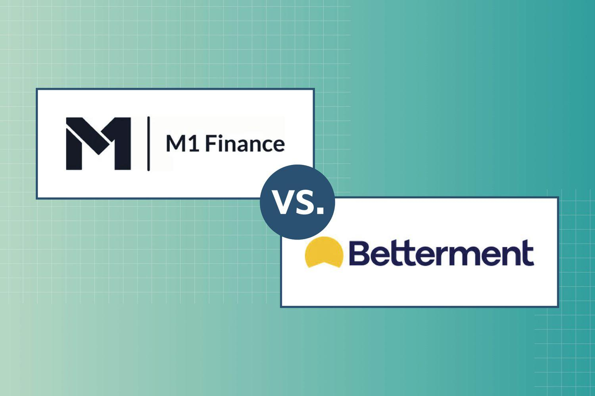

In recent years, investment platforms have witnessed a significant surge in popularity, driven by the rapid advancement of digital technology and a growing public interest in self-directed investing. This growth reflects a broader trend in the evolution of digital wealth management, wherein traditional financial advisory services are increasingly supplemented or even replaced by automated platforms that offer a range of investment opportunities at lower costs. These platforms provide users with sophisticated investing tools, portfolio management, and financial planning services, largely enabled by technological advancements such as algorithmic trading.

Two key players in this space are M1 Finance and Betterment, which have garnered attention for their unique offerings and approaches to digital investing. M1 Finance is known for its hybrid model that allows for both automated investing and self-directed portfolio management, offering a customizable experience to users. Betterment, on the other hand, has established itself as a pioneer in robo-advisory services, providing personalized financial advice through automated portfolio management.

Algorithmic trading plays a crucial role in modern investing by leveraging computer algorithms to execute trades quickly, efficiently, and often at reduced costs. These algorithms analyze large data sets to identify investment opportunities and execute trades at optimal prices without human intervention. This technology not only democratizes access to sophisticated trading strategies but also enhances the efficiency and precision of investment management.

The purpose of this article is to compare M1 Finance and Betterment, examining their features, user experiences, fee structures, investment options, and overall value to investors. By doing so, we aim to provide potential users with insights to make informed decisions on which platform might better suit their investment preferences and objectives.

## Table of Contents

## What Are M1 Finance and Betterment?

M1 Finance and Betterment are two influential platforms in the digital investment landscape, each with a unique approach to wealth management.  

**M1 Finance** was founded in 2015 by Brian Barnes with the mission to offer individuals a more flexible investment experience. The platform allows users to create personalized portfolios, known as “Pies,” composed of various investments including stocks and ETFs. M1 Finance emphasizes automation by enabling automatic rebalancing, thereby aligning with modern algorithmic trading trends. The platform's seamless integration of banking and borrowing services further enhances its comprehensive financial management offerings.

**Betterment**, established earlier in 2008, is renowned as one of the pioneers in the robo-advisory sector. It was founded by Jon Stein and Eli Broverman with the mission to democratize investment management through technology. Betterment offers automated portfolio management services tailored to individual risk preferences and financial goals. This platform focuses heavily on optimizing returns through tax-loss harvesting and smart dividend reinvestment, aiming for a hands-off approach to wealth accumulation.

Both platforms provide a range of financial services that cater to varying investment needs. 

M1 Finance's key features include its innovative “Pie” investment model, flexible borrowing options with low-interest rates, and the ability to invest in fractional shares. This approach allows users significant control over their investment strategy while leveraging automated systems for efficiency. The platform's unique selling point lies in its ability to integrate banking and investment management, offering services like M1 Spend and M1 Borrow, which provide an all-in-one financial solution.

On the other hand, Betterment's primary features revolve around goal-based investing, tax optimization strategies such as tax-coordinated portfolios, and a user-friendly interface that streamlines portfolio management. Betterment’s unique selling point is its focus on financial advice and automation, underscored by its use of advanced algorithms to optimize asset allocation according to individual goals and timelines. The platform's dedication to affordable, high-quality investment management is highlighted by its straightforward fee structure and lack of transaction fees. 

Both M1 Finance and Betterment leverage algorithm-driven investment planning, yet they serve different types of investors. M1 Finance attracts those who prefer a more hands-on approach with customizable investment options, while Betterment is ideal for individuals seeking simplicity and comprehensive financial advisory services in their investment journey.

## Algorithmic Trading and Digital Investment

Algorithmic trading, a cornerstone of modern digital investment, refers to the use of computer algorithms to execute trading orders based on pre-defined criteria. This process allows for high-frequency and high-[volume](/wiki/volume-trading-strategy) trading that is largely free from human emotion and error, thereby increasing the efficiency of financial markets. The importance of [algorithmic trading](/wiki/algorithmic-trading) lies in its ability to implement complex trading strategies with speed and precision, providing investors with the tools to optimize their portfolios and achieve better returns.

Digital investment platforms integrate algorithmic trading by utilizing advanced algorithms to manage and optimize user portfolios. These platforms take into account various factors such as market conditions, asset performance, and individual investor preferences to automate investment decisions. This integration not only streamlines the trading process but also democratizes access to sophisticated investment strategies that were once limited to institutional investors.

For different types of investors, algorithmic trading offers significant benefits. It provides retail investors with access to cutting-edge technology that can enhance portfolio performance while reducing costs associated with traditional trading. Institutional investors benefit from the ability to execute large orders with minimal market impact, improving [liquidity](/wiki/liquidity-risk-premium) and risk management. Additionally, algorithmic trading can help investors maintain discipline by adhering to pre-defined strategies, thus avoiding impulsive decisions driven by market [volatility](/wiki/volatility-trading-strategies).

Betterment's approach to algorithmic trading is rooted in its commitment to providing personalized financial advice through modern technology. The platform uses algorithms to construct and manage diversified portfolios based on an investor's risk tolerance and financial goals. By leveraging techniques such as tax-loss harvesting, Betterment optimizes after-tax returns, which is particularly beneficial for taxable accounts. These techniques involve the systematic selling of securities at a loss to offset capital gains, a process that is efficiently handled by algorithms.

M1 Finance takes a distinct approach by promoting a more hands-on investor experience while still offering algorithmic benefits. M1 Finance allows users to create custom portfolios, or "pies," comprised of various asset classes and individual securities. Once configured, these pies are managed using algorithms to ensure optimal balance based on the user's target allocations. M1 Finance's automated features include dynamic rebalancing, where the platform automatically adjusts the portfolio's composition based on user-deposited funds or dividends, ensuring adherence to the investor's chosen strategy without manual intervention.

In summary, algorithmic trading is a pivotal component of digital investment platforms, offering enhanced portfolio management capabilities and accessibility to sophisticated trading strategies. Betterment and M1 Finance exemplify different applications of algorithmic trading, each providing distinct advantages that cater to diverse investor preferences and objectives.

## Comparative Analysis: User Experience

The user experience of investment platforms is a critical [factor](/wiki/factor-investing) for investors who seek intuitive navigation, straightforward account setup, and reliable customer support. This section provides a comparative analysis of the user experience on M1 Finance and Betterment, focusing on ease of navigation and user interface, the account setup process, usability features of mobile and web applications, customer support services, and user feedback.

### Ease of Navigation and User Interface

M1 Finance offers a clean and intuitive user interface designed to facilitate straightforward investing. Users can easily navigate the platform's dashboard, which presents a clear overview of their investment portfolios, pending actions, and performance metrics. The interface supports a pie-based investing model, allowing users to visualize their portfolio allocations. This design is particularly beneficial for hands-on investors who appreciate visual representations.

Betterment, on the other hand, provides a simplistic yet effective user interface that emphasizes automated wealth management. The platform prioritizes ease of use with a minimalist design that guides users through goal-based investing. The dashboard presents personalized financial advice and insights, making it appealing to those who prefer a passive investment approach. Betterment’s design focuses on clarity and helps users track progress toward their financial goals.

### Account Setup Process

The account setup process on M1 Finance is designed to be user-friendly and efficient. New users are guided through a series of steps that involve providing personal information, linking a bank account, and custom-building a portfolio using M1’s pie-based model. The process is typically quick, allowing investors to start building their portfolios relatively swiftly.

Betterment’s account setup is also straightforward, facilitating easy entry for new users. Potential investors are prompted to define their financial goals and risk level, upon which Betterment provides a recommended investment plan. By focusing on goal-based questions, the platform swiftly personalizes investment portfolios, making the process efficient for users interested in automated investment strategies.

### Usability Features in Terms of Mobile and Web Apps

Both M1 Finance and Betterment offer robust mobile and web applications, ensuring users have comprehensive access to their accounts from any device. M1 Finance's mobile app mirrors its web interface, providing seamless integration with features for monitoring performance, executing trades, and managing portfolio pies. The app is lauded for its intuitive design and functionality that aligns closely with user expectations for modern financial tools.

Betterment’s mobile app complements its web platform with clear navigation and tools for portfolio management, financial goal tracking, and accessing personalized advice. The app’s user-friendly design promotes consistent user engagement and supports users’ ability to manage their investments effortlessly on-the-go. The consistency between mobile and web experiences enhances the platform's appeal to tech-savvy investors.

### Customer Support Services Comparison

In terms of customer support, M1 Finance provides a variety of resources including an extensive FAQ section, email support, and phone support for more complex inquiries. While generally responsive, the platform's customer service has received mixed reviews, with some users noting delayed responses during peak times.

Betterment offers tiered customer support with features such as live chat, email, and phone support. Premium users gain access to certified financial planners, which enhances the overall service quality. The customer support experience at Betterment is often praised for its responsiveness and knowledgeable staff, which can be a decisive factor for users seeking comprehensive service.

### User Reviews and Feedback Summary

User feedback reveals contrasting experiences for both platforms. M1 Finance is frequently praised for its unique investment model and ease of customization, resonating with hands-on investors seeking a personalized investment experience. However, some users express concern over customer service responsiveness and occasional technical glitches.

Betterment garners positive reviews for its effective goal-based investing approach and seamless user interface, appealing to users who prefer automation and simplicity. The platform’s strength in offering financial advice is often highlighted, although users sometimes cite a lack of flexibility in investment choices as a drawback.

In summary, M1 Finance and Betterment each cater to distinct user preferences, balancing between investor control and automated convenience. Potential users should weigh the strengths of each platform's user experience to align with their personal investment needs and preferences.

## Investment Strategies and Options

## Investment Strategies and Options

Betterment and M1 Finance offer a variety of investment strategies tailored to different investor needs, preferences, and risk tolerances.

### Portfolio Construction Offerings by Betterment

Betterment is known for its use of automated algorithms to craft diversified portfolios tailored to individual risk profiles. The platform utilizes a goal-based investing approach, allowing users to define specific financial goals such as retirement, safety net savings, or general investing. Betterment's portfolios typically comprise low-cost, diversified exchange-traded funds (ETFs) that span multiple asset classes, including domestic and international equities, bonds, and real estate investment trusts (REITs). This broad diversification is designed to optimize returns while managing risks over the long term.

To align with modern financial trends, Betterment also offers Socially Responsible Investing (SRI) portfolios. These portfolios are constructed with a focus on companies that meet certain environmental, social, and governance ([ESG](/wiki/esg-investing)) criteria. Furthermore, Betterment provides a range of portfolios tailored to different preferences, such as the Goldman Sachs Smart Beta portfolio and a Flexible Portfolio option, which allows clients to manually adjust the asset class weights.

### Portfolio Customization Capabilities in M1 Finance

M1 Finance offers a high degree of portfolio customization through its unique "Pie" investing feature. This model allows users to build personalized portfolios by selecting individual stocks and ETFs, each represented as a "slice" of a visual pie chart. Investors can fully design their own pie or choose from pre-built expert pies, which are curated portfolios following specific strategies, such as income generation or retirement planning.

This high level of customization caters to investors who prefer greater control over their asset allocation. Additionally, M1 Finance automatically rebalances portfolios for free, ensuring that the asset allocation remains consistent with the user's original strategy without manual intervention.

### Available Assets and Investment Vehicles in Both Platforms

Both Betterment and M1 Finance provide access to a wide array of investment vehicles. Betterment primarily focuses on ETFs and does not allow direct stock investments. Its portfolio options incorporate diverse asset classes across global markets, including U.S. and international stocks and bonds, with specific funds selected for optimal efficiency.

M1 Finance, meanwhile, offers broader asset accessibility, enabling investment in individual stocks, ETFs, and even fractional shares. This flexibility allows investors to allocate resources as desired, providing the freedom to invest in a single stock or diversify across multiple sectors and industries.

### Comparison of Tax-Loss Harvesting Strategies

Tax-loss harvesting is a prominent feature in Betterment’s suite of services. The platform automatically conducts daily checks to identify the potential to sell securities at a loss to offset gains and reduce taxable income. This practice can optimize an investor's tax situation without requiring manual oversight, making it particularly advantageous for taxable accounts.

M1 Finance, on the other hand, does not offer automatic tax-loss harvesting. However, it provides tax-efficient investing benefits through features like tax minimization strategies during withdrawals and an optional Plus membership that grants further tax advantages for larger accounts.

### Review of Additional Investment Options like Crypto and ESG Portfolios

Betterment's portfolio options include ESG portfolios aligned with investors' interests in environmental and social governance. However, as of now, Betterment does not support [cryptocurrency](/wiki/cryptocurrency) investments directly through its platform.

M1 Finance enhances its offering with access to cryptocurrency through M1 Crypto, allowing users to invest in a variety of digital currencies alongside traditional stocks and ETFs. This integration caters to investors seeking exposure to the growing digital asset market.

In conclusion, both Betterment and M1 Finance present compelling investment strategies, each catering to distinct investor preferences, with Betterment leaning towards a more guided, automated investment approach and M1 Finance offering flexibility and control in portfolio construction.

## Costs and Fees

### Costs and Fees

The fee structures of M1 Finance and Betterment are fundamental considerations for any investor evaluating the two platforms. While both platforms cater to a range of investor needs, their cost frameworks differ significantly, potentially impacting long-term investment returns.

#### Breakdown of Fee Structures for M1 Finance

M1 Finance offers a distinctive approach to fees that centers on providing investors with flexibility and control over their portfolios. Notably, M1 Finance does not charge management fees for their basic account. This feature allows investors to create and manage portfolios without incurring annual maintenance costs, setting it apart from many traditional finance models. However, M1 Finance does offer M1 Plus, an optional premium subscription service priced at $125 per year. M1 Plus includes benefits such as higher interest rates on cash balances, lower borrowing rates, and additional trading windows.

#### Breakdown of Fee Structures for Betterment

Betterment employs a tiered fee structure, focusing on providing automated investment management with varying levels of human advisory service. The Digital plan charges an annual management fee of 0.25% of assets under management. This fee encompasses portfolio management, automated rebalancing, and tax-loss harvesting. Betterment also offers a Premium plan at 0.40% annually, which includes unlimited access to certified financial planners. While Betterment does not require any additional fees for deposits, withdrawals, or account closures, the percentage-based fee can equate to significant costs for larger account balances.

#### Comparison of Overall Costs for Different Account Sizes

To illustrate the cost implications, consider an investor with $10,000 under management:

- **M1 Finance**: $0 management fee with a basic account; $125 annually if subscribed to M1 Plus.
- **Betterment Digital Plan**: Annual fee of 0.25% equals $25.
- **Betterment Premium Plan**: Annual fee of 0.40% equals $40.

For larger accounts, e.g., $100,000:

- **M1 Finance Basic**: Still $0 management fee; $125 with M1 Plus.
- **Betterment Digital Plan**: Annual fee of 0.25% equals $250.
- **Betterment Premium Plan**: Annual fee of 0.40% equals $400.

While M1 Finance remains cost-efficient particularly for smaller accounts, Betterment's tiered fees may appeal to investors seeking additional advisory services.

#### Exploration of Hidden Costs or Additional Fees

While both platforms are transparent about their primary fees, it is essential to consider potential auxiliary costs. M1 Finance may charge miscellaneous fees for services such as wire transfers, paper statements, and returned checks, albeit these are ancillary and avoidable through electronic transactions. Betterment’s percentage-based fee structure generally includes all primary service expenses, but investors should be vigilant about potential tax implications or changes in fee structures as account values fluctuate.

#### Verdict on Cost-Efficiency for the Average Investor

M1 Finance is particularly attractive for cost-conscious investors, especially those comfortable with self-directed investing and less need for human advisory services. For investors prioritizing automated investment management coupled with the option for personalized financial advice, Betterment's slightly higher fee structure could offer additional value. Ultimately, the decision rests on individual investment strategies, the importance of human advisory services, and the investor’s asset size. For those prioritizing low-cost self-management, M1 Finance is a compelling option. Conversely, Betterment's added advisory benefits may justify its fees for more extensive portfolios seeking professional guidance.

## Security and Reliability

Both M1 Finance and Betterment implement robust security protocols to ensure the safety of investor information and assets. These platforms prioritize digital security by employing industry-standard encryption methods and multi-factor authentication. Such measures are essential to safeguard against unauthorized access and ensure the secure handling of sensitive data.

M1 Finance uses a combination of 4096-bit RSA encryption and two-factor authentication (2FA) to protect user accounts. Additionally, accounts are insured through the Securities Investor Protection Corporation (SIPC), which provides up to $500,000 in coverage, including a $250,000 limit for cash claims. This level of coverage ensures that user assets are protected against brokerage failure, although it is important to note that it does not cover the loss of market value.

Betterment also employs stringent security protocols, including AES 256-bit encryption and 2FA, ensuring that user data remains confidential and secure. Furthermore, client assets held at Betterment are also protected by SIPC insurance, providing similar coverage as M1 Finance—up to $500,000 per account, with a $250,000 limit for cash. Betterment's custodial accounts with other financial institutions also offer an additional layer of protection.

Both M1 Finance and Betterment demonstrate a strong track record of operational reliability, maintaining consistent service availability and effective management of transactions. Incident histories reported have been minimal, with both companies typically addressing any issues promptly, ensuring minimal disruption to users.

In evaluating the overall safety for investors, both platforms are considered secure and reliable. Investors are advised to leverage the protective measures offered, such as enabling two-factor authentication, to enhance their account security further. While both platforms offer SIPC insurance to cover brokerage failures, it is crucial for investors to be aware of the fact that this does not extend to cover market losses.

In conclusion, M1 Finance and Betterment provide sufficient security protocols and insurance measures to safeguard investor assets, with reliable operational histories enhancing their reputation as secure platforms for digital investment management.

## Who Should Use Which Platform?

M1 Finance and Betterment offer distinct features catering to various investor needs. Understanding these differences can help potential users select the platform best suited to their requirements.

### Profile of Investors Who Might Prefer Betterment

Betterment is often favored by those seeking a hands-off investment experience. Its focus on automated financial planning and advice makes it ideal for beginners or individuals who prefer not to handle investment decisions directly. Betterment's platform is well-suited for:

1. **Passive Investors**: Those who wish to utilize robo-advisors for automated portfolio management.
2. **Retirement Savers**: Investors focusing on long-term goals, particularly retirement savings, will benefit from Betterment's goal-based planning tools.
3. **Fee-Conscious Investors**: Those who prefer transparent, flat fee structures where costs are based on assets under management.

### Profile of Investors Likely to Benefit More from M1 Finance

M1 Finance is better suited for investors seeking greater control over their investment portfolios without the rigid structure of advisory fees. It appeals to those with a more active investment style. Key profiles include:

1. **DIY Investors**: Individuals who want to create and customize their own portfolios using M1’s “pie” system for personalized allocation.
2. **Cost-Conscious Investors**: Investors keen on minimizing fees, as M1 Finance offers commission-free trading.
3. **Experienced Investors**: Those comfortable with making their own investment decisions but wanting a simplified execution model.

### Scenarios Analyzing Investor Needs and Platform Suitability

- **Scenario 1**: A new investor focused on retirement savings with little knowledge of stock markets might lean towards Betterment for its automated management and financial planning tools.

- **Scenario 2**: An experienced investor interested in building a comprehensive portfolio with various asset classes might prefer M1 Finance's flexible pie models for their custom allocation capabilities and lack of trade commissions.

- **Scenario 3**: An investor primarily interested in ethical investing can benefit from Betterment’s ESG (Environmental, Social, and Governance) portfolio options, although M1 also offers customization flexibility for ethical investments.

### Suggestions for New vs. Experienced Investors

For new investors, the guided approach of Betterment provides the educational and practical framework necessary to build confidence in investment decisions. In contrast, experienced investors might leverage M1 Finance’s advanced customization options to craft intricate portfolios aligned with their personal strategies and market outlooks.

### Decision-Making Factors Summarized

The decision between Betterment and M1 Finance can be distilled into several key factors:

- **Degree of Control**: Betterment is for those needing guidance, while M1 offers significant control.
- **Cost Structures**: Compare Betterment’s flat fee model against M1’s commission-free trading.
- **Investment Goals**: Evaluate if long-term planning (such as retirement) or active management aligns more with your needs.
- **Experience Level**: Beginners may appreciate Betterment’s support, whereas seasoned investors might prefer M1’s flexibility.

Investors should align personal financial goals, investment style, and desired level of involvement with each platform’s strengths to make an informed choice.

## Conclusion

In comparing M1 Finance and Betterment, both platforms excel as digital investment tools with unique offerings tailored to varying investor needs. M1 Finance distinguishes itself through a flexible, user-driven portfolio management system. This platform allows investors to design highly customized portfolios, known as "pies," and provides a robust suite of rebalancing tools without charging management fees. Additionally, M1 Finance's unique borrowing and spending features, including a line of credit and a spending account, make it a versatile choice for those seeking an all-in-one financial management platform.

Conversely, Betterment positions itself as a leader in automated investing, leveraging advanced algorithmic trading to optimize portfolio performance. Betterment's strategies emphasize tax-efficient investing through features like tax-loss harvesting, making it an attractive option for individuals primarily seeking a hands-off investment experience. Moreover, Betterment offers a variety of pre-constructed portfolios, including socially responsible investing (SRI) options, catering to investors with specific ethical considerations.

For potential users, the choice between M1 Finance and Betterment hinges largely on personal investment preferences and financial goals. Investors who prioritize control and customization may lean towards M1 Finance, while those interested in a more passive, automated approach might find Betterment aligns better with their needs. It's essential for users to assess their individual risk tolerance, desired level of involvement, and financial objectives when selecting a platform.

Encouragement is extended to prospective investors to thoroughly examine both platforms. Consideration of unique financial situations alongside the diverse features offered by each service can aid users in making informed decisions. Engaging with each platform, exploring their educational resources, and possibly utilizing trial features or demos will provide clarity and confidence in leveraging digital wealth management tools effectively.

## FAQs

### Common Questions about M1 Finance and Betterment

**1. What is algorithmic trading, and how does it apply to M1 Finance and Betterment?**

Algorithmic trading involves the use of computer algorithms to execute trades based on pre-defined criteria. This trading method is essential for enhancing trading efficiency, reducing human error, and enabling rapid decision-making. In digital investment platforms like M1 Finance and Betterment, algorithmic trading allows for automated portfolio rebalancing and tax-loss harvesting, ensuring that investment strategies remain aligned with users' financial goals with minimal manual intervention.

**2. How do M1 Finance and Betterment integrate external accounts?**

Both M1 Finance and Betterment offer the capability to link external financial accounts, providing a comprehensive view of an investor's financial landscape. M1 Finance allows users to connect their bank accounts for seamless fund transfers and offers an integrated financial ecosystem through its "M1 Spend” feature. Betterment provides a feature called "Account Aggregation," which enables users to link external accounts and view all their assets and liabilities within the Betterment dashboard. This integration aids in holistic financial planning by offering insights into overall net worth and asset allocation.

**3. How do these platforms handle portfolio rebalancing and investment?**

Portfolio rebalancing is a critical aspect of maintaining the desired asset allocation across various investments, ensuring that risk exposure stays consistent with the investor's objectives. Betterment executes automatic rebalancing of portfolios by using algorithms to account for market fluctuations, dividends, and contributions, helping to optimize returns. M1 Finance, on the other hand, provides a feature known as "Pie Investing," where users create or select a pre-defined “Pie.” Over time, as the proportions of the asset categories in the Pie change due to market movements, M1 Finance's automated system rebalances the portfolio when deposits or rebalance actions are triggered by the user. 

**4. Where can investors find additional resources for deeper understanding?**

For those seeking more in-depth knowledge, both M1 Finance and Betterment offer online resources, blogs, and customer support. M1 Finance provides educational content through its platform’s insights and articles accessible via its website. Betterment also hosts a knowledge base with detailed articles and tutorials on investment strategies and platform features. Additionally, investors may explore financial forums, third-party financial education websites, and academic journals focused on digital investment management and algorithmic trading for further study.

## References & Further Reading

[1]: Bergstra, J., Bardenet, R., Bengio, Y., & Kégl, B. (2011). ["Algorithms for Hyper-Parameter Optimization."](https://papers.nips.cc/paper/4443-algorithms-for-hyper-parameter-optimization) Advances in Neural Information Processing Systems 24.

[2]: ["Advances in Financial Machine Learning"](https://www.amazon.com/Advances-Financial-Machine-Learning-Marcos/dp/1119482089) by Marcos Lopez de Prado

[3]: ["Evidence-Based Technical Analysis: Applying the Scientific Method and Statistical Inference to Trading Signals"](https://www.amazon.com/Evidence-Based-Technical-Analysis-Scientific-Statistical/dp/0470008741) by David Aronson

[4]: ["Machine Learning for Algorithmic Trading"](https://github.com/stefan-jansen/machine-learning-for-trading) by Stefan Jansen

[5]: ["Quantitative Trading: How to Build Your Own Algorithmic Trading Business"](https://www.amazon.com/Quantitative-Trading-Build-Algorithmic-Business/dp/1119800064) by Ernest P. Chan