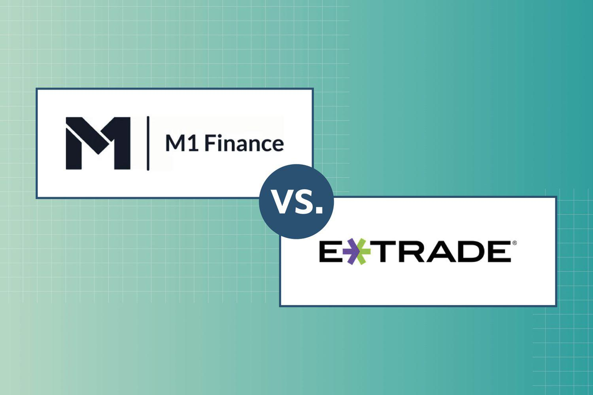

The landscape of automated investing is vast, with platforms offering innovative solutions tailored to diverse investor needs. Among these, M1 Finance and E*TRADE Core Portfolios are notable for their unique approaches to digital wealth management. Investors often face challenges when selecting the right platform, as each offers distinct investment strategies, features, and cost structures. This article aims to provide a comprehensive comparison of M1 Finance and E*TRADE Core Portfolios, with a specific focus on algorithmic trading capabilities and investment management tools. Throughout the discussion, we will examine various aspects such as account setup, platform functionalities, and fee structures, enabling you to make an informed choice. By the end of this comparison, you should have a better understanding of which platform aligns most closely with your investment goals.

## Table of Contents

## Overview of M1 Finance

M1 Finance, established in 2015, has quickly become a noteworthy player among robo-advisors due to its innovative investment model. The platform is distinguished by its 'Pie' investing framework, which allows investors to create portfolios tailored to their individual preferences. This framework facilitates customization by enabling users to choose from a wide selection of over 6,000 stocks and exchange-traded funds (ETFs). This level of personalization makes M1 Finance appealing to those who want more control over their investment allocations.

One of the significant advantages of M1 Finance is its cost-effectiveness. The platform does not charge advisory fees for its basic accounts, which is a compelling feature for investors looking to minimize fees and maximize returns. This fee-free structure ensures that users can invest without the typical costs associated with account management, offering a transparent and straightforward approach to investing.

Furthermore, M1 Finance provides an attractive option for those interested in leveraging their investment through its margin lending facility, known as M1 Borrow. This feature allows investors to borrow against their portfolio holdings at competitive interest rates, thus providing an additional layer of financial flexibility. It enables users to access [liquidity](/wiki/liquidity-risk-premium) without the need to liquidate their investments, which can be strategically advantageous.

For investors who appreciate a hands-on approach to portfolio management, M1 Finance offers tools and features that facilitate precision and control. The platform's emphasis on customization and its fee-free model cater to individuals who are both knowledgeable and proactive in managing their investments. This approach contrasts with more traditional robo-advisors, offering a blend of automation and self-direction.

## Overview of E*TRADE Core Portfolios

E*TRADE Core Portfolios is an integral part of the broader E*TRADE platform, renowned for its extensive array of investing tools and services. As a robo-advisor, E*TRADE Core Portfolios offers a structured and guided investment experience, primarily catering to investors who prefer automated management over manual handling of their portfolios. The platform employs investor questionnaires to accurately assess individual risk tolerance and financial objectives. Based on these assessments, it constructs diversified portfolios that are tailored to align with the investor's personal financial goals.

E*TRADE Core Portfolios charges an annual advisory fee of 0.3%. This fee is competitive within the robo-advisor market and provides investors with fully automated portfolio management services. These services include regular rebalancing to ensure that portfolios remain aligned with the initial strategic asset allocations and tax-loss harvesting, which can help optimize taxable accounts by minimizing tax liabilities.

In addition to these core services, E*TRADE Core Portfolios integrates socially responsible investing (SRI) options. This feature allows investors to incorporate their personal values into their investment decisions, thereby aligning their portfolios with ethical and social preferences. This is achieved by selecting investments that adhere to environmental, social, and governance ([ESG](/wiki/esg-investing)) principles.

The seamless integration of Core Portfolios with the wider E*TRADE platform significantly enhances its appeal. This integration grants users access to a comprehensive suite of financial products and services that the E*TRADE ecosystem offers, ranging from traditional brokerage services to advanced trading tools. Consequently, investors using E*TRADE Core Portfolios benefit not only from the robo-advisory services but also from the full breadth of E*TRADE's investment expertise and resources, making it a compelling choice for both new and seasoned investors seeking a holistic investment platform.

## Investment Strategies and Portfolio Management

M1 Finance empowers investors by providing a platform that allows for a high degree of customization in their portfolios. This customization is facilitated through a unique 'Pie' model, which enables investors to select from over 6,000 individual stocks and exchange-traded funds (ETFs). Each 'Pie' represents a collection of chosen securities, and investors can adjust the proportions of these securities to align with their specific investment objectives and risk tolerance. The platform supports dynamic rebalancing, a feature that helps maintain target allocations within each 'Pie' as market conditions fluctuate. Additionally, M1 Finance offers a tax minimization feature, optimizing sell orders to reduce potential tax impacts. However, it does not provide tax-loss harvesting, which could be a consideration for those looking to manage capital gains more actively.

On the other hand, E*TRADE Core Portfolios offers a more automated approach to investment management. Utilizing an algorithm, the platform creates and manages diversified portfolios that align with the investor's risk tolerance and financial goals. Rebalancing is automated and occurs when a portfolio's asset allocation drifts significantly from its target, ensuring the investment strategy remains on [course](/wiki/best-algorithmic-trading-courses). A key advantage of E*TRADE's approach is the inclusion of tax-loss harvesting, a technique that involves selling securities at a loss to offset taxable capital gains. This feature is particularly beneficial for investors with taxable accounts seeking to enhance after-tax returns.

The decision between M1 Finance and E*TRADE Core Portfolios largely hinges on an investor's preference for hands-on versus hands-off portfolio management. M1 Finance appeals to those with the desire and expertise to manage their investments actively, providing tools that allow granular control over portfolio composition. Conversely, E*TRADE Core Portfolios is suited to investors preferring an automated, guided investment experience, making it an attractive option for individuals seeking convenience and professionally managed portfolios. Ultimately, the choice depends on one's level of investment knowledge, time availability, and comfort with financial decision-making.

## Fees and Charges

M1 Finance distinguishes itself by offering a fee-free model for standard accounts, which can be particularly appealing to cost-conscious investors. However, there are some minor fees, such as charges for inactivity in smaller accounts, which potential users should consider. This approach provides a financially attractive option for those who prefer managing their portfolios without incurring advisory fees.

Conversely, E*TRADE Core Portfolios charges an annual advisory fee of 0.3%. This fee is deducted monthly, based on the account balance at the end of the previous month. This cost structure is commonplace among robo-advisors that provide comprehensive automated management services, and E*TRADE justifies this fee with its suite of features, including automatic rebalancing and tax-loss harvesting.

Both platforms include underlying [ETF](/wiki/etf-trading-strategies) expense ratios, which are in line with industry norms, ensuring that investors are not subject to unexpected costs. These ratios are standard across most managed platforms and are typically factored into the overall returns of the investment portfolios.

Investors should carefully weigh these costs against the features each platform offers. While M1 Finance's fee-free structure is more suitable for those who are comfortable with self-management and confident in their investing skills, E*TRADE's fees may be justified by its automated management offerings, which can be advantageous for investors seeking a more guided approach to portfolio management.

Ultimately, the decision between M1 Finance and E*TRADE Core Portfolios should be informed by an investor’s personal financial strategy and their preferred level of involvement in portfolio management. Each platform offers distinct benefits that cater to different investing styles and needs, allowing investors to choose the option that best aligns with their financial goals.

## Security and User Experience

Security is a top priority for both M1 Finance and E*TRADE Core Portfolios, ensuring that investors feel confident in managing their assets. M1 Finance employs military-grade encryption to safeguard user data, providing a robust level of protection against unauthorized access and cyber threats. This high level of encryption is essential for maintaining the confidentiality and integrity of financial information, reassuring users that their data is secure.

E*TRADE Core Portfolios also prioritizes security by utilizing robust measures such as multi-[factor](/wiki/factor-investing) authentication (MFA). MFA adds an additional layer of security by requiring users to provide two or more verification factors to access their accounts, significantly reducing the risk of unauthorized access. This ensures that even if a user's password is compromised, their account remains protected.

In terms of user experience, M1 Finance offers a streamlined and user-friendly interface designed to provide investors with a clear and concise view of their financial snapshots. The platform focuses on simplicity and ease of use, making it accessible for both novice and experienced investors. This intuitive design is evident in its mobile and desktop applications, which allow users to effortlessly navigate through their investments and make informed decisions.

E*TRADE Core Portfolios benefits from the extensive interface design expertise of the broader E*TRADE platform. Its desktop and mobile experience is highly user-friendly, offering a seamless integration of tools and services. This comprehensive approach allows investors to manage their portfolios efficiently, with easy access to a myriad of financial products and services. The mobile app is particularly robust, providing users with the flexibility to monitor and adjust their investments on the go.

Ultimately, the choice between M1 Finance and E*TRADE Core Portfolios may be influenced by personal preferences concerning interface design and the range of integrated tools offered by each platform. Both platforms excel in delivering a secure and efficient user experience, but the decision will hinge on which interface and set of features align more closely with the investor's needs and expectations.

## Customer Support

M1 Finance offers a range of support options, ensuring accessibility to its users through various channels. Investors can reach out via phone calls during specified business hours, providing direct human interaction for more complex inquiries. Email support is also available, allowing users to detail their issues or questions at any time, with responses typically provided within a standard business timeframe. Additionally, M1 Finance incorporates a modern approach by offering online chat support facilitated through an AI chatbot, providing quick responses for simpler queries and directing users to more detailed resources when necessary.

On the other hand, E*TRADE distinguishes itself with comprehensive 24/7 customer service, reflecting its integration into a larger financial ecosystem. This round-the-clock availability via phone ensures that investors can receive immediate assistance regardless of time zones or emergencies. Email and social media channels further extend E*TRADE's accessibility, demonstrating its commitment to maintaining an open line of communication with its users. This level of service can be particularly beneficial for investors who require instant resolutions to their issues or prefer constant access to support resources.

While the continuous availability of E*TRADE support offers distinct advantages, particularly for time-sensitive matters, M1 Finance's approach focuses on specialized guidance via a tailored client success team. This personalized support can be invaluable for users seeking customized advice and assistance beyond routine queries. Despite the strengths of both platforms, E*TRADE's extensive support network, backed by its substantial resources as part of a larger entity, generally provides broader customer service advantages.

## Conclusion

Both M1 Finance and E*TRADE Core Portfolios offer distinct advantages tailored to different investor profiles. M1 Finance appeals predominantly to experienced investors who desire an active role in managing their portfolios without the burden of advisory fees. This platform supports a highly personalized approach to investing, allowing users to construct and manage their investment "Pies" with precision and flexibility.

Conversely, E*TRADE Core Portfolios is designed to cater to newer investors or those who prefer a more hands-off approach. It provides robust automated portfolio management solutions, leveraging modern algorithms to align investments with individual risk tolerances and financial goals. The inclusion of tax-efficient strategies, such as tax-loss harvesting, further enhances its appeal to those prioritizing tax optimization in taxable accounts.

The decision between M1 Finance and E*TRADE Core Portfolios ultimately hinges on individual investment strategies, the level of engagement desired, and specific financial goals. While some investors may prize the autonomy and cost-effectiveness offered by M1 Finance, others may prioritize the guided experience and comprehensive investment management of E*TRADE Core Portfolios.

Both platforms uphold high-security standards and provide streamlined user experiences, ensuring that investors feel secure and in control of their financial decisions. Whether one leans towards hands-on management or values the convenience of automated solutions, both M1 Finance and E*TRADE Core Portfolios deliver environments conducive to achieving one's investment objectives.

## References & Further Reading

[1]: ["Advances in Financial Machine Learning"](https://www.amazon.com/Advances-Financial-Machine-Learning-Marcos/dp/1119482089) by Marcos Lopez de Prado

[2]: ["Evidence-Based Technical Analysis: Applying the Scientific Method and Statistical Inference to Trading Signals"](https://www.amazon.com/Evidence-Based-Technical-Analysis-Scientific-Statistical/dp/0470008741) by David Aronson

[3]: ["Machine Learning for Algorithmic Trading"](https://github.com/stefan-jansen/machine-learning-for-trading) by Stefan Jansen

[4]: ["Quantitative Trading: How to Build Your Own Algorithmic Trading Business"](https://www.amazon.com/Quantitative-Trading-Build-Algorithmic-Business/dp/1119800064) by Ernest P. Chan