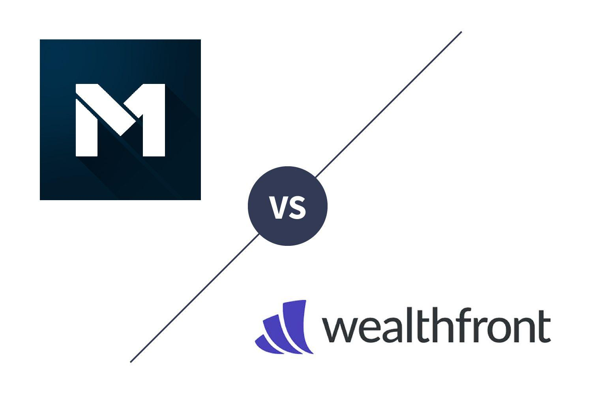

In the ever-evolving world of digital investing, platforms like M1 Finance and Wealthfront have carved niches for themselves by offering tailored investment services to meet the needs of modern investors. Both platforms provide innovative financial solutions, but they do so through distinct methodologies that cater to various investment styles and preferences. M1 Finance combines self-directed brokerage capabilities with automated portfolio management, allowing investors to customize their investment portfolios using a feature they call "Pies." These Pies are composed of stocks and exchange-traded funds (ETFs), giving users significant control over their investment strategies without incurring management fees. In contrast, Wealthfront positions itself as a comprehensive robo-advisor, emphasizing goal-based investing through expertly designed portfolios, including advanced features like tax optimization and automated financial planning tools.

As we explore these offerings, we will compare the features, fees, and investment strategies of M1 Finance and Wealthfront. A highlight of our discussion will be on the emerging trend of algorithmic trading and its benefits for modern investors. Algorithmic trading utilizes computer algorithms to execute trades rapidly and efficiently based on predetermined criteria, providing precision and potential cost savings. Both M1 Finance and Wealthfront have integrated elements of algorithmic strategies to enhance investment performance, although they do so with varying degrees of focus on automation versus investor customization.

Whether you're a seasoned investor looking for advanced tools or a novice seeking guidance, understanding the core propositions of each platform will help you determine which service aligns with your investment goals and preferences. This guide aims to equip you with the necessary information to navigate these options effectively.

## Table of Contents

## Overview of M1 Finance

M1 Finance distinguishes itself as a versatile investment platform by merging the attributes of a self-directed brokerage with those of a robo-advisor. This dual nature allows users to craft bespoke portfolios through an innovative system known as 'Pies.' Each Pie consists of slices representing stocks and exchange-traded funds (ETFs), thereby granting investors substantial flexibility and control over their investment compositions.

The platform offers a broad array of over 6,000 securities, making it an excellent choice for those interested in a Do-It-Yourself (DIY) investment approach combined with the ease of automated portfolio management. This is particularly appealing to investors who value both autonomy in their investment decisions and the convenience of automation.

Notably, M1 Finance operates with a fee-free structure, which differentiates it from many competitors. There are no management fees, which can significantly enhance the net returns for investors over time. Additionally, M1 Finance provides an optional M1 Plus membership, which offers enhanced features and perks, such as better borrowing rates and advanced cash management options.

Furthermore, M1 Finance is recognized for its competitive cash management services, which include options like checking accounts and debit cards with high-yield features. Its attractive borrowing rates contribute to its popularity among sophisticated investors who are looking for integrated solutions that encompass investment and personal finance needs.

Overall, M1 Finance serves as an exceptional platform for investors seeking a high degree of customization without incurring management fees, along with the added benefits that could be enhanced through its premium membership.

## Overview of Wealthfront

Wealthfront is recognized as a sophisticated robo-advisor that emphasizes goal-based investing through expertly crafted portfolios. This platform is designed to cater to passive investors, offering a hands-off investment experience enriched with advanced financial planning and management tools.

One of Wealthfront's key features is its daily tax-loss harvesting capability. This process involves selling investments at a loss to offset taxes on gains and income, which can enhance an investor's after-tax returns. Wealthfront automates this complex process, ensuring that users benefit from tax efficiencies without requiring meticulous attention to their investment portfolios.

The platform also integrates the Path financial planning tool, which provides users with a comprehensive view of their financial health and assists in planning for various life goals such as retirement, buying a home, or funding education. Path uses users' financial data to customize recommendations and projections, adjusting strategies based on individual circumstances and goals.

Wealthfront's investment offerings are notably diverse, including access to crypto funds, which caters to contemporary demands for digital asset inclusion. This diversification allows investors to manage a more balanced portfolio that aligns with modern market trends.

Additionally, Wealthfront seamlessly integrates with external financial accounts, providing users a holistic overview of their financial situation. This feature is instrumental for users seeking to consolidate their financial data and make informed decisions based on comprehensive insights.

The platform optimizes for ease and minimal intervention, making it ideal for individuals who prefer automatic financial management rather than engaging in day-to-day investment decision-making. Wealthfront's structure and tools offer passive investors a robust, goal-oriented approach to building and managing wealth.

## Comparing Features and Costs

M1 Finance and Wealthfront are two leading digital investment platforms that cater to distinct investor needs, primarily differing in their fee structures and feature sets. M1 Finance distinguishes itself with a fee-free model, allowing users to manage their investments without the burden of management fees. However, it offers an optional M1 Plus membership that introduces enhanced features and benefits, such as lower borrowing rates and superior cash management, for a subscription fee.

Wealthfront, conversely, implements a straightforward flat management fee of 0.25% of assets under management. This fee covers the platform's comprehensive services, which include robust tax-optimization strategies. Wealthfront's tax-loss harvesting feature stands out as a significant value addition that can potentially mitigate overall investment costs by strategically leveraging tax benefits.

In terms of features, M1 Finance offers extensive customization options through its unique "Pie" investment model. This approach empowers investors to create highly personalized portfolios by selecting from a wide array of stocks and ETFs. This flexibility appeals particularly to DIY investors who prioritize control and customization in their investment strategy.

Wealthfront's platform is tailored for those who prefer a more hands-off approach, with extensive financial planning tools that support goal-based investing. Its seamless integration with external financial accounts provides users with a comprehensive view of their financial well-being. Wealthfront's focus on automation and planning tools is designed to cater to passive investors seeking effortless portfolio management and strategic financial planning without frequent manual intervention.

Both M1 Finance and Wealthfront ensure a seamless user experience through comprehensive security measures and top-rated mobile applications. These apps facilitate easy account management, ensuring that investors can engage with their portfolios efficiently and securely, directly from their mobile devices.

## Algorithmic Trading: A Growing Trend

Algorithmic trading, characterized by the deployment of computer algorithms to facilitate trades based on predetermined criteria, has gained considerable traction within digital investment platforms. This trend capitalizes on the advanced computational capabilities to enhance trading precision and responsiveness to market fluctuations. By automating the trading process, algorithmic systems allow for rapid responses to ever-changing market conditions, enabling investors to seize advantageous opportunities promptly.

**Wealthfront's Integration of Algorithmic Trading Elements**

Wealthfront exemplifies the application of [algorithmic trading](/wiki/algorithmic-trading) with its tax-loss harvesting and automatic rebalancing features. These functions are designed to optimize portfolio performance by executing trades that minimize tax liabilities and maintain desired asset allocation. Tax-loss harvesting is a strategy where losing investments are sold to offset gains in other areas, reducing taxable income. Wealthfront's algorithmic approach systematically identifies such opportunities on a daily basis, a task that would be onerous to perform manually with the same efficiency.

**M1 Finance and Expert Pies**

While M1 Finance is not a traditional robo-advisor, its "Expert Pies" represent an algorithmic trading strategy. These pre-built portfolios consist of investments curated to follow specific market strategies or themes, streamlining the decision-making process for investors. Each "Pie" functions as a mini-portfolio, automatically balanced according to the investment thesis it was designed around. Although the level of automation is not as sophisticated as pure algorithmic trading platforms, M1 Finance's approach allows for a certain degree of strategic automation without relinquishing control.

**Enhancing Portfolio Performance Through Algorithms**

For investors interested in maximizing the benefits of algorithmic trading, understanding and effectively employing these systems can significantly impact portfolio outcomes. The precise and timely execution of trades enabled by algorithms ensures that investment strategies are executed without delay or human error. Additionally, the scalability of these systems allows them to handle large volumes of trades, maintaining efficiency regardless of market size or complexity.

By integrating automated strategies such as tax-loss harvesting, auto-rebalancing, and strategic portfolio allocations like those offered by Wealthfront's and M1 Finance's platforms, investors can optimize their portfolios with minimal manual intervention. These tools democratize sophisticated trading strategies, making them accessible to a broader audience and transforming the landscape of digital investment.

## Who Should Use M1 Finance?

M1 Finance is tailored for sophisticated investors who prioritize a hands-on approach to portfolio management while still appreciating the benefits of automation. This platform is particularly attractive to those who wish to construct their own investment strategies and value the independence of fee-free management. M1 Finance's innovative model, which combines self-directed brokerage with automated features, provides users with the unique opportunity to manage their investments without incurring management fees, a crucial [factor](/wiki/factor-investing) for cost-conscious investors.

For users seeking additional capabilities, M1 Plus offers enhanced cash management options and portfolio management tools. M1 Plus membership can include benefits such as lower interest rates on borrowing and higher yields on cash balances, making it attractive for those looking to optimize their financial strategies further.

The platform’s flexibility makes it ideal for investors interested in individual stock selection and custom [ETF](/wiki/etf-trading-strategies) investments. Through M1’s 'Pie' system, investors can design highly personalized portfolios by selecting specific stocks and ETFs from a broad array of available options. This level of customization is appealing for those who prefer to tailor their portfolios according to specific investment themes or market outlooks.

Overall, M1 Finance caters to investors who enjoy engaging with their investments actively and seek sophisticated tools that empower them to craft precise investment strategies. By offering a blend of autonomy and automation, M1 Finance stands out as a versatile option for those who value control and cost-effectiveness in their investment ventures.

## Who Should Use Wealthfront?

Wealthfront is particularly suited for passive investors who seek automated, comprehensive investment management. The platform's primary appeal lies in its emphasis on tax-advantaged strategies and innovative financial planning tools. These features collectively support a goal-based approach to investment tracking, allowing investors to align their portfolios with long-term financial objectives with minimal intervention.

One of the standout characteristics of Wealthfront is its seamless integration of various financial accounts. This integration facilitates a holistic view of one's financial health, enabling users to evaluate their entire financial situation at a glance. The convenience of having a singular platform to monitor multiple accounts reduces the complexity often associated with managing diverse investments, making Wealthfront an attractive option for both novice investors and those who prefer a hands-off approach. 

For individuals who appreciate a well-managed, low-maintenance portfolio, Wealthfront's automated service offerings provide peace of mind. The platform leverages advanced algorithms for tasks such as rebalancing portfolios and optimizing tax efficiency through strategies like tax-loss harvesting. This level of automation is particularly beneficial for investors who do not wish to constantly monitor and adjust their investment portfolios. By handling these critical functions, Wealthfront ensures that investment strategies remain aligned with user-defined financial goals, thereby allowing investors to focus on other important aspects of life.

Overall, Wealthfront is ideally positioned for those looking to combine ease of use with sophisticated financial planning and management capabilities. Its focus on automation and integration promotes a simplified investment experience, making it a compelling choice for passive investors.

## Conclusion

Choosing between M1 Finance and Wealthfront largely hinges on individual investment styles and the value placed on customization versus automation. M1 Finance stands out for its exceptional customization options tailored for DIY investors. It offers the flexibility to build personalized investment portfolios with features that allow for self-directed management without the encumbrance of management fees. This makes it particularly suitable for investors who relish having direct oversight of their investments and who enjoy crafting detailed financial strategies.

On the other hand, Wealthfront is renowned for its robust financial planning tools and sophisticated tax-loss harvesting capabilities. These features are designed to meet the needs of passive investors seeking a hands-off approach to investment management. Wealthfront excels in offering expertly crafted portfolios and financial planning that aims to maximize returns while minimizing tax liabilities, providing a seamless investment experience.

Both platforms stand out in terms of security and user experience, underscoring their commitments to providing reliable digital investment solutions. This is vital in ensuring that investors’ assets and data are safeguarded against potential threats, allowing for peace of mind while investing digitally.

To make an informed decision between the two, it's essential to evaluate personal financial goals, desired levels of involvement in investment management, and the specific features offered by each platform. For those who prefer hands-on portfolio customization, M1 Finance may be the better fit. Conversely, for those who value comprehensive, algorithm-driven investment management and tax efficiency, Wealthfront could be more advantageous.

As digital investment services continue to progress, staying well-informed about platforms like M1 Finance and Wealthfront can significantly contribute to more effective and tailored investing strategies. The choice should ultimately align with individual financial objectives and the degree of control desired over one's investments.

## References & Further Reading

[1]: Jansen, S. (2020). ["Machine Learning for Algorithmic Trading."](https://github.com/stefan-jansen/machine-learning-for-trading) Packt Publishing.

[2]: Lopez de Prado, M. (2018). ["Advances in Financial Machine Learning."](https://www.amazon.com/Advances-Financial-Machine-Learning-Marcos/dp/1119482089) Wiley.

[3]: Aronson, D. R. (2006). ["Evidence-Based Technical Analysis: Applying the Scientific Method and Statistical Inference to Trading Signals."](https://www.amazon.com/Evidence-Based-Technical-Analysis-Scientific-Statistical/dp/0470008741) Wiley.

[4]: Chan, E. P. (2013). ["Quantitative Trading: How to Build Your Own Algorithmic Trading Business."](https://github.com/ftvision/quant_trading_echan_book) Wiley.

[5]: Bergstra, J., Bardenet, R., Bengio, Y., & Kégl, B. (2011). ["Algorithms for Hyper-Parameter Optimization."](https://dl.acm.org/doi/10.5555/2986459.2986743) Advances in Neural Information Processing Systems 24.