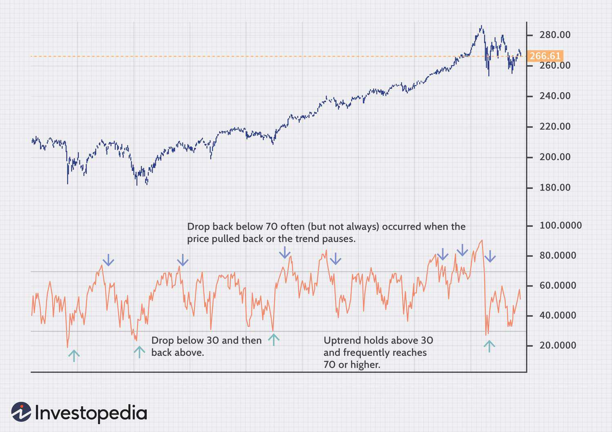

In algorithmic trading, the Moving Average Convergence Divergence (MACD) and the Relative Strength Index (RSI) are pivotal momentum indicators. Traders utilize these tools extensively to pinpoint trends, evaluate market momentum, and form informed trading decisions. The MACD, developed by Gerald Appel in the late 1970s, captures the momentum of a security by measuring the difference between two exponential moving averages (EMAs). In contrast, the RSI, introduced by J. Welles Wilder, Jr. in 1978, assesses the speed and change of price movements by oscillating between 0 and 100 to identify overbought or oversold conditions.

The advantage of comprehending the mechanics and applications of these indicators lies in their capacity to offer insights into market dynamics. While MACD excels in identifying the trend direction and spotting potential reversals, RSI provides critical information about the momentum and the current strength or weakness of a price movement. These functionalities allow traders not only to track prevailing trends but also to anticipate potential reversals, thereby navigating the complexities of financial markets more effectively.



Combining MACD and RSI can lead to a more nuanced understanding of the trading environment. By understanding the nuances of these indicators and their complementary nature, traders can enhance their market strategies. This knowledge enables them to leverage MACD and RSI to identify optimal entry and exit points, manage risk more efficiently, and ultimately make more strategic decisions. This article explores the intricacies and uses of MACD and RSI in algorithmic trading, equipping traders with the groundwork required to excel in this domain.

## Table of Contents

## Understanding MACD

The Moving Average Convergence Divergence (MACD) is a popular momentum indicator used in trading to identify trends and potential buy or sell signals. It calculates the difference between two exponential moving averages (EMAs), which are typically set at 12-period and 26-period intervals. This difference forms the primary MACD line. The basic formula for the MACD line can be given as:

$$
\text{MACD Line} = \text{EMA}_{12} - \text{EMA}_{26}
$$

A signal line is then created by taking the 9-period EMA of the MACD line itself. This 9-period EMA acts as a trigger for buy or sell decisions. When the MACD line crosses above the signal line, it generates a buy signal or a bullish crossover, indicating that the asset might experience upward momentum. Conversely, when the MACD line crosses below the signal line, it produces a sell signal or a bearish crossover, suggesting potential downward momentum.

In addition to the MACD line and signal line, the MACD histogram is an important component, as it graphically represents the difference between the MACD line and the signal line. This histogram helps visualize the [momentum](/wiki/momentum) strength, where larger histogram bars indicate increased momentum.

The MACD is favored by traders for its ability to provide clear insight into the strength and direction of market trends, making it a cornerstone of technical analysis in [algorithmic trading](/wiki/algorithmic-trading) strategies.

## Understanding RSI

The Relative Strength Index (RSI) is a momentum oscillator that evaluates the speed and change of price movements, providing an index value that ranges from 0 to 100. This indicator is widely employed by traders to identify overbought or oversold conditions in a market. Typically, an RSI value above 70 suggests that the asset may be overbought, signaling potential for a price correction or pullback. Conversely, an RSI below 30 indicates that the asset might be oversold, suggesting a possible price bounce or reversal.

The RSI calculation is based on the average gain and average loss over a defined period, generally 14 trading days. The calculation formula for RSI is:

$$

\text{RSI} = 100 - \left( \frac{100}{1 + RS} \right) 
$$

where $RS$ is the relative strength, computed as the average of 'n' days' up closes divided by the average of 'n' days' down closes. This formula reflects the ratio of upward price movements to downward price movements over the set period.

Traders often use RSI to identify potential reversal points within a trend, providing insights into the current momentum's strength. For instance, an RSI declining from above 70 can suggest weakening momentum and a reversal potential, whereas an RSI rising from below 30 can indicate strengthening momentum and an upcoming upward trend.

By integrating RSI into their trading strategies, traders aim to optimize entry and [exit](/wiki/exit-strategy) points while assessing the current trend's vigor. This assists in making more informed decisions, particularly in volatile or uncertain market conditions.

## Comparing MACD and RSI

Both the Moving Average Convergence Divergence (MACD) and the Relative Strength Index (RSI) serve as pivotal tools in measuring market momentum, yet they employ distinct methodologies to do so.

The MACD is primarily centered on the relationship between two exponential moving averages (EMAs), typically a 12-period and a 26-period. By calculating the differential between these moving averages, the MACD identifies the general direction of a trend. A positive MACD indicates a bullish trend, as the short-term EMA is above the long-term EMA, whereas a negative MACD suggests a bearish trend. This focus on the convergence or divergence of moving averages makes the MACD particularly advantageous in recognizing trending markets.

In contrast, the RSI operates by evaluating the speed and change of recent price movements over a specified timeframe, traditionally set to 14 periods. RSI values oscillate between 0 and 100, with readings above 70 usually signifying overbought conditions and readings below 30 indicating oversold conditions. Unlike the MACD, which is trend-oriented, the RSI is adept at signaling potential reversals and is particularly useful during periods of market consolidation when prices fluctuate within a narrow range. This characteristic allows RSI to identify points at which a trend may be losing momentum even if a definitive direction is not yet established.

An effective trading strategy often incorporates both indicators to harness their complementary strengths. While MACD can effectively confirm the direction and strength of a trend, RSI can provide early warning signals for potential reversals. Traders frequently employ both MACD and RSI together to gain a comprehensive understanding of market dynamics, thereby enhancing their trading decisions. By using MACD to validate trend direction and RSI to find optimal entry and exit points, traders can mitigate the risk of false signals and improve strategic outcomes.

## Using MACD and RSI Together

Combining the Moving Average Convergence Divergence (MACD) and the Relative Strength Index (RSI) can enhance trading decisions by providing a dual perspective on trend confirmation and momentum oscillation. This strategy leverages the strengths of each indicator, creating a robust system for identifying trading opportunities.

A common approach is to use the MACD to establish the direction and strength of a trend. The MACD line crossing above its signal line suggests a bullish trend, whereas a crossover below indicates a bearish trend. Once a trend is identified, the RSI can be used to pinpoint timing for market entry or exit. For instance, in an uptrend confirmed by MACD, if the RSI indicates an asset is overbought, traders might consider holding off on buying until it reverts to a more neutral level. Conversely, in a downtrend, an oversold RSI reading might signal a potential entry point for shorting or buying on a pullback.

The synergy between MACD and RSI helps mitigate the risk of false signals, particularly in volatile markets. While MACD is effective in identifying the long-term trend, RSI is suitable for detecting short-term overbought or oversold conditions. This dual confirmation can be especially beneficial in choppy markets where price movements lack clear direction.

For algorithmic traders, implementing this combined approach can be achieved through programming. Below is a simple Python script example using the TA-Lib library to identify potential trade signals based on both MACD and RSI:

```python
import talib
import numpy as np

# Sample price data
prices = np.array([your_price_data])

# Calculate MACD and RSI
macd, signal, _ = talib.MACD(prices, fastperiod=12, slowperiod=26, signalperiod=9)
rsi = talib.RSI(prices, timeperiod=14)

# Trading strategy
for i in range(len(prices)):
    if macd[i] > signal[i] and rsi[i] < 30:
        print(f"Consider buying at index {i}")
    elif macd[i] < signal[i] and rsi[i] > 70:
        print(f"Consider selling at index {i}")
```

It's important for traders to regularly optimize their algorithms and backtest on historical data to ensure their approaches remain effective under current market conditions. By leveraging both MACD and RSI, traders not only broaden their market analysis but also increase the reliability of their trading signals.

## Case Studies and Backtesting

Implementing a strategy using the Moving Average Convergence Divergence (MACD) and Relative Strength Index (RSI) indicators demands empirical validation through [backtesting](/wiki/backtesting). Backtesting involves evaluating a trading strategy’s potential by testing it on historical market data. This method helps determine the strategy’s potential effectiveness and uncovers potential issues before deploying it in live trading environments.

To backtest a strategy utilizing MACD and RSI, traders often follow a structured process. They start by defining the trading rules that incorporate signals from both indicators. For instance, a strategy might dictate entering a buy position when the MACD line crosses above the signal line and the RSI is below a certain threshold, such as 30, indicating an oversold condition. Conversely, a sell signal could be generated when the MACD line crosses below the signal line and the RSI is above 70, signifying an overbought market condition.

Once the rules are established, traders use historical price data to simulate the strategy. This involves calculating the MACD and RSI values for each time step within the dataset and applying the defined trading rules to generate simulated trades. Key performance metrics, such as the total return, maximum drawdown, and win-loss ratio, are then computed to assess the strategy’s effectiveness.

Python offers various tools and libraries for backtesting trading strategies, particularly for MACD and RSI. Libraries like `pandas` are used for data manipulation, while `numpy` assists with numerical calculations. The `talib` library can calculate technical indicators like MACD and RSI. Here is a basic example of how a backtest might be implemented in Python:

```python
import pandas as pd
import talib
import numpy as np

# Load historical data
data = pd.read_csv('historical_data.csv')
close_prices = data['Close']

# Calculate MACD and RSI
macd, macd_signal, macd_hist = talib.MACD(close_prices, fastperiod=12, slowperiod=26, signalperiod=9)
rsi = talib.RSI(close_prices, timeperiod=14)

# Define trading signals
buy_signal = (macd > macd_signal) & (rsi < 30)
sell_signal = (macd < macd_signal) & (rsi > 70)

# Initialize strategy results
initial_balance = 10000  # arbitrary starting balance
position = 0
balance = initial_balance

# Backtesting loop
for i in range(1, len(data)):
    if buy_signal[i] and position == 0:
        # Buy action
        position = balance / close_prices[i]
        balance = 0
    elif sell_signal[i] and position > 0:
        # Sell action
        balance = position * close_prices[i]
        position = 0

# Calculate strategy performance
final_balance = balance + position * close_prices[-1]
total_return = (final_balance - initial_balance) / initial_balance * 100
print(f'Total Return: {total_return:.2f}%')
```

A successful case study of MACD and RSI implementation can be found in volatile markets like cryptocurrencies, where rapid price changes provide numerous trading opportunities. Backtesting on historical data from the Bitcoin market over several years, for instance, may reveal that a combined MACD and RSI strategy could outperform strategies utilizing singular indicators by offering higher returns and reduced drawdowns due to its dual-layered confirmation method.

However, it is crucial to remember that past performance does not guarantee future results. Market conditions evolve, and strategies must be regularly evaluated and adjusted. Employing robust risk management techniques, such as stop-loss orders, can mitigate potential losses. Traders must remain vigilant, adapting their strategies based on ongoing performance assessment.

## Challenges and Considerations

Moving Average Convergence Divergence (MACD) and Relative Strength Index (RSI) are widely used tools in trading, yet they possess limitations that traders must consider. These indicators, although powerful, can sometimes give false signals, particularly during certain market conditions or when employed without comprehensive strategies.

One primary challenge stems from erratic or range-bound market conditions. In such environments, the indicators may generate misleading signals. For instance, MACD might suggest trend continuation, while RSI indicates overbought or oversold situations without a clear direction. This potential discordance highlights the need for traders to be cautious and recognize that relying solely on these indicators during erratic markets might lead to suboptimal trading decisions.

To counteract the risks associated with false signals, it is advisable for traders to integrate risk management strategies into their trading approaches. Utilizing stop losses and position sizing can mitigate potential losses. Additionally, combining MACD and RSI with other technical indicators can enhance accuracy. For example, incorporating trend confirmation tools like Bollinger Bands or Volume analysis can provide additional context, improving the reliability of signals derived from MACD and RSI.

Adapting MACD and RSI settings to suit specific market conditions and personal trading preferences is crucial. For MACD, traders might adjust the periods used for the EMAs based on current market [volatility](/wiki/volatility-trading-strategies). Similarly, modifying the RSI period can help fine-tune the indicator sensitivity to suit the trader's strategy. Such customization requires ongoing evaluation and optimization to ensure alignment with market dynamics.

Considering these challenges and adaptative measures, traders can better harness the potential of MACD and RSI while minimizing the likelihood of being misled by inaccurate signals.

## Technical Tips for Implementation

To effectively utilize the Moving Average Convergence Divergence (MACD) and Relative Strength Index (RSI) in algorithmic trading, it is essential to employ reliable algorithmic trading platforms. These platforms should support the integration of technical indicators like MACD and RSI, allowing for seamless execution of trading strategies.

A crucial aspect of maintaining the efficiency of algorithmic strategies is the regular evaluation and optimization of algorithm parameters. Market conditions are dynamic, and trading strategies must adapt to these fluctuations to stay relevant. Traders should consider implementing a systematic approach to parameter optimization, using techniques such as grid search or genetic algorithms to fine-tune settings. These methods help in finding the optimal parameters that maximize the performance of the trading strategy based on historical data.

Incorporating other technical analysis tools can enhance the robustness of trading strategies involving MACD and RSI. For instance, integrating moving averages can provide additional insights into trend directions, while Fibonacci retracements can assist in identifying potential support and resistance levels. By combining these tools, traders can enhance the validation of their strategies and increase the likelihood of success. Below is a simple example of how one might implement a basic MACD and RSI strategy in Python, using popular libraries such as `pandas` and `TA-Lib`:

```python
import talib
import pandas as pd

# Load historical data into a pandas DataFrame (e.g., date, open, high, low, close, volume)
data = pd.read_csv('historical_data.csv')

# Calculate MACD
macd, macdsignal, macdhist = talib.MACD(data['close'], fastperiod=12, slowperiod=26, signalperiod=9)

# Calculate RSI
rsi = talib.RSI(data['close'], timeperiod=14)

# Generate trading signals
buy_signals = (macd > macdsignal) & (rsi < 30)  # Example condition for a buy signal
sell_signals = (macd < macdsignal) & (rsi > 70) # Example condition for a sell signal

# Add signals to the DataFrame
data['Buy_Signal'] = buy_signals
data['Sell_Signal'] = sell_signals

# View the results
print(data[['date', 'Buy_Signal', 'Sell_Signal']])
```

By following these technical tips and ensuring a keen eye on ongoing optimization, algorithmic traders can effectively harness the potential of MACD and RSI, maintaining a strategic edge in financial markets.

## Conclusion

The combination of the Moving Average Convergence Divergence (MACD) and the Relative Strength Index (RSI) provides traders with profound insights into the dynamics of trend and momentum in financial markets. By jointly employing these indicators, traders are better equipped to interpret market signals and to make informed trading decisions. While no single indicator offers a fail-proof strategy, the synergistic use of MACD and RSI can significantly enhance a trader's ability to identify viable entry and exit points. This advantage stems from the complementary nature of these tools, where the MACD helps to ascertain trend direction and the RSI signals potential overbought or oversold conditions.

To leverage this combination effectively, traders must engage in thorough backtesting, using historical data to evaluate the performance of their strategies. This process enables the identification of the optimal settings for each indicator, tailored to specific market conditions and individual trading styles. Modern trading platforms often facilitate such testing, supporting algorithmic integration of these indicators, which can be further refined using programming languages like Python. Regular evaluations and adjustments to the strategy are indispensable, allowing for adaptation to evolving market dynamics.

In summary, while the MACD and RSI are powerful tools in the trader’s arsenal, success largely depends on their strategic implementation. Continuous monitoring, empirical validation through backtesting, and adaptability to the market’s ever-changing nature constitute the pillars of a robust trading strategy that harnesses the full potential of these momentum indicators.

## References & Further Reading

[1]: Appel, G. (2005). ["Technical Analysis: Power Tools for Active Investors."](https://www.amazon.com/Technical-Analysis-Power-Active-Investors/dp/0132930048) Financial Times Press.

[2]: Wilder, J. W. (1978). ["New Concepts in Technical Trading Systems."](https://archive.org/details/newconceptsintec00wild) Trend Research.

[3]: Murphy, J. J. (1999). ["Technical Analysis of the Financial Markets."](https://archive.org/details/technicalanalysi0000murp) New York Institute of Finance.

[4]: Elder, A. (2002). ["Come Into My Trading Room: A Complete Guide to Trading."](https://www.amazon.com/Come-Into-My-Trading-Room/dp/0471225347) Wiley.

[5]: Kirkpatrick, C. D., & Dahlquist, J. R. (2010). ["Technical Analysis: The Complete Resource for Financial Market Technicians."](https://ptgmedia.pearsoncmg.com/images/9780134137049/samplepages/9780134137049.pdf) FT Press.