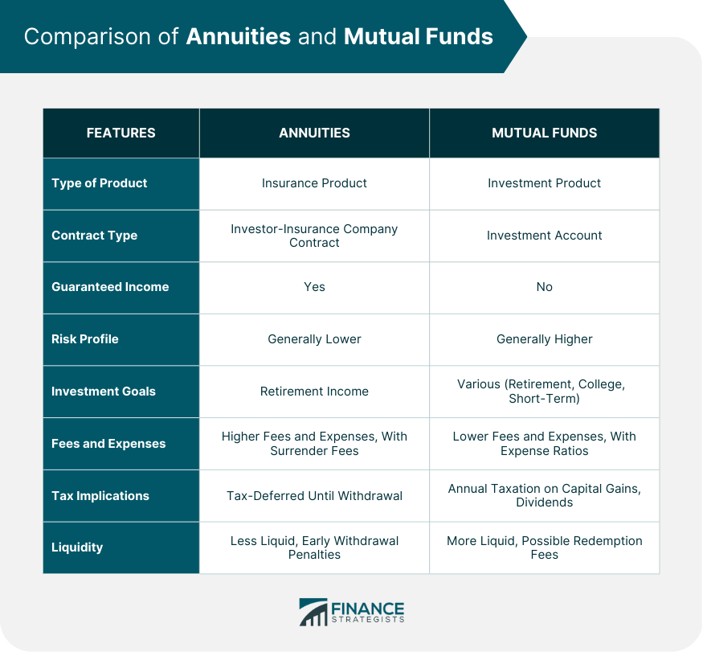

## Table of Contents

## What are managed payout funds?

Managed payout funds are a type of investment where you get regular payments from your investment. They are designed to give you a steady income, which can be helpful if you are retired or need money regularly. The fund managers take care of your investment and decide how to give you the payments, which can be monthly, quarterly, or yearly.

These funds work by taking money from the fund's assets to make the payments. The payments can come from the earnings of the investments, like interest or dividends, or they might also come from the principal, which is the original amount you invested. This means that over time, the value of your investment might go down if more money is taken out than what the investments earn. It's important to understand this before investing in a managed payout fund.

## What are annuities?

Annuities are financial products that you buy from an insurance company. They are designed to give you a steady stream of income, usually during your retirement. You pay a lump sum or make regular payments to the insurance company, and in return, they promise to pay you a certain amount of money either right away or starting at a future date. This can help you feel more secure because you know you'll have money coming in regularly.

There are different types of annuities, like fixed, variable, and indexed annuities. A fixed annuity gives you a guaranteed payment, which is good if you want to know exactly how much you'll get. A variable annuity lets you invest in different funds, so your payments can go up or down based on how those investments do. An indexed annuity is linked to a market index, like the S&P 500, and your payments can change based on how that index performs. Each type has its own pros and cons, so it's important to choose the one that fits your needs and comfort with risk.

## How do managed payout funds work?

Managed payout funds are a type of investment where you get regular payments from your money. These funds are managed by professionals who decide how to invest your money and how much to pay you. You can get payments monthly, quarterly, or yearly, which can be helpful if you need a steady income, like during retirement. The payments come from the fund's earnings, like interest or dividends, and sometimes from the principal, which is the original amount you invested.

When you invest in a managed payout fund, the fund manager takes care of everything. They choose the investments and manage them to make sure there's enough money to keep making the payments. But because the payments can sometimes come from the principal, the value of your investment might go down over time. This means you need to be careful and understand how the fund works before you invest. It's a good idea to talk to a financial advisor to see if a managed payout fund is right for you.

## How do annuities work?

Annuities are like a deal you make with an insurance company. You give them money, either all at once or over time, and they promise to give you money back regularly. This can start right away or later, like when you retire. It's a way to make sure you have a steady income when you're not working anymore. You can choose different types of annuities depending on what you need. A fixed annuity gives you the same amount of money every time, which is good if you want to know exactly what you'll get. A variable annuity lets you invest in different things, so your payments might change based on how those investments do. An indexed annuity is tied to a market index, like the S&P 500, and your payments can go up or down depending on how that index performs.

When you buy an annuity, you need to think about how long you want to get payments and what happens if you die before or after you start getting them. Some annuities pay you for the rest of your life, no matter how long you live. Others might pay for a certain number of years, and if you die before that, your family might get the rest. You also need to know that annuities can be complicated and have fees, so it's smart to read everything carefully and maybe talk to a financial advisor. They can help you figure out if an annuity is a good choice for you and which type might work best.

## What are the key differences between managed payout funds and annuities?

Managed payout funds and annuities are both ways to get regular money, but they work differently. Managed payout funds are investments where a professional manages your money and gives you payments from the earnings or even the original amount you invested. These payments can be monthly, quarterly, or yearly. The value of your investment might go down if they take more money out than what the investments earn. This type of fund is good if you want someone else to manage your money and you're okay with the value possibly going down over time.

Annuities, on the other hand, are contracts with an insurance company. You give them money, and they promise to give you payments for a certain time or the rest of your life. There are different types of annuities like fixed, variable, and indexed, each with its own way of figuring out payments. Fixed annuities give you the same amount every time, which is good if you want to know exactly what you'll get. Variable annuities let you invest in different funds, so your payments can change. Indexed annuities are tied to a market index, and your payments can go up or down based on that index. Annuities are good if you want a guaranteed income and are willing to deal with the fees and complexity that come with them.

In summary, managed payout funds are managed investments that might decrease in value over time, while annuities are insurance products that offer a more predictable income but come with their own set of fees and rules. Choosing between them depends on what you need and how comfortable you are with the risks involved.

## What are the investment risks associated with managed payout funds?

Managed payout funds come with several risks that you should know about. One big risk is that the payments you get might come from the money you originally invested, not just from the earnings. This means the value of your investment can go down over time. If the fund keeps taking more money out than it earns, your investment might get smaller and smaller. This can be a problem if you need the money to last for a long time.

Another risk is that the investments in the fund might not do well. The fund manager picks the investments, but they can't always pick winners. If the investments lose money, it could affect how much you get paid. Also, if you need to take money out of the fund early, you might have to pay fees or penalties, which can make your investment worth even less. It's important to think about these risks and maybe talk to a financial advisor before you decide to invest in a managed payout fund.

## What are the investment risks associated with annuities?

Annuities come with some risks that you need to know about. One big risk is that the insurance company might not be able to pay you. If the company goes bankrupt, your money could be in trouble. Another risk is that the payments might not keep up with inflation. If the money you get stays the same but everything else gets more expensive, your money won't go as far over time. Also, if you pick a variable annuity, the payments can go up or down based on how the investments do. If the investments do badly, you might get less money than you expected.

Another risk is that annuities can be hard to understand and can have a lot of fees. There are fees for managing the money, fees for taking money out early, and other charges that can eat into your returns. If you need your money back before the payments start, you might have to pay a big penalty. Also, if you die before you get all your money back, your family might not get anything unless you added a special feature to the annuity. It's important to read everything carefully and maybe talk to a financial advisor to understand all the risks before you buy an annuity.

## How do fees and expenses compare between managed payout funds and annuities?

Managed payout funds and annuities both have fees and expenses, but they can be different. For managed payout funds, you might have to pay a fee to the fund manager for managing your money. There could also be other costs like fees for buying or selling investments within the fund. If you need to take money out of the fund early, there might be a penalty fee. These fees can make the value of your investment go down over time, so it's good to know what they are before you invest.

Annuities also have fees, but they can be more complicated. You might have to pay a fee to the insurance company for managing the annuity. There are also fees for things like taking money out early or changing your investment choices if you have a variable annuity. Some annuities have high fees that can eat into your returns, so it's important to read everything carefully. Both managed payout funds and annuities have their own set of fees, and understanding them can help you decide which one is better for you.

## What are the tax implications of investing in managed payout funds versus annuities?

When you invest in managed payout funds, the tax rules can be a bit tricky. The money you get from these funds might be taxed as regular income, depending on what the fund earns. If the payments come from interest, dividends, or capital gains, you might have to pay different kinds of taxes on them. Also, if you take money out of the fund early, you might have to pay a penalty on top of the taxes. It's a good idea to talk to a tax advisor to understand how your managed payout fund will be taxed.

Annuities have their own tax rules. When you put money into an annuity, you usually don't pay taxes on it right away. The money grows without being taxed until you start getting payments. When you get payments, the part that comes from your original investment isn't taxed, but the part that comes from earnings is taxed as regular income. If you take money out of an annuity before you're 59½ years old, you might have to pay a penalty. Talking to a tax advisor can help you figure out the best way to handle the taxes on your annuity.

## How do managed payout funds and annuities cater to different retirement planning strategies?

Managed payout funds can be a good choice if you want someone else to manage your money and give you regular payments. These funds are run by professionals who decide how to invest your money and how much to pay you. You can get payments monthly, quarterly, or yearly, which can help you plan your retirement spending. But remember, the payments might come from the money you originally invested, not just from the earnings. This means the value of your investment could go down over time. If you're okay with this risk and want a simple way to get money regularly, a managed payout fund might work for you.

Annuities are another way to plan for retirement, and they work differently. When you buy an annuity, you're making a deal with an insurance company. You give them money, and they promise to pay you back regularly, either right away or when you retire. This can give you peace of mind because you know you'll have money coming in. There are different types of annuities, like fixed, variable, and indexed, so you can pick the one that fits your needs. Fixed annuities give you the same amount every time, which is good if you want a steady income. Variable and indexed annuities can change based on how investments do, so they might be better if you're okay with some risk. Annuities can be more complicated and have fees, but they can be a good choice if you want a guaranteed income in retirement.

## What are the historical performance comparisons between managed payout funds and annuities?

When we look at how managed payout funds and annuities have done over time, it's important to remember that each one is different. Managed payout funds have shown a range of performance based on how the investments inside them do. If the fund's investments do well, you might get more money, but if they do badly, your payments could be less, and the value of your investment might go down. Over the years, managed payout funds have had ups and downs, just like any other investment. The key thing to remember is that the money you get might come from the earnings or even the money you originally put in, so the value of your investment can change a lot.

Annuities, on the other hand, have a more predictable performance, especially if you choose a fixed annuity. These give you the same amount of money every time, so you know what to expect. Over time, fixed annuities have been a safe choice for people who want a steady income without worrying about the market going up and down. Variable and indexed annuities can change based on how their investments do, so they might have more ups and downs. But even with these, the insurance company promises to pay you something, which can make them a bit safer than managed payout funds. When you're thinking about which one to choose, it's good to look at how they've done in the past and think about what you need for your retirement.

## How can one evaluate the suitability of managed payout funds versus annuities based on their financial goals and risk tolerance?

When you're thinking about whether managed payout funds or annuities are right for you, it's important to look at your financial goals and how much risk you're okay with. If you want a simple way to get money regularly and don't mind if the value of your investment goes down over time, a managed payout fund might be a good choice. These funds are run by professionals who pick the investments and decide how much to pay you. But because the payments might come from the money you originally put in, not just the earnings, the value of your investment can change a lot. If you're okay with this and want someone else to manage your money, a managed payout fund could work well for you.

On the other hand, if you want a more predictable income and are willing to deal with some complexity and fees, an annuity might be better. Annuities give you a steady stream of money, which can be really helpful during retirement. Fixed annuities give you the same amount every time, which is good if you want to know exactly what you'll get. Variable and indexed annuities can change based on how investments do, so they might be better if you're okay with some risk. But remember, annuities can be hard to understand and have fees, so it's important to read everything carefully and maybe talk to a financial advisor. Choosing between a managed payout fund and an annuity depends on what you need and how comfortable you are with the risks involved.

## References & Further Reading

[1]: Pye, G. (1993). ["Annuities: A Tax Usefulness Study."](https://www.nytimes.com/1993/02/13/news/annuities-tax-deferral-is-a-plus-but-charges-are-high.html) Journal of the American Taxation Association. 

[2]: Bauer, D., & Weber, F. (2008). ["Spanning and Valuation of (Life) Insurance Liabilities under Solvency II."](https://www.semanticscholar.org/paper/Assessing-Investment-and-Longevity-Risks-within-Bauer-Weber/f0744ec45e8b6becbfa1a6078a803dc0af1fca51) SSRN Electronic Journal.

[3]: Bianchi, D., Drew, M. E., & Walk, A. N. (2015). ["The Future of Pension Funds in Europe: Financial Challenges of the 21st Century."](https://onlinelibrary.wiley.com/doi/10.1111/1759-3441.12154) Cambridge University Press.

[4]: Palomar, D. P., & Chiang, M. (2006). ["Alternative Distributed Algorithms for Network Utility Maximization: Framework and Applications."](https://www.princeton.edu/~chiangm/alternativedecomp.pdf) IEEE Transactions on Automatic Control.

[5]: Menkveld, A. J. (2013). ["High-Frequency Trading and the New Market Makers."](https://papers.ssrn.com/sol3/papers.cfm?abstract_id=1722924) Journal of Financial Markets.